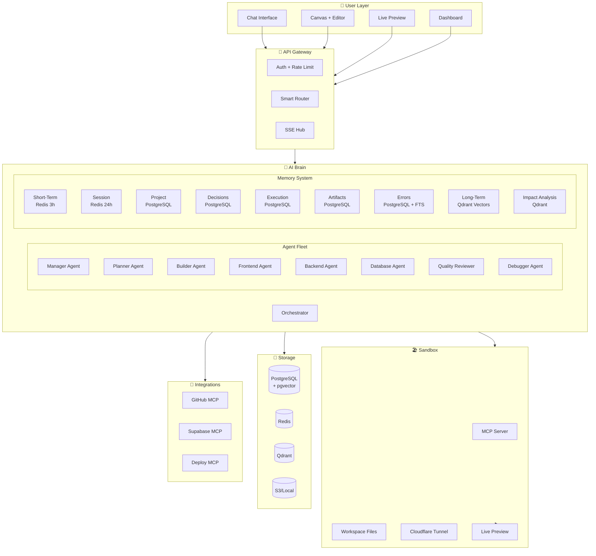
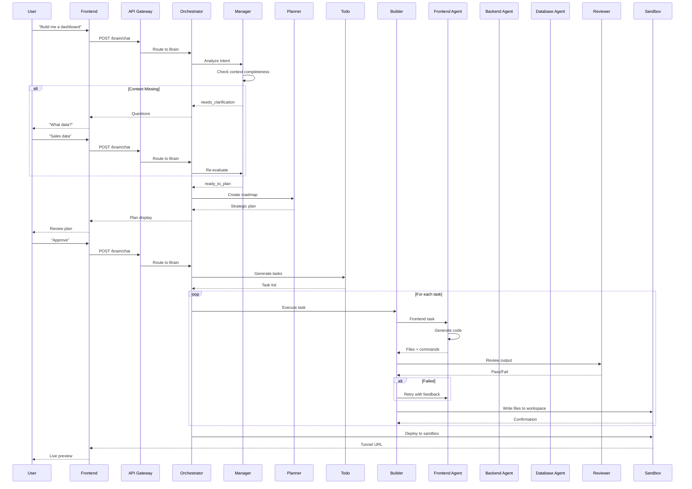
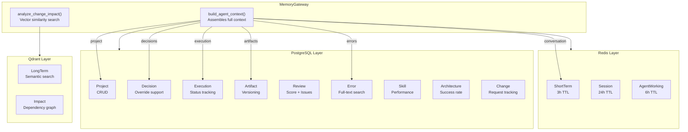
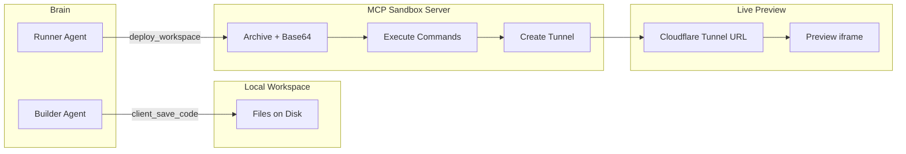
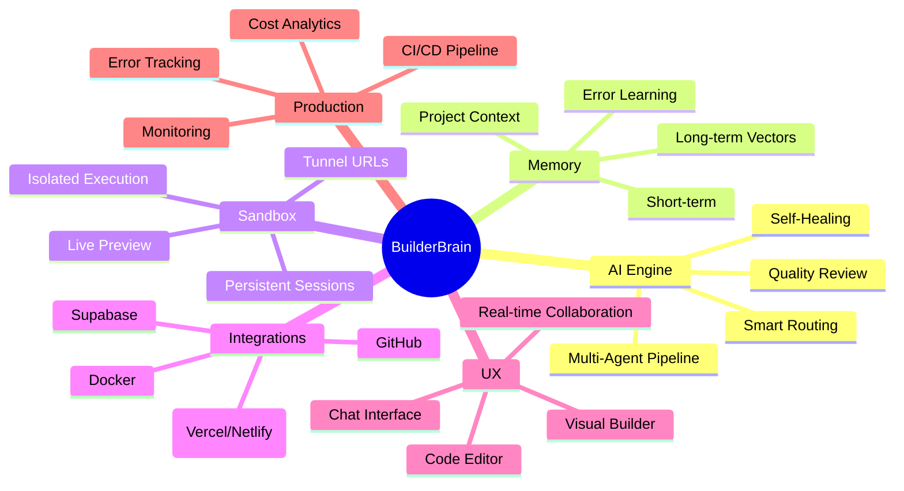

# BuilderBrain — Ideal Architecture Diagram

## System Architecture

## Agent Communication Flow

## Memory Architecture

## Sandbox Flow

## What BuilderBrain Needs to Be World-Class

## Key Differentiators vs Competitors

| Feature | BuilderBrain | Lovable | Bolt | Devin |
|---|---|---|---|---|
| Multi-Agent System | ✅ 13 agents | ❌ | ❌ | ✅ |
| Memory Architecture | ✅ 12 types | ⚠️ | ⚠️ | ✅ |
| MCP Connectors | ✅ GitHub, Supabase | ❌ | ❌ | ✅ |
| Quality Review | ✅ Auto review | ❌ | ❌ | ⚠️ |
| Impact Analysis | ✅ Vector search | ❌ | ❌ | ❌ |
| Error Learning | ✅ Full-text search | ❌ | ❌ | ⚠️ |
| Framework Support | ⚠️ React, Next.js | ✅ Many | ✅ Many | ✅ Many |
| One-Click Deploy | ❌ | ✅ | ✅ | ✅ |
| Production Ready | ❌ | ✅ | ✅ | ✅ |

## Recommended Priority

1. **Security** — Add auth to Brain endpoints, fix CORS
2. **Deployment** — One-click deploy to Vercel/Netlify
3. **More Frameworks** — Add Vue, Svelte, Angular templates
4. **Testing** — Unit tests for agents and memory
5. **CI/CD** — GitHub Actions pipeline
6. **Monitoring** — Sentry + analytics
7. **Collaboration** — Multi-user real-time editing
8. **Mobile** — React Native support
