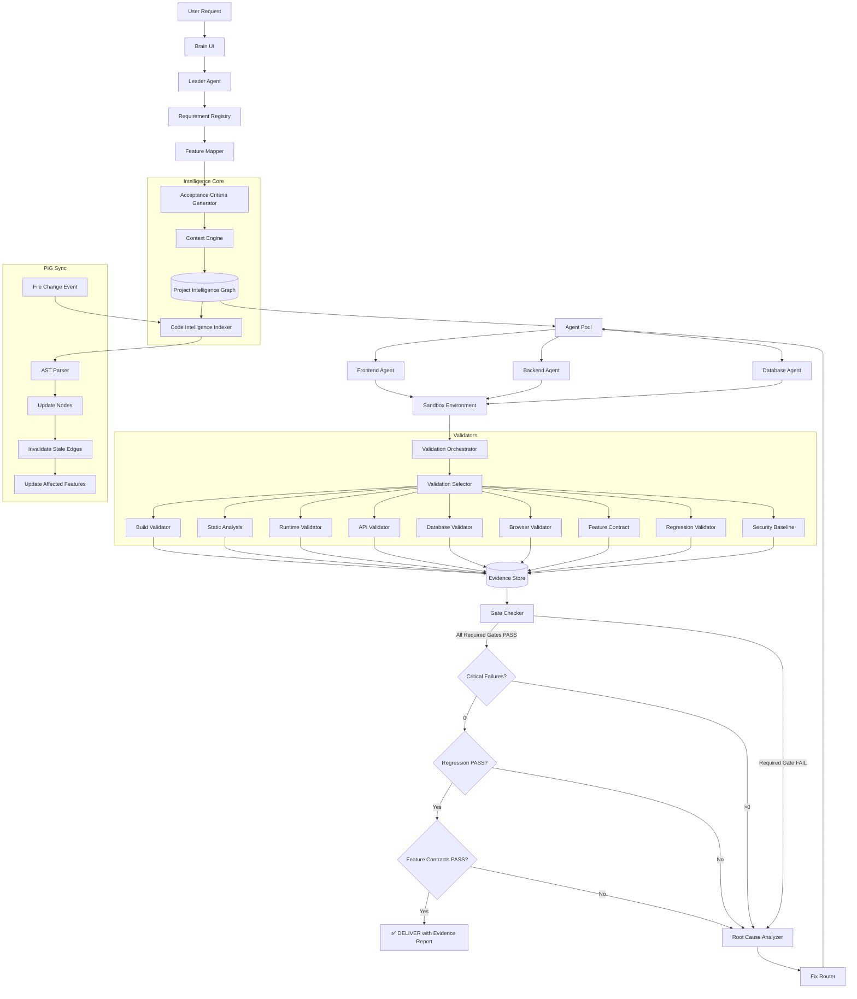

# 🧠 BuilderBrain v2.0: Production-Ready Validation & Project Intelligence Architecture
*(Revised Technical Specification - Addressing All Critical Design Issues)*

---

## Table of Contents
1. [Executive Summary & Architectural Philosophy](#1-executive-summary--architectural-philosophy)
2. [Critical Revisions from v1](#2-critical-revisions-from-v1)
3. [Global System Architecture](#3-global-system-architecture)
4. [Component 1: Project Intelligence Graph (PIG) with Auto-Sync](#4-component-1-project-intelligence-graph-pig-with-auto-sync)
5. [Component 2: Requirement-Feature-Code Traceability Matrix](#5-component-2-requirement-feature-code-traceability-matrix)
6. [Component 3: Context Engine](#6-component-3-context-engine)
7. [Component 4: Capability-Based Validation Orchestrator](#7-component-4-capability-based-validation-orchestrator)
8. [Component 5: Validation Evidence Store](#8-component-5-validation-evidence-store)
9. [Component 6: Gate-Based Delivery System](#9-component-6-gate-based-delivery-system)
10. [Validator Implementations](#10-validator-implementations)
11. [Error Intelligence Pipeline](#11-error-intelligence-pipeline)
12. [Code Implementation Structure](#12-code-implementation-structure)

---

## 1. Executive Summary & Architectural Philosophy

### What BuilderBrain Guarantees

**NOT:** "100% bug-free, production-ready"

**INSTEAD:** BuilderBrain guarantees that:

> **All defined requirements, required validation gates, feature contracts, and regression checks passed with recorded evidence.**

This is technically defensible, auditable, and represents genuine engineering quality.

### The False-Positive Problem (Corrected)

The original architecture recognized that a successful render doesn't mean the application works. However, v1 had critical gaps:

| Validation Type | v1 Approach | v2 Approach |
|-----------------|-------------|--------------|
| Delivery Decision | `score == 100%` | Gate-based: `required_gates_passed AND critical_failures == 0` |
| PIG Maintenance | Static JSON at creation | Auto-sync via AST parsing + file change events |
| API Validation | Global `expected_status_codes` list | Test-case-specific expectations per endpoint |
| Selectors | Tailwind classes (`.text-red-500`) | Semantic selectors (`data-testid`, `getByRole`) |
| DB Validation | Direct SQL operations | Full-stack persistence verification |
| Security | Blind SQLMap execution | Controlled Security Baseline Validator |
| Traceability | Missing | Requirement → Feature → Code → Test → Evidence |

---

## 2. Critical Revisions from v1

### 2.1 Five Mandatory Architectural Changes

1. **PIG Auto-Sync Pipeline** - Project Intelligence Graph must stay synchronized with actual code
2. **Requirement → Feature → Code Traceability** - Every feature must be traceable back to its requirement
3. **Gate-Based Final Decision** - Replace percentage scoring with required gates and critical failure detection
4. **Capability-Based Validators** - Plugin architecture instead of rigid 8-layer execution
5. **Validation Evidence Store** - Deterministic test cases with recorded evidence

### 2.2 Terminology Change

**Removed:** "100% production-ready, bug-free"

**Added:** "All defined requirements, required validation gates, feature contracts, and regression checks passed with recorded evidence."

---

## 3. Global System Architecture

