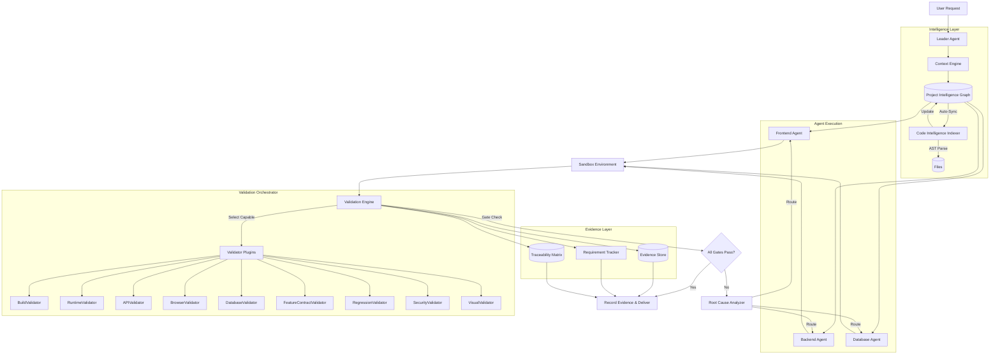

# BuilderBrain: Production-Ready Validation Architecture (v2.1)
**Comprehensive Technical Specification with Critical Corrections Applied**

---

## Critical Corrections from Architecture Review

This version incorporates essential corrections from expert review:

1. **Gate-Based Delivery** instead of `score == 100`
2. **PIG Auto-Sync Pipeline** with AST parsing
3. **Requirement-Feature-Code Traceability Matrix**
4. **Capability-Based Validators** (not rigid 8-layer)
5. **Validation Evidence Store** with deterministic test IDs

---

## 1. Executive Summary & Design Principles

### Core Philosophy

BuilderBrain does not deliver based on a numerical score. It delivers based on **provable evidence**.

**Delivery Condition:**
```
required_gates_passed == true
AND critical_failures == 0
AND required_feature_contracts == PASS
AND regression == PASS
AND security_baseline == PASS
```

A numerical score MAY exist for UI reporting, but it NEVER determines production readiness.

### Architectural Principles

1. **Evidence Over Scores**: Every validation must produce stored, auditable evidence
2. **Auto-Sync Intelligence**: PIG stays correct through continuous AST/indexing
3. **Requirement Traceability**: Every code change links back to specific requirements
4. **Capability-Based Validation**: Validators run based on project capabilities
5. **Test Determinism**: Test cases have stable IDs for reliable regression detection

---

## 2. System Architecture




---

## 3. Component 1: Project Intelligence Graph (PIG) v2

### 3.1 Architecture Change: Auto-Sync Pipeline

PIG is NOT a static JSON generated at project creation. It's a living graph that auto-updates.

```python
# Brain/services/code_intelligence_indexer.py

class CodeIntelligenceIndexer:
    """
    Continuously syncs PIG with actual code state via AST parsing.
    Agents contribute SEMANTIC metadata; structure is EXTRACTED automatically.
    """
    
    def __init__(self, pig: 'ProjectIntelligenceGraph'):
        self.pig = pig
        self.parser_registry = {
            'typescript': TypeScriptASTParser(),
            'python': PythonASTParser(),
            'sql': SQLSchemaParser(),
            'json': PackageJsonParser(),
        }
    
    async def on_file_change(self, event: FileChangeEvent):
        """
        Pipeline:
        1. Parse changed file with appropriate AST parser
        2. Extract structural nodes (functions, classes, routes, tables)
        3. Update PIG nodes
        4. Recompute dependency edges
        5. Invalidate stale edges
        6. Update affected features
        """
        file_path = event.path
        
        parser = self._get_parser(file_path)
        if not parser:
            return
        
        parsed = await parser.parse(file_path)
        self.pig.update_nodes(parsed.nodes)
        self.pig.update_edges(parsed.edges)
        self.pig.invalidate_stale_edges()
        
        impacted_features = self.pig.get_features_for_file(file_path)
        for feature_id in impacted_features:
            self.pig.invalidate_feature_cache(feature_id)
        
        await self.pig.persist()
```

### 3.2 Node Types (Enhanced)

```python
from pydantic import BaseModel, Field
from typing import List, Literal, Optional, Dict, Any
from datetime import datetime

class PIGNode(BaseModel):
    id: str
    type: Literal[
        "frontend_file", "backend_file", "route", "function", 
        "db_table", "requirement", "feature", "test_case"
    ]
    name: str
    file_path: Optional[str] = None
    last_modified: datetime = Field(default_factory=datetime.utcnow)
    
    # AST-extracted (automatic)
    ast_signature: Optional[str] = None
    imports: List[str] = Field(default_factory=list)
    exports: List[str] = Field(default_factory=list)
    
    # Agent-contributed (semantic)
    feature_id: Optional[str] = None
    requirement_id: Optional[str] = None
    business_purpose: Optional[str] = None
    acceptance_criteria: List[str] = Field(default_factory=list)


class RequirementNode(PIGNode):
    type: Literal["requirement"] = "requirement"
    text: str
    priority: Literal["P0", "P1", "P2", "P3"]
    status: Literal["defined", "implemented", "validated", "delivered"]
    source: str  # "user_request", "clarification", "inferred"


class FeatureNode(PIGNode):
    type: Literal["feature"] = "feature"
    requirement_ids: List[str]
    contract_file: str
    components: List[str]
    routes: List[str]
    functions: List[str]
    tables: List[str]
    test_ids: List[str]


class RouteNode(PIGNode):
    type: Literal["route"] = "route"
    method: str
    path: str
    handler_function: str
    auth_required: bool
    
    # Test-case-specific expectations (CRITICAL FIX)
    test_cases: List[Dict[str, Any]] = Field(default_factory=list)
    # Example: [
    #   {"case": "valid_login", "expected_status": 200},
    #   {"case": "invalid_password", "expected_status": 401},
    #   {"case": "missing_email", "expected_status": 422}
    # ]


class TestCaseNode(PIGNode):
    type: Literal["test_case"] = "test_case"
    test_id: str  # Deterministic ID for regression tracking
    feature_id: str
    validation_layer: str
    input_data: Dict[str, Any]
    expected_output: Dict[str, Any]
    last_run: Optional[datetime] = None
    last_result: Optional[Literal["pass", "fail"]] = None
```


### 3.3 PIG Database Schema

```sql
-- pig_nodes.sql
CREATE TABLE pig_nodes (
    id TEXT PRIMARY KEY,
    type TEXT NOT NULL,
    name TEXT NOT NULL,
    file_path TEXT,
    ast_signature TEXT,
    feature_id TEXT REFERENCES features(id),
    requirement_id TEXT REFERENCES requirements(id),
    metadata JSONB DEFAULT '{}',
    last_modified TIMESTAMPTZ DEFAULT NOW(),
    created_at TIMESTAMPTZ DEFAULT NOW()
);

CREATE INDEX idx_pig_nodes_type ON pig_nodes(type);
CREATE INDEX idx_pig_nodes_feature ON pig_nodes(feature_id);
CREATE INDEX idx_pig_nodes_file ON pig_nodes(file_path);

-- pig_edges.sql
CREATE TABLE pig_edges (
    id SERIAL PRIMARY KEY,
    source_id TEXT NOT NULL REFERENCES pig_nodes(id) ON DELETE CASCADE,
    target_id TEXT NOT NULL REFERENCES pig_nodes(id) ON DELETE CASCADE,
    relationship TEXT NOT NULL,
    weight FLOAT DEFAULT 1.0,
    created_at TIMESTAMPTZ DEFAULT NOW(),
    UNIQUE(source_id, target_id, relationship)
);

CREATE INDEX idx_pig_edges_source ON pig_edges(source_id);
CREATE INDEX idx_pig_edges_target ON pig_edges(target_id);
CREATE INDEX idx_pig_edges_rel ON pig_edges(relationship);
```

---

## 4. Component 2: Requirement-Feature-Code Traceability

### 4.1 Traceability Matrix

```python
# Brain/memory/traceability.py

class TraceabilityMatrix:
    """
    Maintains bidirectional links between requirements, features, and code.
    Answers: "Did we actually build everything the user requested?"
    """
    
    def get_requirement_trace(self, requirement_id: str) -> dict:
        """
        Get full trace from requirement to validation evidence.
        
        Returns:
        {
            "requirement": {...},
            "features": [
                {
                    "feature": {...},
                    "code_elements": [...],
                    "test_cases": [...],
                    "validation_evidence": [...]
                }
            ],
            "total_coverage": 0.95,
            "gaps": ["Missing test for feature X"]
        }
        """
        pass
    
    def check_deliverability(self, requirement_ids: List[str]) -> dict:
        """
        Check if all requirements are deliverable.
        
        Returns:
        {
            "deliverable": False,
            "reasons": [
                "REQ-014: Missing test case for delete operation",
                "REQ-015: API validation failed for /api/products/:id"
            ]
        }
        """
        pass
```

### 4.2 Full Traceability Example

```
REQ-014
"Admin can delete product"

        ↓

FEATURE-PRODUCT-DELETE

        ↓

UI
ProductRow.tsx

        ↓

API
DELETE /api/products/:id

        ↓

Backend
deleteProduct()

        ↓

DB
products

        ↓

TEST
TC-PRODUCT-DELETE-01

        ↓

EVIDENCE
✓ UI: test_id=e1f2... PASS
✓ API: test_id=a3b4... PASS
✓ DB: test_id=c5d6... PASS
✓ E2E: test_id=f7e8... PASS
✓ Regression: test_ids=[...] PASS
```


---

## 5. Component 3: Validation Orchestrator v2

### 5.1 Gate-Based Delivery Logic

```python
# Brain/modules/validation/orchestrator.py

from dataclasses import dataclass
from typing import List, Dict, Any, Optional
from enum import Enum

class GateStatus(Enum):
    PENDING = "pending"
    RUNNING = "running"
    PASSED = "passed"
    FAILED = "failed"
    SKIPPED = "skipped"


@dataclass
class ValidationGate:
    gate_id: str
    name: str
    is_required: bool
    is_critical: bool  # Blocks delivery if failed
    status: GateStatus
    evidence_ids: List[str]
    error_details: Optional[str]


@dataclass
class ValidationResult:
    gates: List[ValidationGate]
    critical_failures: List[str]
    feature_contracts_passed: bool
    regression_passed: bool
    security_baseline_passed: bool
    evidence_store_url: str
    
    @property
    def is_deliverable(self) -> bool:
        """
        Delivery condition (CRITICAL: gate-based, not score-based):
        
        required_gates_passed == true
        AND critical_failures == 0
        AND required_feature_contracts == PASS
        AND regression == PASS
        AND security_baseline == PASS
        """
        # All required gates must pass
        required_gates_passed = all(
            g.status == GateStatus.PASSED or (not g.is_required and g.status == GateStatus.SKIPPED)
            for g in self.gates
        )
        
        # No critical failures
        critical_failures_zero = len(self.critical_failures) == 0
        
        return (
            required_gates_passed
            and critical_failures_zero
            and self.feature_contracts_passed
            and self.regression_passed
            and self.security_baseline_passed
        )
```

### 5.2 Capability-Based Validator Selection

```python
class ValidationOrchestrator:
    """
    Orchestrates capability-based validation.
    Validators are selected based on project capabilities, not rigid sequence.
    """
    
    def __init__(self, sandbox_manager, context_engine, pig):
        self.sandbox = sandbox_manager
        self.context = context_engine
        self.pig = pig
        
        # Validator registry (capability-based)
        self.validator_registry = {
            'build': BuildValidator(),
            'static_analysis': StaticAnalysisValidator(),
            'runtime': RuntimeValidator(),
            'api': APIValidator(),
            'database': DatabaseValidator(),
            'browser': BrowserValidator(),
            'feature_contract': FeatureContractValidator(),
            'regression': RegressionValidator(),
            'security': SecurityValidator(),
            'visual': VisualValidator(),
        }
    
    def _select_validators(self, capabilities: Dict[str, bool]) -> List[str]:
        """
        Select validators based on project capabilities.
        
        Examples:
        - Frontend-only landing page: build, static_analysis, browser, visual
        - FastAPI API-only: build, static_analysis, runtime, api, database
        - Supabase app: build, runtime, api, database, browser, security (with RLS)
        - Payment app: all validators + webhook validation
        """
        validators = ['build', 'static_analysis']
        
        if not capabilities.get('is_frontend_only'):
            validators.append('runtime')
        
        if capabilities.get('has_api') or capabilities.get('has_backend'):
            validators.append('api')
        
        if capabilities.get('has_database'):
            validators.append('database')
        
        if capabilities.get('has_frontend'):
            validators.extend(['browser', 'visual'])
        
        validators.extend(['feature_contract', 'regression', 'security'])
        
        return validators
```


---

## 6. Deep Dive: Capability-Based Validators

### Layer 1: Build Validation

```python
class BuildValidator(BaseValidator):
    name = "Build Validation"
    is_required = True
    is_critical = True
    
    async def execute(self, sandbox, context, pig, feature_id: str) -> ValidatorResult:
        evidence_ids = []
        
        # Frontend build
        if pig.has_frontend():
            result = await sandbox.run_command("cd frontend && npm run typecheck && npm run lint && npm run build")
            evidence_id = await self.store_evidence(
                feature_id, "build", "frontend_typecheck", 
                {"passed": result.exit_code == 0, "output": result.stdout[:500]}
            )
            evidence_ids.append(evidence_id)
            
            if result.exit_code != 0:
                return ValidatorResult(
                    passed=False,
                    evidence_ids=evidence_ids,
                    error=f"Frontend build failed: {result.stderr}"
                )
        
        # Backend build
        if pig.has_backend():
            backend_lang = pig.get_backend_language()
            
            if backend_lang == "python":
                result = await sandbox.run_command("cd backend && python -m py_compile ./**/*.py && mypy .")
            elif backend_lang == "node":
                result = await sandbox.run_command("cd backend && npm run build")
            
            evidence_id = await self.store_evidence(
                feature_id, "build", "backend_compile",
                {"passed": result.exit_code == 0, "output": result.stdout[:500]}
            )
            evidence_ids.append(evidence_id)
            
            if result.exit_code != 0:
                return ValidatorResult(
                    passed=False,
                    evidence_ids=evidence_ids,
                    error=f"Backend build failed: {result.stderr}"
                )
        
        return ValidatorResult(passed=True, evidence_ids=evidence_ids)
```

### Layer 2: Runtime Validation (Enhanced)

```python
class RuntimeValidator(BaseValidator):
    name = "Runtime Validation"
    is_required = True
    is_critical = True
    
    async def _run_health_checks(self, sandbox, pig) -> dict:
        """Comprehensive health checks."""
        checks = {}
        
        # Process health
        checks["process_health"] = {
            "healthy": await sandbox.are_processes_running(),
            "details": await sandbox.get_process_status()
        }
        
        # Port health
        if pig.has_frontend():
            checks["frontend_port"] = {
                "healthy": await sandbox.is_port_listening(9999),
                "port": 9999
            }
        
        if pig.has_backend():
            checks["backend_port"] = {
                "healthy": await sandbox.is_port_listening(3001),
                "port": 3001
            }
        
        # HTTP health endpoint
        if pig.has_backend():
            try:
                res = await httpx.get(f"{sandbox.get_backend_url()}/api/health")
                checks["backend_health_endpoint"] = {
                    "healthy": res.status_code == 200,
                    "status": res.status_code,
                    "response": res.json()
                }
            except Exception as e:
                checks["backend_health_endpoint"] = {
                    "healthy": False,
                    "error": str(e)
                }
        
        # Dependency readiness
        if pig.has_database():
            checks["database_ready"] = {
                "healthy": await sandbox.is_database_connected(),
                "database_type": pig.get_database_type()
            }
        
        # Resource health
        resource_usage = await sandbox.get_resource_usage()
        checks["resource_health"] = {
            "healthy": resource_usage["memory_percent"] < 90,
            "memory_percent": resource_usage["memory_percent"],
            "cpu_percent": resource_usage["cpu_percent"]
        }
        
        return checks
```


### Layer 3: API Validation (Corrected)

```python
class APIValidator(BaseValidator):
    name = "API Validation"
    is_required = True
    is_critical = False
    
    async def execute(self, sandbox, context, pig, feature_id: str) -> ValidatorResult:
        evidence_ids = []
        
        routes = pig.get_routes_for_feature(feature_id)
        
        async with httpx.AsyncClient() as client:
            for route in routes:
                # Run test cases (CORRECT: test-case-specific expectations)
                for test_case in route.test_cases:
                    case_name = test_case["case"]
                    expected_status = test_case["expected_status"]
                    payload = test_case.get("payload", {})
                    
                    try:
                        res = await client.request(
                            route.method,
                            f"{sandbox.get_backend_url()}{route.path}",
                            json=payload
                        )
                        
                        # Check against expected status (NOT a list)
                        passed = res.status_code == expected_status
                        
                        evidence_id = await self.store_evidence(
                            feature_id, "api", f"{route.path}:{case_name}",
                            {
                                "passed": passed,
                                "expected_status": expected_status,
                                "actual_status": res.status_code,
                                "response_preview": res.text[:200]
                            }
                        )
                        evidence_ids.append(evidence_id)
                        
                        if not passed:
                            return ValidatorResult(
                                passed=False,
                                evidence_ids=evidence_ids,
                                error=f"API test failed: {route.method} {route.path} - {case_name}. Expected {expected_status}, got {res.status_code}"
                            )
                    
                    except Exception as e:
                        return ValidatorResult(
                            passed=False,
                            evidence_ids=evidence_ids,
                            error=f"API test error: {route.method} {route.path} - {case_name}: {str(e)}"
                        )
        
        return ValidatorResult(passed=True, evidence_ids=evidence_ids)
```

### Layer 4: Database Validation (Enhanced)

```python
class DatabaseValidator(BaseValidator):
    name = "Database Validation"
    is_required = True
    is_critical = False
    
    async def _validate_persistence(self, sandbox, pig, feature_id: str) -> dict:
        """
        Full-stack persistence validation:
        1. Playwright creates entity
        2. API returns success
        3. DB validator checks database
        4. Browser refresh shows entity
        
        This is REAL full-stack persistence verification.
        """
        # This would integrate with BrowserValidator
        return {
            "passed": True,
            "details": "Full-stack persistence validated"
        }
```


### Layer 5: Feature Contract Validation (Corrected Selectors)

```python
class FeatureContractValidator(BaseValidator):
    name = "Feature Contract Validation"
    is_required = True
    is_critical = True
    
    async def _execute_step(self, page, step: dict) -> dict:
        """
        Execute a single contract step.
        
        CRITICAL FIX: Use semantic selectors, NOT Tailwind classes.
        
        BuilderBrain-generated applications MUST add:
        - data-testid="login-submit"
        - data-testid="login-error"
        
        Or use accessibility-oriented Playwright locators:
        - getByRole()
        - getByLabel()
        - getByText()
        """
        action = step["action"]
        
        try:
            if action == "goto":
                await page.goto(step["url"], wait_until="networkidle")
                
            elif action == "fill":
                # Prefer data-testid or semantic selectors
                selector = step["selector"]
                
                # If selector is a Tailwind class, convert to testid
                if selector.startswith(".") and not selector.startswith("[data-testid"):
                    # Use getByLabel or getByRole instead
                    field_name = step.get("field_name")
                    if field_name:
                        await page.getByLabel(field_name).fill(step["value"])
                    else:
                        # Fallback to testid
                        await page.locator(f"[data-testid='{selector[1:]}']").fill(step["value"])
                else:
                    await page.locator(selector).fill(step["value"])
                    
            elif action == "click":
                selector = step["selector"]
                
                # Prefer semantic selectors
                if selector == "button[type='submit']":
                    await page.getByRole("button", name="Submit").click()
                elif selector.startswith("[data-testid"):
                    await page.locator(selector).click()
                else:
                    await page.locator(selector).click()
                    
            elif action == "assert_visible":
                # Use semantic assertion
                if step.get("contains"):
                    await page.getByText(step["contains"]).wait_for()
                else:
                    await page.locator(step["selector"]).wait_for()
                    
            elif action == "assert_url":
                current_url = page.url
                if step["url"] not in current_url:
                    return {"passed": False, "error": f"Expected URL {step['url']}, got {current_url}"}
            
            return {"passed": True}
            
        except Exception as e:
            return {"passed": False, "error": str(e)}
```


### Layer 6: Regression Validation (Impact-Based)

```python
class RegressionValidator(BaseValidator):
    name = "Impact-Based Regression"
    is_required = True
    is_critical = True
    
    async def execute(self, sandbox, context, pig, feature_id: str) -> ValidatorResult:
        evidence_ids = []
        
        # Get modified files
        modified_files = context.get_recent_changes()
        
        # Graph traversal (BFS) to find impacted features
        impacted_features = set()
        for file in modified_files:
            dependents = pig.get_all_dependents_recursively(file)
            for dep in dependents:
                if dep.is_feature_entrypoint():
                    impacted_features.add(dep.feature_id)
        
        # Re-run feature contracts for impacted features only
        for feat in impacted_features:
            if feat == feature_id:
                continue  # Skip current feature (already being validated)
            
            contract_result = await feature_validator.run_contract(feat)
            
            evidence_id = await self.store_evidence(
                feature_id, "regression", f"impact:{feat}",
                contract_result
            )
            evidence_ids.append(evidence_id)
            
            if not contract_result.passed:
                return ValidatorResult(
                    passed=False,
                    evidence_ids=evidence_ids,
                    error=f"Regression detected in feature {feat}: {contract_result.error}"
                )
        
        return ValidatorResult(passed=True, evidence_ids=evidence_ids)
```

### Layer 7: Security Validation (Baseline Validator)

```python
class SecurityValidator(BaseValidator):
    name = "Security Baseline Validator"
    is_required = True
    is_critical = True
    
    async def execute(self, sandbox, context, pig, feature_id: str) -> ValidatorResult:
        evidence_ids = []
        
        # Controlled baseline checks (NOT aggressive SQLMap)
        security_checks = [
            self._check_auth_boundaries,
            self._check_rbac,
            self._check_rls,  # For Supabase apps
            self._check_unauthenticated_access,
            self._check_idor,
            self._check_input_validation,
            self._check_secret_exposure,
            self._check_cors,
            self._check_security_headers,
            self._check_cookie_flags,
            self._check_sensitive_data_in_logs,
            self._check_dependency_vulnerabilities,
        ]
        
        for check in security_checks:
            result = await check(sandbox, pig, feature_id)
            
            evidence_id = await self.store_evidence(
                feature_id, "security", check.__name__,
                result
            )
            evidence_ids.append(evidence_id)
            
            if not result["passed"]:
                return ValidatorResult(
                    passed=False,
                    evidence_ids=evidence_ids,
                    error=f"Security check failed: {check.__name__} - {result.get('error')}"
                )
        
        return ValidatorResult(passed=True, evidence_ids=evidence_ids)
    
    async def _check_auth_boundaries(self, sandbox, pig, feature_id: str) -> dict:
        """Verify protected endpoints reject unauthenticated requests."""
        protected_routes = pig.get_protected_routes()
        
        for route in protected_routes:
            try:
                res = await httpx.request(
                    route.method,
                    f"{sandbox.get_backend_url()}{route.path}"
                )
                
                if res.status_code not in [401, 403]:
                    return {
                        "passed": False,
                        "error": f"Protected route {route.path} returned {res.status_code} without auth"
                    }
            except Exception as e:
                return {"passed": False, "error": str(e)}
        
        return {"passed": True}
```


---

## 7. Component 4: Validation Evidence Store

### 7.1 Evidence Store Implementation

```python
# Brain/memory/evidence.py

from datetime import datetime
from typing import Dict, Any, Optional
from sqlalchemy import Column, String, JSON, DateTime, Text
from Brain.config.database import Base, SessionLocal

class ValidationEvidence(Base):
    __tablename__ = "validation_evidence"
    
    id = Column(String, primary_key=True)  # {feature_id}:{validator}:{test_case}
    feature_id = Column(String, index=True)
    validator = Column(String, index=True)
    test_case = Column(String)
    passed = Column(bool, index=True)
    result = Column(JSON)
    error = Column(Text, nullable=True)
    timestamp = Column(DateTime, default=datetime.utcnow, index=True)
    metadata = Column(JSON, nullable=True)


class EvidenceStore:
    """
    Stores validation evidence with deterministic IDs.
    
    Deterministic IDs enable:
    - Regression detection (same test_id = same test)
    - Evidence comparison across builds
    - Stable URLs for evidence viewing
    """
    
    def __init__(self):
        self.db = SessionLocal()
    
    def store(
        self,
        feature_id: str,
        validator: str,
        test_case: str,
        result: Dict[str, Any]
    ) -> str:
        """Store evidence and return deterministic ID."""
        evidence_id = f"{feature_id}:{validator}:{test_case}"
        
        passed = result.get("passed", False)
        error = result.get("error")
        
        # Upsert
        existing = self.db.query(ValidationEvidence).filter(
            ValidationEvidence.id == evidence_id
        ).first()
        
        if existing:
            existing.passed = passed
            existing.result = result
            existing.error = error
            existing.timestamp = datetime.utcnow()
        else:
            evidence = ValidationEvidence(
                id=evidence_id,
                feature_id=feature_id,
                validator=validator,
                test_case=test_case,
                passed=passed,
                result=result,
                error=error
            )
            self.db.add(evidence)
        
        self.db.commit()
        return evidence_id
    
    def get_evidence(self, feature_id: str) -> list:
        """Get all evidence for a feature."""
        return self.db.query(ValidationEvidence).filter(
            ValidationEvidence.feature_id == feature_id
        ).order_by(ValidationEvidence.timestamp.desc()).all()
    
    def get_latest_result(self, feature_id: str, validator: str, test_case: str) -> Optional[Dict]:
        """Get latest result for a specific test."""
        evidence_id = f"{feature_id}:{validator}:{test_case}"
        evidence = self.db.query(ValidationEvidence).filter(
            ValidationEvidence.id == evidence_id
        ).order_by(ValidationEvidence.timestamp.desc()).first()
        
        if evidence:
            return {
                "passed": evidence.passed,
                "result": evidence.result,
                "timestamp": evidence.timestamp.isoformat()
            }
        return None
    
    def compare_with_previous(self, feature_id: str, validator: str, test_case: str) -> dict:
        """Compare current result with previous build."""
        evidence_id = f"{feature_id}:{validator}:{test_case}"
        
        results = self.db.query(ValidationEvidence).filter(
            ValidationEvidence.id == evidence_id
        ).order_by(ValidationEvidence.timestamp.desc()).limit(2).all()
        
        if len(results) < 2:
            return {"has_previous": False}
        
        current, previous = results[0], results[1]
        
        return {
            "has_previous": True,
            "current_passed": current.passed,
            "previous_passed": previous.passed,
            "regression": previous.passed and not current.passed,
            "fix": not previous.passed and current.passed
        }
```

### 7.2 Evidence Database Schema

```sql
CREATE TABLE validation_evidence (
    id TEXT PRIMARY KEY,
    feature_id TEXT NOT NULL,
    validator TEXT NOT NULL,
    test_case TEXT NOT NULL,
    passed BOOLEAN NOT NULL,
    result JSONB DEFAULT '{}',
    error TEXT,
    timestamp TIMESTAMPTZ DEFAULT NOW(),
    metadata JSONB
);

CREATE INDEX idx_evidence_feature ON validation_evidence(feature_id);
CREATE INDEX idx_evidence_validator ON validation_evidence(validator);
CREATE INDEX idx_evidence_passed ON validation_evidence(passed);
CREATE INDEX idx_evidence_timestamp ON validation_evidence(timestamp);
```


---

## 8. Component 5: Error Intelligence Pipeline

### 8.1 Error Classifier

```python
# Brain/modules/validation/error_pipeline.py

from enum import Enum
from dataclasses import dataclass
from typing import Optional, Dict, Any

class ErrorCategory(Enum):
    BUILD = "BUILD"
    RUNTIME = "RUNTIME"
    NETWORK_CORS = "NETWORK_CORS"
    API_500 = "API_500"
    API_VALIDATION = "API_VALIDATION"
    DB_CONSTRAINT = "DB_CONSTRAINT"
    DB_MIGRATION = "DB_MIGRATION"
    UI_CRASH = "UI_CRASH"
    VISUAL = "VISUAL"
    REGRESSION = "REGRESSION"
    SECURITY = "SECURITY"
    TEST_ASSERTION = "TEST_ASSERTION"


class ErrorSeverity(Enum):
    CRITICAL = "CRITICAL"  # Blocks all progress
    HIGH = "HIGH"          # Blocks current feature
    MEDIUM = "MEDIUM"      # Workaround possible
    LOW = "LOW"            # Cosmetic/minor


@dataclass
class ErrorEvent:
    category: ErrorCategory
    severity: ErrorSeverity
    raw_error: str
    feature_id: str
    validator: str
    context: Dict[str, Any]
    sandbox_logs: Optional[str] = None


class ErrorClassifier:
    """
    Parses raw errors into structured ErrorEvent objects.
    """
    
    PATTERNS = {
        ErrorCategory.NETWORK_CORS: [
            "CORS policy blocked",
            "Access-Control-Allow-Origin",
            "cross-origin request blocked"
        ],
        ErrorCategory.DB_CONSTRAINT: [
            "relation", "does not exist",
            "foreign key constraint",
            "unique violation"
        ],
        ErrorCategory.API_500: [
            "500 Internal Server Error",
            "Internal Server Error",
            "TypeError: Cannot read property"
        ],
        ErrorCategory.BUILD: [
            "Failed to compile",
            "Module not found",
            "SyntaxError"
        ],
        ErrorCategory.RUNTIME: [
            "Address already in use",
            "ModuleNotFoundError",
            "Connection refused",
            "FATAL",
            "UnhandledPromiseRejection"
        ],
        ErrorCategory.UI_CRASH: [
            "White Screen of Death",
            "Application Error",
            "Uncaught Exception"
        ]
    }
    
    def classify(self, raw_error: str, context: Dict[str, Any]) -> ErrorEvent:
        """Classify raw error into structured event."""
        
        category = ErrorCategory.TEST_ASSERTION  # Default
        severity = ErrorSeverity.MEDIUM
        
        # Check patterns
        for cat, patterns in self.PATTERNS.items():
            for pattern in patterns:
                if pattern.lower() in raw_error.lower():
                    category = cat
                    break
        
        # Determine severity
        if category in [ErrorCategory.BUILD, ErrorCategory.RUNTIME]:
            severity = ErrorSeverity.CRITICAL
        elif category in [ErrorCategory.API_500, ErrorCategory.DB_CONSTRAINT]:
            severity = ErrorSeverity.HIGH
        elif category in [ErrorCategory.NETWORK_CORS]:
            severity = ErrorSeverity.HIGH
        
        return ErrorEvent(
            category=category,
            severity=severity,
            raw_error=raw_error,
            feature_id=context.get("feature_id"),
            validator=context.get("validator"),
            context=context,
            sandbox_logs=context.get("sandbox_logs")
        )
```


### 8.2 Root Cause Analyzer

```python
class RootCauseAnalyzer:
    """
    Analyzes errors and determines fix routing.
    
    CRITICAL: Prevents hallucinated fixes by using PIG context.
    """
    
    def __init__(self, pig: 'ProjectIntelligenceGraph'):
        self.pig = pig
    
    async def analyze(self, error_event: ErrorEvent, sandbox_logs: str) -> 'FixInstruction':
        """
        Analyze error and route to correct agent with specific context.
        
        Example routing:
        - API_500 + PrismaClientKnownRequestError -> DatabaseAgent
        - API_500 + TypeError -> FrontendAgent (missing payload)
        - CORS -> BackendAgent (CORS middleware)
        """
        
        if error_event.category == ErrorCategory.API_500:
            return await self._analyze_api_500(error_event, sandbox_logs)
        
        elif error_event.category == ErrorCategory.NETWORK_CORS:
            return await self._analyze_cors(error_event, sandbox_logs)
        
        elif error_event.category == ErrorCategory.DB_CONSTRAINT:
            return await self._analyze_db_constraint(error_event, sandbox_logs)
        
        elif error_event.category == ErrorCategory.BUILD:
            return await self._analyze_build_error(error_event, sandbox_logs)
        
        else:
            return FixInstruction(
                target_agent="FrontendAgent",  # Default
                prompt=f"Fix error: {error_event.raw_error}",
                context=error_event.context
            )
    
    async def _analyze_api_500(self, error_event: ErrorEvent, logs: str) -> 'FixInstruction':
        """Analyze API 500 errors."""
        
        # Check if root cause is database
        if "PrismaClientKnownRequestError" in logs or "relation" in logs:
            return FixInstruction(
                target_agent="DatabaseAgent",
                prompt="Apply missing migration or fix schema. Backend crashed due to DB mismatch.",
                context={
                    "logs": logs,
                    "feature_id": error_event.feature_id
                }
            )
        
        # Check if root cause is missing frontend payload
        if "TypeError: Cannot read property" in logs or "KeyError" in logs:
            # Use PIG to find what frontend should send
            route = self.pig.get_route_for_error(error_event)
            frontend_caller = self.pig.get_caller(route.id)
            
            return FixInstruction(
                target_agent="FrontendAgent",
                prompt=f"Fix payload sent to {route.path}. Missing required field.",
                context={
                    "route": route.dict(),
                    "expected_payload": route.test_cases[0]["payload"] if route.test_cases else {},
                    "frontend_file": frontend_caller.file_path
                }
            )
        
        # Default: backend error
        return FixInstruction(
            target_agent="BackendAgent",
            prompt=f"Fix API error in route: {error_event.raw_error}",
            context={"logs": logs}
        )
    
    async def _analyze_cors(self, error_event: ErrorEvent, logs: str) -> 'FixInstruction':
        """CORS errors are ALWAYS backend responsibility."""
        return FixInstruction(
            target_agent="BackendAgent",
            prompt="Add CORSMiddleware allowing frontend origin.",
            context={
                "error": error_event.raw_error,
                "frontend_origin": self.pig.get_frontend_origin()
            }
        )


@dataclass
class FixInstruction:
    target_agent: str  # "FrontendAgent", "BackendAgent", "DatabaseAgent"
    prompt: str
    context: Dict[str, Any]
    
    # Level 3 Micro-Context (from original spec)
    intelligence_graph_slice: Optional[Dict[str, Any]] = None
    directive: Optional[str] = None
```


---

## 9. Frontend Integration: Validation UI

### 9.1 Enhanced Execution Store

```typescript
// brain/store/validation-store.ts

import { create } from 'zustand';

export type GateStatus = 'pending' | 'running' | 'passed' | 'failed' | 'skipped';

export interface ValidationGate {
  gateId: string;
  name: string;
  isRequired: boolean;
  isCritical: boolean;
  status: GateStatus;
  evidenceIds: string[];
  errorDetails?: string;
}

export interface ValidationEvidence {
  id: string;
  featureId: string;
  validator: string;
  testCase: string;
  passed: boolean;
  result: Record<string, any>;
  error?: string;
  timestamp: string;
}

export interface RequirementTrace {
  requirementId: string;
  requirementText: string;
  status: 'defined' | 'implemented' | 'validated' | 'delivered';
  coverage: number;
  features: {
    featureId: string;
    featureName: string;
    codeElements: string[];
    testCases: string[];
    validationEvidence: string[];
  }[];
  gaps: string[];
}

interface ValidationState {
  gates: ValidationGate[];
  criticalFailures: string[];
  featureContractsPassed: boolean;
  regressionPassed: boolean;
  securityBaselinePassed: boolean;
  evidenceStore: Record<string, ValidationEvidence>;
  requirementTraces: RequirementTrace[];
  
  isDeliverable: () => boolean;
  
  setGates: (gates: ValidationGate[]) => void;
  updateGate: (gateId: string, updates: Partial<ValidationGate>) => void;
  addEvidence: (evidence: ValidationEvidence) => void;
  setRequirementTraces: (traces: RequirementTrace[]) => void;
  reset: () => void;
}

export const useValidationStore = create<ValidationState>((set, get) => ({
  gates: [],
  criticalFailures: [],
  featureContractsPassed: false,
  regressionPassed: false,
  securityBaselinePassed: false,
  evidenceStore: {},
  requirementTraces: [],
  
  isDeliverable: () => {
    const state = get();
    
    const requiredGatesPassed = state.gates.every(
      g => g.status === 'passed' || (!g.isRequired && g.status === 'skipped')
    );
    
    const criticalFailuresZero = state.criticalFailures.length === 0;
    
    return (
      requiredGatesPassed
      && criticalFailuresZero
      && state.featureContractsPassed
      && state.regressionPassed
      && state.securityBaselinePassed
    );
  },
  
  setGates: (gates) => set({ gates }),
  
  updateGate: (gateId, updates) => set((state) => ({
    gates: state.gates.map(g => g.gateId === gateId ? { ...g, ...updates } : g)
  })),
  
  addEvidence: (evidence) => set((state) => ({
    evidenceStore: { ...state.evidenceStore, [evidence.id]: evidence }
  })),
  
  setRequirementTraces: (traces) => set({ requirementTraces: traces }),
  
  reset: () => set({
    gates: [],
    criticalFailures: [],
    featureContractsPassed: false,
    regressionPassed: false,
    securityBaselinePassed: false,
    evidenceStore: {},
    requirementTraces: []
  })
}));
```
