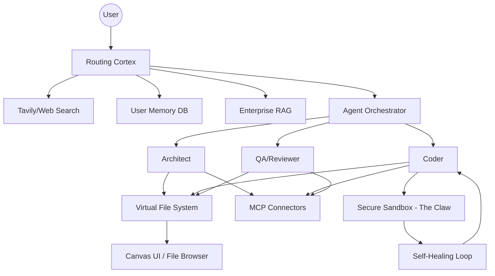
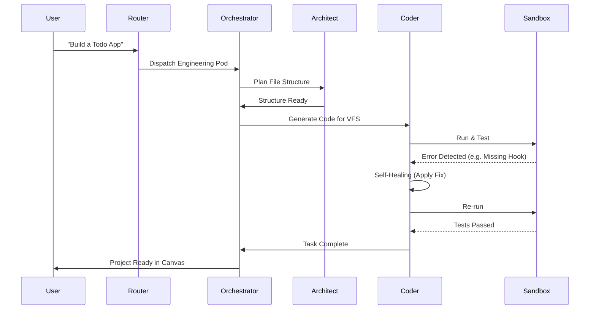

# ARCHITECTURAL SPECIFICATION: THE UNIVERSAL BRAIN (V2.0)

This document outlines the roadmap and technical specifications for transitioning from the **Reactive Cortex (V1.0)** to the **Universal Brain (V2.0)**—an autonomous, context-aware routing and execution engine.

## 1. Executive Summary
The Universal Brain is not just an AI chat interface; it is a **Decentralized Autonomous OS**. It acts as a central nervous system that possesses long-term memory, physically manipulates external applications via MCP, orchestrates specialized sub-agents, and executes multi-file codebases in a secure, isolated sandbox.

---

## 2. The Six Architectural Pillars

### Pillar 1: Model Context Protocol (MCP) Integration
**Objective:** Give the Brain "hands" to interact with the external world.
- **Connectors:** Expand beyond Supabase to include **GitHub, Slack, Jira, and Google Drive**.
- **Action Intent:** The Router will identify intents like *"Review the latest PR"* or *"Slack the summary to the team"* and trigger specific MCP tools.
- **Security:** Bidirectional, secure bridges with granular permissioning.

### Pillar 2: Unified RAG & Router Symbiosis
**Objective:** Eliminate retrieval fragmentation and maximize speed.
- **Optimization:** Deprecate multi-embedding models in favor of a single, optimized model (e.g., Voyage AI).
- **Retrieval-First Routing:** Before any web search, the Router queries the vector store to check if enterprise documents already contain the answer.

### Pillar 3: Continuous User Memory (Episodic & Semantic)
**Objective:** High-speed personalization across infinite sessions.
- **Personalized Memory:** Separate heavy enterprise RAG from a lightweight User Memory DB (e.g., Mem0/Qdrant).
- **Background Extraction:** A "Learning Worker" extracts facts and preferences from conversations in real-time.
- **Dynamic Context Injection:** Memory is injected into system prompts for "Extreme Personalization."

### Pillar 4: Virtual File System (VFS)
**Objective:** Transition from "snippets" to "full-cycle engineering."
- **Stateful Management:** A backend directory manager maintaining file states, dependencies, and folder structures.
- **Multi-File Context:** The Brain understands the relationships between `package.json`, `App.tsx`, and CSS files simultaneously.

### Pillar 5: Multi-Agent Orchestration
**Objective:** Parallel processing for complex workflows.
- **Agent Pods:** Orchestration of specialized sub-agents:
    - **Architect:** Designs VFS structure.
    - **Coder:** Writes the logic.
    - **Reviewer:** Audits for security and quality.
- **Deterministic Graphs:** Constrained to 4-6 "Expert Agents" per Brain to prevent token bloat.

### Pillar 6: The Secure Sandbox (The "Claw")
**Objective:** Safe, persistent, and unrestricted code execution.
- **Dockerized Runtimes:** Ephemeral containers (OpenDevin style) for running `npm install`, test suites, and bash scripts.
- **Self-Healing:** Real-time stack trace analysis and automatic code correction within the isolated container.

---

## 3. User Flow & Frontend Evolution

### Stage 1: Intent Recognition & Agent Deployment
1.  **User Input:** "Build a full-stack React app with Supabase and deploy it."
2.  **Routing Cortex:** Identifies "Full-Cycle Engineering" task.
3.  **Agent Orchestration:** Spins up the **Architect** and **Coder** agents.
4.  **UI Feedback:** `AgentBubbles` animate to show active collaboration.

### Stage 2: VFS & Canvas Interaction
1.  **VFS Creation:** The Brain populates the `FileBrowser` with the project structure.
2.  **Multi-File Edit:** `CanvasPanel` allows switching between files seamlessly.
3.  **Visual Tracking:** User watches the "Brain" build the app in the HTML/Project Preview.

### Stage 3: Execution & Self-Healing
1.  **The Sandbox:** Code runs in the "Claw" environment.
2.  **Auto-Correction:** If a dependency is missing, the Brain runs `npm install` or fixes the import automatically.
3.  **Deployment:** Once validated, the **MCP Agent** pushes to GitHub.

---

## 4. Implementation Mermaid Diagrams

### System Architecture

### Multi-Agent Interaction Flow

---

## 5. Next Steps for Frontend Development

1.  **Enhance Connectors UI:** Create a rich, card-based interface for GitHub, Slack, and Jira in the `ConnectorsPanel`.
2.  **VFS Integration:** Upgrade `FileBrowser` to support directory creation, file movement, and project-wide search.
3.  **Agent Dashboard:** Implement a real-time "Orchestration View" showing agent logs and inter-agent communication.
4.  **Sandbox Terminal:** Build an advanced Xterm-compatible terminal for the "Claw" environment.
5.  **Memory Visualizer:** Add a UI component that shows "What the Brain knows about you" (extracted facts/preferences).
