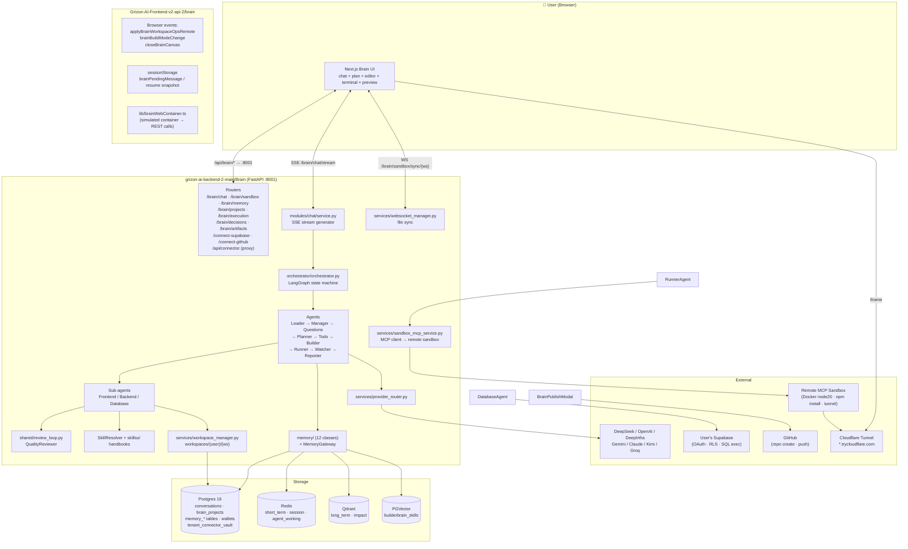
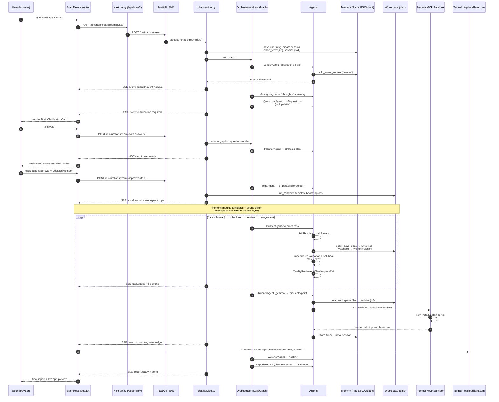
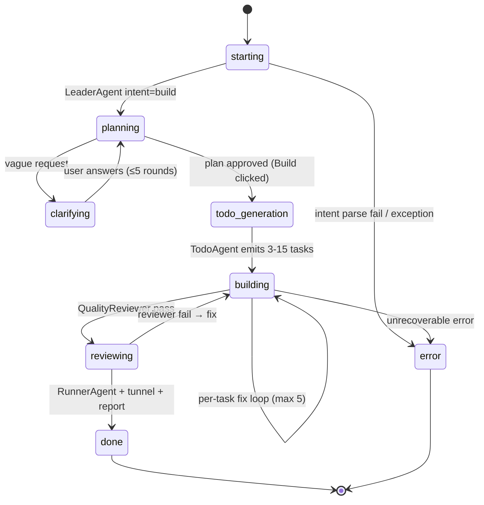
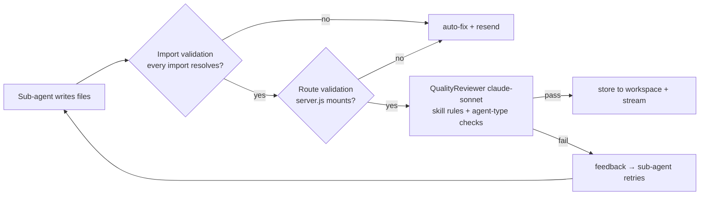
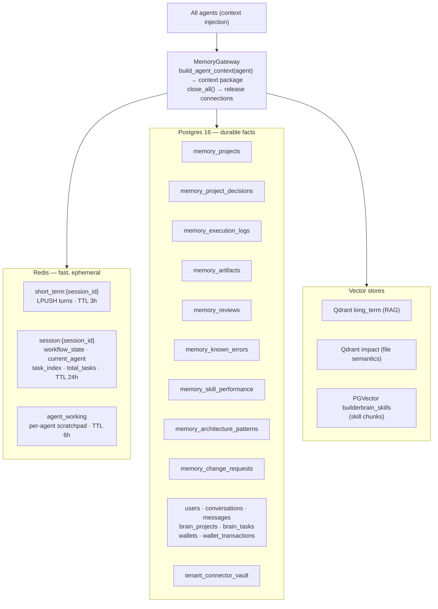
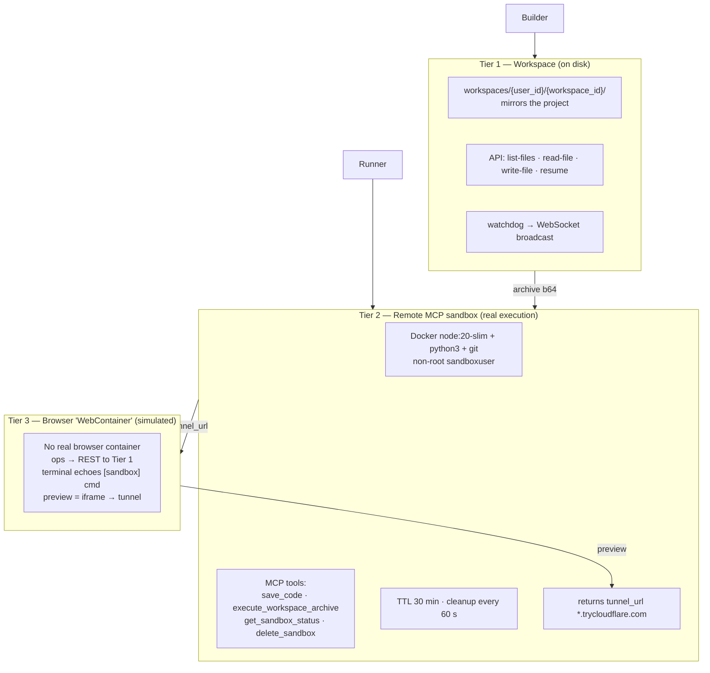
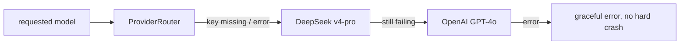

# 🧠 BrainFlow — Complete Technical Manual of the Grizon AI Brain

> **Scope:** Every component, every file, every connection of the Grizon AI Brain.
> **Source code bases:**
> - Backend (the Brain): `grizon-ai-backend-2-main/Brain` — Python/FastAPI v2.5.2
> - Frontend (the screen): `Grizon-AI-Frontend-v2-api-2/brain` — Next.js/React/TypeScript
>
> Everything in this document was extracted from the actual source code. Where the code
> differs from the design docs (`orchestration.md`, `agents.md`, `project_brain.md`, …), the
> **code is treated as truth** and the difference is flagged in Part 18 ("What is real vs. what is a spec").

---

## Table of Contents

1. [One-Line Summary](#1-one-line-summary)
2. [System At A Glance (Mermaid)](#2-system-at-a-glance)
3. [The Complete Folder & File Inventory](#3-folder--file-inventory)
4. [End-To-End Request Lifecycle (Mermaid Sequence)](#4-end-to-end-request-lifecycle)
5. [The Orchestrator & Workflow State Machine](#5-orchestrator--workflow-state)
6. [Agent Deep-Dive](#6-agents)
7. [Sub-Agents (Frontend / Backend / Database)](#7-sub-agents)
8. [Quality Review & Self-Healing Loop](#8-quality-review--self-healing-loop)
9. [The Chat Service & SSE Event Stream](#9-chat-service--sse-events)
10. [REST API Reference (all endpoints)](#10-rest-api-reference)
11. [Memory Architecture (Redis / Postgres / Qdrant / PGVector)](#11-memory-architecture)
12. [Skills System](#12-skills-system)
13. [Sandbox, Workspace, Tunnel & Resume](#13-sandbox--workspace--tunnel)
14. [Models & Provider Router](#14-models--provider-router)
15. [Frontend Deep-Dive](#15-frontend-deep-dive)
16. [Frontend ↔ Backend Contract (REST / SSE / WS / Tunnel)](#16-frontend--backend-contract)
17. [Connectors & Integrations](#17-connectors--integrations)
18. [What Is Real vs. What Is a Spec](#18-real-vs-spec)
19. [Environment Variables & Config](#19-environment-variables--config)
20. [Glossary](#20-glossary)

---

# 1. One-Line Summary

**The Brain is an AI software company that takes a chat message, clarifies it, plans it,
gets your approval, breaks it into ordered tasks, delegates each task to a specialized
AI "engineer", writes the code into a sandbox workspace, runs it on a remote sandbox
machine, streams everything live into a browser IDE, and produces a final report.**

Two halves talk to each other:

| Half | Location | Tech |
|---|---|---|
| 🖥️ Frontend (the screen) | `Grizon-AI-Frontend-v2-api-2/brain` | Next.js + React + TS (Monaco editor, xterm, iframe preview) |
| 🧠 Backend (the Brain) | `grizon-ai-backend-2-main/Brain` | FastAPI + LangChain/LangGraph + Redis + Postgres + Qdrant |

The frontend is the window. The backend is the brain. All intelligence, memory, and
execution lives server-side; the browser is a thin-but-rich client.

---

# 2. System At A Glance



**Key architectural insight:** the browser has **no real container**. The "WebContainer" in the
frontend (`context/BrainWebContainerContext.tsx`, `lib/brainWebContainer.ts`) is a *simulation*:
file operations are REST calls to the backend, terminal output is a log echo, and the preview
is an iframe to a real Cloudflare tunnel URL served by the remote sandbox. See Part 13 & 15.

---

# 3. Folder & File Inventory

## 3.1 Backend — `grizon-ai-backend-2-main/Brain/`

### 3.1.1 Root files

| File | Role |
|---|---|
| `main.py` | FastAPI app entry. Title `"Grizon AI: Project Brain Backend"`, version `2.5.2`, runs on `127.0.0.1:8001` with `reload=True`. Mounts all routers, CORS `allow_origins=["*"]`, custom 422 validation handler, `/health`, `/debug/tasks`, legacy `/brain/sandbox/write-file`. |
| `requirements.txt` | 25 deps: fastapi, uvicorn, langgraph, langchain(+anthropic/openai/google-genai/community/postgres/mcp-adapters), redis, pydantic, python-dotenv, httpx, sqlalchemy, psycopg2-binary, sse-starlette, tavily-python, docker, watchdog, qdrant-client, openai, PyJWT, mcp. |
| `Dockerfile` | Root Dockerfile (backend app image). |
| `docker/Dockerfile.sandbox` | The *sandbox* image: `node:20-slim` + python3 + python3-pip + git + curl, non-root user `sandboxuser`, `/workspace` owned by that user, `CMD ["bash"]`. This is what the remote MCP sandbox runs. |
| `AGENTS.md` | Design spec: the 15-agent "Brains" vision (Project/Development/Data/Research/Content/Strategy/Security/QC brains) — the roadmap, not all implemented. |
| `project_brain.md` | Design doc for the Project Brain (leader/PM role, tools list). |
| `orchestration.md` | Design doc: LangGraph DAG orchestration vision. |
| `agents.md` | Full agent roster design. |
| `memory_detailed.md` | Memory architecture design doc. |
| `master_universal_brain_backend.md` | Big master plan document. |
| `brain_route_plan.md`, `QUEUE_SYSTEM_PLAN.md`, `CONCURRENT_REQUEST_AND_AGENT_EXECUTION_PLAN.md`, `BACKEND_INTEGRATION.md`, `Frontend.md`, `layers _features.md`, `supabase_proxy_workflow.md`, `GRIZON_AI_READY.txt`, `FINAL_SUCCESS_VERIFIED.txt` | Planning / acceptance documents. |
| `*.log`, `*_results.txt`, `*_test_output.txt` | Live run logs & manual test outputs (evidence of real runs). |
| `check_db.py`, `check_openai.py`, `check_unified_status.py`, `inspect_db.py`, `discover_models.py`, `list_gemini.py`, `debug_planner.py`, `drop_fk.py`, `create_test_user.py`, `insert_test_user.py`, `auto_insert_connector.py`, `test_all_memories.py`, `test_project_api.py` | Dev/test scripts. |
| `scratch/test_sandbox.py`, `scratch/test_token_credit.py` | Scratch tests. |

### 3.1.2 `agents/` — the pipeline agents

| File | Agent class | Model | Job |
|---|---|---|---|
| `agents/leader_agent.py` | `LeaderAgent` | `deepseek-v4-pro` | "CEO": parses intent (build/fix/clarify), titles conversations, kicks off workflow. |
| `agents/clarifier_agent.py` | `ClarifierAgent` | (shared router) | Legacy clarification agent. |
| `agents/manager/manager_agent.py` | `ManagerAgent` | `deepseek-v4-flash` | "Chief of Staff": writes the user-facing "thoughts" summary streamed to the UI. |
| `agents/questions/questions_agent.py` | `QuestionsAgent` | `deepseek-v4-flash` | "Interviewer": up to 5 multiple-choice questions, includes a mandatory color-palette question. |
| `agents/planner/planner_agent.py` | `PlannerAgent` | `llama-4-scout-17b-16e-instruct` (DeepInfra) | "Architect": writes the strategic plan/PRD (project_name, summary, stack, architecture, milestones). Deterministic `_topic_fallback` for vague prompts. |
| `agents/planner_agent.py`, `agents/task_agent.py`, `agents/reporter_agent.py` (root level) | Legacy/older variants | — | Duplicated older agent files; the package-based versions above are the live ones. |
| `agents/todo/todo_agent.py` | `TodoAgent` | `llama-4-scout-17b-16e-instruct` (DeepInfra) | "PM": plan → 3–15 ordered tasks with categories database→backend→frontend→integration→runner. |
| `agents/builder/builder_agent.py` | `BuilderAgent` | `Qwen/Qwen3-Coder-480B-A35B-Instruct-Turbo` (DeepInfra) | "Team lead": executes tasks one-by-one, delegates to sub-agents, validates imports/routes, self-healing loop. Keeps a second cheap LLM (`DEFAULT_CHEAP_MODEL`, default `deepseek-chat`) for internal classification/quick steps. |
| `agents/builder/mcp_tools.py` | MCP tool bindings | — | `read_skill_file`, `client_save_code`, `client_execute_in_sandbox`, `supabase_exec_sql`, `supabase_create_exec_sql_function` + activity event emitter. |
| `agents/runner/runner_agent.py` | `RunnerAgent` | `gemma-4-26b-a4b-it` | "DevOps": picks entrypoint (`frontend/src/main.jsx` else `backend/server.js`), sends workspace archive to remote sandbox via MCP, returns tunnel URL. |
| `agents/watcher/watcher_agent.py` | `WatcherAgent` | `deepseek-chat` | "Monitoring": simplified — sets `health_status: healthy`, forwards to reporter. |
| `agents/reporter/reporter_agent.py` | `ReporterAgent` | `claude-sonnet-4.6` | "Secretary": generates the final 7-section Markdown technical report. |

### 3.1.3 `sub_agents/` — the specialist builders

| File | Class | Model | Scope |
|---|---|---|---|
| `sub_agents/frontend/frontend_agent.py` | `FrontendAgent` | `Qwen/Qwen3-Coder-480B-A35B-Instruct-Turbo` (DeepInfra) | React UI code. Tools: `client_save_code`, `read_skill_file`. Temperature 0.1, `top_p=0.8`. Rules from `FRONTEND_BUILD_STANDARDS`. |
| `sub_agents/backend/backend_agent.py` | `BackendAgent` | same Qwen model | Express/CommonJS API code. Tools: `client_save_code`, `read_skill_file`. |
| `sub_agents/database/database_agent.py` | `DatabaseAgent` | `deepseek-v4-flash` | Supabase SQL + live execution. Tools add `supabase_exec_sql`, `supabase_create_exec_sql_function`. Skill cache keys: `migration`, `rls`, `seed`, `indexes`, `schema`, `fallback`. |

### 3.1.4 `orchestrator/`

| File | Role |
|---|---|
| `orchestrator/orchestrator.py` | The LangGraph `StateGraph` that runs the pipeline. Nodes: leader → manager → questions → planner → todo → builder → runner → watcher → reporter, with conditional edges (clarify vs. proceed, review loops). State keys include `workflow_state`, `current_agent`, `status`, `next_agent`, `project_plan`, `todo_list`, `executed_tasks`, `current_task_index`, `sandbox_id`, `error_msg`, `memory_context`, `run_config`. |

### 3.1.5 `services/` — infrastructure

| File | Role |
|---|---|
| `services/provider_router.py` | `ProviderRouter.get_model(model_id, temperature, …)` — single switchboard mapping model IDs → provider SDKs, with a universal fallback chain (see Part 14). |
| `services/sandbox_mcp_service.py` | `SandboxMCPService` — MCP client to the remote sandbox (`SANDBOX_MCP_URL`). Tools: `save_code`, `execute_workspace_archive`, `get_sandbox_status`, `delete_sandbox`. Sandbox TTL 30 min, background cleanup loop every 60 s. Stores per-session `tunnel_url`. Init timeout 15 s. |
| `services/sandbox_manager.py` | Older local sandbox manager (workspace-level file ops). |
| `services/sandbox_service.py` | Older sandbox abstraction (Firecracker-era design, mostly superseded by the MCP sandbox). |
| `services/workspace_manager.py` | `workspace_manager.resolve_workspace_path(workspace_id, user_id=None)` → `workspaces/{user_id}/{workspace_id}` (falls back to legacy `workspaces/{workspace_id}`). Helpers `build_op_mkdir`, `build_op_write_file`. |
| `services/workspace_watcher.py` | `watcher_manager.start_watching(workspace_id, path, on_file_change)` — filesystem watchdog that broadcasts changes over WebSocket. Noise-filtered dirs: `.git`, `node_modules`, `.next`, `dist`, `build`. |
| `services/websocket_manager.py` | `ws_manager` — `connect`, `broadcast_to_sandbox(workspace_id, data)`, `disconnect`. |
| `services/terminal_manager.py` | Terminal session management (xterm backend side). |
| `services/template_service.py` | Template catalog: `list_frameworks()`, `normalize_framework()`, `get_bootstrap_ops(fw, include_frontend)`, `template_to_workspace_ops(tpl)`, `FRAMEWORK_TO_FRONTEND_TEMPLATE` (react→`react-template`, next→`next-template`). Injects company Supabase URL/anonymous key into the frontend `.env`. |
| `services/command_policy.py` | WebContainer command filter (see 13.4): blocks Supabase CLI, `echo` of secrets, `.env` copies, `npx create-*`, bare `npm install`, `npm run dev/start`; parses `npm install <pkgs>` into structured `install_packages` ops. |
| `services/build_resume.py` | Resume-after-reload: `compute_resume_index(todos)`, `latest_todo_list_from_messages(messages)`, `workspace_disk_to_ops(workspace_id, user_id)` (walks disk → `write_file` ops, ≤400 files, ≤512 KB each, skips locks/`.git`), `get_resume_payload(...)` returning `{workspace_id, framework, todos, current_task_index, build_complete, workspace_ops, runtime: "sandbox_mcp", tunnel_url}`. |
| `services/mcp_service.py` | Tool gateway for agents (`GCP_MCP_BASE_URL`): per-call MCP sessions authenticated with the user's decrypted connector tokens; `mcp_list_tools` / `mcp_call_tool` style bridge. |
| `services/roadmap_service.py` | Milestones/roadmap helper for planning. |
| `services/web_search_service.py` | Tavily-based web search (research support). |

### 3.1.6 `shared/` — common code

| File | Role |
|---|---|
| `shared/agent.py` | `BaseAgent(name, description, model_id)` — every agent's base class. `get_model()` via `ProviderRouter`; `chat(messages)` binds agent tools (LangChain tool binding) and calls the model with a 90 s timeout. |
| `shared/review_loop.py` | `QualityReviewer` — Claude Sonnet (`claude-sonnet-4.6`, temperature 0) grades an agent's output against compiled skill rules, returns `{passed, feedback}` JSON. Contains deterministic frontend checks (React Router v6, orphan/placeholder/duplicate files, missing deps in package.json, BFS connectivity from root node). |
| `shared/build_standards.py` | The "handbook" constants: `GLOBAL_BUILD_STANDARDS` (~300 tokens), `FRONTEND_BUILD_STANDARDS` (~500), `BACKEND_BUILD_STANDARDS` (~400), `DATABASE_BUILD_STANDARDS` (~200), `INTEGRATION_BUILD_STANDARDS` (~300), `TASK_ORDER_STANDARDS`, `FULL_STACK_BUILD_STANDARDS` (all combined), and `INTEGRATION_TASK_TEMPLATE` (the mandatory final wiring task). |
| `shared/structured_spec.py` | `format_structured_spec(task)` — renders todo fields `files/ui/api/depends_on` into spec lines injected into the sub-agent prompt. |
| `shared/frontend_entry.py` | `normalize_frontend_entry_files(files)` — guarantees `frontend/src/main.jsx → ./App.jsx` is the only Vite root: redirects `App.tsx`→`App.jsx`, strips TS syntax (`tsx_to_jsx`), detects boilerplate markers (`"Grizon React"`, `"useState(0)"`, `"Brain will mount"`, …), and regenerates a canonical `main.jsx` when missing. Returns `(normalized_files, should_delete_tsx)`. |
| `shared/skills/resolver.py` | `SkillResolver` — semantic skill retrieval: (1) LLM turns task description into a search query, (2) `similarity_search` on PGVector `builderbrain_skills` (top 5 chunks), (3) "compiler" LLM (DeepSeek `deepseek-chat`, temp 0) distills chunks into JSON rules. Falls back to **file paths** of local `skillss/`/`skills/` markdown (agent reads them on demand via `read_skill_file` MCP tool). |
| `shared/skills/ingestion.py` | Standalone ingestion script: ensures `pgvector` extension, splits every `skillss/*/SKILL.md` by Markdown headers + recursive text splitter (1000 chars / 200 overlap), embeds with OpenAI embeddings, stores into PGVector collection `builderbrain_skills` (use_jsonb). |

### 3.1.7 `memory/` — the 12 memory classes + gateway

| File | Class | Storage | Purpose |
|---|---|---|---|
| `memory/short_term.py` | `ShortTermMemory` | Redis `short_term:{session_id}` | Conversation turns; LPUSH `{role, content, agent, timestamp}`; TTL **10800 s (3 h)**. |
| `memory/session.py` | `SessionMemory` | Redis `session:{session_id}` | Hash: `workflow_state`, `current_agent`, `current_task_id`, `task_index`, `total_tasks`, `project_id`, `started_at`, `last_active`; TTL **86400 s (24 h)**. |
| `memory/agent_working.py` | `AgentWorkingMemory` | Redis (per agent per session) | Scratchpad; TTL **6 h**. |
| `memory/project.py` | `ProjectMemory` | Postgres `memory_projects` | Project row: stack, requirements, roadmap, status. |
| `memory/decision.py` | `DecisionMemory` | Postgres `memory_project_decisions` | Approved decisions (stack/UI/security) with override tracking. |
| `memory/execution.py` | `ExecutionMemory` | Postgres `memory_execution_logs` | Per-task lifecycle: status, retries, duration_ms, token_count, output files. |
| `memory/artifact.py` | `ArtifactMemory` | Postgres `memory_artifacts` | Versioned file artifacts: path, version, content_hash, dependencies, exports. |
| `memory/review.py` | `ReviewMemory` | Postgres `memory_reviews` | Quality scores (≥70 = pass), issues JSONB. |
| `memory/error.py` | `ErrorMemory` | Postgres `memory_known_errors` | Known error patterns + fixes, success_rate, occurrence_count. |
| `memory/skill.py` | `SkillMemory` | Postgres `memory_skill_performance` | Success rate per skill (total/successful/failed uses, avg score/tokens/duration). |
| `memory/architecture.py` | `ArchitectureMemory` | Postgres `memory_architecture_patterns` | Winning stack combos + success rates. |
| `memory/change.py` | `ChangeMemory` | Postgres `memory_change_requests` | Pending→completed change requests. |
| `memory/long_term.py` | `LongTermMemory` | Qdrant `long_term` | Semantic embeddings of past project knowledge (RAG). |
| `memory/impact.py` | `ImpactMemory` | Qdrant `impact` | File-level semantic impact analysis. |
| `memory/gateway.py` | `MemoryGateway` | all of the above | `build_agent_context(agent)` assembles the context package (recent chat + session state + project + decisions + skills + known errors) before an agent runs; `close_all()` releases DB connections to prevent pool exhaustion. |
| `memory/memory_engine.py` | `MemoryEngine` | orchestrates | Higher-level memory facade. |
| `memory/debug.py` | debug API router | — | `/brain/memory/...` endpoints (see Part 10). |
| `memory/models.py` | SQLAlchemy models | — | ORM models for memory tables. |

### 3.1.8 `modules/` — HTTP modules

| File | Role |
|---|---|
| `modules/chat/service.py` | **The heart of the Brain.** `process_chat(data)` and `process_chat_stream(data)` (async generator → SSE). Core flow: `analyze_ingress` → `recursive_clarify` (up to N rounds) → `strategic_plan` → `create_tasks` → `init_sandbox` → background build loop `_run_builder_background` (builds while streaming status events). Tracks session state in Redis, persists messages with `todo_list` and `sandbox_job` JSON columns. Also `stop_execution(conversation_id)`, `get_sandbox_files(conversation_id)`. |
| `modules/chat/controller.py` | Router `prefix="/brain/chat"`: `POST ""`, `POST /stream`, `POST /stop`, `GET /files/{conversation_id}`. Handles the frontend quirk of `conversation_id` arriving as a list. |
| `modules/chat/types.py` | Pydantic `BrainChatRequest` / `BrainChatResponse`. |
| `modules/conversations/models.py` | SQLAlchemy models: `User`, `Conversation`, `Message`, `BrainProject`, `CreditWallet`, `CreditTransaction`, `BrainTask` (see Part 11 for columns). |
| `modules/conversations/controller.py` | Router `prefix="/brain/conversations"` (list/create/get messages, …). |
| `modules/conversations/service.py` | `conversation_service` — CRUD + `get_messages()`, message persistence with todo/sandbox JSON. |
| `modules/projects/controller.py` | Router `prefix="/brain/projects"`: `POST ""`, `GET /{project_id}`, `PATCH /{project_id}/stack`, `POST /{project_id}/requirements`, `GET ""`. |
| `modules/projects/decisions.py` | Router `prefix="/brain/decisions"`: `POST ""`, `GET /{project_id}`, `POST /override`. |
| `modules/projects/execution.py` | Router `prefix="/brain/execution"`: `POST /start`, `POST /{log_id}/complete`, `POST /{log_id}/fail`, `GET /check/{project_id}/{task_name}`, `GET /failed/{project_id}`, `GET /summary/{project_id}`. |
| `modules/projects/artifacts.py` | Router `prefix="/brain/artifacts"`: `POST ""`, `GET /{project_id}`, `GET /{project_id}/check`, `GET /{project_id}/type/{artifact_type}`, `GET /{project_id}/name/{name}`, `DELETE /{artifact_id}`. |
| `modules/sandbox/controller.py` | Router `prefix="/brain/sandbox"`: all workspace/sandbox endpoints (see Part 10) + tunnel proxy + WebSocket. |
| `modules/connectors/supabase/controller.py` | Router `prefix="/connect-supabase"`: status/disconnect/save-credentials/apply-to-workspace/inject-company-credentials/auto-schema (generates the standard app schema), OAuth login + callback. |
| `modules/connectors/supabase/service.py` + `schema.py` | Credential handling (encrypted), connection checks, schema generator (`profiles`, `projects`, `posts`, `media`, `activity_log`, `settings` + RLS policies). |
| `modules/connectors/github/controller.py` | Router `prefix="/connect-github"`: OAuth login/callback, status, disconnect, PAT save, repo create/list/discover/select/sync/chat/changes, push-changes, webhook. |
| `modules/connectors/github/service.py` | GitHub API client for the above. |
| `modules/supabase_proxy/controller.py` | Router `prefix="/api/connector"`: `GET /health`, `POST /push`, `GET /query` — lets generated apps read/write the shared tenant vault with rate limiting. |
| `modules/supabase_proxy/service.py` | `proxy_client` — company-owned Supabase client; `init_client()`, `start_housekeeping()`, `close_client()` (called from app lifespan). |
| `modules/shared/auth.py` | Shared auth/JWT helpers for modules. |

### 3.1.9 `mcp_connector/`

| File | Role |
|---|---|
| `mcp_connector/connector.py` | Router `prefix="/mcp"`: `POST /github/tools`, `POST /supabase/tools` — a bridge that exposes connector-backed tools to agents over MCP (each session fresh, authenticated with decrypted tokens). |

### 3.1.10 `templates/` — starter projects copied into each workspace

| Template | Contents |
|---|---|
| `react-template/` | Vite React app: `package.json`, `vite.config.js` (**port 9999**, proxies `/api` → `:3001`), `index.html`, `postcss.config.js`, `tailwind.config.js`, `src/App.jsx` (boilerplate the agents must replace), `src/main.jsx`, `src/index.css`, `src/lib/api.js` (apiGet/apiPost/…). |
| `next-template/` | Next.js: `package.json`, `next.config.js`, `app/layout.tsx`, `app/page.tsx`. |
| `express-template/` | Express: `package.json`, `server.js` (port 3001, CommonJS). |
| `supabase-template/` | `client.js` (server-side client), `schema.sql` (standard app schema + RLS). |

### 3.1.11 `skills/` & `skillss/` — the agent handbooks

`skills/` (older, markdown):
- `skills/frontend/skills.md`, `skills/frontend/react.md`, `skills/frontend/shadcn.md`
- `skills/backend/skills.md`, `skills/backend/api-security.md`
- `skills/database/skills.md`, `skills/database/supabase.md`

`skillss/` (current, skill-framework layout with `SKILL.md` + references):
- `skillss/backend-development/SKILL.md`
- `skillss/frontend-design/SKILL.md`
- `skillss/nodejs-backend-patterns/SKILL.md` (+ `references/advanced-patterns.md`, `references/details.md`)
- `skillss/shadcn/SKILL.md` + `cli.md`, `customization.md`, `mcp.md`, `rules/` (base-vs-radix, composition, forms, icons, styling), `agents/`, `assets/`, `evals/`
- `skillss/supabase/SKILL.md` (+ `references/`)
- `skillss/supabase-postgres-best-practices/SKILL.md` + **30+ reference files** (indexing, pooling, locks, RLS, pagination, upserts, …)

These are the files the `SkillResolver` points agents at and that `ingestion.py` vectorizes.

### 3.1.12 `config/`, `sql/`, others

| File | Role |
|---|---|
| `config/database.py` | SQLAlchemy engine + `Base` + session factory. |
| `config/redis.py` | Redis client singleton. |
| `sql/create_memory_tables.sql` | Full DDL for all `memory_*` tables (verbatim in Part 11). |
| `sql/create_tenant_connector_vault.sql` | DDL + RLS for `tenant_connector_vault` (verbatim in Part 17). |
| `sandbox_mcp_server/mcp-file.py` | Reference MCP file-server implementation. |
| `providers/`, `queues/`, `controllers/`, `configs/` | Mostly placeholder packages for future work (BullMQ queues & provider abstraction are planned but the live code uses `services/provider_router.py`). |

## 3.2 Frontend — `Grizon-AI-Frontend-v2-api-2/brain/`

| File | Role |
|---|---|
| `BrainView.tsx` | Main brain screen: mounts layout, loads session, handles `brainPendingMessage` from sessionStorage. |
| `BrainLayout.tsx` | Split layout: chat column (~35%) + workspace column (~65%). |
| `components/BrainMessages.tsx` | **The central state machine (~2,765 lines).** Orchestrates the whole conversation: sends chat requests, consumes the SSE stream, renders messages, updates todos, emits workspace ops to the editor, handles clarification answers, plan approval ("Build"), resume, and stops. |
| `components/BrainAgentMessage.tsx`, `BrainAgentStatus.tsx` | Agent "thoughts" bubble + status chips (per-agent progress). |
| `components/BrainUserMessage.tsx` | User message bubble. |
| `components/BrainClarificationCard.tsx` | Multiple-choice clarification UI (up to 5 questions incl. palette). |
| `components/BrainPlanCanvas.tsx` | Plan/PRD card with the **Build** button (approval gate). |
| `components/BrainTodoCanvas.tsx`, `BrainLiveTodos.tsx` | Todo list renderer + live updating checkboxes. |
| `components/BrainEditorCanvas.tsx` | Monaco editor (custom dark theme, tabs, 800 ms autosave) + xterm.js terminal + preview iframe with 10 s boot countdown. |
| `components/BrainSandboxCanvas.tsx` | Sandbox panel: file explorer + terminal + preview. |
| `components/BrainArtifactView.tsx`, `BrainDecisionView.tsx`, `BrainExecutionView.tsx` | Memory-backed panels: artifacts (files), approved decisions, execution logs. |
| `components/BrainFrameworkSelector.tsx` | Choose React vs Next before starting. |
| `components/BrainSupabasePrompt.tsx` | "Connect your Supabase" prompt + status. |
| `components/BrainPublishModal.tsx` | Publish: download ZIP or push to GitHub (create repo → commit → push). |
| `components/BrainWorkspaceBoot.tsx` | Initial workspace boot / template mount screen. |
| `constants/frameworks.ts` | React / Next framework catalog (id, name, icon, description). |
| `context/BrainWebContainerContext.tsx` | React context exposing `applyWorkspaceOps`, `listFiles`, `readFile`, `writeFile` — **naming is legacy; the implementation delegates to `lib/brainWebContainer.ts` (REST)**, no real browser container. |
| `hooks/useBrainWorkspaceOps.ts` | Hook wrapping workspace ops + terminal output subscription. |
| `lib/brainApiBase.ts` | `getBrainApiUrl(path)` — browser: `/api/brain/{path}` (Next.js rewrite → :8001, avoids CORS); server: `NEXT_PUBLIC_BRAIN_API_URL || http://127.0.0.1:8001/brain/{path}`. `brainApiFetch()` with no-store + abort support. |
| `lib/brainSession.ts` | `SessionState` + `fetchSession`, `updateSessionField`, `updateWorkflowState`, `clearSession` → `/brain/memory/session/...`. Phase label/color maps (`starting`, `planning`, `clarifying`, `todo_generation`, `building`, `reviewing`, `done`, `error`). |
| `lib/brainWebContainer.ts` | Workspace op types (`write_file`, `delete_file`, `mkdir`, `install_packages`, `run`), `sortWorkspaceOps` (mkdir → write → install → run → delete), `applyWorkspaceOp` (echoes `[sandbox] cmd` to terminal — simulated execution), `listWebContainerFiles`/`readWebContainerFile` (REST), and MCP wrappers: `mcpSaveFiles`, `mcpExecute`, `mcpSaveAndExecute`, `mcpGetStatus`, `mcpDeleteSandbox`. |
| `lib/commandPolicy.ts` | Frontend mirror of the command policy (skips echo/env/Supabase-CLI/npx-create commands). |
| `lib/templateBootstrap.ts` | Mounts template ops into the workspace at boot. |
| `lib/fileTreeUtils.ts` | Builds the VS Code-style file tree (folders first). |
| `lib/artifactMemory.ts`, `lib/decisionMemory.ts`, `lib/executionMemory.ts`, `lib/projectMemory.ts` | Client caches for the memory panels. |
| `lib/streaming/useStream.ts` | Fetch-based SSE reader hook (`ReadableStream` parser, event dispatch). |
| `lib/streaming/stream-simulator.ts` | Demo/simulation stream (used by prototype screens only). |
| `lib/agent-engine/engine.ts`, `lib/agents/dynamic-prompts.ts` | **Demo-only** in-browser agent engine — not used by the real chat. |
| `store/execution-store.ts` | Zustand store: live thoughts, phases, current agent, active todos. |
| `universal_brain_v2_plan.md` | Planning doc inside the frontend. |

---

# 4. End-To-End Request Lifecycle



**The numbered walkthrough (with code anchors):**

1. **Send** — `BrainMessages.tsx` fires the SSE POST (`/brain/chat/stream`). The frontend writes the pending message into `sessionStorage` first so a reload never loses it (`BrainView.tsx`).
2. **Session creation** — `chat/service.py` persists the `Message` row (with `conversation_id` failsafe for list-quirks in `controller.py:16`), creates Redis `session:{sid}` (TTL 24 h) and pushes the turn into `short_term:{sid}` (TTL 3 h).
3. **Leader** — `LeaderAgent` (`agents/leader_agent.py`, `deepseek-v4-pro`) classifies intent (build / clarify / fix) and generates the conversation title.
4. **Manager** — `ManagerAgent` writes a friendly "what I'm about to do" summary streamed to the UI.
5. **Clarify (conditional)** — `QuestionsAgent` asks up to **5 multiple-choice questions**; question 1 is always the color palette (`COLOR_PALETTES`: `midnight-blue`, `dark-coral`, `clean-light`). The graph takes the `needs_clarification` edge and **pauses** — no guessing.
6. **Plan** — `PlannerAgent` produces the strategic plan (`project_name`, `summary`, `stack`, `architecture`, `milestones`). If the request is too vague, `_topic_fallback` builds a safe generic CRUD plan. A `plan.ready` SSE event shows `BrainPlanCanvas`.
7. **Approval (HITL gate)** — nothing is built until the user clicks **Build**. On approval, choices are committed to `DecisionMemory` so every downstream agent agrees on the same stack.
8. **Tasks** — `TodoAgent` (MIN 3 / MAX 15 tasks) orders them: `database → backend → frontend → integration → runner` (`TASK_ORDER_STANDARDS`). Each todo has `id`, `category`, `title`, `description`, `skill_required`, `acceptance_criteria`, and structured fields `files / ui / api / depends_on`.
9. **Sandbox init** — template ops (React + Express + Supabase templates) are mounted into `workspaces/{user_id}/{workspace_id}` and streamed to the browser; the editor appears (Monaco + xterm + empty preview).
10. **Build loop** — `_run_builder_background` iterates tasks. For each: `BuilderAgent` resolves skills (`SkillResolver`), dispatches to the right sub-agent (`FrontendAgent` / `BackendAgent` / `DatabaseAgent`), receives `{files, commands}` JSON, writes files via `client_save_code` (also to the disk workspace), validates imports/routes, self-heals up to 5 times, and runs the independent `QualityReviewer`.
11. **Run** — `RunnerAgent` picks `frontend/src/main.jsx` (else `backend/server.js`), archives the workspace (base64), and calls the remote sandbox MCP `execute_workspace_archive`. The sandbox installs dependencies and starts servers; it returns a **Cloudflare tunnel URL**.
12. **Preview** — frontend loads the tunnel URL in the preview iframe (direct, or through `/brain/sandbox/proxy-tunnel/{session}/{path}` which rewrites absolute `src/href` to relative to survive the tunnel).
13. **Report** — `ReporterAgent` writes the final 7-section Markdown report; state becomes `completed`.
14. **Credits** — each LLM call is token-counted and billed in chunks (1 credit / 4000 tokens) via the wallet system.

---

# 5. Orchestrator & Workflow State

The orchestrator is a **LangGraph `StateGraph`** (`orchestrator/orchestrator.py`). The design docs describe a DAG engine with parallel branches; the running implementation is a **linear pipeline with conditional loops**:



**State dictionary** (keys observed across agents):

| Key | Type | Meaning |
|---|---|---|
| `workflow_state` | str | `starting`, `planning`, `clarifying`, `todo_generation`, `building`, `reviewing`, `done`, `error` |
| `current_agent` | str | Name of the agent currently executing |
| `status` | str | `idle`, `running`, `completed`, `error` |
| `next_agent` | str or None | Manual edge override (e.g. watcher→`reporter`) |
| `project_plan` | dict | `{project_name, summary, stack, architecture, milestones}` |
| `todo_list` | list | Ordered tasks from TodoAgent |
| `executed_tasks` | list | Accumulated task results for the reporter |
| `current_task_index` | int | Position in the todo list |
| `sandbox_id` / `current_job_id` | str | Workspace/session identifier |
| `error_msg` | str | Last error |
| `run_report` | str | Runner output |
| `run_config` | dict | `{framework, port, install_command, start_command}` |
| `memory_context` | dict | `{session_state, ...}` assembled by the MemoryGateway |

**Session fields** mirrored in Redis `session:{session_id}`: `workflow_state`, `current_agent`, `current_task_id`, `current_task_label`, `task_index`, `total_tasks`, `project_id`, `started_at`, `last_active` (exact names as used by `lib/brainSession.ts`).

---

# 6. Agents

## 6.1 `BaseAgent` (`shared/agent.py`)

Every agent extends `BaseAgent(name, description, model_id)`:
- `get_model()` → `ProviderRouter.get_model(model_id, temperature, ...)`
- `chat(messages)` → binds the agent's tool list (LangChain `bind_tools`), runs the model, **90 s timeout**, returns the text content.

## 6.2 Pipeline agents (details that matter)

### LeaderAgent — `deepseek-v4-pro`
- Intent classification; conversation title generation; sets `workflow_state` and `current_agent` in session memory.

### ManagerAgent — `deepseek-v4-flash`
- Produces a short user-facing "thoughts" paragraph from the leader's raw analysis (cheap model = low cost for cosmetic output).

### QuestionsAgent — `deepseek-v4-flash`
- Generates up to **5** questions with multiple choice options (`options: []`, each with `label`).
- **Mandatory question 1: color palette** from `COLOR_PALETTES` — three curated looks (e.g. `midnight-blue`, `dark-coral`, `clean-light`).
- Answer flow: frontend posts answers back; the graph loops `clarifying → planning` until the plan can be made (max rounds guard in service).

### PlannerAgent — `llama-4-scout-17b-16e-instruct` (DeepInfra)
- Writes the strategic plan: `project_name`, `markdown_plan`, `tech_stack`, `stack` (frontend/backend/db/auth/styling), `architecture` (pages/components/tables/api_routes/dependencies), `status`.
- Two-step attempt ladder: **full structured prompt (max_tokens 2000, timeout 90s) → light retry (max_tokens 1000, timeout 45s) → deterministic `_topic_fallback`** (no LLM at all). A plan is only accepted if it has all required keys, so the user always gets a real plan.
- `_topic_fallback`: extracts the subject from the prompt (stopword-filtered), derives a generic CRUD plan (Dashboard/List/Manage/Settings pages, React+Tailwind, Express, Shared Table + JSONB).
- Decides the Supabase source itself: `user_connector` if a connected connector exists with valid config, else `company_fallback`, else `not_requested` — recorded into DecisionMemory.

### TodoAgent — `llama-4-scout-17b-16e-instruct` (DeepInfra)
- Constants: `MIN_TODOS = 3`, `MAX_TODOS = 15`; `clamp_todo_list` enforces the max and guarantees exactly one `runner` task at the end (converts the last task to `runner` if the LLM forgot).
- Category order enforced from `TASK_ORDER_STANDARDS`: `database → backend → frontend → integration → runner`.
- Task shape: `{id, category, title, description, skill_required, acceptance_criteria, files[], ui[], api[], depends_on[]}`.
- The planner's `architecture` block is injected **verbatim** (tagged as authoritative, names must be used exactly) so the todo agent never renames components/tables/routes.
- When a build needs full-stack wiring, the **integration task template** (`INTEGRATION_TASK_TEMPLATE` in `shared/build_standards.py`) is appended — the mandatory App.jsx/server.js/API wiring checklist.

### BuilderAgent — `Qwen/Qwen3-Coder-480B-A35B-Instruct-Turbo` (DeepInfra)
- The main task-generation calls use the Qwen coder model; a separate cheap LLM (`DEFAULT_CHEAP_MODEL`, default `deepseek-chat`, temperature 0) is used for internal meta steps (classifying files, quick judgments).
- Maintains a `ProjectIndex` (class-level cached scan of the workspace: jsx files, imports per file) used for import validation and route validation.
- Executes tasks sequentially, mapping category → sub-agent:
  - `database` → DatabaseAgent
  - `backend` → BackendAgent
  - `frontend` → FrontendAgent
  - `integration` → FrontendAgent with `INTEGRATION_BUILD_STANDARDS`
  - `runner` → RunnerAgent (delegated, never duplicated)
- **Self-healing loop**: run → catch → ask fixer → re-run, **max 5 attempts**, `FORBIDDEN_PATTERNS` block destructive commands.
- Emits activity events (`type: "task" | "file" | "command" | "info" | "install"`, `id: "act-{ts}-{type}"`, `status: pending|done|error`, `taskTitle`, `path`, `label`) — these drive the live activity feed in the UI.

### RunnerAgent — `gemma-4-26b-a4b-it`
- Picks entrypoint: `frontend/src/main.jsx` if it exists, else `backend/server.js`.
- Archives workspace → base64 → MCP `execute_workspace_archive` on the remote sandbox (15 s init timeout).
- Receives `tunnel_url`, stores it via `sandbox_mcp.store_tunnel_url(session_id, url)`.

### WatcherAgent — `deepseek-chat`
- Simplified in code: sets `health_status = "healthy"`, `next_agent = "reporter"`. The real monitoring is done by the async runner + tunnel status, not by this agent.

### ReporterAgent — `claude-sonnet-4.6`
- Prompt demands a professional Markdown report with **7 sections**: Executive Summary, Project Overview, Task Execution Details, Sandbox/Runtime Environment, Milestones Achieved, Errors & Issues, Conclusion & Recommendations.
- Feeds it: project plan, executed tasks (order/title/category/status/summary/error), sandbox context (framework/port/install/start commands), milestones, errors, and the session context line (`[Session] Phase: … | Active Agent: … | Task: i/n`).
- Sets `status = "completed"`, `next_agent = None`.

---

# 7. Sub-Agents

| | FrontendAgent | BackendAgent | DatabaseAgent |
|---|---|---|---|
| File | `sub_agents/frontend/frontend_agent.py` | `sub_agents/backend/backend_agent.py` | `sub_agents/database/database_agent.py` |
| Model | `Qwen/Qwen3-Coder-480B-A35B-Instruct-Turbo` | same | `deepseek-v4-flash` |
| Temperature | 0.1 | 0.1 | (cheap default) |
| Tools | `client_save_code`, `read_skill_file` | `client_save_code`, `read_skill_file` | + `supabase_exec_sql`, `supabase_create_exec_sql_function` |
| Standards injected | `FRONTEND_BUILD_STANDARDS` | `BACKEND_BUILD_STANDARDS` | `DATABASE_BUILD_STANDARDS` |
| Skill cache keys | (n/a) | (n/a) | `migration`, `rls`, `seed`, `indexes`, `schema`, `fallback` |

**Frontend rules that are mechanically enforced:**
- Vite entry `frontend/src/main.jsx → ./App.jsx` only; **never** `App.tsx` (`shared/frontend_entry.py` normalizes this after every generation).
- Vite dev server **port 9999** (not 5173); `vite.config.js` proxies `/api` → Express `:3001`.
- React Router **v6 only**: `<Routes>` not `<Switch>`, `element={<X />}` not `component={X}`.
- No placeholder UI (`<h1>Home Page</h1>`), no orphan components, every import must resolve.
- Premium dark theme, Tailwind, framer-motion.

**Backend rules:**
- Express on port **3001**, **CommonJS only** (`require`/`module.exports`), never ES modules.
- Structure `backend/routes/*.js` + `backend/controllers/*.js`; every controller starts with `const { supabase } = require('../supabase/client');`.
- `server.js` written last with all routes mounted; `{success: true, data}` JSON contract; new deps → return `"commands": ["cd backend && npm install"]`.

**Database rules:**
- **Shared tenant table + JSONB** pattern (not one table per user); `tenant_id` + JSONB payload.
- Schema delivered as `backend/supabase/*.sql` files only — **no Supabase CLI**.
- Connector-first: use the user's connected Supabase connector; fallback to the company proxy. Never request user credentials; no browser-side DB access.
- RLS policies + indexes on tenant filters.

---

# 8. Quality Review & Self-Healing Loop



`shared/review_loop.py` — `QualityReviewer` (`claude-sonnet-4.6`, temperature 0):
- Reviews the sub-agent output against the **compiled skill rules** JSON.
- **Deterministic checks** (no LLM needed) for frontend output:
  - Missing `App.jsx` when components exist → CRITICAL FAILURE with exact fix instructions.
  - React Router v5 syntax (`<Switch>`, `component={}`) → fail.
  - Placeholder content in tiny files → fail.
  - Duplicate component names across `components/` and `pages/` → fail.
  - `@supabase/supabase-js` / `axios` imported but missing from `package.json` → fail.
  - Imports in `App.jsx` that don't exist in the file set → fail.
  - **BFS from the root node**: any file not reachable from `App.jsx` through the import graph = orphan → fail.
- LLM fallback: any non-JSON response is treated as **pass** (fail-open) to avoid infinite loops.

Build-side self-healing (BuilderAgent):
- Re-run code → parse error → patch → re-run; **max 5 fix attempts**; forbidden patterns blocked (e.g. destructive `rm -rf` style commands).

Human-in-the-loop gates: plan approval before build; `POST /brain/chat/stop` anytime.

---

# 9. Chat Service & SSE Events

`modules/chat/service.py` (`process_chat` / `process_chat_stream`) is the engine. `process_chat_stream` is an async generator yielding SSE events; the frontend `useStream.ts` parses them.

**Main internal steps:** `analyze_ingress` → `recursive_clarify` → `strategic_plan` → `create_tasks` → `init_sandbox` → `_run_builder_background` (asyncio background task keeps building even if the client disconnects).

**SSE event shapes (type + payload):**

| Event type | Payload highlights | Rendered by |
|---|---|---|
| `status` | `{state, message}` | phase pill (`brainSession.ts` labels) |
| `agent.thought` | `{agent, content}` | `BrainAgentMessage` |
| `clarification.required` | `{questions: [{id, question, options, type}]}` | `BrainClarificationCard` |
| `plan.ready` | `{plan: {project_name, summary, stack, architecture, milestones}}` | `BrainPlanCanvas` |
| `todo.update` / `todo.list` | `{todoList: [...]}` | `BrainTodoCanvas` / `BrainLiveTodos` |
| `sandbox.init` | `{workspace_id, framework, ops?}` | `BrainWorkspaceBoot` |
| `workspace_ops` | `{ops: WorkspaceOp[]}` | editor/file tree (via `applyBrainWorkspaceOpsRemote`) |
| `task.status` | `{taskId, status, message, label}` | `BrainLiveTodos` |
| `file.saved` | `{path, content}` | editor tab / activity feed |
| `activity` | `{id: act-{ts}-{type}, type, label, status, ...}` | activity feed |
| `sandbox.running` | `{tunnel_url}` | preview iframe |
| `report.ready` / `done` | `{report}` | final report panel |

**Persistence contract:** `Message` rows carry `todo_list` (the project roadmap JSON — this is what makes resume work) and `sandbox_job` (execution credentials/job id), plus `credits_deducted`.

---

# 10. REST API Reference

All routers registered in `main.py`. Browser hits them via the Next.js rewrite `/api/brain/*` → `http://127.0.0.1:8001/brain/*`.

## 10.1 Chat — `/brain/chat`
| Method | Path | Purpose |
|---|---|---|
| POST | `/brain/chat` | Non-streaming chat (returns conversation_id, report, todo_list). |
| POST | `/brain/chat/stream` | **Main entry** — SSE stream. |
| POST | `/brain/chat/stop` | `?conversation_id=` — stop the running build. |
| GET | `/brain/chat/files/{conversation_id}` | Sandbox files for a conversation. |

## 10.2 Sandbox — `/brain/sandbox`
| Method | Path | Purpose |
|---|---|---|
| GET | `/brain/sandbox/frameworks` | List available templates. |
| GET | `/brain/sandbox/resume/{workspace_id}` | Resume payload after reload (`get_resume_payload`). |
| GET | `/brain/sandbox/template-ops` | `?framework=&frontend_only=` template workspace ops. |
| WS | `/brain/sandbox/sync/{workspace_id}` | Real-time file/op sync (ping → pong; watchdog broadcasts). |
| GET | `/brain/sandbox/read-file` | `?workspace_id=&path=` read a file. |
| POST | `/brain/sandbox/write-file` | Write a file (workspace_id as query or body). |
| GET | `/brain/sandbox/list-files` | Recursive file tree (skips `.git`/`node_modules`/`.next`/`dist`/`build`). |
| GET | `/brain/sandbox/proxy-tunnel/{session_id}` & `/{session_id}/{path:path}` | Reverse-proxy tunnel URL; rewrites absolute `src/href` → relative (mixed-content fix). |
| POST | `/brain/sandbox/register-tunnel/{session_id}` | `?tunnel_url=` register tunnel for proxy. |
| POST | `/brain/sandbox/cleanup-all` | Delete all sandboxes. |
| DELETE | `/brain/sandbox/cleanup/{session_id}` | Delete one sandbox. |

**MCP sandbox wrappers (used by `lib/brainWebContainer.ts`):** POST `/brain/sandbox/mcp/save-files`, POST `/brain/sandbox/mcp/execute` (`{session_id, entrypoint, archive_b64}`), POST `/brain/sandbox/mcp/save-and-execute`, GET `/brain/sandbox/mcp/status`, DELETE `/brain/sandbox/mcp/sandbox`.

## 10.3 Memory — `/brain/memory` (`memory/debug.py`)
| Method | Path | Purpose |
|---|---|---|
| GET | `/brain/memory/debug/{session_id}` | Full memory debug dump. |
| GET | `/brain/memory/debug/{session_id}/session` | Session fields. |
| GET | `/brain/memory/session/{session_id}` | Fetch session state (used on resume). |
| PUT | `/brain/memory/session/{session_id}` | `{field, value}` update. |
| PUT | `/brain/memory/session/{session_id}/workflow` | `?state=&agent=` set workflow phase. |
| DELETE | `/brain/memory/session/{session_id}` | Clear session. |

## 10.4 Projects / Decisions / Execution / Artifacts
| Method | Path | Purpose |
|---|---|---|
| POST | `/brain/projects` | Create project. |
| GET | `/brain/projects` | List projects. |
| GET | `/brain/projects/{project_id}` | Get project. |
| PATCH | `/brain/projects/{project_id}/stack` | Update stack. |
| POST | `/brain/projects/{project_id}/requirements` | Add requirements. |
| POST | `/brain/decisions` | Record decision. |
| GET | `/brain/decisions/{project_id}` | List decisions. |
| POST | `/brain/decisions/override` | Override a decision. |
| POST | `/brain/execution/start` | Start execution log. |
| POST | `/brain/execution/{log_id}/complete` · `/fail` | Finish task. |
| GET | `/brain/execution/check/{project_id}/{task_name}` · `/failed/{project_id}` · `/summary/{project_id}` | Execution queries. |
| POST | `/brain/artifacts` | Register artifact. |
| GET | `/brain/artifacts/{project_id}` (+ `/check`, `/type/{type}`, `/name/{name}`) | Artifact queries. |
| DELETE | `/brain/artifacts/{artifact_id}` | Delete artifact. |

## 10.5 Connectors & Proxy
| Method | Path | Purpose |
|---|---|---|
| GET | `/connect-supabase/status` · `/connect-github/status` | Connection status. |
| GET | `/connect-supabase/login` · `/connect-github/login` | OAuth start. |
| GET | `/connect-supabase/oauth2/callback` · `/connect-github/oauth2/callback` | OAuth callback. |
| POST | `/connect-supabase/save-credentials` | Save URL + anon/service key. |
| POST | `/connect-supabase/apply-to-workspace` | Inject connector config into the generated app. |
| POST | `/connect-supabase/inject-company-credentials` | Company fallback creds. |
| POST | `/connect-supabase/auto-schema` | Generate + apply the standard app schema. |
| POST | `/connect-supabase/disconnect` · `/connect-github/disconnect` | Revoke. |
| POST | `/connect-github/save-pat` | Save personal access token. |
| POST | `/connect-github/repositories/create` · GET `/repositories` · `/repositories/discover` · POST `/repositories/select` · POST `/repositories/{id}/sync` · `/changes` · POST `/repositories/{id}/chat` · POST `/push-changes` | Repo management + push. |
| POST | `/connect-github/webhook` | GitHub webhook endpoint. |
| GET | `/connect-github/github-file` · `/repositories/{id}/file` | Read repo files. |
| GET | `/api/connector/health` | Proxy health. |
| POST | `/api/connector/push` | Generated app → tenant vault write. |
| GET | `/api/connector/query` | Generated app → tenant vault read. |
| POST | `/mcp/github/tools` · `/mcp/supabase/tools` | MCP tool bridge. |

## 10.6 Misc
| Method | Path | Purpose |
|---|---|---|
| GET | `/health` | `{status: healthy, service: project-brain}`. |
| GET | `/debug/tasks` | Plain-text dump of running asyncio tasks (debugging). |
| POST | `/brain/sandbox/write-file` (app-level legacy) | Same as router version. |

---

# 11. Memory Architecture

## 11.1 Overview diagram



## 11.2 Redis keys (exact)

| Key | Type | TTL | Content |
|---|---|---|---|
| `short_term:{session_id}` | List (LPUSH) | **10800 s (3 h)** | `{role, content, agent, timestamp}` JSON turns. Auto-compaction with a summary when too large. |
| `session:{session_id}` | Hash | **86400 s (24 h)** | `workflow_state`, `current_agent`, `current_task_id`, `current_task_label`, `task_index`, `total_tasks`, `project_id`, `started_at`, `last_active`. |
| `agent_working:*` | String/JSON | **6 h** | Per-agent-per-session working notes. |

## 11.3 Postgres memory tables (verbatim DDL — `sql/create_memory_tables.sql`)

```sql
-- BuilderBrain Memory Architecture — PostgreSQL 16

CREATE TABLE IF NOT EXISTS memory_projects (
  id              UUID PRIMARY KEY DEFAULT gen_random_uuid(),
  name            TEXT NOT NULL,
  description     TEXT,
  frontend        TEXT,
  backend         TEXT,
  database        TEXT,
  css_framework   TEXT,
  auth_method     TEXT,
  folder_structure JSONB,
  requirements    TEXT[],
  roadmap         JSONB,
  status          TEXT DEFAULT 'active',
  owner_id        TEXT,
  created_at      TIMESTAMPTZ DEFAULT now(),
  updated_at      TIMESTAMPTZ DEFAULT now()
);
CREATE INDEX IF NOT EXISTS idx_memory_projects_owner ON memory_projects(owner_id);
CREATE INDEX IF NOT EXISTS idx_memory_projects_status ON memory_projects(status);

CREATE TABLE IF NOT EXISTS memory_project_decisions (
  id            UUID PRIMARY KEY DEFAULT gen_random_uuid(),
  project_id    TEXT NOT NULL,
  category      TEXT NOT NULL,
  decision_key  TEXT NOT NULL,
  decision_val  TEXT NOT NULL,
  reason        TEXT,
  approved_at   TIMESTAMPTZ DEFAULT now(),
  approved_by   TEXT DEFAULT 'user',
  overridden_at TIMESTAMPTZ,
  overridden_by TEXT,
  is_active     BOOLEAN DEFAULT true
);
CREATE INDEX IF NOT EXISTS idx_memory_decisions_project ON memory_project_decisions(project_id);
CREATE INDEX IF NOT EXISTS idx_memory_decisions_active ON memory_project_decisions(project_id, is_active);

CREATE TABLE IF NOT EXISTS memory_execution_logs (
  id            UUID PRIMARY KEY DEFAULT gen_random_uuid(),
  project_id    TEXT NOT NULL,
  todo_id       TEXT,
  task_name     TEXT NOT NULL,
  task_type     TEXT,
  agent         TEXT,
  status        TEXT DEFAULT 'pending',
  output_files  TEXT[],
  error_message TEXT,
  retry_count   INT DEFAULT 0,
  started_at    TIMESTAMPTZ,
  completed_at  TIMESTAMPTZ,
  duration_ms   INT,
  token_count   INT,
  metadata      JSONB DEFAULT '{}'
);
CREATE INDEX IF NOT EXISTS idx_memory_exec_project_status ON memory_execution_logs(project_id, status);
CREATE INDEX IF NOT EXISTS idx_memory_exec_task_name ON memory_execution_logs(project_id, task_name);

CREATE TABLE IF NOT EXISTS memory_artifacts (
  id            UUID PRIMARY KEY DEFAULT gen_random_uuid(),
  project_id    TEXT NOT NULL,
  name          TEXT NOT NULL,
  artifact_type TEXT NOT NULL,
  file_path     TEXT NOT NULL,
  version       INT DEFAULT 1,
  content_hash  TEXT,
  dependencies  TEXT[],
  exports       TEXT[],
  language      TEXT,
  size_bytes    INT,
  is_active     BOOLEAN DEFAULT true,
  created_by    TEXT,
  created_at    TIMESTAMPTZ DEFAULT now(),
  updated_at    TIMESTAMPTZ DEFAULT now()
);
CREATE UNIQUE INDEX IF NOT EXISTS idx_memory_artifacts_path ON memory_artifacts(project_id, file_path, is_active) WHERE is_active = true;
CREATE INDEX IF NOT EXISTS idx_memory_artifacts_type ON memory_artifacts(project_id, artifact_type);
CREATE INDEX IF NOT EXISTS idx_memory_artifacts_name ON memory_artifacts(project_id, name);

CREATE TABLE IF NOT EXISTS memory_reviews (
  id            UUID PRIMARY KEY DEFAULT gen_random_uuid(),
  project_id    TEXT NOT NULL,
  artifact_id   TEXT,
  reviewed_by   TEXT,
  quality_score INT,
  issues        JSONB,
  passed        BOOLEAN,
  review_type   TEXT,
  created_at    TIMESTAMPTZ DEFAULT now()
);
CREATE INDEX IF NOT EXISTS idx_memory_reviews_project ON memory_reviews(project_id);
CREATE INDEX IF NOT EXISTS idx_memory_reviews_artifact ON memory_reviews(artifact_id);

CREATE TABLE IF NOT EXISTS memory_known_errors (
  id               UUID PRIMARY KEY DEFAULT gen_random_uuid(),
  error_pattern    TEXT NOT NULL,
  error_type       TEXT,
  framework        TEXT,
  occurrence_count INT DEFAULT 1,
  fix_description  TEXT NOT NULL,
  fix_code         TEXT,
  success_rate     FLOAT DEFAULT 1.0,
  last_seen        TIMESTAMPTZ DEFAULT now(),
  first_seen       TIMESTAMPTZ DEFAULT now(),
  tags             TEXT[]
);
CREATE INDEX IF NOT EXISTS idx_memory_errors_framework ON memory_known_errors(framework, error_type);

CREATE TABLE IF NOT EXISTS memory_skill_performance (
  id              UUID PRIMARY KEY DEFAULT gen_random_uuid(),
  skill_name      TEXT NOT NULL UNIQUE,
  version         TEXT DEFAULT '1.0',
  total_uses      INT DEFAULT 0,
  successful_uses INT DEFAULT 0,
  failed_uses     INT DEFAULT 0,
  avg_score       FLOAT DEFAULT 0,
  avg_token_cost  INT DEFAULT 0,
  avg_duration_ms INT DEFAULT 0,
  projects_used   TEXT[],
  last_used       TIMESTAMPTZ,
  created_at      TIMESTAMPTZ DEFAULT now()
);

CREATE TABLE IF NOT EXISTS memory_architecture_patterns (
  id             UUID PRIMARY KEY DEFAULT gen_random_uuid(),
  pattern_name   TEXT NOT NULL,
  frontend       TEXT,
  backend        TEXT,
  database       TEXT,
  auth_method    TEXT,
  css_framework  TEXT,
  times_used     INT DEFAULT 0,
  success_count  INT DEFAULT 0,
  success_rate   FLOAT DEFAULT 0,
  avg_build_time_min INT,
  project_ids    TEXT[],
  tags           TEXT[],
  last_used      TIMESTAMPTZ,
  created_at     TIMESTAMPTZ DEFAULT now()
);

CREATE TABLE IF NOT EXISTS memory_change_requests (
  id               UUID PRIMARY KEY DEFAULT gen_random_uuid(),
  project_id       TEXT NOT NULL,
  request_text     TEXT NOT NULL,
  affected_files   TEXT[],
  affected_components TEXT[],
  status           TEXT DEFAULT 'pending',
  created_at       TIMESTAMPTZ DEFAULT now(),
  completed_at     TIMESTAMPTZ
);
```

## 11.4 Core app tables (SQLAlchemy — `modules/conversations/models.py`)

```mermaid
erDiagram
    users ||--o{ conversations : owns
    users ||--o{ messages : writes
    users ||--o{ wallets : owns
    users ||--o{ brain_projects : owns
    conversations ||--o{ messages : contains
    conversations ||--o| brain_projects : has_one
    brain_projects ||--o{ brain_tasks : contains
    wallets ||--o{ wallet_transactions : records

    users {
        string id PK
        string email UK
        string email_normalised
        string password_hash
        string role
        string status
        string name
        text bio
        string avatar_url
        string locale
        string timezone
        string registration_platform
        datetime email_verified_at
        int failed_login_attempts
        datetime locked_until
        string mfa_secret
        boolean mfa_enabled
        datetime last_login_at
        string last_login_ip
        datetime banned_at
        string banned_by
        string ban_reason
        boolean semantic_cache_optout
    }
    conversations {
        string id PK
        string user_id FK
        string title
        string status
        string platform
        datetime created_at
        datetime updated_at
    }
    messages {
        string id PK
        string conversation_id FK
        string user_id FK
        string role
        string content
        json todo_list
        json sandbox_job
        json metadata
        int credits_deducted
        datetime created_at
    }
    brain_projects {
        string id PK
        string user_id FK
        string conversation_id FK UK
        string title
        string repo_url
        string status
        datetime created_at
        datetime updated_at
    }
    brain_tasks {
        string id PK
        string project_id FK
        string label
        string strategy
        string agent
        string status
        int order
        datetime created_at
    }
    wallets {
        string id PK
        string user_id FK UK
        int balance
        int lifetime_earned
        int lifetime_spent
        datetime updated_at
    }
    wallet_transactions {
        string id PK
        string wallet_id FK
        int amount
        int balance_after
        string type
        string description
        string job_id
        datetime created_at
    }
```

## 11.5 The Memory Gateway (`memory/gateway.py`)

- `build_agent_context(agent)` — called **before** any agent runs; assembles:
  - recent short-term turns,
  - session state (phase / active agent / task index),
  - project row + requirements,
  - approved decisions,
  - skill rules (from SkillResolver),
  - known errors + their fixes (from `memory_known_errors`),
  - relevant long-term knowledge (Qdrant similarity).
- `close_all()` — releases DB connections after context assembly (fixes connection-pool exhaustion under parallel requests).

---

# 12. Skills System

## 12.1 Three layers of skill supply

1. **Vectorized handbooks** — `shared/skills/ingestion.py` embeds `skillss/*/SKILL.md` (header-aware splitting, 1000-char chunks, 200 overlap) into PGVector `builderbrain_skills` with OpenAI embeddings.
2. **Semantic retrieval** — `SkillResolver.resolve_skills_for_task(task)`:
   - LLM (DeepSeek `deepseek-chat`, temp 0) → search query,
   - `similarity_search` → top 5 chunks,
   - compiler LLM → distilled JSON rules (validated; fallback to raw content),
   - **if pgvector yields nothing → local fallback**: keyword-classifies the task (frontend/backend/db keywords) and returns **file paths** of relevant `skillss/*/SKILL.md` files; the agent then reads them on demand with the `read_skill_file` MCP tool (avoids 45–50k-token prompt bloat).
3. **Performance memory** — `memory_skill_performance` tracks success rates per skill, so the best instructions can be preferred over time.

## 12.2 The skill library (on disk)

- `skillss/backend-development/`, `skillss/frontend-design/`, `skillss/nodejs-backend-patterns/`, `skillss/shadcn/`, `skillss/supabase/`, `skillss/supabase-postgres-best-practices/`
- Legacy `skills/` mirrors for frontend/backend/database.

**Design principle:** agents get *pointers* (skill file paths) + *compiled rules* (small JSON), never the whole library — the system was explicitly tuned to avoid hallucination from irrelevant context.

---

# 13. Sandbox, Workspace, Tunnel

## 13.1 The three tiers



## 13.2 MCP sandbox lifecycle

- Created per session on demand (`execute_workspace_archive` with `entrypoint` + base64 archive).
- `sandbox_mcp_service` tracks every session; **TTL 30 minutes**; a background task reaps expired sandboxes every **60 s**.
- Tunnel URLs are stored per session (`store_tunnel_url` / `get_tunnel_url`) so the proxy and resume work after page reload.

## 13.3 Preview & mixed-content fix

The frontend loads the app in an iframe from the tunnel. Because `http://localhost:8001` serving `https://*.trycloudflare.com` can hit mixed-content blockers, `/brain/sandbox/proxy-tunnel/{session_id}/{path}` reverse-proxies the tunnel and **rewrites absolute `src="/…"`, `href="/…"`, `action="/…"` to relative `"./…"`** in HTML responses so assets resolve through the proxy.

## 13.4 Command policy (`services/command_policy.py` + `lib/commandPolicy.ts`)

Skipped commands (echoed to the terminal but never executed):
- `supabase ...` (any CLI), esp. `init|link|login|migration|db|start|stop`
- `echo <anything>` (secret leakage)
- `cp .env*`, anything mentioning `.env.example`
- `npx create-*` (scaffolding — templates already exist)
- bare `npm install` / `npm ci` / `npm run dev` / `npm start` / `yarn install` / `pnpm install` (the Runner handles install & start at the end)

Parsed instead of executed: `npm install <packages>…` → structured `{op: "install_packages", packages, cwd}` workspace op.

## 13.5 Templates (`templates/`)

`get_bootstrap_ops(framework, include_frontend=True)` returns workspace ops that mount the right template combo (e.g. `express-template` + `supabase-template` + `react-template`). The React template ships `vite.config.js` port 9999 and `/api` → `:3001` proxy; the company Supabase URL/anonymous key are injected into the app `.env`.

## 13.6 Resume after reload

1. `BrainView` detects an existing session (`brainPendingMessage`/conversation id in sessionStorage) → polls `/brain/sandbox/resume/{workspace_id}` (5 s retry until available).
2. Backend: `latest_todo_list_from_messages` reads the latest `todo_list` JSON off the `messages` rows → `compute_resume_index` finds the first non-done task (or `failed` stops the list) → `workspace_disk_to_ops` re-syncs the whole disk tree as `write_file` ops (≤ 400 files, ≤ 512 KB each).
3. Frontend replays ops into the editor, restores tunnel URL, and shows **Continue** to resume the build from the exact task.

---

# 14. Models & Provider Router

## 14.1 Router table

`ProviderRouter.get_model(model_id, temperature=…)` in `services/provider_router.py`:

| Model ID | Provider | SDK/Notes |
|---|---|---|
| `deepseek-v4-pro` | DeepSeek | LeaderAgent; thinking mode enabled; primary fallback target |
| `deepseek-v4-flash` | DeepSeek | Manager/Questions/Database agents (cheap) |
| `deepseek-chat` | DeepSeek | Watcher + SkillResolver compiler + Builder's internal meta LLM; default cheap model env fallback |
| `llama-4-scout-17b-16e-instruct` | DeepInfra | **PlannerAgent + TodoAgent**; router maps the bare id to the alias `meta-llama/Llama-4-Scout-17B-16E-Instruct` |
| `Qwen/Qwen3-Coder-480B-A35B-Instruct-Turbo` | DeepInfra | **BuilderAgent** + Frontend/Backend sub-agents; `top_p=0.8`, temp 0.1 |
| `gemma-4-26b-a4b-it` | Google (Gemini SDK) | RunnerAgent |
| `claude-sonnet-4.6` | Anthropic | ReporterAgent + QualityReviewer (temp 0) |
| Kimi models | Moonshot | **temperature forced to 1** |
| Llama models | Groq | fastest Llama routing; DeepInfra alias override for `llama-4-scout-17b-16e-instruct` |
| GPT-4o | OpenAI | universal fallback; embeddings (`OpenAIEmbeddings`) for skills/vectors |

## 14.2 Fallback chain



The system never hard-crashes because a single API key is missing. Every call passes through a token counter used for credit billing.

## 14.3 Why mixed models

- **DeepSeek v4-pro**: cheap-but-strong reasoning → leadership (intent analysis, titles).
- **DeepSeek v4-flash**: fast/cheap → routine agents (manager, questions, DB SQL).
- **Llama 4 Scout 17B (DeepInfra)**: long-context, low-cost → planning & todo generation.
- **Qwen3-Coder 480B (DeepInfra)**: specialized coder with generous context → actual code generation (builder + frontend/backend sub-agents).
- **gemma-4-26b**: lightweight → the runner's "write commands" step.
- **Claude Sonnet**: best writing/instruction-following → final reports & quality reviews.

---

# 15. Frontend Deep-Dive

## 15.1 Page flow

- Route `app/(main)/brain/page.tsx` → `BrainView` (new brain) and `app/(main)/brain/[id]/page.tsx` → `BrainView` (existing conversation).
- **An external launcher** (outside this repo) writes `brainPendingMessage` into `sessionStorage` before navigating; `BrainView` picks it up and sends it — that's how "Build with Brain" works from elsewhere in the app.

## 15.2 The state machine (`BrainMessages.tsx`)

Phases handled: sending → clarifying → awaiting approval → building (live todos + activity feed) → running (tunnel) → report → done/error. Interactions:
- Sends chat via SSE (`useStream.ts`), parses typed events (Part 9).
- Renders `BrainClarificationCard` for `clarification.required`; posts answers back.
- Renders `BrainPlanCanvas`; **Build** click posts approval + commits to DecisionMemory.
- Applies `workspace_ops` from SSE to the editor via the `applyBrainWorkspaceOpsRemote` window event (decoupled so `BrainEditorCanvas`/`BrainSandboxCanvas` can subscribe independently).
- Listens for `brainBuildModeChange` and `closeBrainCanvas` fire-and-forget events.
- Persists a **session snapshot** in `sessionStorage` (conversation id, todo list, workspace state) for crash-safe resume; re-polls `sandbox/resume` every 5 s while waiting.

## 15.3 Editor canvas (`BrainEditorCanvas.tsx`)

- **Monaco editor** with custom dark theme; multi-tab; **autosave 800 ms** after edits → `POST /brain/sandbox/write-file`.
- **xterm.js** terminal fed by `[sandbox]` output logs and `onBrainTerminalOutput` subscribers.
- **Preview iframe** with a 10 s boot countdown; src = tunnel URL (or `/api/brain/sandbox/proxy-tunnel/...`).
- File tree from `listWebContainerFiles` (folders-first, noise-filtered).

## 15.4 Workspace ops (order matters)

`sortWorkspaceOps`: **mkdir → write_file → install_packages → run → delete_file**. This ordering guarantees parent folders exist before writes, and installs happen before runs.

## 15.5 Client-side memory panels

`projectMemory.ts`, `decisionMemory.ts`, `executionMemory.ts`, `artifactMemory.ts` cache the corresponding backend memory tables for the side panels (project info, decisions, execution logs, artifacts).

## 15.6 Demo vs. real

`lib/agent-engine/` + `lib/streaming/stream-simulator.ts` are a **simulated** engine used by prototype screens. The real brain chat uses the backend SSE stream exclusively.

---

# 16. Frontend ↔ Backend Contract

| Channel | Direction | Mechanism | Use |
|---|---|---|---|
| REST | ⇄ | Next.js rewrite `/api/brain/*` → FastAPI `:8001` (`brainApiBase.ts`) | sessions, memory, sandbox files, connectors, projects |
| SSE | → | `POST /brain/chat/stream` (fetch + ReadableStream parsing) | all live brain events |
| WebSocket | ⇄ | `ws://localhost:8001/brain/sandbox/sync/{workspace_id}` | live file ops from watchdog; ping/pong keepalive |
| Tunnel | → | `https://*.trycloudflare.com` in iframe (or proxied via `/brain/sandbox/proxy-tunnel/{sid}/{path}`) | live app preview |
| Polling | → | `GET /brain/sandbox/resume/{workspace_id}` every 5 s | crash-safe resume after reload |
| sessionStorage | — | `brainPendingMessage` (launcher), conversation/todo snapshot | hand-off between pages and reloads |

---

# 17. Connectors & Integrations

## 17.1 Supabase (the generated app's database)

- OAuth + `save-credentials` (URL, anon key, service key) → stored **encrypted** (`modules/connectors/supabase/service.py`).
- `apply-to-workspace` injects the connection into the generated app.
- `auto-schema` generates the standard app schema — `profiles`, `projects`, `posts`, `media`, `activity_log`, `settings` — with **RLS policies** (owner-only writes; public read of active content).
- `DatabaseAgent` executes SQL live via `supabase_exec_sql` / `supabase_create_exec_sql_function`.

## 17.2 The company Supabase proxy (`/api/connector/*`)

Lets generated apps persist shared tenant data without their own DB:
- Table `tenant_connector_vault` (verbatim):

```sql
create table if not exists public.tenant_connector_vault (
    id uuid primary key default gen_random_uuid(),
    tenant_id text not null,
    schema_name text not null,
    record_data jsonb not null default '{}'::jsonb,
    created_at timestamptz not null default timezone('utc'::text, now()),
    updated_at timestamptz not null default timezone('utc'::text, now())
);
create index if not exists idx_tenant_connector_vault_tenant_schema
    on public.tenant_connector_vault (tenant_id, schema_name);
create index if not exists idx_tenant_connector_vault_record_data
    on public.tenant_connector_vault using gin (record_data);
-- + trigger: set_tenant_connector_vault_updated_at() on UPDATE
-- + RLS: select/insert/update/delete policies scoped to
--   current_setting('request.jwt.claims')::jsonb ->> 'sub' = tenant_id
```

- `POST /push` (rate-limited), `GET /query`, housekeeping started in app lifespan.

## 17.3 GitHub (publishing)

OAuth or PAT (`save-pat`); repo create/discover/select; `push-changes` creates a private repo, checks the diff, commits and pushes the generated project; webhook for sync; `repositories/{id}/chat` for repo Q&A.

## 17.4 MCP tool bridge

`/mcp/github/tools` and `/mcp/supabase/tools` create per-call MCP sessions authenticated with the user's decrypted connector tokens, so agents can call GitHub/Supabase tools in the standard MCP shape (`mcp_connector/connector.py`).

---

# 18. Real vs. Spec

| Item | Status |
|---|---|
| Chat → clarify → plan → approve → build → run → preview → report pipeline | ✅ implemented (as described above) |
| Agents: Leader, Manager, Questions, Planner, Todo, Builder, Runner, Watcher, Reporter + 3 sub-agents | ✅ implemented |
| Memory: Redis short-term/session/agent-working; 9 Postgres `memory_*` tables; Qdrant long-term + impact; PGVector skills | ✅ implemented (DDL shipped in `sql/`) |
| Skills ingestion + resolver + MCP `read_skill_file` | ✅ implemented |
| Remote MCP sandbox (Docker, TTL 30 min, tunnel) | ✅ implemented |
| Templates (react/next/express/supabase), resume, command policy | ✅ implemented |
| Credit wallet (1 credit / 4000 tokens) | ✅ implemented |
| Supabase connector (OAuth, schema auto-gen, RLS, live SQL exec) | ✅ implemented |
| GitHub publish (repo create + push) | ✅ implemented |
| The 15-agent "Brains" vision (Research, Security, Content, Strategy, QC, Voice, Ads, SEO…) | ⏳ **spec only** (`AGENTS.md` etc.) — not implemented |
| LangGraph DAG engine with parallel branches | ⏳ **simplified**: linear pipeline with conditional edges |
| BullMQ queues (`queues/`) | ⏳ placeholder package; runtime uses asyncio tasks |
| Firecracker micro-VMs | ⏳ **spec only**; real execution = remote MCP sandbox (Docker) |
| Browser "WebContainer" | ⚠️ **simulated** — real work happens server-side (see 13.1) |
| Frontend `lib/agent-engine/` in-browser agents | ⚠️ demo only |

---

# 19. Environment Variables & Config

Loaded from `.env` at `main.py` / `shared/agent.py` / `shared/skills/*.py` (`load_dotenv()`). Key variables referenced by code:

| Variable | Used by |
|---|---|
| `DATABASE_URL` | Postgres (SQLAlchemy + PGVector + psycopg2) |
| `OPENAI_API_KEY` | Embeddings (skills/vectors) + OpenAI fallback chat |
| `DEEPSEEK_API_KEY`, `DEEPSEEK_BASE_URL`, `DEFAULT_CHEAP_MODEL` | DeepSeek chat + SkillResolver compiler |
| `SANDBOX_MCP_URL` | Remote MCP sandbox client |
| `GCP_MCP_BASE_URL` | MCP tool gateway |
| `NEXT_PUBLIC_BRAIN_API_URL` | Frontend server-side base (`http://127.0.0.1:8001`) |
| Connector credentials | GitHub PAT/OAuth, Supabase service keys (stored encrypted in DB) |

App config: FastAPI title `"Grizon AI: Project Brain Backend"` v2.5.2, host `127.0.0.1`, port **8001**, `reload=True`, CORS `*`.

---

# 20. Glossary

| Term | Meaning |
|---|---|
| Agent | LLM + role prompt + tools (subclass of `BaseAgent`) |
| Orchestration | Ordering + conditional flow of agents (LangGraph state graph) |
| PRD / Plan | The planner's output: project_name, summary, stack, architecture, milestones |
| HITL | Human-in-the-loop gate (plan approval) |
| SSE | Server-Sent Events — one-way live push used for chat/stream |
| Workspace op | Structured mutation: `write_file` / `mkdir` / `install_packages` / `run` / `delete_file` |
| Sandbox (MCP) | Remote Docker environment that actually runs the generated app |
| Tunnel | Cloudflare URL exposing the sandbox server for the preview iframe |
| RAG | Retrieval-Augmented Generation (Qdrant + PGVector semantic search) |
| MCP | Model Context Protocol — tool access standard (sandbox, github, supabase bridge) |
| RLS | Row-Level Security in Postgres |
| Token | LLM billing unit; 1 credit ≈ 4,000 tokens |
| Skill | Markdown handbook section, vectorized for semantic retrieval |
| Memory Gateway | Assembles + injects context before each agent, then closes DB connections |

---

*Compiled directly from the source code of `grizon-ai-backend-2-main/Brain` and `Grizon-AI-Frontend-v2-api-2/brain`.*
