# Grizon AI Brain — Concurrent Request Handling & Hallucination-Free Agent Execution

**Version:** 1.0
**Date:** 2026-07-22
**Status:** Design — Pre-Implementation

---

## Table of Contents

1. [Problem Statement](#1-problem-statement)
2. [The Tracking Chain: User → Request → Task → File → Agent](#2-the-tracking-chain)
3. [Multi-User Request Handling: Complete Flow](#3-multi-user-request-handling-complete-flow)
4. [Concurrent Request Handling (100 Users)](#4-concurrent-request-handling-100-users)
5. [Agent Execution Without Hallucination](#5-agent-execution-without-hallucination)
6. [Request Lifecycle Under Load](#6-request-lifecycle-under-load)
7. [Agent Validation Pipeline](#7-agent-validation-pipeline)
8. [Sandbox-as-Proof Architecture](#8-sandbox-as-proof-architecture)
9. [Rate Limiting & Fairness](#9-rate-limiting--fairness)
10. [Memory & Context Isolation](#10-memory--context-isolation)
11. [Monitoring Under Load](#11-monitoring-under-load)
12. [Implementation Checklist](#12-implementation-checklist)

---

## 1. Problem Statement

### Challenge 1: 100 Concurrent Users

Currently, a single request blocks a FastAPI worker for 30s–5min. With 100 concurrent users:
- 100 blocked workers = system deadlock
- No request can complete
- Memory and CPU spike → crash

### Challenge 2: Agent Hallucination

AI agents (LLMs) can:
- Generate code that doesn't compile
- Reference APIs/files that don't exist
- Produce incorrect logic that passes syntax checks
- Create duplicate/conflicting code across tasks
- Hallucinate function names, imports, or library versions

**Goal:** Handle 100 concurrent requests smoothly AND ensure every agent output is verified before delivery.

---

## 2. The Tracking Chain: User → Request → Task → File → Agent

### 2.1 Core Question

> "100 users ne request ki — system ko kaise pata ki kiski request hai, kiske files hain, kaunsa agent kya kar raha hai?"

**Answer:** Every piece of data carries a `user_id` and `conversation_id` as a tracking chain. Nothing exists without an owner.

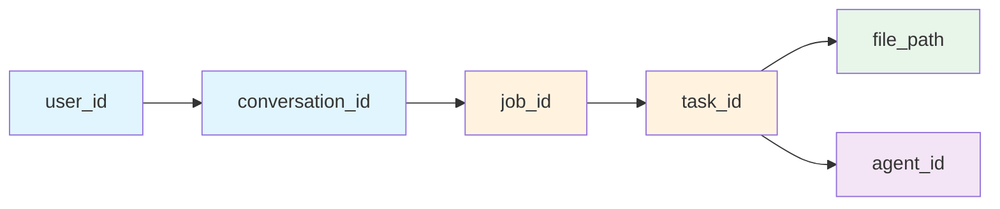

| Level | ID | Example | Where Stored |
|-------|-----|---------|-------------|
| User | `user_id` | `usr_abc123` | `users` table |
| Conversation | `conversation_id` | `conv_xyz789` | `conversations` table |
| Job | `job_id` | `job_123e4567` | `brain_jobs` table + Redis |
| Task | `task_id` | `task_0`, `task_1`, ... | `state["plan"][0]["id"]` |
| File | `file_path` | `src/components/Button.tsx` | `workspace_manager` |
| Agent | `agent_id` | `BuilderAgent-8f3a2b1c` | Worker heartbeat |

### 2.2 Data Model: Who Owns What

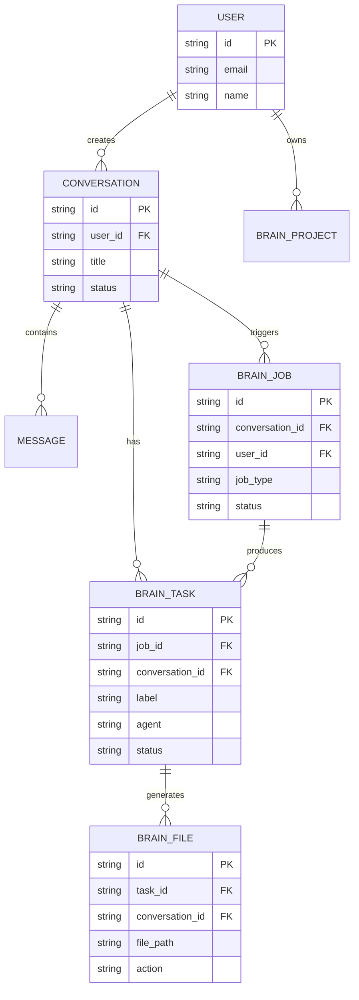

### 2.3 How Each Record Links Back to User

```sql
-- Every query can trace back to the user:

-- "Whose job is this?"
SELECT user_id FROM brain_jobs WHERE id = :job_id;

-- "What files did this user's build create?"
SELECT bf.file_path, bt.label
FROM brain_files bf
JOIN brain_tasks bt ON bf.task_id = bt.id
WHERE bt.conversation_id = :conversation_id;

-- "What is this user's active build status?"
SELECT bj.status, bj.job_type, bj.created_at
FROM brain_jobs bj
WHERE bj.user_id = :user_id
  AND bj.status IN ('queued', 'running')
ORDER BY bj.created_at DESC;
```

### 2.4 When User Sends a Request — Full Traceability

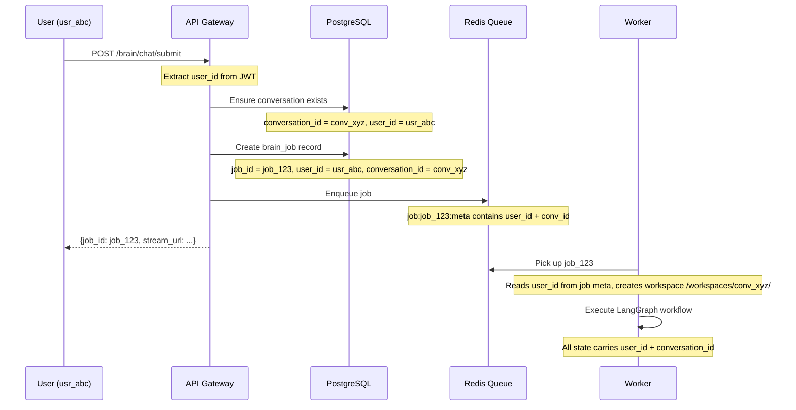

### 2.5 What Gets Stored at Each Step

| Step | What's Created | Owner Fields |
|------|---------------|--------------|
| User sends message | `conversations` row | `user_id` |
| User sends message | `messages` row | `user_id`, `conversation_id` |
| Job enqueued | `brain_jobs` row | `user_id`, `conversation_id` |
| Job enqueued | Redis `job:{id}:meta` | `user_id`, `conversation_id` |
| Planner runs | `brain_tasks` rows | `conversation_id`, `agent` |
| Builder runs | Files in workspace | `conversation_id` (in path) |
| Builder runs | `brain_files` rows | `task_id`, `conversation_id` |
| Deploy runs | Preview URL | `conversation_id` |

### 2.6 Agent Context: How Agents Know "Whose Work Is This"

Every agent receives a `BrainState` dictionary — the single source of truth:

```python
BrainState = {
    "user_id": "usr_abc123",           # WHO initiated this
    "conversation_id": "conv_xyz789",  # WHICH conversation
    "content": "Build a todo app",     # WHAT they asked
    "plan": [...],                     # Tasks to execute
    "current_job_id": "job_123",       # WHICH job
    "model_id": "deepseek-chat",       # WHICH LLM model
    "framework": "react",              # Project settings
}
```

How each agent uses ownership info:

| Agent | Reads | Uses For |
|-------|-------|----------|
| **ManagerAgent** | `user_id`, `content`, `messages` | Understand user intent from their history |
| **QuestionsAgent** | `user_id`, `conversation_id` | Generate questions specific to their project |
| **PlannerAgent** | `user_id`, `content`, `memory_context` | Create plan aligned with their requirements |
| **TodoAgent** | `conversation_id`, `project_plan` | Break plan into tasks for their project |
| **BuilderAgent** | `conversation_id`, `current_job_id` | Write files to THEIR workspace only |
| **RunnerAgent** | `conversation_id`, `current_job_id` | Deploy THEIR build only |

**Rule:** Agent context never includes other users' data. Each worker processes ONE job at a time.

### 2.7 File Ownership: Which Files Belong to Which User

Every conversation gets its own workspace directory:

```
/workspaces/
├── conv_abc123/          ← User A's project
│   ├── src/
│   │   ├── App.tsx
│   │   └── components/
│   │       └── Button.tsx
│   └── package.json
├── conv_def456/          ← User B's project
│   ├── src/
│   │   └── main.py
│   └── requirements.txt
└── conv_ghi789/          ← User C's project
    ├── src/
    │   └── index.html
    └── styles.css
```

File path contains conversation ID:

```python
file_path = "src/components/Button.tsx"
conversation_id = "conv_abc123"
full_path = f"/workspaces/{conversation_id}/{file_path}"
# = /workspaces/conv_abc123/src/components/Button.tsx
```

### 2.8 Task Assignment: Which Agent Handles What

Each task in the plan has an assigned agent:

```python
plan = [
    {
        "id": "task_0",
        "title": "Create Express backend with Supabase auth",
        "category": "backend",
        "agent": "BuilderAgent",      # ← WHO executes this
        "conversation_id": "conv_abc123",  # ← WHOSE project
    },
    {
        "id": "task_1",
        "title": "Create React frontend with login page",
        "category": "frontend",
        "agent": "BuilderAgent",
        "conversation_id": "conv_abc123",
    },
    {
        "id": "task_2",
        "title": "Start dev servers and verify",
        "category": "runner",
        "agent": "RunnerAgent",       # ← Different agent for deploy
        "conversation_id": "conv_abc123",
    },
]
```

Agent assignment logic:

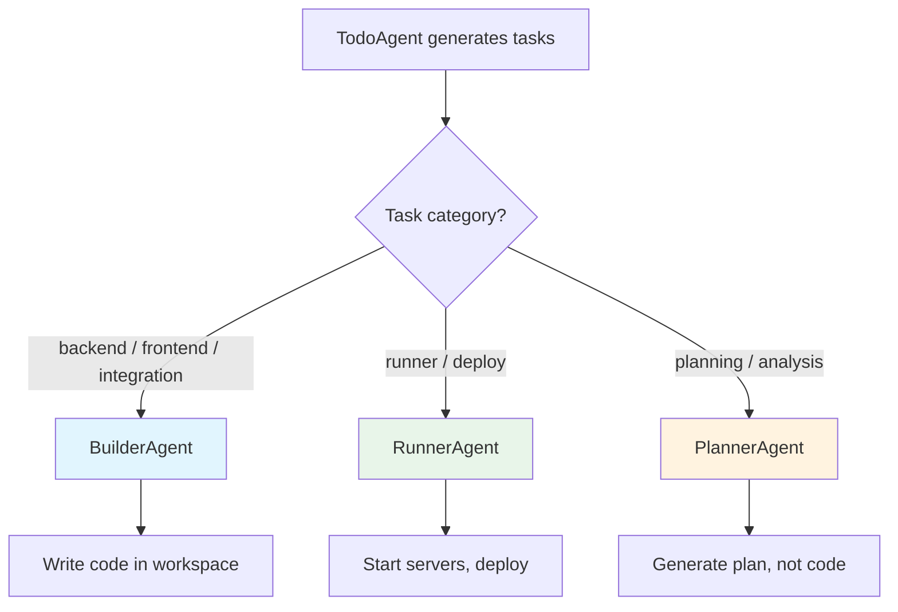

### 2.9 Redis State Map: Real-Time Tracking

```
# Job metadata (who owns this job)
job:job_123:meta → {
    "job_id": "job_123",
    "user_id": "usr_abc123",
    "conversation_id": "conv_xyz789",
    "status": "running"
}

# Active job for conversation
conv:conv_xyz789:active_job → "job_123"

# Stop signal (per conversation)
stop:conv_xyz789 → "true"

# Rate limiting (per user)
rate:usr_abc123:rpm → "3"
rate:usr_abc123:concurrent → "1"
```

### 2.10 Visual Flow: 3 Users, 3 Requests Simultaneously

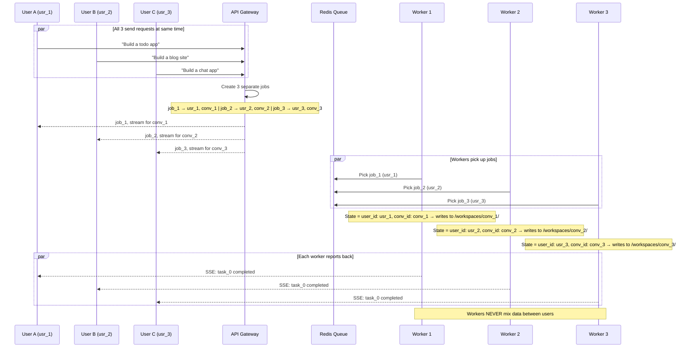

What each worker sees:

| Worker | Current Job | User | Workspace | Tasks |
|--------|------------|------|-----------|-------|
| Worker 1 | job_1 | usr_1 | `/workspaces/conv_1/` | Create backend, Create frontend, Deploy |
| Worker 2 | job_2 | usr_2 | `/workspaces/conv_2/` | Create blog engine, Create admin panel, Deploy |
| Worker 3 | job_3 | usr_3 | `/workspaces/conv_3/` | Create chat server, Create chat UI, Deploy |

### 2.11 Edge Cases

| Scenario | How Handled |
|----------|------------|
| Same user sends 2 messages | Each gets separate `conversation_id` OR same if follow-up |
| User has 3 active builds | Rate limiter caps at `concurrent` limit per tier |
| Worker crash mid-task | Redis Stream: message not ACK'd → redelivered to another worker |
| Two tasks write same file | Sequential execution within a conversation (one worker per job) |
| User A and User B both create `App.tsx` | Separate workspaces → no conflict |
| User clicks Stop | `stop:{conv_id}` set in Redis → current worker checks → aborts |

### 2.12 The Ownership Guarantee

```
EVERY piece of data has a clear owner:

1. Every CONVERSATION belongs to a USER
2. Every JOB belongs to a CONVERSATION (and therefore a USER)
3. Every TASK belongs to a JOB (and therefore a USER)
4. Every FILE belongs to a TASK (and therefore a USER)
5. Every AGENT execution reads ONLY its assigned task's data
6. Every WORKSPACE is isolated per CONVERSATION

Result: User A never sees User B's files, tasks, or agent outputs.
```

---

## 3. Multi-User Request Handling: Complete Flow

### 3.1 What Happens When Multiple Users Send Requests

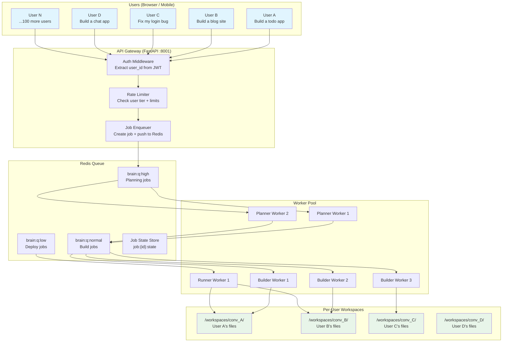

### 3.2 Complete Request Flow: Step by Step

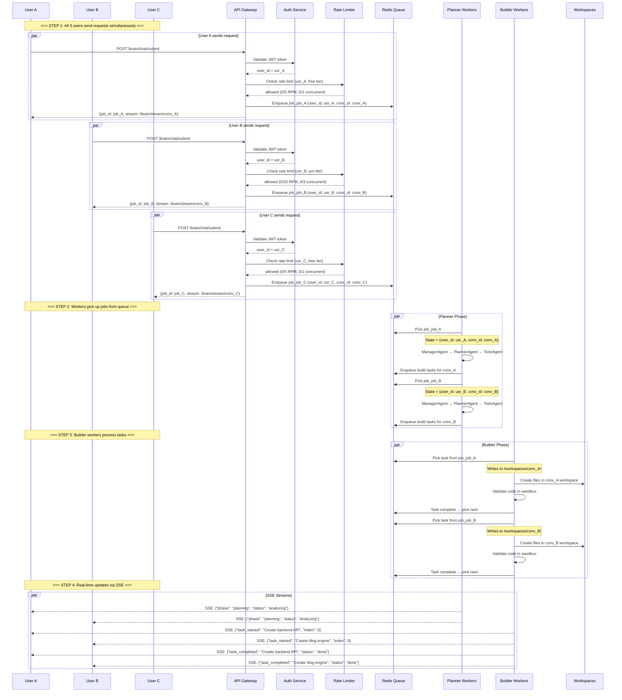

### 3.3 The API Gateway: Entry Point for All Users

```python
# Brain/queues/controllers/chat_submit.py

from fastapi import APIRouter, Depends, Request
from Brain.queues.enqueue import JobEnqueueService
from Brain.queues.rate_limiter import RateLimiter
from Brain.queues.types import ChatSubmitRequest, ChatSubmitResponse

router = APIRouter(prefix="/brain/chat", tags=["queue"])
enqueuer = JobEnqueueService()
rate_limiter = RateLimiter()

@router.post("/submit", response_model=ChatSubmitResponse)
async def submit_chat(request: ChatSubmitRequest, http_request: Request):
    """
    Multi-user entry point. Every request goes through:
    1. Auth (extract user_id from JWT)
    2. Rate limit check (per-user)
    3. Job creation + enqueue
    4. Return job_id + stream URL
    """

    # Step 1: Extract user_id from JWT
    user_id = http_request.state.user_id  # Set by auth middleware

    # Step 2: Rate limit check
    tier = http_request.state.user_tier  # "free", "pro", "enterprise"
    rate_check = await rate_limiter.check_rate_limit(user_id, tier)
    if not rate_check["allowed"]:
        return HTTPException(
            status_code=429,
            detail=rate_check["reason"],
            headers={"Retry-After": str(rate_check["retry_after"])}
        )

    # Step 3: Create or get conversation
    conversation_id = await ensure_conversation(
        user_id=user_id,
        content=request.content,
        existing_id=request.conversation_id
    )

    # Step 4: Enqueue job
    job_id = await enqueuer.enqueue(
        job_type="chat_analyze",
        payload={
            "user_id": user_id,
            "conversation_id": conversation_id,
            "content": request.content,
            "model_id": request.model_id,
            "framework": request.framework,
        },
        conversation_id=conversation_id,
        user_id=user_id,
        priority="high",
    )

    # Step 5: Increment concurrent counter
    await rate_limiter.increment_concurrent(user_id)

    # Step 6: Return immediately (don't block!)
    return ChatSubmitResponse(
        job_id=job_id,
        conversation_id=conversation_id,
        status="queued",
        stream_url=f"/brain/stream/{conversation_id}",
    )
```

### 3.4 How Workers Know Which User's Job They're Processing

```python
# Brain/queues/workers/planner_worker.py

class PlannerWorker(BaseWorker):
    async def process(self, payload):
        """
        Each job payload contains:
        {
            "job_id": "job_123",
            "user_id": "usr_abc",         ← WHO requested this
            "conversation_id": "conv_xyz", ← WHICH conversation
            "job_type": "chat_analyze",
            "payload": { ... }             ← The actual work
        }
        """

        user_id = payload["user_id"]
        conversation_id = payload["conversation_id"]
        job_type = payload["job_type"]

        print(f"[PLANNER] Processing {job_type} for user {user_id}, conv {conversation_id}")

        # Build state with ONLY this user's data
        state = {
            "user_id": user_id,                    # This user only
            "conversation_id": conversation_id,    # This conversation only
            "content": payload["payload"]["content"],
            "model_id": payload["payload"]["model_id"],
            "framework": payload["payload"]["framework"],
        }

        # Run LangGraph workflow
        if job_type == "chat_analyze":
            agent = ManagerAgent()
            result = await agent.execute(state)

        elif job_type == "chat_plan":
            agent = PlannerAgent()
            result = await agent.execute(state)

        elif job_type == "chat_todo":
            agent = TodoAgent()
            result = await agent.execute(state)

        # Publish progress event for THIS user's SSE stream
        await publish_event(conversation_id, {
            "type": "phase_update",
            "agent": "PlannerAgent",
            "status": "completed",
            "user_id": user_id,  # For logging only
        })

        return result
```

### 3.5 How Builder Writes Files to Correct User's Workspace

```python
# Brain/queues/workers/builder_worker.py

class BuilderWorker(BaseWorker):
    async def process(self, payload):
        """
        Builder receives a task like:
        {
            "job_id": "job_123",
            "user_id": "usr_abc",
            "conversation_id": "conv_xyz",
            "payload": {
                "task": {
                    "id": "task_0",
                    "title": "Create login component",
                    "category": "frontend",
                },
                "plan": [...]
            }
        }
        """

        user_id = payload["user_id"]
        conversation_id = payload["conversation_id"]
        task = payload["payload"]["task"]

        # CRITICAL: workspace path includes conversation_id
        workspace = f"/workspaces/{conversation_id}"

        print(f"[BUILDER] User {user_id}: Building task '{task['title']}' in {workspace}")

        # Create workspace if it doesn't exist
        os.makedirs(workspace, exist_ok=True)

        # Run builder agent with THIS user's workspace only
        agent = BuilderAgent()
        state = {
            "user_id": user_id,
            "conversation_id": conversation_id,
            "current_task": task,
            "workspace_path": workspace,  # ← Isolated workspace
        }

        # Agent writes files to THIS workspace only
        async for event in agent.execute(state):
            if isinstance(event, dict) and event.get("execute_sandbox"):
                for op in event["execute_sandbox"].get("workspace_ops", []):
                    file_path = op.get("path", "")

                    # Verify file is within THIS user's workspace
                    full_path = os.path.join(workspace, file_path)
                    if not full_path.startswith(workspace):
                        raise SecurityError(
                            f"Agent tried to write outside workspace: {file_path}"
                        )

                    # Write file
                    os.makedirs(os.path.dirname(full_path), exist_ok=True)
                    with open(full_path, "w") as f:
                        f.write(op.get("content", ""))

                    print(f"[BUILDER] User {user_id}: Created {file_path}")

                # Publish progress for THIS user
                await publish_event(conversation_id, {
                    "type": "task_completed",
                    "task_id": task["id"],
                    "task_title": task["title"],
                })

        return {"status": "completed", "task_id": task["id"]}
```

### 3.6 SSE Stream: Each User Gets Their Own Real-Time Updates

```python
# Brain/queues/sse_proxy.py

@router.get("/stream/{conversation_id}")
async def stream_events(conversation_id: str, request: Request):
    """
    Each user connects to their OWN SSE stream.
    User A connects to /brain/stream/conv_A
    User B connects to /brain/stream/conv_B
    They never see each other's events.
    """

    async def event_generator():
        pubsub = redis_client._client.pubsub()
        channel = f"brain:evt:{conversation_id}"
        await pubsub.subscribe(channel)

        try:
            # Sync: send current state if job exists
            active_job = await redis_client.get(f"conv:{conversation_id}:active_job")
            if active_job:
                state = await redis_client.get(f"job:{active_job}:state")
                if state:
                    yield f"data: {json.dumps({'type': 'state_sync', 'state': json.loads(state)})}\n\n"

            # Stream live events for THIS conversation only
            while True:
                message = await pubsub.get_message(
                    ignore_subscribe_messages=True, timeout=1.0
                )
                if message and message["type"] == "message":
                    yield f"data: {message['data']}\n\n"
                else:
                    yield ": keep-alive\n\n"
                    await asyncio.sleep(1)

                # Check if client disconnected
                    if await request.is_disconnected():
                        break
        finally:
            await pubsub.unsubscribe(channel)

    return StreamingResponse(
        event_generator(),
        media_type="text/event-stream",
        headers={"Cache-Control": "no-cache", "Connection": "keep-alive"},
    )
```

### 3.7 Real Example: 5 Users Simultaneous

| Time | User A (free) | User B (pro) | User C (free) | User D (pro) | User E (free) |
|------|--------------|--------------|---------------|--------------|---------------|
| T+0s | Send request | Send request | Send request | Send request | Send request |
| T+0.1s | Job enqueued | Job enqueued | Job enqueued | Job enqueued | Job enqueued |
| T+1s | Worker picks up | Worker picks up | Waiting in queue | Worker picks up | Waiting in queue |
| T+30s | Planning done | Planning done | Worker picks up | Planning done | Worker picks up |
| T+60s | Building task 1 | Building task 1 | Planning done | Building task 1 | Planning done |
| T+120s | Building task 2 | Building task 3 | Building task 1 | Building task 2 | Building task 1 |
| T+180s | Deploy | Deploy | Building task 2 | Deploy | Building task 2 |
| T+240s | **DONE** | **DONE** | Building task 3 | **DONE** | Building task 3 |
| T+300s | - | - | Deploy | - | Deploy |
| T+360s | - | - | **DONE** | - | **DONE** |

### 3.8 Redis Keys for Multi-User Tracking

```redis
# Per-user rate limiting
rate:usr_A:rpm → "3"                          # User A made 3 requests this minute
rate:usr_A:concurrent → "1"                   # User A has 1 active job
rate:usr_B:rpm → "7"                          # User B made 7 requests this minute
rate:usr_B:concurrent → "2"                   # User B has 2 active jobs

# Per-conversation job tracking
conv:conv_A:active_job → "job_A"              # User A's active job
conv:conv_B:active_job → "job_B"              # User B's active job
conv:conv_C:active_job → "job_C"              # User C's active job

# Per-job metadata (contains user_id + conversation_id)
job:job_A:meta → {"user_id": "usr_A", "conversation_id": "conv_A", "status": "running"}
job:job_B:meta → {"user_id": "usr_B", "conversation_id": "conv_B", "status": "running"}
job:job_C:meta → {"user_id": "usr_C", "conversation_id": "conv_C", "status": "queued"}

# Per-conversation SSE channel
brain:evt:conv_A → (pub/sub channel for User A's real-time events)
brain:evt:conv_B → (pub/sub channel for User B's real-time events)
brain:evt:conv_C → (pub/sub channel for User C's real-time events)

# Stop signals (per conversation)
stop:conv_A → "true"                          # User A clicked Stop
```

### 3.9 Database Records for Multi-User

```sql
-- All records linked to their user

-- Conversations
INSERT INTO conversations (id, user_id, title) VALUES
('conv_A', 'usr_A', 'Build a todo app'),
('conv_B', 'usr_B', 'Build a blog site'),
('conv_C', 'usr_C', 'Fix my login bug');

-- Jobs
INSERT INTO brain_jobs (id, user_id, conversation_id, job_type, status) VALUES
('job_A', 'usr_A', 'conv_A', 'chat_analyze', 'completed'),
('job_B', 'usr_B', 'conv_B', 'chat_analyze', 'completed'),
('job_C', 'usr_C', 'conv_C', 'chat_analyze', 'running');

-- Tasks (each task knows which conversation it belongs to)
INSERT INTO brain_tasks (id, job_id, conversation_id, label, agent, status) VALUES
('task_A0', 'job_A', 'conv_A', 'Create backend API', 'BuilderAgent', 'completed'),
('task_A1', 'job_A', 'conv_A', 'Create frontend UI', 'BuilderAgent', 'running'),
('task_B0', 'job_B', 'conv_B', 'Create blog engine', 'BuilderAgent', 'completed'),
('task_C0', 'job_C', 'conv_C', 'Debug login flow', 'BuilderAgent', 'pending');

-- Query: "Show me all active jobs"
SELECT bj.id, bj.user_id, bj.conversation_id, bj.status, bj.job_type
FROM brain_jobs bj
WHERE bj.status IN ('queued', 'running')
ORDER BY bj.created_at;

-- Output:
-- id    | user_id | conversation_id | status  | job_type
-- ------|---------|-----------------|---------|----------
-- job_C | usr_C   | conv_C          | running | chat_analyze
```

### 3.10 Security: User A Never Sees User B's Data

```python
# Security checks at every layer

class MultiUserSecurity:
    """Ensures no cross-user data leakage."""

    @staticmethod
    def validate_workspace_access(user_id: str, conversation_id: str) -> bool:
        """Verify user owns this conversation."""
        db = SessionLocal()
        conv = db.query(Conversation).filter(
            Conversation.id == conversation_id,
            Conversation.userId == user_id
        ).first()
        db.close()
        return conv is not None

    @staticmethod
    def validate_file_path(workspace: str, file_path: str) -> bool:
        """Ensure file stays within workspace boundary."""
        full_path = os.path.normpath(os.path.join(workspace, file_path))
        return full_path.startswith(os.path.normpath(workspace))

    @staticmethod
    def validate_job_access(user_id: str, job_id: str) -> bool:
        """Verify user owns this job."""
        meta = redis_client.get(f"job:{job_id}:meta")
        if not meta:
            return False
        job = json.loads(meta)
        return job.get("user_id") == user_id
```

### 3.11 What If User A's Build Fails While User B Succeeds?

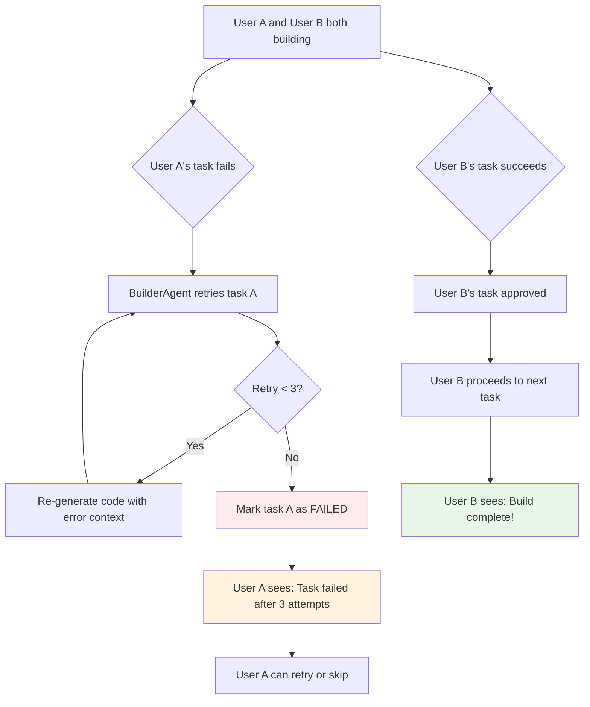

**Key point:** User A's failure does NOT affect User B. Each user's build is completely independent.

---

## 4. Concurrent Request Handling (100 Users)

### 2.1 How 100 Requests Flow Through the System

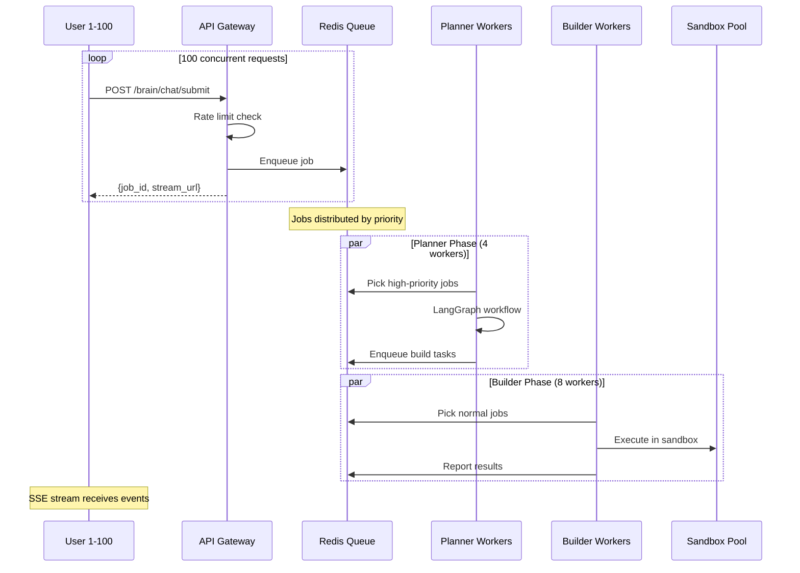

### 2.2 Worker Allocation for 100 Users

| Scenario | Planner Workers | Builder Workers | Runner Workers | Total |
|----------|----------------|-----------------|----------------|-------|
| 100 simple chats (no build) | 4 | 0 | 0 | 4 |
| 100 build requests (planning) | 4 | 0 | 0 | 4 |
| 100 build requests (building) | 2 | 8 | 2 | 12 |
| Mixed (50 chat + 50 build) | 4 | 8 | 2 | 14 |

### 2.3 Queue Distribution Strategy

When 100 requests arrive simultaneously:

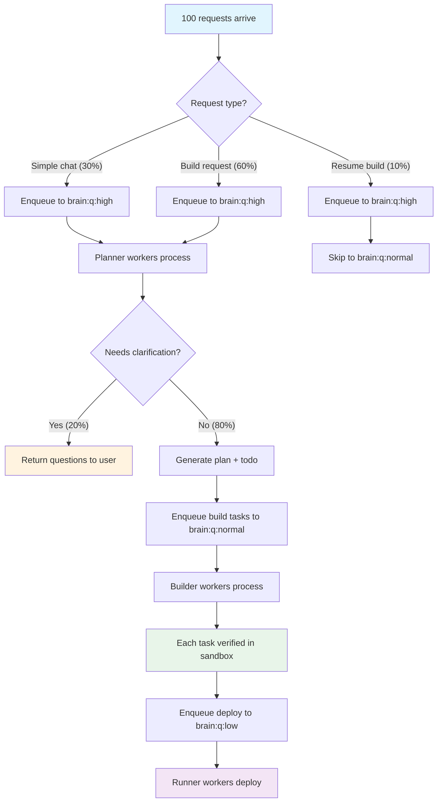

### 2.4 Memory & CPU Budget Per Request

| Phase | CPU Time | Memory | Timeout |
|-------|----------|--------|---------|
| Rate limit check | 1ms | negligible | 1s |
| Job enqueue | 5ms | negligible | 2s |
| Planner (analyze) | 10-30s | 512MB | 2min |
| Planner (plan) | 15-60s | 512MB | 3min |
| Planner (todo) | 5-15s | 256MB | 1min |
| Builder (per task) | 30-120s | 1GB | 5min |
| Runner (deploy) | 20-60s | 512MB | 3min |
| **Total per request** | **2-8 min** | **~1GB peak** | **15min** |

For 100 concurrent requests:
- **Worst case:** 100 × 1GB = 100GB RAM (impossible on single EC2)
- **With queue:** Only 8-14 active at once, rest queued → **8-14GB RAM** (feasible)

---

## 5. Agent Execution Without Hallucination

### 3.1 The Hallucination Problem

LLMs hallucinate in predictable ways:

| Hallucination Type | Example | Impact |
|-------------------|---------|--------|
| **Phantom API** | `import fancylib` (doesn't exist) | Code won't run |
| **Wrong function** | `app.get()` instead of `app.get()` | Syntax error |
| **Logic error** | Off-by-one in loop | Runtime bug |
| **Duplicate code** | Two files define same component | Build conflict |
| **Stale knowledge** | Uses deprecated API | Warning or failure |
| **Missing import** | Uses `useState` without importing React | Compile error |
| **Wrong file path** | Writes to `src/comps/Button.tsx` vs `src/components/Button.tsx` | File not found |

### 3.2 Anti-Hallucination Architecture: 5-Layer Defense

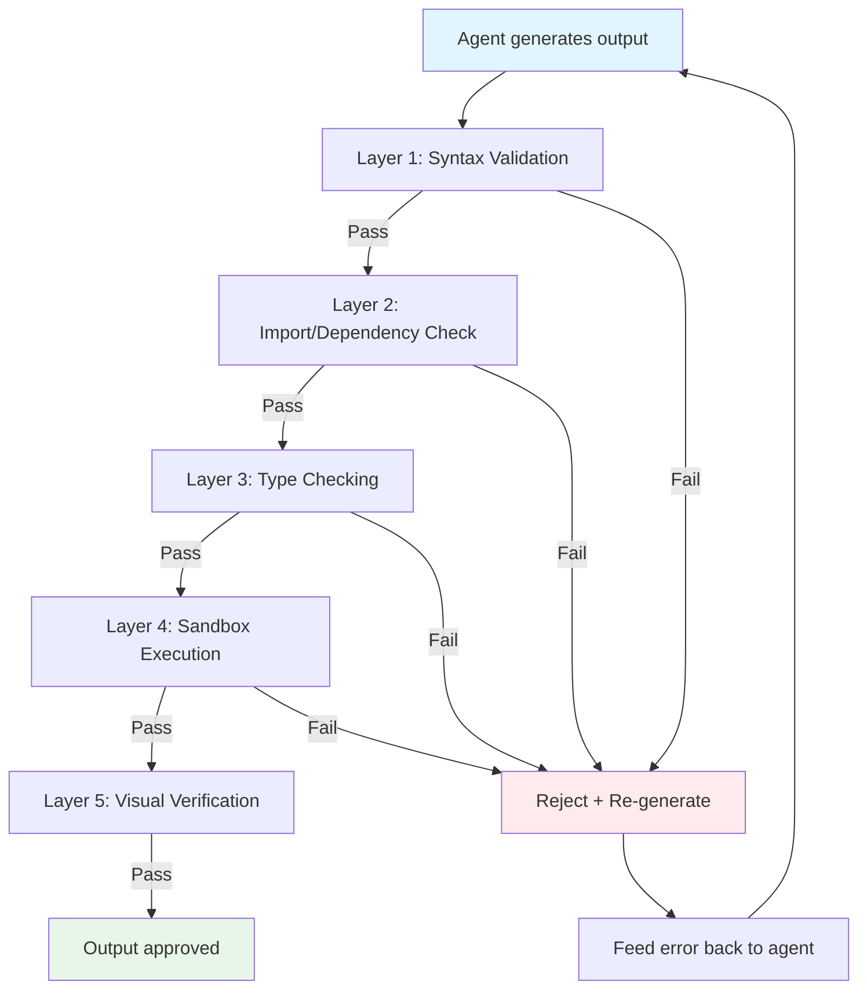

### 3.3 Layer 1: Syntax Validation

Every code output is syntax-checked before acceptance:

```python
# Brain/queues/workers/validation/syntax_check.py

import ast
import subprocess
import tempfile
import os

class SyntaxValidator:
    """Validates code syntax before accepting agent output."""

    def validate_python(self, code: str) -> dict:
        try:
            ast.parse(code)
            return {"valid": True, "error": None}
        except SyntaxError as e:
            return {"valid": False, "error": f"Line {e.lineno}: {e.msg}"}

    def validate_javascript(self, code: str, file_path: str) -> dict:
        with tempfile.NamedTemporaryFile(
            suffix=".js", mode="w", delete=False
        ) as f:
            f.write(code)
            f.flush()
            try:
                result = subprocess.run(
                    ["node", "--check", f.name],
                    capture_output=True, text=True, timeout=10
                )
                if result.returncode == 0:
                    return {"valid": True, "error": None}
                return {"valid": False, "error": result.stderr[:500]}
            finally:
                os.unlink(f.name)

    def validate_typescript(self, code: str, file_path: str) -> dict:
        with tempfile.NamedTemporaryFile(
            suffix=".ts", mode="w", delete=False
        ) as f:
            f.write(code)
            f.flush()
            try:
                result = subprocess.run(
                    ["npx", "tsc", "--noEmit", f.name],
                    capture_output=True, text=True, timeout=30
                )
                if result.returncode == 0:
                    return {"valid": True, "error": None}
                return {"valid": False, "error": result.stderr[:500]}
            finally:
                os.unlink(f.name)
```

### 3.4 Layer 2: Import & Dependency Check

Verifies all imports/references actually exist:

```python
# Brain/queues/workers/validation/import_check.py

import re
import os

class ImportValidator:
    """Checks that all imports/references exist in the project."""

    def __init__(self, workspace_path: str):
        self.workspace = workspace_path

    def validate_imports(self, file_path: str, content: str) -> dict:
        errors = []

        # Python: check import statements
        if file_path.endswith(".py"):
            imports = re.findall(
                r'(?:from|import)\s+([\w.]+)', content
            )
            for imp in imports:
                top_module = imp.split(".")[0]
                if top_module in ("os", "sys", "json", "re", "datetime",
                                   "typing", "asyncio", "uuid", "pathlib"):
                    continue  # stdlib
                if not self._module_exists(top_module):
                    errors.append(f"Module '{top_module}' not found")

        # TypeScript/JSX: check import statements
        if file_path.endswith((".ts", ".tsx", ".js", ".jsx")):
            imports = re.findall(
                r"from\s+['\"]([^'\"]+)['\"]", content
            )
            imports += re.findall(
                r"import\s+['\"]([^'\"]+)['\"]", content
            )
            for imp in imports:
                if imp.startswith("."):
                    # Relative import — check file exists
                    base_dir = os.path.dirname(file_path)
                    target = os.path.join(base_dir, imp)
                    if not os.path.exists(target) and \
                       not os.path.exists(target + ".ts") and \
                       not os.path.exists(target + ".tsx") and \
                       not os.path.exists(target + ".js"):
                        errors.append(f"Relative import '{imp}' not found")
                elif not imp.startswith("@") and "/" not in imp:
                    # NPM package — check node_modules
                    pkg_path = os.path.join(
                        self.workspace, "node_modules", imp
                    )
                    if not os.path.exists(pkg_path):
                        errors.append(f"Package '{imp}' not installed")

        return {"valid": len(errors) == 0, "errors": errors}

    def _module_exists(self, module: str) -> bool:
        try:
            __import__(module)
            return True
        except ImportError:
            return False
```

### 3.5 Layer 3: Type Checking (TypeScript Projects)

```python
# Brain/queues/workers/validation/type_check.py

import subprocess
import os

class TypeChecker:
    """Runs TypeScript type checking on workspace."""

    def check(self, workspace_path: str) -> dict:
        tsconfig = os.path.join(workspace_path, "tsconfig.json")
        if not os.path.exists(tsconfig):
            return {"valid": True, "error": None, "skipped": True}

        result = subprocess.run(
            ["npx", "tsc", "--noEmit"],
            cwd=workspace_path,
            capture_output=True,
            text=True,
            timeout=60
        )

        if result.returncode == 0:
            return {"valid": True, "error": None}

        # Parse errors
        errors = []
        for line in result.stdout.split("\n"):
            if "error TS" in line:
                errors.append(line.strip())

        return {
            "valid": False,
            "error": result.stdout[:2000],
            "error_count": len(errors),
            "errors": errors[:20]  # First 20 errors
        }
```

### 3.6 Layer 4: Sandbox Execution

**The most critical layer.** Every code output is actually run in an isolated sandbox:

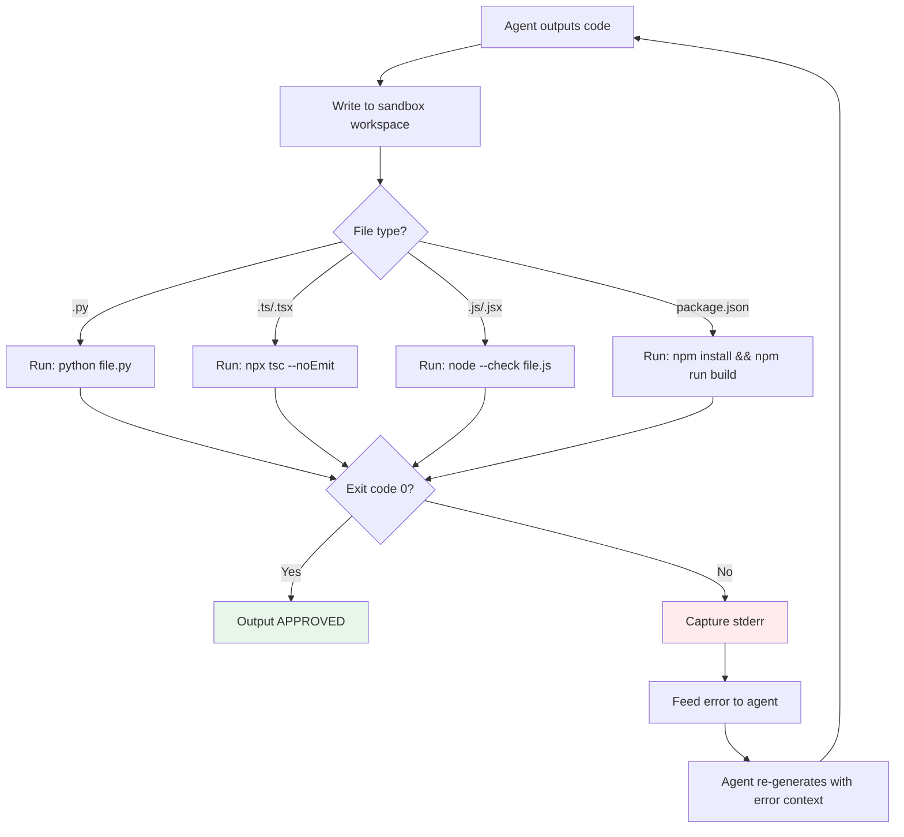

**Sandbox execution rules:**
- Every file write triggers a syntax/compile check
- After all tasks complete, run `npm install && npm run build` (for JS/TS)
- After all tasks complete, run `python -m py_compile` for Python files
- If build fails, the builder agent gets the error and must fix it
- Maximum 3 retry attempts per task before marking as failed

### 3.7 Layer 5: Visual Verification (Future)

For UI components, render in sandbox and compare against expected output:
- Take screenshot of rendered component
- Compare dimensions, colors, layout against design spec
- Flag visual regressions

---

## 6. Request Lifecycle Under Load

### 4.1 Timeline: 100 Concurrent Build Requests

```mermaid
gantt
    title 100 Concurrent Build Requests Timeline
    dateFormat X
    axisFormat %s

    section Queue
    Requests 1-10 (planning)     :a1, 0, 30
    Requests 11-30 (planning)    :a2, 10, 40
    Requests 31-60 (queued)      :a3, 20, 50
    Requests 61-100 (queued)     :a4, 30, 60

    section Planning (4 workers)
    Batch 1 plan                 :b1, 0, 30
    Batch 2 plan                 :b2, 15, 45
    Batch 3 plan                 :b3, 30, 60
    Batch 4 plan                 :b4, 45, 75

    section Building (8 workers)
    Batch 1 build (tasks 1-5)    :c1, 30, 90
    Batch 2 build (tasks 6-10)   :c2, 45, 105
    Batch 3 build (tasks 11-15)  :c3, 60, 120
    Batch 4 build (tasks 16-20)  :c4, 75, 135

    section Deploy (2 workers)
    Batch 1 deploy               :d1, 90, 120
    Batch 2 deploy               :d2, 105, 135
    Batch 3 deploy               :d3, 120, 150
    Batch 4 deploy               :d4, 135, 165
```

### 4.2 Throughput Calculations

| Metric | Value |
|--------|-------|
| Planner throughput | ~3-4 requests/min per worker |
| Builder throughput | ~1-2 tasks/min per worker |
| Runner throughput | ~2-3 deploys/min per worker |
| **System throughput (14 workers)** | **~20-30 full builds/min** |
| **Time to process 100 requests** | **~3-5 minutes** |
| **P95 latency per request** | **~4-8 minutes** |

### 4.3 Priority Under Load

When 100 requests compete:

1. **Critical (stop signals)** — processed immediately, preempt other work
2. **High (planning)** — 4 workers dedicated, max 2min per job
3. **Normal (building)** — 8 workers, max 5min per task
4. **Low (deploy)** — 2 workers, max 3min per job
5. **Background (title gen, memory)** — runs when workers idle

---

## 7. Agent Validation Pipeline

### 5.1 Builder Agent Validation Flow

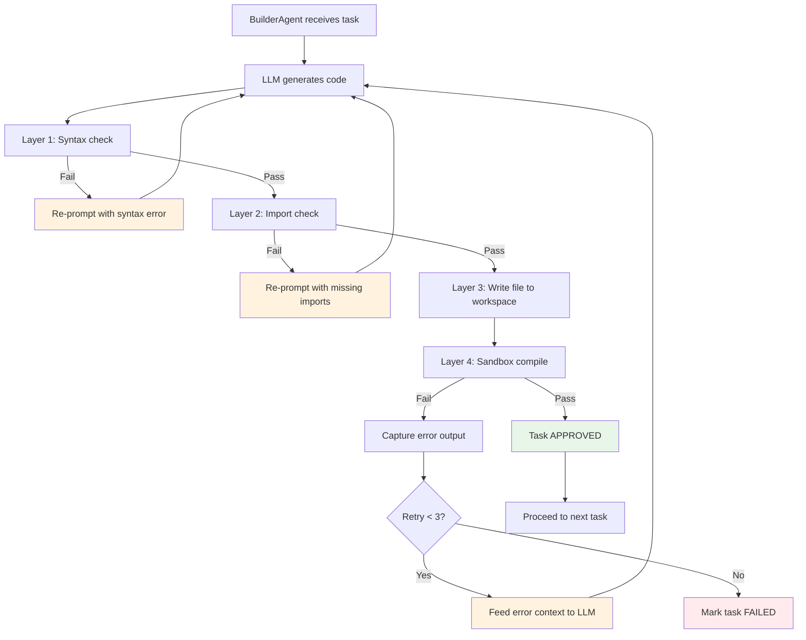

### 5.2 LLM Re-Prompting Strategy

When validation fails, the agent gets structured error context:

```python
# Template for re-prompting after validation failure

RETRY_PROMPT = """
The code you generated failed validation. Fix the error below.

## Failed File
{file_path}

## Error Type
{error_type}

## Error Message
{error_message}

## Current Code
```{lang}
{current_code}
```

## Instructions
1. Fix ONLY the error mentioned above
2. Do NOT change working parts of the code
3. Ensure all imports exist in the project
4. Ensure the file compiles/runs without errors

## Project Context
{project_context}
"""
```

### 5.3 Planner Agent Validation

The planner doesn't generate code, but its plans must be valid:

| Check | How | Fail Action |
|-------|-----|-------------|
| Task dependencies are acyclic | Topological sort | Re-generate plan |
| All referenced files exist | Filesystem check | Remove invalid tasks |
| Framework matches project | Config check | Adjust task types |
| No duplicate tasks | Set dedup | Merge duplicates |
| Task count reasonable (1-50) | Count check | Split or merge |

### 5.4 Runner Agent Validation

| Check | How | Fail Action |
|-------|-----|-------------|
| `package.json` exists | Filesystem | Skip npm install |
| `npm install` succeeds | Shell exec | Log error, continue |
| `npm run build` succeeds | Shell exec | Report build failure |
| Dev server starts | Port check | Report startup failure |
| Preview URL accessible | HTTP check | Report URL issue |

---

## 8. Sandbox-as-Proof Architecture

### 6.1 Principle: "If it doesn't run, it doesn't exist"

Every agent output is treated as **unverified** until it passes sandbox execution:

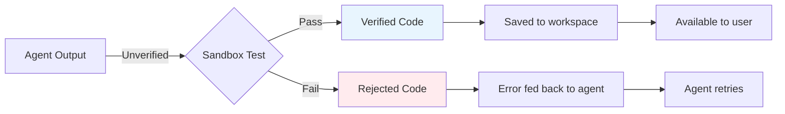

### 6.2 Sandbox Execution Rules

| Rule | Implementation |
|------|---------------|
| **No trust** | Agent code is never trusted without execution |
| **Isolated** | Each workspace is isolated (separate directory) |
| **Timeout** | Max 30s per file check, 60s per build |
| **Resource limits** | CPU: 2 cores, RAM: 2GB per sandbox |
| **No network** | Sandboxes don't access external APIs during validation |
| **Clean state** | Fresh `node_modules` for each build (or cached) |

### 6.3 Error Feedback Loop

When sandbox execution fails:

```python
class ErrorFeedbackLoop:
    """Captures sandbox errors and formats them for LLM re-prompting."""

    def capture_error(self, error_output: str, file_path: str) -> dict:
        # Parse error type
        if "SyntaxError" in error_output:
            error_type = "syntax"
        elif "ModuleNotFoundError" in error_output:
            error_type = "missing_import"
        elif "TypeError" in error_output:
            error_type = "type_error"
        elif "is not defined" in error_output:
            error_type = "undefined_reference"
        else:
            error_type = "runtime_error"

        # Extract line number if possible
        line_match = re.search(r'line (\d+)', error_output)
        line_number = int(line_match.group(1)) if line_match else None

        return {
            "file": file_path,
            "error_type": error_type,
            "error_message": error_output[:500],
            "line_number": line_number,
            "suggestion": self._suggest_fix(error_type, error_output),
        }

    def _suggest_fix(self, error_type: str, error: str) -> str:
        suggestions = {
            "syntax": "Check for missing colons, brackets, or quotes",
            "missing_import": "Add the missing import statement",
            "type_error": "Check argument types match function signature",
            "undefined_reference": "Check spelling and ensure variable is defined",
            "runtime_error": "Review the error message for logic issues",
        }
        return suggestions.get(error_type, "Review the code carefully")
```

---

## 9. Rate Limiting & Fairness

### 7.1 Per-User Rate Limits

| Tier | Requests/min | Concurrent Jobs | Build Tasks |
|------|-------------|-----------------|-------------|
| Free | 5 | 1 | 10 |
| Pro | 20 | 3 | 50 |
| Enterprise | 100 | 10 | 200 |

### 7.2 Rate Limit Implementation

```python
# Brain/queues/rate_limiter.py

from Brain.config.redis import redis_client

class RateLimiter:
    """Token bucket rate limiter using Redis."""

    async def check_rate_limit(
        self, user_id: str, tier: str = "free"
    ) -> dict:
        limits = {
            "free": {"rpm": 5, "concurrent": 1, "tasks": 10},
            "pro": {"rpm": 20, "concurrent": 3, "tasks": 50},
            "enterprise": {"rpm": 100, "concurrent": 10, "tasks": 200},
        }
        limit = limits.get(tier, limits["free"])

        # Check requests per minute
        rpm_key = f"rate:{user_id}:rpm"
        current = await redis_client.incr(rpm_key)
        if current == 1:
            await redis_client.expire(rpm_key, 60)

        if current > limit["rpm"]:
            return {
                "allowed": False,
                "reason": "Rate limit exceeded",
                "retry_after": 60,
            }

        # Check concurrent jobs
        concurrent_key = f"rate:{user_id}:concurrent"
        concurrent = int(await redis_client.get(concurrent_key) or 0)
        if concurrent >= limit["concurrent"]:
            return {
                "allowed": False,
                "reason": "Too many concurrent jobs",
                "retry_after": 30,
            }

        return {"allowed": True}
```

### 7.3 Fairness: No Starvation

When 100 requests compete, ensure no request waits forever:

| Mechanism | Description |
|-----------|-------------|
| **Priority queue** | Planning > Building > Deploy > Background |
| **Aging** | Jobs waiting > 5min get priority boost |
| **Per-user cap** | Max 3 concurrent jobs per user |
| **Preemption** | Stop signals (priority=critical) preempt others |
| **Timeout** | Jobs stuck > 15min are failed and retried |

---

## 10. Memory & Context Isolation

### 8.1 Per-Request Isolation

Each concurrent request must have isolated:

| Resource | Isolation Method |
|----------|-----------------|
| **Conversation state** | Separate conversation_id in DB |
| **Workspace files** | Separate directory per conversation |
| **Memory context** | Separate MemoryGateway per session |
| **Sandbox** | Separate Docker container or directory |
| **Redis state** | Separate keys per job_id |

### 8.2 No Cross-Contamination

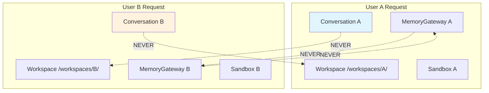

### 8.3 Context Window Management

Each agent call uses a fresh context:

| Agent | Context Source | Max Tokens |
|-------|---------------|------------|
| ManagerAgent | User message + conversation history | 4K |
| QuestionsAgent | Manager analysis + user history | 2K |
| PlannerAgent | Manager analysis + project context | 8K |
| TodoAgent | Planner output | 4K |
| BuilderAgent | Task description + file context | 16K |
| RunnerAgent | Build output + workspace state | 4K |

**Rule:** Agent context never includes other users' data.

---

## 11. Monitoring Under Load

### 9.1 Key Metrics at 100 Concurrent

| Metric | Healthy | Warning | Critical |
|--------|---------|---------|----------|
| Queue depth (high) | < 20 | 20-50 | > 50 |
| Queue depth (normal) | < 100 | 100-200 | > 200 |
| Worker CPU | < 60% | 60-80% | > 80% |
| Worker memory | < 70% | 70-85% | > 85% |
| Job latency (P95) | < 5min | 5-10min | > 10min |
| Sandbox failures | < 5% | 5-15% | > 15% |
| Redis memory | < 50% | 50-75% | > 75% |

### 9.2 Auto-Scaling Triggers

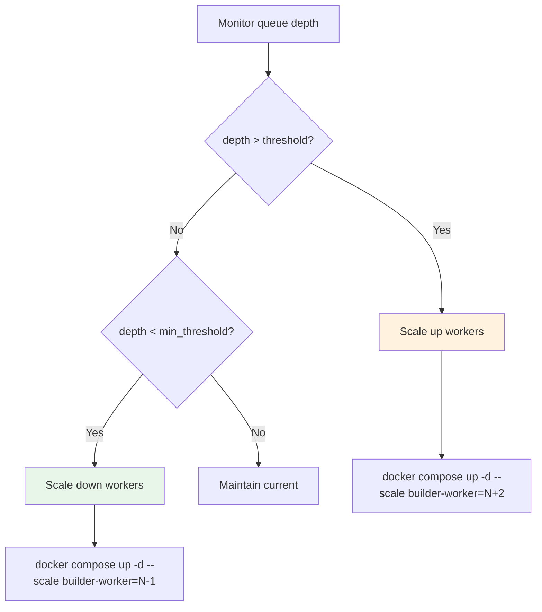

---

## 12. Implementation Checklist

### Anti-Hallucination Pipeline

- [ ] Create `Brain/queues/workers/validation/` module
- [ ] Implement `SyntaxValidator` (Python, JS, TS)
- [ ] Implement `ImportValidator` (check imports exist)
- [ ] Implement `TypeChecker` (TypeScript noEmit)
- [ ] Implement `SandboxExecutor` (run code in isolation)
- [ ] Implement `ErrorFeedbackLoop` (format errors for LLM)
- [ ] Integrate validation into `BuilderWorker.process()`
- [ ] Add retry logic (max 3 attempts per task)
- [ ] Add validation metrics (pass/fail rates per layer)

### Concurrent Request Handling

- [ ] Implement `RateLimiter` in `Brain/queues/rate_limiter.py`
- [ ] Add rate limit check to `/brain/chat/submit` endpoint
- [ ] Implement job aging (priority boost for old jobs)
- [ ] Add per-user concurrent job cap
- [ ] Test with 100 concurrent requests (Locust/k6)
- [ ] Monitor queue depths and worker utilization
- [ ] Tune worker concurrency based on load test results

### Context Isolation

- [ ] Verify workspace isolation per conversation
- [ ] Verify MemoryGateway isolation per session
- [ ] Verify no cross-user data in agent context
- [ ] Add context size limits per agent type

### Request Tracking & Ownership

- [ ] Create `brain_jobs` table with `user_id` + `conversation_id` columns
- [ ] Create `brain_tasks` table with `conversation_id` + `agent` columns
- [ ] Create `brain_files` table with `task_id` + `conversation_id` columns
- [ ] Ensure `BrainState` always carries `user_id` + `conversation_id`
- [ ] Verify workspace path includes `conversation_id`
- [ ] Add Redis keys: `conv:{id}:active_job`, `rate:{user}:rpm`, `rate:{user}:concurrent`
- [ ] Test: 3 users simultaneous → verify no cross-contamination
- [ ] Test: query "whose job is this?" returns correct user_id

### Multi-User Request Handling

- [ ] Implement JWT auth middleware (extract `user_id` + `user_tier`)
- [ ] Implement `POST /brain/chat/submit` endpoint with rate limiting
- [ ] Implement SSE proxy per conversation (`/brain/stream/{conv_id}`)
- [ ] Add workspace security check (user can only access own workspace)
- [ ] Add file path validation (no path traversal outside workspace)
- [ ] Add job ownership validation (user can only query own jobs)
- [ ] Test: 5 users simultaneous → verify isolated workspaces
- [ ] Test: User A fails → User B unaffected
- [ ] Test: User A clicks Stop → only User A's build stops

---

*This document defines how Grizon AI handles concurrent load and ensures agent outputs are verified, not hallucinated. Every code output passes through 5 validation layers before reaching the user.*
