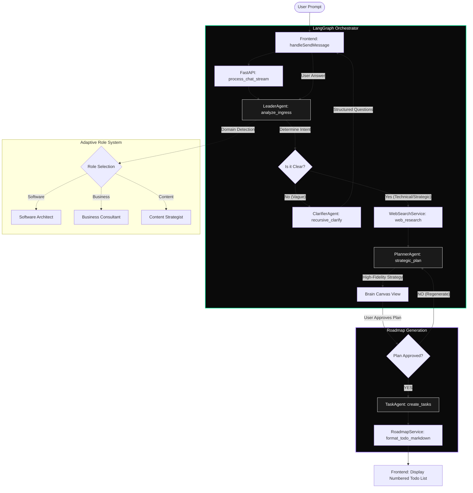
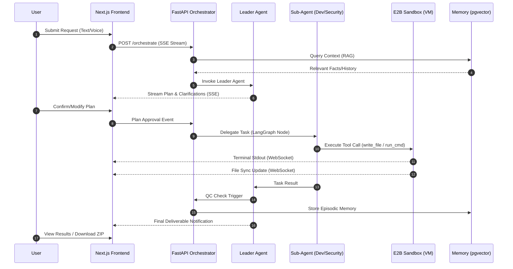
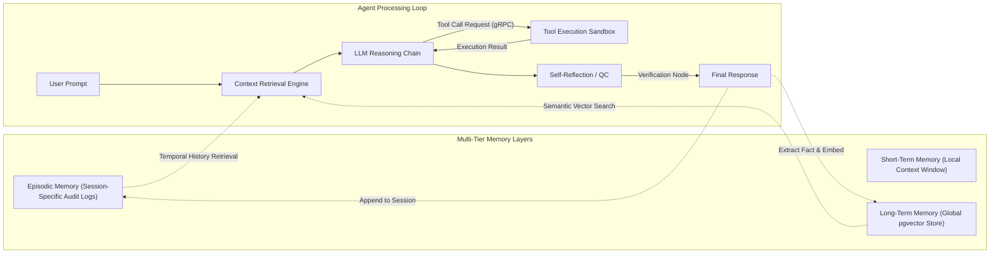
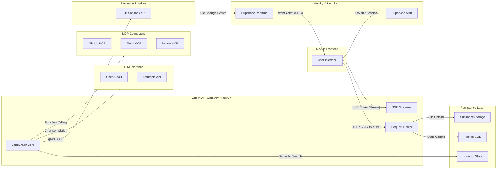

**GRIZON AI**

**Frontend — Complete Technical Specification**

_Every Screen • Every Component • Every Flow • Every State_

Based on: agents.md • layers\_\_features.md • project\_brain.md + all prior sessions

April 2026 — Version 1.0

# Overview — What the Frontend Must Do

The Grizon AI frontend is not a chatbox. It is a full Command Center — a workspace where the user acts as Project Owner, watches 15+ agents work in real time, approves plans before execution, monitors costs, manages memory, and receives verified production-ready deliverables. Every pixel must communicate trust, control, and transparency.

| Design Principle | What It Means in Practice |
| --- | --- |
| Transparency first | User always knows what agents are doing, why, and how much it costs. No black boxes. |
| Control always available | Kill switch, edit plan, override agent — accessible from every screen at all times. |
| Real-time everything | Agent thoughts stream live. Task status updates instantly. Cost counter ticks in real time. |
| Approval before execution | No agent starts work without user seeing and approving the plan. This is a hard UI rule. |
| Zero cognitive overload | 15 agents is complex — the UI must make it feel simple. Progressive disclosure. Show detail only when needed. |
| Production-grade aesthetic | Feels like Linear + Vercel + Cursor — not a consumer chatbot. Enterprise-ready from day one. |

## Tech Stack Decision

| Concern | Technology | Reason |
| --- | --- | --- |
| Framework | Next.js 14 (App Router) | Server components, streaming SSR, file-based routing. Best ecosystem for AI apps. |
| Styling | Tailwind CSS + shadcn/ui | Consistent design system. Fast iteration. Customisable. Industry standard for SaaS. |
| Real-time streaming | Vercel AI SDK (useChat + useCompletion) | Built for token-by-token LLM streaming. Handles SSE natively. |
| Live agent status | Supabase Realtime (WebSockets) | Push agent state updates instantly from backend to UI. |
| State management | Zustand | Lightweight global state for project/task/agent status. No Redux overhead. |
| Terminal emulator | Xterm.js | The industry standard for browser-based terminal. Used by VS Code web. |
| Code editor / preview | Monaco Editor (VS Code engine) | Full syntax highlighting, diff view, read-only preview of sandbox files. |
| Charts / visualisations | Recharts or Tremor | Token usage charts, cost dashboard, agent timeline Gantt chart. |
| Animations | Framer Motion | Agent card transitions, plan reveal animations, status change effects. |
| Voice input | Web Speech API + Whisper API fallback | Browser-native STT for speed, Whisper for accuracy on complex inputs. |
| Voice output | ElevenLabs API or Web Speech Synthesis | Natural TTS for agent replies. ElevenLabs for premium tier. |
| File upload | Supabase Storage + react-dropzone | Drag-and-drop file upload for PDFs, code, GitHub links. |
| Auth | Supabase Auth | Google + GitHub OAuth + email. Row Level Security for project isolation. |
| Deployment | Vercel | Zero-config Next.js. Edge functions. Global CDN. |

# Section 1 — Information Architecture & Navigation

The complete sitemap and navigation model. Every route, what it contains, and who can access it.

## 1.1 Route Structure

| Route | Screen Name | Who Sees It | Purpose |
| --- | --- | --- | --- |
| / | Landing / Login | Unauthenticated | Marketing page + sign in / sign up |
| /onboarding | Onboarding Flow | New users only | Set up profile, preferences, first project |
| /dashboard | Home Dashboard | All users | All projects, recent activity, quick-start |
| /projects/[id] | Project Workspace | Project owner | THE main screen — full agent workspace |
| /projects/[id]/plan | Plan Review | Project owner | Show PRD, approve or edit before execution |
| /projects/[id]/timeline | Execution Timeline | Project owner | Gantt-style live view of agent tasks |
| /projects/[id]/files | File Explorer | Project owner | All files produced by agents, downloadable |
| /projects/[id]/memory | Memory Panel | Project owner | What Grizon remembers about this project |
| /security | Security Brain Portal | Pro + Enterprise | Submit repos for VM security audit |
| /security/[scanId] | Security Scan Report | Pro + Enterprise | Results, patched code, download |
| /memory | Global Memory Dashboard | All users | All long-term memories, user profile, RAG docs |
| /settings | Settings | All users | Profile, preferences, connected apps, billing |
| /settings/mcp | MCP Connectors | All users | Connect GitHub, Supabase, Notion, etc. |
| /settings/billing | Billing & Usage | All users | Subscription, token usage, cost history |
| /docs | Documentation | All users | Help, guides, API docs |

## 1.2 Global Navigation Layout

The app uses a persistent 3-panel layout in the workspace:

| Global Layout Structure |
| --- |
| LEFT SIDEBAR (240px, collapsible): Project list, navigation links, global kill switch, user profile |
| MAIN AREA (flex-grow): Changes per route — chat, plan, timeline, files, etc. |
| RIGHT PANEL (320px, slide-in): Context-sensitive — agent details, memory, cost breakdown, settings |
| TOP BAR (48px, always visible): Project name, active agents count, budget meter, voice toggle, kill switch |
| BOTTOM STATUS BAR (32px): Current agent status, last action, streaming indicator |
|  |

## 1.3 Responsive Breakpoints

| Breakpoint | Layout Behaviour |
| --- | --- |
| Desktop (1280px+) | Full 3-panel layout. All panels visible simultaneously. |
| Laptop (1024–1280px) | Right panel hidden by default, accessible via toggle. |
| Tablet (768–1024px) | Left sidebar collapses to icon strip. Main area full width. |
| Mobile (< 768px) | Single panel at a time. Bottom tab bar for navigation. Voice input prominent. |

# Section 2 — Screen-by-Screen Specification

## 2.1 Home Dashboard (/dashboard)

The first screen users see after login. Must communicate the power of the system while staying clean.

### Components Required

*   Header bar: 'Good morning \[Name\]' + today's token usage summary + create new project CTA
*   Projects grid: Card per project showing name, last active, agents used, status badge (active/complete/paused), cost
*   Quick-start panel: 3 big buttons — 'Start a project', 'Security audit', 'Ask a quick question'
*   Recent activity feed: Last 10 agent actions across all projects — 'Dev Agent wrote auth.ts 4h ago'
*   Cost overview widget: This month's spend vs budget, bar chart by day, projected end-of-month
*   Memory summary: '12 long-term memories stored • 3 documents indexed' — link to /memory
*   Connected apps badge strip: Shows which MCP connectors are active (GitHub ✓, Supabase ✓, Notion ✗)

### States to Handle

*   Empty state (new user): Large welcome illustration, 'Your first project is one click away' CTA
*   Loading state: Skeleton cards — never a spinner blocking the whole page
*   Error state: Toast notification — individual widgets fail gracefully, rest of page stays usable

## 2.2 Project Workspace (/projects/\[id\]) — THE MAIN SCREEN

| This is the most important screen in the entire product. |
| --- |
| Everything happens here. User talks to Leader Agent, watches agents work, monitors costs, manages files. |
| Inspiration: Cursor IDE + Linear + Claude.ai — not a chatbot, a command centre. |
| Must feel like you have a team of 15 working for you in real time. |
|  |

### Layout: 3-Column Workspace

| Panel | Width | Contents |
| --- | --- | --- |
| Left: Agent Status Panel | 280px | Live list of all 15 agents — which are active, queued, idle, complete. Click any agent to see their current task. |
| Center: Main Interaction Area | flex-grow | Tabs: Chat | Plan | Canvas | Terminal | Files — switching between modes |
| Right: Context Panel | 320px | Slide-in: current agent detail, memory context, cost breakdown, tool calls log |

### Center Panel — Tab 1: Chat

*   Message thread between user and Leader Agent
*   Token-by-token streaming of Leader Agent replies (Vercel AI SDK useChat)
*   Leader Agent 'thinking' indicator — animated dots while planning
*   Clarifying questions shown as interactive buttons ('Yes / No / Tell me more') not just text
*   File drag-and-drop into chat — PDF, repo zip, image — triggers RAG ingestion + shows progress pill
*   GitHub URL paste detection — auto-suggests 'Index this repo for context?' or 'Run security audit?'
*   Voice input button — holds to speak, releases to send (Web Speech API)
*   @ mention syntax — '@Design Agent please review this brief' routes to specific agent
*   Message types: user message / agent reply / system event / HITL approval request / cost alert

### Center Panel — Tab 2: Plan (PRD Review)

This tab appears automatically when Leader Agent generates an execution plan. It is the HITL approval gate.

*   PRD rendered as structured document: objective, scope, task list, agent assignments, estimated tokens + cost
*   Each task row shows: task name, assigned agent brain, dependencies, estimated time, estimated tokens
*   Inline editing: user can click any task and edit the description or change the assigned agent
*   Add task button: user can insert additional tasks before approving
*   Remove task: strike-through with confirmation — 'Remove this task from the plan?'
*   Cost estimate bar: total estimated token cost shown prominently before approval
*   Two primary actions: 'Approve & Execute' (green, prominent) | 'Request Changes' (outlined)
*   'Request Changes' opens a text field to tell Leader Agent what to revise — plan updates in place
*   Once approved: plan locks (read-only), execution begins, tab shows live progress ticks per task

### Center Panel — Tab 3: Canvas (Workspace)

*   Monaco Editor for code files — syntax highlighting, read-only by default, 'Edit' toggle for manual fixes
*   File tree on the left of canvas: shows all files created/modified by agents in this project
*   Live file sync: as agents write files in the E2B sandbox, they appear here in real time
*   Diff view: for each file, toggle between 'current' and 'previous version' — shows what agent changed
*   Preview pane: for HTML/CSS/React files, shows live rendered preview alongside code
*   Download button per file + 'Download all as ZIP' for the whole project
*   Document view mode: for non-code outputs (reports, strategies), renders as formatted document

### Center Panel — Tab 4: Terminal

*   Xterm.js terminal connected to the E2B Firecracker sandbox
*   Real-time stdout/stderr stream from all running commands
*   User can type commands directly — useful for manual intervention or inspection
*   Command history preserved per session
*   Clear terminal button + copy all output button
*   Read-only mode for Free tier (can observe but not type)
*   Sandbox status indicator: 'VM Running' (green) | 'VM Starting' (amber) | 'VM Idle' (gray)

### Center Panel — Tab 5: Files

*   Full file explorer for all agent-generated outputs
*   Sort by: date created / agent / file type / size
*   Filter by agent: show only files from Dev Agent, or only from Security Brain, etc.
*   Preview on click for common types: PDF, images, markdown, code files
*   Download individual files or select multiple + bulk download
*   Delete file (with confirmation) — removes from project storage
*   File provenance: hover any file to see 'Created by Dev Agent at 14:32 on Step 3 of the plan'

### Left Panel — Agent Status Panel

The live heartbeat of the system. Shows all agents and what they're doing right now.

*   Agent card per agent (15 cards total) showing: agent name, brain group, current status
*   Status colours: Active (blue pulse animation) | Queued (amber) | Complete (green) | Idle (gray) | Error (red)
*   Expand card: click to see current task description, last tool call, tokens used this task
*   'Thought stream' per agent: a live sub-feed of the agent's inner monologue (streaming tokens)
*   Agent hierarchy: Leader Agent always at top, sub-agents grouped by brain (Dev Brain, Research Brain, etc.)
*   Collapse all / Expand all toggle
*   Agent filter: show only active agents to reduce noise during long runs

### Right Panel — Context Panel (Slide-in)

*   Triggered by: clicking an agent, clicking a task, or clicking the context icon in top bar
*   Agent detail view: full system prompt (read-only), tool list, token usage this session, last 5 actions
*   Task detail view: full task description, PRD reference, input context, output produced
*   Memory context view: what memories were injected into the current agent call — short-term, long-term, RAG chunks
*   Tool calls log: every MCP connector call — tool name, parameters sent, response received, timestamp
*   Cost breakdown: per-agent token usage, model used, cost this task, cost this project, projected total

### Top Bar — Always Visible

*   Left: Project name (editable on click) + breadcrumb navigation
*   Center: Active agents count indicator with pulse — '3 agents running'
*   Center: Budget meter — progress bar showing tokens used vs budget. Turns amber at 80%, red at 95%
*   Right: Voice toggle button (mic icon) — activates voice input mode
*   Right: KILL SWITCH — red stop icon, always visible. One click shows confirmation modal, second click halts everything
*   Right: Notification bell — HITL approval requests, QC failures, cost alerts, completion events

## 2.3 Plan Review Screen (/projects/\[id\]/plan)

Also accessible as a modal/overlay within the workspace. The full PRD rendered for user approval.

*   Full-width PRD document view with sections: Project Goal, Scope, Out of Scope, Task Breakdown, Success Criteria
*   Task breakdown table: task ID, name, assigned brain, agent, dependencies, estimated tokens, estimated time
*   Dependency visualiser: simple left-to-right flow diagram showing which tasks block others
*   Budget summary card: breakdown by agent/brain, total estimated cost, tier limit check
*   Edit mode: any field in the PRD is editable inline — changes trigger Leader Agent to re-validate
*   Approval button: large, prominent 'Approve & Begin Execution' — triggers confirmation modal
*   Rejection flow: 'Request Changes' → text area → Leader Agent updates plan → shows diff of changes
*   Version history: if user has requested multiple revisions, can compare 'Plan v1 vs Plan v2'

## 2.4 Execution Timeline (/projects/\[id\]/timeline)

Gantt-style live view of the entire execution. User sees the system heartbeat.

*   Horizontal Gantt chart: X-axis is time, Y-axis is agents/tasks
*   Each task block: coloured by agent brain, shows task name, duration, status
*   Parallel tasks shown on separate rows running simultaneously
*   Sequential dependencies shown with arrows connecting blocks
*   Live update: currently running task block pulses / animates
*   Click any block: shows task detail in right panel (same as workspace)
*   Zoom controls: fit-to-screen, zoom in/out, scroll horizontally for long projects
*   Export timeline as PNG or PDF
*   Log stream at bottom: real-time text feed of every agent action with timestamp

## 2.5 Security Brain Portal (/security)

| The flagship USP screen — must feel serious, powerful, and trustworthy. |
| --- |
| This is what no competitor offers. The UI must make this feel like a professional security audit tool. |
| Dark theme option for this screen specifically — matches security industry aesthetic. |
|  |

### Submission Screen

*   Large input area: 'Paste GitHub URL or upload your project'
*   GitHub URL input: validates URL format, shows repo preview (name, language, star count) on paste
*   File upload zone: drag-and-drop ZIP, or folder upload — shows file count and size on drop
*   Private repo support: 'Connect GitHub account' button — uses GitHub MCP to authenticate
*   Scan options (accordion): select which scans to run — dependency CVEs, secret detection, SAST, dynamic testing, logic analysis
*   Severity filter: choose minimum severity to report (Low / Medium / High / Critical)
*   'Start Security Audit' CTA button — triggers VM provisioning

### Scan Progress Screen (non-streaming — shows stages)

*   Stage progress bar: Cloning → Dependency Scan → Secret Detection → Static Analysis → Dynamic Testing → Fix Generation → Validation
*   Each stage: shows status (pending / running / complete / failed) with timing
*   'VM Isolated' badge — reassures user their code is isolated
*   Estimated time remaining indicator
*   Cannot be cancelled mid-scan (VM is running) — show clear 'scan in progress' messaging

### Scan Results Screen (/security/\[scanId\])

*   Summary header: total vulnerabilities found, breakdown by severity (Critical/High/Medium/Low), files scanned, scan duration
*   Vulnerability cards: one card per finding — severity badge, type, file + line number, description, CWE ID
*   Each card has: 'View Original Code' | 'View Fixed Code' | 'Apply Fix' | 'Dismiss'
*   Code diff panel: side-by-side original vs patched code with syntax highlighting and line numbers
*   'Apply All Fixes' button: applies all auto-generated patches at once
*   'Download Patched Code' button: full project with all fixes applied as ZIP
*   Security score: A–F grade with explanation (like SSL Labs score)
*   Share report: generate shareable read-only URL for team or client
*   Re-scan button: after applying fixes, re-run scan to confirm clean

## 2.6 Memory Dashboard (/memory)

Full visibility into what Grizon remembers about the user and their projects. Builds trust through transparency.

### Sections

*   Long-term memories panel: list of stored facts — 'Prefers TypeScript', 'Company: Grizon AI', 'Budget range: $20–50k' — each with delete option
*   Add memory manually: user can type a fact and save it — 'Always use Supabase for the DB'
*   RAG documents panel: list of uploaded/indexed documents — name, type, size, date indexed, chunk count
*   Upload document: drag-and-drop new document to add to knowledge base
*   Delete document: removes from vector store with confirmation
*   Episodic memory panel: past project summaries — project name, date, outcome, what was learned
*   Search across memories: semantic search — 'What do I know about my tech stack?'
*   Privacy controls: 'Clear all long-term memories' + 'Clear all documents' with double confirmation

## 2.7 Settings (/settings)

### Profile & Preferences

*   Name, email, avatar — editable
*   Communication style preference: formal / casual / technical — stored in long-term memory
*   Default tone for content agents
*   Language preference
*   Notification preferences: email alerts for task completion, cost thresholds, security findings

### MCP Connectors (/settings/mcp)

*   Grid of all available MCP connectors with connect/disconnect toggle
*   Each connector card: logo, name, description, connected status, last used, permissions granted
*   Connect flow: OAuth or API key entry — validated before saving
*   Scopes shown: 'GitHub: Read repos, Create PRs, Push commits' — user sees exactly what's granted
*   Test connection button: fires a test call and shows success/failure

### Billing & Usage (/settings/billing)

*   Current plan badge + upgrade CTA
*   Token usage this month: used / limit with progress bar
*   Cost breakdown: by project, by agent, by model — table + donut chart
*   Invoice history: list of past invoices, downloadable PDF
*   Usage alert settings: alert at 80%, 95%, 100% of token limit
*   Upgrade / downgrade plan flows

## 2.8 Data & Analytics Portal (/analytics)

Specialized workspace for the **Data Scientist Brain**. Designed for processing CSV/Excel, financial modeling, and statistical visualization.

*   **Notebook View**: A cell-based interface (similar to Jupyter) where the Data Scientist agent outputs code, data summaries, and charts.
*   **Data Grid Component**: High-performance table (TanStack Table) capable of rendering 100k+ rows with virtualization. Features: filtering, sorting, and "AI-suggested pivots".
*   **Dynamic Charting Engine**: Real-time rendering of Plotly/Seaborn outputs. User can toggle between chart types (Bar, Line, Scatter, Heatmap).
*   **Insight Sidebar**: List of "Auto-discovered Insights" (e.g., "Anomaly detected in Q3 revenue," "Correlation between X and Y is 0.85").
*   **Export Center**: One-click export of cleaned data to CSV, Parquet, or SQL insert scripts.

## 2.9 Research & Fact-Check Dashboard (/research)

Specialized for the **Research Analyst** and **Fact Checker Brains**. Focused on source verification and knowledge synthesis.

*   **Source Map**: A visual graph showing the "lineage" of information — which URLs were crawled to reach a specific conclusion.
*   **Verification Status**: Every factual claim in a report is marked with a "Confidence Score" (Green/Amber/Red). Hovering shows the supporting vs. contradictory sources found.
*   **Crawl Progress Monitor**: Live list of URLs being visited by the agent, with status (Crawling / Parsing / Failed).
*   **Synthesis Workspace**: Side-by-side view of raw research notes and the final executive summary being drafted.
*   **Archive Viewer**: Preview of cached versions of web pages used by the agent, ensuring the user can verify the context even if the source changes.

## 2.10 Creative Studio (/creative)

Specialized for **Content Creator** and **Creative Director Brains**. Focused on high-fidelity output and brand consistency.

*   **Style Guide Manager**: UI to define and lock "Brand Voice," "Tone," and "Key Terminology." Agents must adhere to these settings.
*   **Rich Text Editor (ProseMirror/Tiptap)**: For drafting blog posts, ad copy, and SEO content. Features "AI Ghostwriter" mode (streaming text directly into the editor).
*   **SEO Heatmap**: Real-time analysis of the content against target keywords. Shows keyword density, readability score, and meta-tag optimization.
*   **Asset Library**: Grid of generated images (from DALL-E/Midjourney via agent calls). Supports "Variations" flow — click an image to ask the Creative Director for 4 similar versions.
*   **Version Compare**: Compare two versions of a marketing campaign side-by-side with a "Sentiment Delta" (e.g., "Version B is 20% more persuasive but 10% less formal").

## 2.11 Market Intelligence Radar (/market)

Specialized for the **Market Intelligence Brain**. Real-time monitoring of financial and sector trends.

*   **Live Ticker Tape**: Animated horizontal scroll of asset prices (Crypto, Stocks) relevant to the project context.
*   **Sentiment Heatmap**: Visual map of social sentiment (Twitter/Reddit) for specific keywords or competitors.
*   **News Feed Aggregator**: Real-time stream of articles with "AI-summarized Impact" (e.g., "Interest rate hike → High impact on tech sector").
*   **Correlation Matrix**: Visualizing how different market factors are affecting the project's goal.

## 2.12 Business & Strategy Suite (/strategy)

Specialized for **Business Analyst** and **Strategy Consultant Brains**. Focused on high-level planning and ROI.

*   **Framework Generator**: Drag-and-drop builder for SWOT, PESTLE, and Porter's Five Forces. Agents fill these in, but the user can edit the blocks.
*   **GTM Roadmap Builder**: Interactive timeline where the Strategy Consultant maps out "Phase 1: Beta," "Phase 2: Launch," etc.
*   **Financial Projection Sandbox**: Interactive sliders to adjust variables (User growth, Churn, CAC) and see real-time ROI charts.
*   **Investor Pitch Preview**: Renders the "Investor Pitch Deck" in a presentation mode (like Slidev or Reveal.js).

## 2.13 Operations & DevOps Console (/ops)

Specialized for the **DevOps Agent**. Focused on infrastructure and deployment.

*   **CI/CD Pipeline Visualizer**: Similar to GitHub Actions or GitLab CI — shows nodes for "Build," "Test," "Security Scan," and "Deploy."
*   **Cloud Infrastructure Map**: Visual diagram of the provisioned infra (e.g., Vercel Edge Functions, Supabase DB, S3 Buckets).
*   **Log Streaming (Logflare/Loki style)**: Real-time logs from the production environment, with "AI Log Parser" highlighting errors.
*   **Deployment Rollback UI**: One-click button to revert the production environment to a previous "Safe State."

# Section 3 — Component Library

Every reusable component needed across the application. Defined once, used everywhere.

## 3.1 Agent Card Component

| Property | Detail |
| --- | --- |
| Size | Full width in left panel, or compact in timeline |
| States | Idle (gray) / Queued (amber, pulsing dot) / Active (blue, animated border) / Complete (green) / Error (red) |
| Contents | Agent avatar icon + name + brain group label + status badge + current task truncated |
| Expanded state | Full task description + last tool call + tokens used + thought stream (streaming text) |
| Interactions | Click to expand/collapse + click to open agent detail in right panel |
| Animation | Active state: subtle border animation. Status change: smooth colour transition via Framer Motion |

## 3.2 Streaming Message Component

| Property | Detail |
| --- | --- |
| Purpose | Display token-by-token streaming text from Leader Agent or any agent |
| Implementation | Vercel AI SDK useChat — appends tokens as they arrive, cursor blink at end |
| Message types | User message / Agent reply / System event / HITL request / Cost alert — each has distinct visual style |
| Markdown rendering | Agent replies render markdown: headers, bold, code blocks, bullet lists |
| Code blocks | Syntax highlighted via Prism.js + copy button + language label |
| HITL message | Special card with approval/rejection buttons — blocks further messages until resolved |
| Loading state | Three animated dots while agent is 'thinking' before stream begins |

## 3.3 Budget Meter Component

| Property | Detail |
| --- | --- |
| Location | Top bar (compact), right panel (detailed), dashboard (overview) |
| Compact version | Progress bar + 'X / Y tokens' label + estimated cost |
| Detailed version | Breakdown table: per agent, per model, per task — with cost in USD |
| Colour states | Green (< 60%) / Amber (60–90%) / Red (> 90%) |
| Real-time update | Increments on every LLM call via Supabase Realtime — never stale |
| Alert | Toast notification at 80% and 95% of budget — with option to pause execution |

## 3.4 Plan Task Row Component

| Property | Detail |
| --- | --- |
| Used in | Plan review screen, timeline view, right panel task detail |
| Contents | Task ID badge + task name + agent brain chip + dependency arrows + token estimate + status icon |
| Edit mode | Click task name to edit inline, click agent chip to reassign agent, click dependency to modify |
| Status progression | Pending → In Progress → QC → Complete — shown as step progress within each row |
| Drag-to-reorder | Tasks with no dependencies can be dragged to reorder |

## 3.5 Kill Switch Component

| Safety-critical component — must be always visible, never hidden behind a menu. |
| --- |
| Location: top right of top bar on EVERY screen inside the app. |
| Visual: red stop icon (square, not circle) — universally understood as 'stop'. |
| First click: confirmation modal appears — 'Stop all agents? This will halt all running tasks.' |
| Second click (confirm): sends kill signal to orchestrator → all agent processes halted → VMs destroyed → user notified. |
| After kill: session summary saved to episodic memory. User can resume or start a new plan. |
| Must work even if the rest of the UI is frozen — mount as a separate React root or use a portal. |
|  |

## 3.6 File Upload / Drop Zone Component

*   Drag-and-drop zone with dashed border that highlights on hover
*   Supports: PDF, DOCX, CSV, JSON, MD, JS, TS, ZIP, GitHub URL paste
*   On drop: shows file preview pill with name, type icon, size, and remove button
*   Auto-detects file type and shows relevant action: 'Index for RAG' / 'Run Security Audit' / 'Analyse data'
*   Upload progress: per-file progress bar with percentage
*   Error states: file too large / unsupported type / upload failed — inline error below each pill

## 3.7 HITL Approval Modal

Human-in-the-Loop approval prompts. Blocks all agent execution until user responds.

*   Appears as a modal overlay (not a toast — cannot be dismissed accidentally)
*   Shows: which agent is requesting approval, what action it wants to take, why it's irreversible
*   Three options: 'Approve' / 'Approve with modifications' / 'Reject'
*   'Approve with modifications': opens text input — user types the modification, agent updates and re-requests
*   Timer optional: for time-sensitive actions, show countdown — if no response in X min, auto-pause
*   History: all past HITL requests accessible in the right panel log

## 3.8 Knowledge Graph Component (Memory Viz)

*   **Purpose**: Visualize semantic relationships between project entities, memories, and files.
*   **Visuals**: Force-directed graph using D3.js or React Flow. Nodes = Facts/Files, Edges = Relationships (e.g., "implements", "references").
*   **Interactions**: Drag nodes, zoom/pan, click node to see the original "Memory Entry" in the context panel.
*   **Search**: Highlight nodes matching a keyword.
*   **Temporal Filter**: Slider at the bottom to see how the "Knowledge Base" grew over the course of the project.

## 3.9 Diff View Component (Advanced)

*   **Mode**: Unified or Side-by-Side (Split) view.
*   **Features**: Word-level highlighting of changes, ignore whitespace toggle, and "Accept Chunk" buttons in the gutter.
*   **Agent Attribution**: Marginalia showing which agent made which change (e.g., "Dev Agent added lines 40-52; Debugger Agent fixed line 42").

## 3.10 Command Palette (Ctrl+K)

*   **Purpose**: The "God Mode" shortcut for power users.
*   **Contents**: Search projects, jump to agents, trigger global actions (Kill Switch, New Plan), change theme, or "Ask Grizon" globally.
*   **AI Integration**: Natural language search — type "Where did I save the API docs?" and it finds the file across projects.

# Section 4 — Complete User Flows

Every major user journey mapped step by step. These are the flows developers must implement exactly.

## Flow 1 — New User Onboarding

1.  User arrives at / (landing) → clicks 'Start Free' → Supabase Auth sign-up (email or Google/GitHub OAuth)
2.  Email verification (if email auth) → redirect to /onboarding
3.  Onboarding Step 1: 'Tell us about yourself' — name, role (founder / developer / marketer / other), company size
4.  Onboarding Step 2: 'What will you mainly use Grizon for?' — multi-select cards (Build software / Research / Marketing / Security / Strategy)
5.  Onboarding Step 3: 'Connect your first tool' — show GitHub, Supabase, Notion MCP cards — skip option available
6.  Onboarding Step 4: 'Try your first task' — pre-filled example prompt based on their role selection
7.  Complete → redirect to /dashboard → memory written: user preferences from onboarding stored in long-term memory

## Flow 2 — Start a New Project (Core Flow)

1.  User on /dashboard → clicks 'New Project' → modal: project name + optional description → creates project → redirect to /projects/\[id\]
2.  Workspace loads — chat panel active, all agents shown as Idle in left panel
3.  User types prompt (or uses voice) — e.g. 'Build me a SaaS landing page with a waitlist signup and email notification'
4.  Leader Agent streams clarifying questions: 'What tech stack do you prefer?' / 'Do you need the email actually sent or just the form?' / 'Any brand colours?'
5.  User answers questions (text or voice or quick-reply buttons)
6.  Leader Agent streams PRD generation — user sees plan being written in real time
7.  'Plan ready — please review' notification → Plan tab highlights → user switches to Plan tab
8.  User reviews PRD: reads tasks, checks agent assignments, sees cost estimate
9.  Option A — Approve: clicks 'Approve & Execute' → confirmation modal → agents begin
10.  Option B — Edit: clicks task to modify, or types feedback, Leader Agent updates plan, user reviews again
11.  Execution begins: agents activate (status changes to Active/Queued), canvas starts populating with files, terminal shows commands
12.  Mid-execution HITL: if agent hits irreversible action (deploy to Vercel), modal appears, user approves or rejects
13.  Self-healing loop: if code fails, Debugger Agent automatically retries — user sees 'Auto-fixing error...' in agent status
14.  QC Agent runs: 'Verifying output against PRD...' — user sees this in agent status panel
15.  QC pass: 'Project complete ✓' notification — files available in Canvas tab + Files tab
16.  User downloads output or views in canvas

## Flow 3 — Security Audit

1.  User navigates to /security
2.  Pastes GitHub URL or drags in project ZIP
3.  If private repo: prompted to connect GitHub via MCP → OAuth flow → returns to security page
4.  Selects scan types (or leaves all checked by default)
5.  Clicks 'Start Security Audit' → Backend spins up E2B microVM → clones repo
6.  Progress screen: user watches each scan stage complete in sequence
7.  Results screen: vulnerability cards appear — sorted by severity (Critical first)
8.  User reviews each finding — reads description, views diff between original and patched code
9.  Clicks 'Apply All Fixes' → patched code generated → confirmation modal
10.  Downloads patched project ZIP + security report PDF
11.  Optional: clicks 'Re-scan' to confirm patched code is clean
12.  Scan summary saved to project episodic memory

## Flow 4 — Upload Document to RAG

1.  User in /memory or in workspace chat
2.  Drags PDF or pastes URL into drop zone / chat
3.  System auto-detects file type, shows upload progress
4.  Backend: file parsed → chunked → embedded → stored in pgvector
5.  UI shows: 'Indexed 47 chunks from your-doc.pdf' success pill
6.  Document appears in /memory under RAG documents panel
7.  On next agent call, Leader Agent automatically retrieves relevant chunks — user sees 'Using 3 chunks from your-doc.pdf' in memory context panel

## Flow 5 — Voice Interaction

1.  User clicks microphone icon in top bar OR in chat input area
2.  Browser requests microphone permission (first time only)
3.  Recording starts — waveform animation shows audio level, timer shows recording duration
4.  User speaks prompt — real-time transcript appears in text field as user speaks (Web Speech API)
5.  User releases button or says 'send' — audio sent to Whisper API for accurate transcription (if enabled)
6.  Final transcript shown in chat input — user can edit before sending or confirm
7.  Agent replies via text stream as normal — optionally read aloud via ElevenLabs TTS (if voice mode on)
8.  Voice session summary: key decisions extracted and written to long-term memory

## Flow 6 — Kill Switch (Emergency Stop)

1.  User notices unexpected agent behaviour or wants to stop everything
2.  Clicks red stop icon in top bar (always visible regardless of current screen)
3.  Confirmation modal: 'Stop all agents? This will halt 3 running tasks. Work so far will be saved.'
4.  User confirms → kill signal sent to orchestrator → all LangGraph nodes interrupted → all E2B VMs suspended
5.  UI: all agent cards turn gray (Idle), terminal shows 'Execution halted by user', plan tab shows 'Paused'
6.  Notification: 'All agents stopped. Your work has been saved.'
7.  Options: 'Resume from where I stopped' | 'Start a new plan' | 'View what was completed'

## Flow 7 — Cost Alert & Budget Management

1.  BAMAS detects 80% of token budget consumed mid-execution
2.  Toast notification appears: 'You've used 80% of your budget for this project ($X of $Y)'
3.  Non-blocking — agents continue unless user pauses
4.  At 95%: amber HITL modal — 'You're almost out of budget. Continue and risk overage or pause now?'
5.  At 100%: red blocking modal — 'Budget limit reached. Execution paused.' — user must approve extra tokens or stop
6.  User can approve one-click 'Add 100k tokens ($X)' top-up and execution resumes

# Section 5 — States, Loading & Error Handling

Every component must handle every state. This section defines them all.

## 5.1 Global Application States

| State | UI Behaviour |
| --- | --- |
| Unauthenticated | Show landing page. Redirect /app/* routes to /login. |
| Authenticating | Full-screen loading — Grizon logo + subtle spinner. Timeout after 10s → error message. |
| Authenticated, no projects | Dashboard empty state — illustration + 'Start your first project' CTA. |
| Project executing | Top bar shows active agents count + pulse. Kill switch prominent. Notifications enabled. |
| Project paused (HITL) | Amber banner: 'Waiting for your approval' + link to HITL modal. Agents shown as Paused. |
| Project complete | Green completion banner + confetti (subtle). Files available. Option to start new project. |
| Project error | Red error banner. Error details in right panel. Option to retry or contact support. |
| WebSocket disconnected | Yellow banner: 'Live updates paused — reconnecting...' Auto-retry every 5s. |
| Budget exceeded | Red blocking banner. All execution paused. Top-up or stop options visible. |

## 5.2 Loading Skeletons (Never blank screens)

*   Dashboard projects grid: skeleton cards matching exact layout of real project cards
*   Agent status panel: skeleton agent cards with pulsing background
*   Chat history: skeleton message bubbles alternating left/right
*   Canvas file tree: skeleton lines matching approximate file count
*   Memory dashboard: skeleton memory fact rows
*   Rule: no full-page spinners. Maximum spinner is 40px, inside a contained loading zone.

## 5.3 Error States

| Error Type | How to Display It |
| --- | --- |
| API call failure | Toast notification (bottom-right, auto-dismiss 5s): 'Failed to save. Retrying...' |
| Agent error | Agent card turns red. Error message in expanded view. 'Retry task' button. |
| Sandbox execution failure | Terminal shows red stderr. Self-healing loop activates automatically. User sees 'Auto-fixing...' |
| QC failure | QC Agent card shows 'Output rejected'. Reason shown in right panel. Re-execution triggered. |
| File upload failure | Upload pill turns red with error message inline. 'Retry' button per file. |
| WebSocket disconnection | Yellow reconnecting banner. Non-blocking. Auto-resolves. |
| Auth session expired | Modal: 'Your session has expired. Please sign in again.' — preserves current URL for redirect back. |
| Rate limit hit | Toast: 'Slow down — rate limit reached. Resuming in Xs.' Progress bar shows cooldown. |
| Budget exceeded | Blocking modal (cannot dismiss). Must top-up or stop. Not dismissable with Escape key. |

## 5.4 Empty States

| Screen | Empty State Content |
| --- | --- |
| Dashboard (no projects) | Illustration of empty workspace + 'Start your first project' button + example prompts |
| Files tab (no files yet) | 'Agents haven't created any files yet' + animated waiting indicator |
| Memory (no memories) | 'No memories stored yet. Grizon will learn about you as you work.' |
| RAG docs (none uploaded) | 'No documents indexed. Upload a PDF or paste a URL to get started.' |
| Agent status (all idle) | 'All agents are ready. Start a project to see them in action.' |
| Security (no scans) | 'No security audits yet. Paste a GitHub URL to start your first scan.' |

# Section 6 — Real-Time Architecture & Streaming

Grizon's frontend lives and dies on real-time updates. This section defines every streaming connection.

## 6.1 Streaming Connections

| Data | Protocol | From → To | Update Frequency |
| --- | --- | --- | --- |
| Leader Agent chat tokens | SSE (Vercel AI SDK) | FastAPI → Chat component | Per token (~50ms) |
| Agent thought stream | SSE | FastAPI → Agent card expanded view | Per token (~50ms) |
| Agent status updates | WebSocket (Supabase Realtime) | Supabase → Agent status panel | Per status change |
| Task status changes | WebSocket (Supabase Realtime) | Supabase → Plan tab + Timeline | Per task event |
| Token/cost counter | WebSocket (Supabase Realtime) | Supabase → Budget meter | Per LLM call |
| Sandbox terminal output | WebSocket (E2B SDK) | E2B → Terminal component | Per stdout/stderr line |
| Canvas file updates | WebSocket (Supabase Realtime) | E2B file sync → Canvas | Per file write |
| HITL approval requests | WebSocket (Supabase Realtime) | Supabase → HITL modal | Per request |
| Security scan progress | Polling (every 3s) | FastAPI → Security progress screen | Per stage complete |

## 6.2 Streaming Implementation Rules

*   ALWAYS show a typing/loading indicator before the stream begins — never a blank area appearing suddenly
*   ALWAYS handle stream errors gracefully — if SSE drops, show 'Connection interrupted, retrying...'
*   NEVER block the UI while waiting for a stream — all streaming components are async and non-blocking
*   Throttle rapid state updates: agent status changes faster than 200ms should be batched to prevent UI jitter
*   Token counter: debounce to update every 500ms max — do not re-render on every single token
*   Canvas file sync: debounce 1 second after last write before updating Monaco Editor — prevents cursor jumping

## 6.3 Offline / Reconnection Handling

*   Detect WebSocket disconnect → show yellow banner 'Live updates paused'
*   Auto-retry with exponential backoff: 1s, 2s, 4s, 8s, max 30s
*   On reconnect: fetch latest state from REST API to catch up on missed events
*   Preserve user's current cursor position in editor and scroll position in chat during reconnect
*   If disconnected > 5 minutes: show modal 'You were disconnected. Here's what happened while you were away.' with a summary

# Section 7 — Accessibility, Performance & Security

## 7.1 Accessibility Requirements

*   WCAG 2.1 AA compliance minimum — targeting AAA for core workspace screens
*   Full keyboard navigation: Tab, Shift+Tab, Enter, Escape, Arrow keys for all interactive elements
*   Screen reader support: all agent cards, status changes, and streaming updates announced via aria-live
*   Kill switch: accessible via keyboard shortcut (Ctrl+Shift+K) in addition to click
*   Voice interface: fully keyboard-accessible alternative for users who cannot use microphone
*   Colour contrast: all text meets 4.5:1 ratio minimum — do not rely on colour alone for status (use icons too)
*   Focus management: modals trap focus correctly, focus returns to trigger element on close
*   Reduced motion: respect prefers-reduced-motion — disable Framer Motion animations for users who prefer it

## 7.2 Performance Targets

| Metric | Target | How to Achieve |
| --- | --- | --- |
| Initial page load (LCP) | < 2.5s | Next.js server components, image optimisation, font preloading |
| Time to interactive | < 3.5s | Code split by route, lazy load heavy components (Monaco, Xterm) |
| Agent status update latency | < 200ms | Supabase Realtime WebSocket, no polling |
| Token stream first byte | < 300ms | SSE connection kept warm, FastAPI async streaming |
| Canvas file sync delay | < 1s | Debounced E2B file events, Monaco partial update (not full re-render) |
| Bundle size (initial) | < 150kb gzipped | Tree shaking, dynamic imports for Monaco/Xterm/Recharts |
| Memory usage | < 200MB per tab | Virtualised lists for long agent logs, cleanup inactive WebSocket listeners |

## 7.3 Frontend Security

*   NEVER store API keys, JWT secrets, or master credentials in localStorage, sessionStorage, or Redux state
*   Auth tokens managed by Supabase Auth client — stored in httpOnly cookies (not accessible to JS)
*   All user input sanitised before display — prevent XSS in chat messages and file names
*   CSP headers: Content-Security-Policy blocks inline scripts and restricts external domains
*   File upload validation: check file type by MIME type AND extension — do not trust Content-Type header
*   Max file size enforced client-side (pre-upload) AND server-side (at storage layer)
*   HITL modals cannot be dismissed with Escape for irreversible actions — must click Approve or Reject

# Section 8 — Design System & Visual Language

## 8.1 Colour System

| Token | Hex | Usage |
| --- | --- | --- |
| --brand-primary | #1A56DB | Primary buttons, active states, links, brand elements |
| --brand-dark | #1E3A8A | Headings, dark backgrounds, nav bar |
| --brand-light | #EFF6FF | Info backgrounds, selected state backgrounds |
| --accent-purple | #7C3AED | Agent brain group labels, premium features |
| --success | #059669 | Complete status, positive states, Security Brain, QC pass |
| --warning | #D97706 | Budget warnings, queued state, HITL pending |
| --danger | #DC2626 | Error state, kill switch, budget exceeded, vulnerabilities |
| --gray-50 | #F9FAFB | Page backgrounds, table alternating rows |
| --gray-200 | #E5E7EB | Borders, dividers, skeleton backgrounds |
| --gray-500 | #6B7280 | Secondary text, timestamps, labels |
| --gray-900 | #111827 | Primary text, headings |

## 8.2 Typography

| Usage | Font | Weight | Size |
| --- | --- | --- | --- |
| App name / hero | Space Grotesk | 700 | 36–64px |
| Page headings (H1) | Space Grotesk | 700 | 28–32px |
| Section headings (H2) | Space Grotesk | 600 | 20–24px |
| Component headings (H3) | Inter | 600 | 16–18px |
| Body text | Inter | 400 | 14–16px |
| Code / terminal | JetBrains Mono | 400 | 13–14px |
| Labels / badges / captions | Inter | 500 | 11–12px |

## 8.3 Agent Brain Colour Coding

Each brain group has a consistent colour used across agent cards, task rows, and timeline blocks:

| Brain Group | Colour | Hex |
| --- | --- | --- |
| Core Orchestration (Leader) | Blue | #1A56DB |
| Development Brain | Indigo | #4F46E5 |
| Data & Analytics Brain | Cyan | #0891B2 |
| Research & Validation Brain | Teal | #0D9488 |
| Content & Creative Brain | Pink | #DB2777 |
| Strategy & Planning Brain | Purple | #7C3AED |
| Security Brain | Green | #059669 |
| QC Layer | Amber | #D97706 |
| Interaction / Voice | Orange | #EA580C |

## 8.4 Motion & Animation Principles

*   Duration: micro-interactions 150ms / component transitions 250ms / page transitions 350ms
*   Easing: ease-out for elements entering screen, ease-in for elements leaving, spring for interactive feedback
*   Active agent card: subtle border glow animation using CSS @keyframes — not Framer Motion (performance)
*   Status badge change: crossfade between colours — old colour fades out while new fades in
*   Streaming text: no animation on the text itself — the appearing tokens create natural motion
*   Kill switch: button scales to 0.95 on press with red ripple effect — must feel serious
*   Plan approval: 'Approve' button has a brief green pulse on click before triggering execution
*   Respect prefers-reduced-motion: all animations disabled, only instant transitions

# Section 9 — Advanced Interaction & Edge Cases

## 9.1 Keyboard Shortcuts Map

| Shortcut | Action | Scope |
| --- | --- | --- |
| `Ctrl + K` | Open Command Palette | Global |
| `Ctrl + /` | Toggle Right Context Panel | Workspace |
| `Ctrl + Shift + K` | EMERGENCY KILL SWITCH | Global |
| `Ctrl + S` | Force Sync Sandbox Files | Canvas |
| `Ctrl + G` | Toggle Knowledge Graph | Memory / Workspace |
| `Alt + 1..5` | Switch Workspace Tabs (Chat, Plan, Canvas, etc.) | Workspace |
| `Escape` | Close modals / Clear focus | Global |

## 9.2 Drag-and-Drop Interaction Models

*   **Agent-to-Task**: Drag an agent card from the sidebar onto a task in the Plan to "Manually Reassign."
*   **File-to-Chat**: Drag a file from the Canvas file tree into the Chat input to "Reference in Prompt."
*   **Memory-to-Editor**: Drag a memory fact into the code editor to "Inject as Comment/Context."
*   **URL-to-Security**: Drag a link from the browser into the Security Portal to "Queue for Scan."

## 9.3 Sandbox Resource Exhaustion (Edge Case)

*   **Detection**: E2B SDK returns "Memory Limit Exceeded" or "CPU Throttled."
*   **UI Response**: Amber banner: "Sandbox under heavy load. Optimizing..."
*   **Action**: Backend automatically upgrades VM tier or restarts sandbox with larger swap.
*   **User Feedback**: Progress bar shows "Restoring session from last snapshot."

# Section 10 — Mobile & Voice-First UX

## 10.1 The "Pocket Command Center"

On screens < 768px, the UI shifts from a multi-pane IDE to a "Conversational Dashboard."

*   **Bottom Navigation**: 4 Tabs: Chat, Status, Files, Settings.
*   **Floating Action Button (FAB)**: Large Mic icon for voice-first interaction.
*   **Agent Status Bar**: Sticky bar at the top showing the single "Active Agent" and a "Stop" button.
*   **Push Notifications**: Mobile OS notifications for "Plan Ready for Review" and "Project Complete."
*   **Haptic Feedback**: Subtle vibration when an agent starts a task, finishes a task, or hits an error.

## 10.2 Voice Interface Guidelines

*   **Visual Feedback**: Waveform visualization during recording. "Listening..." text with pulsating glow.
*   **Confirmation Loop**: "I heard: [Transcribed Text]. Is that correct?" (Toggleable for power users).
*   **Interrupt Logic**: User can say "Stop" or "Cancel" during agent TTS output to immediately halt playback.
*   **Ambient Mode**: "Hey Grizon" wake-word support (optional, requires persistent browser permission).

# Section 11 — Internationalization (i18n)

*   **Framework**: `next-intl` or `react-i18next`.
*   **Language Support**: English (US/UK), Japanese, German, French, Spanish, Mandarin (Simplified).
*   **RTL Support**: Full layout mirroring for Arabic/Hebrew.
*   **Localised Numbers/Currency**: Token costs and budget displayed in user's local currency based on IP/Settings.
*   **Agent Persona Translation**: Agents should be able to communicate in the user's preferred language while maintaining technical accuracy.

# Section 12 — Maintenance & System Health

## 12.1 Internal "Pulse" Dashboard (Admin Only)

*   **VM Health**: Real-time monitor of all active E2B sandboxes.
*   **Token Throughput**: Aggregated cost and usage across the entire user base.
*   **Error Rate Heatmap**: Which agents are failing most frequently? (Used for model fine-tuning).
*   **Supabase / Vector DB latency**: Performance monitoring of the persistence layer.

## 12.2 User-Facing System Status

*   **Status Page Link**: `/status` — showing uptime of API, Models (OpenAI, Anthropic), and Sandboxes.
*   **Maintenance Banners**: Scheduled downtime notifications 24h in advance.
*   **Graceful Degradation**: If ElevenLabs is down, automatically fallback to Browser TTS. If E2B is down, disable execution but keep Chat/Memory available.

# Section 13 — Team Collaboration & Enterprise

## 13.1 Shared Workspaces

*   **RBAC (Role-Based Access Control)**: UI for Project Owners to invite members as "Viewers," "Editors," or "Approvers."
*   **Presence Indicators**: Avatars in the top bar showing who is currently viewing the project (like Figma/Google Docs).
*   **Threaded Comments**: Ability to right-click any line of code or agent message to add a comment for a human teammate.
*   **Activity Audit Log**: Full searchable history of which user approved which plan and when.

## 13.2 Enterprise Security Compliance

*   **SAML / SSO Integration**: Dedicated settings page for Okta/Azure AD configuration.
*   **Data Residency Toggles**: Choice of region for vector storage and sandbox execution (US/EU/Asia).
*   **PII Masking**: Frontend-side detection and masking of sensitive data (Credit cards, SSNs) before it hits the LLM stream.
*   **VPC Peering UI**: Configuration for Enterprise users to connect Grizon sandboxes to their own private cloud networks.

# Section 14 — Quality Control (QC) & Audit Trails

## 14.1 The "Verify" Overlay

When the **QC Agent** is running, a specialized overlay appears on the Canvas.

*   **Requirement Checklist**: A list of PRD requirements with "Pass/Fail" status and "Agent Evidence" (e.g., "Requirement: Auth works. Evidence: lines 12-45 in auth.ts").
*   **Manual Override**: If the QC Agent misses something, the user can click "Fail" manually and provide a reason, triggering a re-execution.
*   **Performance Benchmarks**: QC Agent outputs a table of execution time and memory usage for the generated code.

## 14.2 Version Control for Plans

*   **Branching Plans**: User can say "Let's try a different approach" → UI creates a "Plan Branch" where a different agent team/strategy is used.
*   **Merge Conflict UI**: If two agents (or an agent and a human) edit the same file simultaneously, a Git-style merge window appears.

# Section 15 — Future Extensibility (Plugin System)

## 15.1 Marketplace UI

*   **Agent Marketplace**: Grid of community-contributed "Custom Agents" (e.g., "Shopify Specialist," "Solidity Auditor").
*   **Connector Store**: Browse and install new MCP connectors with one click.
*   **Theme Engine**: User-contributed CSS themes for the Grizon Command Center.

# Section 16 — System Architecture & Data Flow

## 16.1 High-Level Technical Architecture

This diagram breaks down the system into its granular sub-modules, showing the exact protocols and technologies used for communication between the frontend, backend, and isolated execution environments.



## 16.2 "Request to Deliverable" Deep-Dive Flow

The granular sequence of events from the moment a user speaks a prompt to the final QC-verified code delivery.



## 16.3 Data Flow Details

| Data Type | Flow Description |
| --- | --- |
| **Authentication** | Handled via Supabase Auth (GoTrue). JWT (RS256) stored in `httpOnly` secure cookies. RLS (Row Level Security) filters all DB queries by `auth.uid()`. |
| **Agent Streaming** | Tokens pushed via FastAPI `StreamingResponse` (Text/Event-Stream). Vercel AI SDK `useChat` handles exponential backoff and automatic stream resumption. |
| **State Sync** | Status & Budget counters pushed via Supabase Realtime (WebSockets/Postgres CDC). UI throttles updates to 200ms to prevent React re-render flooding. |
| **Sandbox I/O** | E2B gRPC tunnel for tool execution. File-system changes detected via `inotify` in the VM and broadcast to the frontend for Monaco differential updates. |
| **Memory Access** | Semantic search via `pgvector` with HNSW indexing for sub-100ms retrieval. Context window managed via sliding-window token truncation. |

## 16.4 Multi-Tier Memory Architecture

How Grizon maintains context across sessions, projects, and the global user profile.



## 16.5 API Integration & External Systems Map

This diagram maps every major API interaction, identifying the protocol used and the destination system.



### Protocol Summary Table

| Connection | Protocol | Tech Used | Purpose |
| --- | --- | --- | --- |
| **Frontend → API** | HTTPS / REST | JSON + Bearer JWT | Standard data fetch/mutate (Projects, Settings) |
| **Backend → Frontend** | SSE | `text/event-stream` | Live token-by-token streaming of agent replies |
| **Supabase → Frontend** | WebSockets | Supabase Realtime | Live status updates, cost counters, and notifications |
| **Backend → E2B** | gRPC / SSH | E2B Python SDK | Isolated code execution and filesystem manipulation |
| **Backend → LLMs** | HTTPS / JSON | OpenAI/Anthropic APIs | Core intelligence and reasoning capabilities |
| **Backend → MCP** | JSON-RPC | Model Context Protocol | Connecting agents to GitHub, Slack, and local tools |
| **Frontend → Storage** | HTTPS | Supabase Storage API | Direct-to-bucket file uploads for RAG documents |

## 16.4 Multi-Tier Memory Architecture

How Grizon maintains context across sessions, projects, and the global user profile.


## 16.5 API Integration & External Systems Map

This diagram maps every major API interaction, identifying the protocol used and the destination system.


### Protocol Summary Table

| Connection | Protocol | Tech Used | Purpose |
| --- | --- | --- | --- |
| **Frontend → API** | HTTPS / REST | JSON + Bearer JWT | Standard data fetch/mutate (Projects, Settings) |
| **Backend → Frontend** | SSE | `text/event-stream` | Live token-by-token streaming of agent replies |
| **Supabase → Frontend** | WebSockets | Supabase Realtime | Live status updates, cost counters, and notifications |
| **Backend → E2B** | gRPC / SSH | E2B Python SDK | Isolated code execution and filesystem manipulation |
| **Backend → LLMs** | HTTPS / JSON | OpenAI/Anthropic APIs | Core intelligence and reasoning capabilities |
| **Backend → MCP** | JSON-RPC | Model Context Protocol | Connecting agents to GitHub, Slack, and local tools |
| **Frontend → Storage** | HTTPS | Supabase Storage API | Direct-to-bucket file uploads for RAG documents |
G documents |
cution Sandbox]
        Reflect[Self-Reflection / QC]
        Output[Final Response]
    end

    Input --> Retrieve
    LTM -.->|Semantic Vector Search| Retrieve
    EM -.->|Temporal History Retrieval| Retrieve
    Retrieve --> Reason
    Reason -->|"Tool Call Request (gRPC)"| Tool
    Tool -->|Execution Result| Reason
    Reason --> Reflect
    Reflect -->|Verification Node| Output
    Output -.->|Append to Session| EM
    Output -.->|Extract Fact & Embed| LTM
```