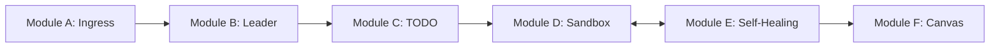

# 🧠 Project Brain: Modular Implementation Blueprint

> **Version:** 1.5.0  
> **Structure:** Modular Micro-Architecture  
> **Objective:** To break down the `/brain` route into independent, scalable modules for development and deployment.

---

## 📦 Module A: User Ingress (The Entry Hub)
**Purpose:** To capture the GitHub URL and user intent with zero friction.

*   **Components**: 
    *   `SmartInput`: A central message box with URL regex detection.
    *   `ProjectInitializer`: Generates a project title and initializes the **Redux State**.
*   **AI Logic**: Uses **GPT-4o-mini** to parse the prompt and classify the task type (Refactor, Feature, Debug).
*   **Output**: `project_id`, `repo_url`, `raw_prompt`.

---

## 📦 Module B: Leader Agent (The Orchestrator)
**Purpose:** The strategic "Brain" that manages all other agents and creates the master plan.

*   **Components**: 
    *   `StrategyEngine`: Built on **LangGraph**.
    *   `ClarificationBridge`: Triggers interactive questions if ambiguity is high.
*   **AI Logic**: Uses **Claude 3.5 Sonnet** to generate the **PRD (Product Requirements Document)** and the initial TODO list.
*   **HITL (Human-in-the-Loop)**: Pauses the graph for user approval of the plan.

---

## 📦 Module C: The Dynamic TODO (Task Tracker)
**Purpose:** A real-time, interactive task manager shown on the UI Canvas.

*   **Components**: 
    *   `TodoSlice`: Redux store managing task states (Pending, In-Progress, Success, Failed).
    *   `TaskVisualizer`: A vertical progress list on the Canvas.
*   **Data Schema**: 
    ```json
    { "id": "uuid", "task": "string", "agent": "string", "status": "enum" }
    ```
*   **Integration**: Syncs via **Socket.io** whenever a LangGraph node completes its task.

---

## 📦 Module D: The Sandbox (The Executioner)
**Purpose:** Hardware-isolated environment for cloning code and running commands.

*   **Components**: 
    *   `E2BManager`: Manages the lifecycle of **Firecracker MicroVMs**.
    *   `FileSystemAgent`: Handles `git clone`, `read_file`, and `write_file` tools.
*   **Security**: Air-gapped network by default; only specific white-listed registries (NPM, PyPI) allowed.
*   **Persistence**: The sandbox state is snapshotted after every major task completion.

---

## 📦 Module E: Self-Healing (The Debugger)
**Purpose:** Automated error detection and remediation loop.

*   **Components**: 
    *   `LogAnalyzer`: Parses sandbox `stderr` and stack traces.
    *   `RepairEngine`: Generates patches to fix identified bugs.
*   **Logic**: 
    1.  Command fails ⮕ Capture Log.
    2.  Send Log + Code to **Debugger Agent**.
    3.  Generate Fix ⮕ Apply in Sandbox ⮕ Re-run Command.
    4.  Loop max 3 times before escalating to the user.

---

## 📦 Module F: The Canvas (The Reporting Hub)
**Purpose:** The final destination for verified artifacts and executive reports.

*   **Components**: 
    *   `ReportRenderer`: Displays the final Markdown project summary.
    *   `ArtifactCenter`: Download area for the modified ZIP project.
*   **Security Check**: The **Security Brain** performs a final "Detonation Audit" before the Canvas is populated.
*   **Output**: 
    *   Summary of changes.
    *   Next steps for the user.
    *   Verified code download.

---

## 📊 Modular Connectivity Map

