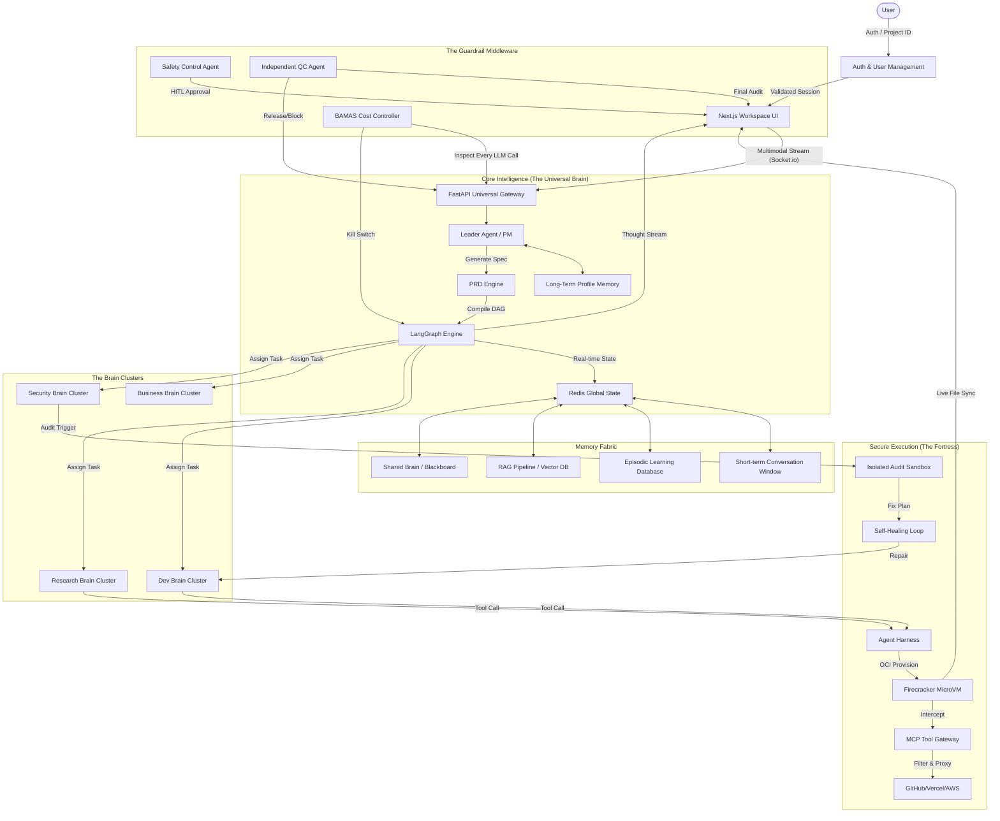

# 🧠 ✅ FINAL PROJECT CHECKLIST (PROJECT BRAIN / GRIZON AI)

---

# 🧩 1. CORE SYSTEM ARCHITECTURE

### 🖥️ Layers:

*   **Frontend (Workspace UI)**: 
    *   Dynamic agent activity feed with real-time streaming of "thoughts."
    *   Interactive Workspace Canvas for code preview and document editing.
    *   Voice UI integration (Whisper/ElevenLabs) for hands-free control.
    *   Live cost & token budget dashboard.
*   **Backend (Universal Brain / Orchestrator)**: 
    *   LangGraph-powered state management and task routing.
    *   Context compression and sliding window memory management.
    *   Universal API gateway for all agent communication.
*   **Sandbox (Execution Layer)**: 
    *   Hardware-isolated MicroVMs (Firecracker/E2B) for zero-trust execution.
    *   Restricted network environment with proxy-based outbound filtering.
    *   Ephemeral filesystem with automatic rollback capabilities.
*   **MCP Layer (External Tools)**: 
    *   Model Context Protocol integration for GitHub, Slack, AWS, and Supabase.
    *   Dynamic tool discovery and runtime permissioning.
*   **Security Brain (VM Audit)**: 
    *   Dedicated non-streaming layer for deep static and dynamic analysis.
    *   Automated vulnerability scanning and AI-driven auto-patching loop.

---

# 🧠 2. MULTI-AGENT SYSTEM

### 👑 Leader Agent (PM)

*   **Deep Prompt Understanding**: Semantic analysis and intent extraction from multi-modal inputs (text, voice, files).
*   **Recursive Clarification**: Proactive questioning to eliminate ambiguity before execution starts.
*   **PRD & Execution Plan**: Generation of detailed Product Requirements and a task dependency graph.
*   **Human-in-the-Loop (HITL)**: Requesting approval for high-risk actions or strategic plan changes.
*   **Dynamic Orchestration**: Assigning tasks to specialized "Brains" and synthesizing their outputs into a final result.

---

### 🤖 Specialized Agents (12+ Domains)

*   **Design Brain**: UI/UX wireframing, branding, and dynamic component generation.
*   **Development Brain**: Full-stack coding, architecture design, and API building.
*   **Finance Brain**: Token economics, budget tracking, and financial analysis.
*   **Marketing Brain**: SEO optimization, social media strategy, and ad copy.
*   **Sales Brain**: Lead generation scripts, funnel optimization, and outreach.
*   **Legal Brain**: Compliance checking, terms of service generation, and risk assessment.
*   **HR Brain**: Skill mapping, task assignment optimization, and team scaling.
*   **Research Brain**: Deep web synthesis, competitive analysis, and report generation.
*   **Analytics Brain**: Dataset processing, trend visualization, and Python-based EDA.
*   **Security Brain**: VM-based auditing, vulnerability detection, and auto-patching.
*   **Operations Brain**: CI/CD pipelines, infra setup, and deployment automation.
*   **QC Agent (Separate Layer)**: The final gatekeeper for output verification (No self-grading rule).

---

### 🔁 Agent Collaboration

*   **Shared Blackboard Context**: A central state where agents can read/write shared variables and status updates.
*   **Asynchronous Task Passing**: Hand-off protocols using standardized JSON schemas to ensure no data loss between Brains.
*   **Hybrid Execution**: Intelligent switching between parallel tasks (e.g., Research + Design) and sequential dependencies (e.g., Plan → Code).
*   **Cross-Brain Validation**: Feedback loops where one agent reviews another's draft before finalizing.

---

# ⚙️ 3. ORCHESTRATION ENGINE (CRITICAL)

*   **Global State Management**: Maintaining a persistent "Source of Truth" across all agent sessions.
*   **Task Dependency Graph**: LangGraph-powered DAG (Directed Acyclic Graph) for managing complex, multi-agent workflows.
*   **Self-Healing Loop Handling**: Automated detection of errors followed by recursive repair cycles.
*   **Intelligent Retry Logic**: Exponential backoff and model-switching (e.g., fallback to GPT-4o-Ultra on complex failures).
*   **Failure Escalation**: Systematic elevation to the Leader Agent or Human-in-the-Loop when autonomous repair fails.

---

# 🧠 4. MEMORY SYSTEM (FULL)

### 5 Layers:

*   **Short-term (Session)**: Active conversation history and immediate tool results (Sliding window).
*   **Long-term (User Profile)**: Persistent storage of user style, preferences, and recurring instructions.
*   **RAG (External Context)**: Indexed access to project files, documentation, PDFs, and GitHub repositories.
*   **Episodic (Historical Patterns)**: A database of past project "Post-Mortems" to avoid repeating mistakes.
*   **Shared Brain (Collaborative Memory)**: A global blackboard for cross-agent synchronization and shared task state.

---

# 🔍 5. RAG PIPELINE

*   **Syntax-Aware Parsing**: Intelligent extraction of text and code structure from `.pdf`, `.md`, `.js`, and `.ts` files.
*   **Recursive Chunking**: Dynamic splitting based on character limits and logical boundaries (classes/functions).
*   **High-Dimensional Embedding**: Using OpenAI `text-embedding-3-large` for deep semantic representation.
*   **Hybrid Vector DB**: Integration with Pinecone or Weaviate for sub-millisecond similarity search.
*   **Retrieval & Re-Ranking**: Utilizing Cohere Rerank to ensure the most relevant context is injected into the model prompt.

---

# 🎤 6. MULTIMODAL INPUT

*   **Natural Language Text**: Advanced intent extraction and semantic parsing of user prompts.
*   **Real-Time Voice**: High-fidelity transcription (Whisper-v3) with integrated memory of speech patterns.
*   **Structured File Upload**: Automated parsing and indexing of `.pdf`, `.docx`, `.csv`, and `.json` files into the RAG pipeline.
*   **Deep GitHub Integration**: Cloning, mapping, and recursive analysis of entire repositories for context-aware coding.

---

# ⚡ 7. STREAMING vs NON-STREAMING

### ✅ Streaming (Optimized for UX):
*   **Leader Chat**: Immediate token-by-token response for user interaction.
*   **Plan Generation**: Real-time visualization of the PRD and task graph construction.
*   **Agent Reasoning**: "Inner monologue" streaming to show the agent's thought process.
*   **Live Code Generation**: Real-time file updates in the Workspace Canvas as code is written.

### ❌ Non-streaming (Optimized for Integrity):
*   **Security Brain**: Full scan completion required before reporting vulnerabilities.
*   **Sandbox Execution**: Command outputs are buffered until completion to ensure data integrity.
*   **QC Validation**: Final "Pass/Fail" delivery only after exhaustive verification against the PRD.
*   **Final Production Output**: Bundled delivery of all project artifacts.

---

# 8. 🧪 SANDBOX SYSTEM

### 🛠️ Basic Environment:
*   **Isolated Code Execution**: Secure runtime for Python, Node.js, and Bash scripts.
*   **Ephemeral File System**: Temporary storage that resets between sessions to prevent state leakage.
*   **Interactive Terminal**: Real-time Xterm.js interface for manual user intervention.

### 🚀 Advanced Infrastructure:
*   **Hardware-Isolated MicroVMs**: Leveraging Firecracker or E2B for multi-tenant security.
*   **Per-Agent Isolation**: Every specialized Brain operates in its own dedicated VM instance.
*   **Resource Throttling**: CPU and RAM caps to prevent "Denial of Service" from runaway loops.

---

# 🔐 9. SECURITY ARCHITECTURE (VERY IMPORTANT)

### 🏗️ Core Principles:
*   **MicroVM Isolation**: Hardware-level separation with no shared kernels between projects.
*   **Zero-Trust Model**: Every agent request is verified, even within the internal network.

### 🛡️ Advanced Defense Layers:
*   **No Direct API Access**: Agents communicate with external services only via the MCP Gateway.
*   **MCP Gateway Proxy**: Outbound traffic filtering to prevent data exfiltration to unauthorized domains.
*   **JWT-Based Temporary Tokens**: Short-lived, task-specific credentials that expire after execution.
*   **Credential Masking**: No secrets or API keys are ever stored inside the Sandbox filesystem.
*   **Deny-All Network Policy**: Sandbox is completely isolated; allow-list only for the MCP gateway.

---

# 🛡️ 10. SECURITY BRAIN (USP)

*   **Isolated Repository Cloning**: Project files are cloned into a dedicated "Audit VM."
*   **Automated Static Analysis (SAST)**: Deep scanning for hardcoded secrets, XSS, and SQL injection.
*   **Dependency Vulnerability Scan**: Real-time checking of `package.json` and `requirements.txt` against CVE databases.
*   **Runtime Execution Monitoring**: Dynamic analysis in the Sandbox to detect malicious behavior.
*   **AI-Powered Auto-Patching**: Automatic generation and application of fixes for detected vulnerabilities.
*   **Iterative Re-Testing**: Verifying fixes in the Sandbox before code delivery.
*   **Audit Reporting**: Generation of a comprehensive security posture report for the user.

---

# 🔁 11. SELF-HEALING LOOP

*   **Step 1: Execute**: Agent runs code/commands within the isolated Sandbox.
*   **Step 2: Catch**: Sandbox captures all `stderr`, stack traces, and exit codes.
*   **Step 3: Analyze**: Debugger Agent identifies the root cause and generates a repair plan.
*   **Step 4: Fix & Verify**: Code Architect applies the patch and re-runs until `Exit Code 0` is achieved.

---

# ✅ 12. QUALITY CONTROL SYSTEM

*   **Independent QC Agent**: A dedicated agent that exists outside the development loop to ensure objectivity.
*   **Mandatory Non-Self-Validation**: Rule: No agent is permitted to approve or grade their own output.
*   **PRD-Based Verification**: Exhaustive testing of final deliverables against the user's initial requirements.
*   **Final Gateway**: Production code is only released to the user after a 100% successful QC pass.

---

# 💰 13. BAMAS (COST CONTROL SYSTEM)

### 📈 Core Features:
*   **Granular Token Budgeting**: Setting hard caps on input/output tokens per agent and per task phase.
*   **Cost Allocation Mapping**: Real-time tracking of spend across Design, Dev, and Research phases.
*   **Recursive Loop Limits**: Automatic termination of agents that exceed a predefined "thought depth" without progress.
*   **Dynamic Model Selection**: Automated switching between high-intelligence models (Claude 3.5 Sonnet) and cost-efficient models (GPT-4o-mini).
*   **Margin Protection Logic**: Ensuring the cost of execution never exceeds a percentage of the user's subscription value.

### 🚨 Fail-Safe Supervisor:
**Triggering Conditions:**
*   **Budget Ceiling**: 90% of the allocated project budget has been consumed.
*   **Logic Stagnation**: Agent stuck in a repetitive prompt/response loop for >3 iterations.
*   **Inter-Agent Conflict**: Two agents providing contradictory instructions to the Sandbox.
*   **Quality Decay**: Output validation scores from the QC Agent are trending downward.

**Supervisor Actions:**
*   **Model Up-scaling**: Switch to a "Reasoning Heavy" model (e.g., Ultra) to break through complex logic blocks.
*   **Problem Simplification**: Temporarily reduce the scope or depth of the current task.
*   **Force Exit**: Terminate the loop and deliver the best-effort output with a "Stagnation Report."

---

# 📊 14. DYNAMIC BUDGET SYSTEM

*   **Task-Based Allocation**: Budgets are dynamically calculated based on the "Complexity Score" of the Leader's PRD.
*   **Real-Time Adjustments**:
    *   **Reasoning Depth**: Increase budget for R&D tasks requiring multiple search passes.
    *   **Agent Parallelism**: Scale the budget when activating multiple Brains simultaneously.
    *   **Token Velocity**: Adjust rate limits based on the current system load and user priority.

---

# 🔗 15. MCP CONNECTORS (MODEL CONTEXT PROTOCOL)

*   **GitHub**: Repository cloning, branch management, and PR automation.
*   **Supabase**: Real-time database schema management and authentication setup.
*   **Apify / Web Scrapers**: Extraction of structured data from complex web surfaces.
*   **OpenClaw / Terminal**: Direct execution of system commands within the MicroVM.
*   **AWS / GCP / Vercel**: Infrastructure provisioning and production-grade deployment.
*   **Notion / Slack / APIs**: Bi-directional communication with enterprise productivity stacks.

---

# 🌐 16. SENSES (REAL-TIME DATA)

*   **Tavily**: Primary search engine for AI-optimized fact retrieval.
*   **Perplexity**: Used for deep research synthesis and source-cited summaries.
*   **Brave Search**: Private, comprehensive web indexing for general queries.
*   **SerpAPI**: Extracting hyper-localized search, jobs, and shopping data.
*   **Grok / Social Sentiment**: Real-time trend monitoring and public sentiment analysis.

---

# ⚙️ 17. BACKEND INFRA (SCALABLE & ROBUST)

*   **Distributed Task Queue**: Powered by BullMQ (Redis) or Kafka for high-concurrency agent tasks.
*   **Containerized Workers**: Specialized worker pods for different agent types (e.g., Python Data Science pods).
*   **Massive Parallelism**: Ability to run multiple "Brains" concurrently without state corruption.
*   **Exponential Backoff Retry**: Standardized failure recovery for all external API calls and sandbox commands.

---

# 🧾 18. LOGGING & OBSERVABILITY

*   **Trace-Level Agent Logs**: Capture every "Thought" and "Tool Call" for auditability.
*   **Visual Execution Timeline**: A Gantt-chart style view of agent activities in the UI.
*   **Per-Project Cost Tracking**: Real-time dollar-value tracking for transparency.
*   **Centralized Error Sentry**: Automated capturing of sandbox failures and LLM timeouts.

---

# 🧠 19. AGENT HARNESS (CONTROL SYSTEM)

*   **SOP Enforcement**: Agents are bound by strict system prompts (Standard Operating Procedures).
*   **Granular Tool Restrictions**: Agents only have access to tools required for their specific Brain (e.g., Researcher cannot write files).
*   **Input/Output Validation**: Every interaction is checked against a strict JSON schema.
*   **Action Boundary Shield**: Prevents agents from accessing directories or processes outside their assigned project.
*   **Rate Limiting**: Throttling agent actions to prevent API abuse and cost overruns.
*   **Atomic Rollback System**: Ability to revert all filesystem changes if a QC pass fails.

---

# 🔐 20. AUTH & USER MANAGEMENT

*   **Enterprise SSO**: Secure login via Google, GitHub, or internal identity providers.
*   **Strict Project Isolation**: No cross-pollination of data between different users or projects.
*   **Secure Credential Vault**: Encryption of user API keys and database secrets (AES-256).

---

# 🛑 21. SAFETY CONTROLS

*   **Global Kill Switch**: Immediate cessation of all active agents and destruction of sandbox VMs.
*   **Mandatory HITL Approval**: Human-in-the-loop requirement for irreversible actions (e.g., deployment, deletion).
*   **Irreversible Action Safeguard**: Two-factor confirmation for critical project state changes.

---

# 💵 22. BUSINESS LAYER

*   **Tiered Pricing Model**: Subscription-based access (Free, Pro, Enterprise).
*   **Token-to-Revenue Monitoring**: Ensuring platform profitability by tracking real-time LLM costs.
*   **Subscription Entitlements**: Managing access to advanced agents (e.g., Security Brain) based on tier.

# 💵 22. BUSINESS LAYER & TOKENOMICS

*   **Tiered Subscription Architecture**:
    *   **Tier 1 (Free/Hobbyist)**: Basic access to Leader and Dev agents, limited to 50k tokens/mo, shared sandbox, and public community support.
    *   **Tier 2 (Pro/Solo-Preneur)**: Full access to the Research, Content, and Business Brains, 1M tokens/mo, dedicated Docker sandboxes, and prioritized execution queues.
    *   **Tier 3 (Enterprise/Scale)**: Unlimited agents, dedicated **Firecracker MicroVMs**, full Security Brain audits, custom agent SOPs, and SOC2-compliant data handling.
*   **Token-to-Revenue Margin Optimizer**:
    *   **Dynamic Markup**: Automatic price adjustment based on the underlying model cost (GPT-4o vs. Claude 3.5).
    *   **High-Margin Thresholds**: System-enforced caps to ensure every project maintains a minimum 40% gross margin relative to API costs.
*   **Usage-Based Upselling**: Automated notifications when a project consumes 80% of the tier's token limit, offering one-click "Budget Expansion" packs.
*   **Retention Engine**: "Project Continuity" credits rewarded for long-running agent workflows, incentivizing high-LTV (Lifetime Value) users.

---

# 🏗️ 24. ARCHITECTURE & SYSTEM FLOW (EXTREME CONNECTIVITY)

This section provides the definitive master mapping of the Grizon AI ecosystem, detailing how the 23 discrete features interlock to form a self-sustaining AI Operating System.

### 📊 A. Extreme Detail System Connectivity (Mermaid)

### 🔗 B. Feature Interconnectivity & Dependency Matrix

The power of Grizon AI lies in the deep technical coupling between its layers. No feature operates in a vacuum.

| Layer / Feature | Depends On | Purpose of Connection |
| :--- | :--- | :--- |
| **Orchestration (3)** | **PRD Engine (2)** | Uses the PRD as a deterministic map to generate the LangGraph DAG nodes. |
| **Self-Healing Loop (11)**| **Sandbox (8)** | Requires a capture of `stderr` and filesystem state to identify and fix runtime errors. |
| **BAMAS (13)** | **Orchestration (3)** | Intercepts the DAG to calculate token ceilings and manages agent loop limits. |
| **RAG Pipeline (5)** | **Multimodal Input (6)**| Converts uploaded files and GitHub repos into high-dimensional vectors for retrieval. |
| **Security Brain (10)** | **Sandbox (8)** | Spawns a mirror VM of the dev environment to run destructive SAST/DAST tests without data loss. |
| **QC Agent (12)** | **PRD Engine (2)** | Uses the original PRD as a "Ground Truth" checklist for final project verification. |
| **Shared Brain (4)** | **Orchestration (3)** | Acts as the "Blackboard" where parallel agents (Research/Dev) sync their intermediate states. |
| **MCP Gateway (15)** | **Security Architecture (9)**| Enforces the "Zero-Trust" model by filtering all outbound traffic from the sandbox. |

### 🔄 C. The "Deep-Context" Execution Flow

1.  **The Context Hand-off**: When the **User** uploads a repository (**6**), the **RAG Pipeline** (**5**) immediately indexes it. The **Leader Agent** (**2**) then queries **LTM** (**4**) to understand the user's coding style (e.g., "Prefer TypeScript/Drizzle").
2.  **The Budget-Aware Plan**: The **Leader** generates a **PRD**. **BAMAS** (**13**) analyzes the PRD's complexity and sets a "Credit Limit." If the plan is too expensive for the user's tier (**22**), the **Fail-Safe Supervisor** suggests a simplified architecture before execution begins.
3.  **Collaborative Execution**: The **LangGraph Engine** (**3**) spawns a **Research Agent** (to find the latest API docs) and a **Dev Agent** (to write the code) simultaneously. Both agents read/write to the **Shared Brain** (**4**) to ensure the code uses the latest research findings.
4.  **Sandbox Feedback Loop**: The **Dev Agent** writes code to the **Firecracker Sandbox** (**8**). If a dependency is missing, the **Debugger** (**2**) catches the error, asks the **Code Architect** to update `package.json`, and restarts the loop automatically.
5.  **The Final Security Gate**: Once the code passes unit tests, the **Security Brain** (**10**) intercepts. It audits the code. If a vulnerability exists, it forces the **Dev Agent** to refactor. This occurs *before* the code ever touches the **QC Agent** (**12**).
6.  **Verified Delivery**: The **QC Agent** verifies that the final code matches every bullet point in the **PRD**. Only then does the **Gateway** release the final project ZIP and update the **Workspace UI** (**1**).

### 📝 D. System "Heartbeat" (Logging & Observability Flow)
Every millisecond of the above flow is captured by **Logging & Observability** (**18**).
*   **Trace Flow**: User Request -> Leader Thought -> BAMAS Check -> Agent Action -> Sandbox Result -> QC Pass.
*   **Visual Feed**: The user sees this in real-time as a "Gantt-style" execution timeline in the UI.

---
