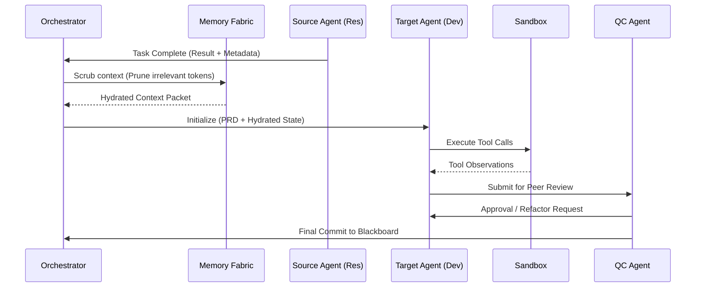
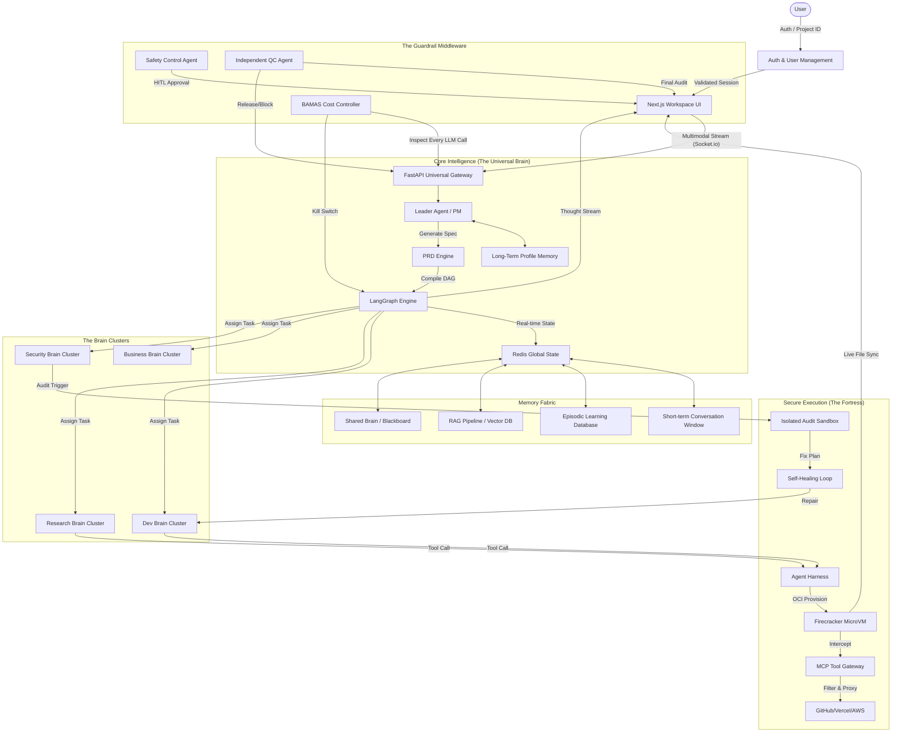

# 🧠 Master Universal Brain Backend (Grizon AI) — Ultimate Technical Specification

> **Version:** 3.0.0 (God-Tier Scale)  
> **Status:** Definitive Engineering Blueprint  
> **Mission:** To establish a hyper-scalable, zero-trust AI Operating System that treats autonomous agents as granular, secure, and cost-optimized micro-services.

---

## 📖 Table of Contents
1. [Core System Architecture](#architecture)
2. [Multi-Agent Orchestration](#multi-agent)
3. [The Orchestration Engine (LangGraph)](#orchestration-engine)
4. [Universal Memory Fabric](#memory-fabric)
5. [The RAG & Context Pipeline](#rag-pipeline)
6. [Multimodal Ingestion & Processing](#multimodal)
7. [Streaming vs. Integrity Protocols](#streaming-integrity)
8. [Sandbox & MicroVM Infrastructure](#sandbox-infra)
9. [Zero-Trust Security Architecture](#security-arch)
10. [The Security Brain (SAST/DAST)](#security-brain)
11. [Self-Healing & Auto-Repair](#self-healing)
12. [Quality Control & Verification](#qc-system)
13. [BAMAS: The Cost & Profit Engine](#bamas)
14. [MCP & External Tool Connectivity](#mcp-connectors)
15. [Scalable Backend Infrastructure](#backend-infra)
16. [Logging, Observability & Auth](#logging-auth)
17. [Safety & Kill-Switch Protocols](#safety-killswitch)

---

## 🏗️ 1. Core System Architecture

The Grizon AI backend is architected as a **Decentralized Agent Mesh (DAM)**. This design moves away from the traditional request-response model toward a highly parallelized, event-driven ecosystem. The core philosophy is **Zero-Trust Autonomy**: each agent is treated as an isolated compute unit with its own restricted context and tool-set.

### 1.1. The "Agent Mesh" Topology
Unlike a monolithic backend, the Mesh is composed of logical "Brain Clusters" that communicate via a high-performance **Service Mesh (Istio/Linkerd)**.

*   **Service Isolation**: Each service (Gateway, Orchestrator, Sandbox) runs in its own Kubernetes Namespace with strict **NetworkPolicies** enforced. No cross-namespace communication is allowed except through authenticated gRPC channels.
*   **Horizontal Elasticity**: Every layer is stateless at the compute level. State is externalized to the **Memory Fabric**, allowing the system to scale from 1 to 10,000 concurrent agents dynamically based on queue depth.
*   **Fault Tolerance**: The system utilizes the **Bulkhead Pattern**. If the "Research Brain" cluster experiences a failure (e.g., rate-limiting from a search provider), the "Development Brain" and "Finance Brain" continue to operate unaffected.

### 1.2. The Communication Fabric
Connectivity within the Mesh is governed by three distinct protocols, each optimized for a specific data velocity:

1.  **gRPC (The Command Layer)**:
    *   Used for low-latency, type-safe Agent-to-Agent (A2A) handovers.
    *   *Implementation*: Protobuf version 3. Supports bi-directional streaming for "Inner Monologue" synchronization between the Leader and specialized agents.
2.  **Redis Pub/Sub (The Pulse Layer)**:
    *   Used for real-time status updates and "Shared Brain" synchronization.
    *   *Example*: When the Debugger Agent finds a fix, it publishes to `project:{id}:events`, which triggers an immediate refresh in the user's Frontend Activity Feed.
3.  **Event Store (The Audit Layer)**:
    *   Powered by **Apache Kafka** or **EventStoreDB**.
    *   Every single state change is stored as an immutable event. This enables **Event Sourcing**, allowing the system to reconstruct the entire "Reasoning Chain" for security auditing or project debugging.

### 1.3. Universal Gateway Service (The Cortex)
The Gateway is the primary ingress point and protocol translator for all multimodal user interactions. Built on a high-concurrency **Node.js & Express** foundation, it acts as the "Traffic Controller" for the entire brain.

*   **Technology Stack**: 
    *   *Core Engine*: **Node.js (v20 LTS)** with **Express.js**.
    *   *Streaming Layer*: **Socket.io** for bi-directional WebSocket connectivity with **Redis Adapter** for multi-node synchronization.
    *   *Sidecar Integration*: Connects to a Python-based **Whisper-v3 Diarization Service** via a persistent gRPC stream for sub-second voice-to-text conversion.

#### 1.3.1. WebSocket Lifecycle & Connection Management
To maintain a persistent, low-latency connection, the Gateway implements a robust lifecycle manager:
*   **Heartbeat & Reconnection**: Employs an exponential backoff strategy for client reconnections. Session state is stored in Redis, allowing users to refresh their browser without losing the active "Agent Thought Stream."
*   **Room-Based Orchestration**: Every project is assigned a unique `Room_ID`. Multiple users (e.g., a team) can join the same room to see the same agent activities in real-time, powered by Socket.io rooms.

#### 1.3.2. Multimodal Stream Aggregator
The Gateway doesn't just receive text; it aggregates disparate data types into a unified **Context Packet**:
1.  **Chunked Ingestion**: Receives audio chunks (PCM), text fragments, and binary image data simultaneously.
2.  **Temporal Alignment**: Uses metadata timestamps to align voice commands with active UI events (e.g., "Fix the error in this file" while the user has a specific file open).
3.  **Payload Bundling**: Compiles these into a `MultimodalRequest` Protobuf message for the Orchestrator.

#### 1.3.3. The "Prompt Injection Shield" (Middleware)
Security begins at the edge. Every incoming message passes through a multi-stage Express middleware:
*   **L1: Regex/Keyword Filter**: Blocks known jailbreak patterns and forbidden command sequences.
*   **L2: BERT-Classifier**: A lightweight **DistilBERT** model running as a Node.js sidecar that analyzes the "Intent" of the prompt. If the intent is flagged as "System Override" or "Identity Theft," the request is dropped with a `403 Forbidden` and logged in the Security Audit log.

#### 1.3.4. BAMAS Edge Pre-Check
To prevent resource abuse, the Gateway performs a "Zero-Cost Check" before activating the LLMs:
*   **Identity Verification**: Validates the JWT and retrieves the user's Tier (Free, Pro, Enterprise).
*   **Quota Validation**: Queries the **BAMAS Cache** (Redis) to ensure the user has not exceeded their per-minute or per-month token limit.
*   **Early Rejection**: If the quota is exceeded, the Gateway returns an immediate "Rate Limit" event to the UI, saving expensive downstream GPU/LLM compute.

#### 1.3.5. Back-Pressure & Streaming Flow Control
When an agent is generating code at 100 tokens/sec, the Gateway ensures the client isn't overwhelmed:
*   **Adaptive Throttling**: If the client's WebSocket buffer exceeds a certain threshold, the Gateway buffers the stream and sends it in optimized "Batches."
*   **Priority Streaming**: "Agent Thoughts" (low bandwidth) are prioritized over "Binary Artifacts" (high bandwidth) to keep the UI responsive.

### 1.4. Orchestrator Engine (The Nervous System)
The Orchestrator is the cognitive core of Grizon AI. It translates high-level project goals into a deterministic, stateful execution graph. Unlike simple LLM chains, the Orchestrator maintains a **Global State** that persists across days of development.

*   **Technology Stack**: 
    *   *Core Engine*: **Python 3.12** using **LangGraph** and **LangChain v0.2**.
    *   *Task Queue*: **BullMQ (Redis)** or **Celery** for distributed task distribution.
    *   *Persistence*: **PostgreSQL** with the `checkpointing` schema for graph state and **Redis** for ephemeral blackboard variables.

#### 1.4.1. LangGraph State Schema & Persistence
Every project session is treated as a persistent "Thread."
*   **The Global Project State**: A structured JSON object containing the full conversation history, the current `Blackboard` variables, the list of generated artifacts, and the `BAMAS` credit status.
*   **Checkpointing Logic**: After every agent node (e.g., the Research Agent finishes), the Orchestrator saves a **State Snapshot**. This allows a project to be paused and resumed exactly where it left off, even if the underlying compute pod is recycled.

#### 1.4.2. Recursive Task Decomposition (PRD -> DAG)
The Orchestrator's primary role is to compile the user's requirement into a **Directed Acyclic Graph (DAG)**:
1.  **Intent Extraction**: The Leader Agent parses the input to identify the "Epic" (e.g., "Build a Dashboard").
2.  **Sub-task Generation**: The Epic is broken into atomic `Graph Nodes` (e.g., `Setup_Repo`, `Design_Schema`, `Implement_Auth`).
3.  **Conditional Routing**: The Orchestrator defines the edges. If `Implement_Auth` fails, the edge routes to the `Debugger_Node` instead of the `UI_Design_Node`.

#### 1.4.3. BAMAS-Driven Model Switching
The Orchestrator acts as the "Buyer" of intelligence. At each node, it consults **BAMAS**:
*   **Speculative Routing**: If the node is `Formatting_JSON`, it uses **GPT-4o-mini**. If the node is `Complex_Refactor`, it switches to **Claude-3.5-Sonnet**.
*   **Intelligence Escalation**: If an agent fails a task twice, the Orchestrator automatically escalates the node to a more powerful model (e.g., **O1-Preview**) to break the reasoning deadlock.

#### 1.4.4. Polyglot & A2A Communication (gRPC)
The Orchestrator bridges the gap between the Python AI logic and the Node.js I/O services:
*   **The gRPC Mesh**: Uses Protobuf definitions to send `Agent_Task` requests to the **Sandbox Service** and `Store_Memory` requests to the **Memory Fabric**.
*   **Asynchronous A2A Handovers**: When the Research Agent finishes, the Orchestrator triggers a "Handover Event." It cleans the context window, injects the new research findings, and initializes the Developer Agent's state.

#### 1.4.5. The "Inner Monologue" Streaming
While an agent is thinking, the Orchestrator streams its internal reasoning steps to the Gateway:
*   **Thought Tokens**: Raw reasoning steps are filtered through a "Transparency Mask" and sent to the UI via Socket.io.
*   **Action Confirmation**: Before an agent calls a tool (e.g., `delete_file`), the Orchestrator pauses the graph and waits for a `User_Approval` event from the Gateway.

### 1.5. Sandbox Execution Cluster (The Muscle)
The Sandbox is the only place where agent-generated code is executed. It is designed with a **Zero-Trust** philosophy, ensuring that even if an agent produces malicious code, the host system and other project data remain untouched.

*   **Technology Stack**: 
    *   *Virtualization Engine*: **Firecracker VMM** (Rust-based).
    *   *Security Runtime*: **NVIDIA OpenShell** (for policy-driven agent governance).
    *   *Operator*: **SandboxOperator** (Go) running as a Kubernetes Custom Controller.
    *   *Control Plane*: **Node.js/Express** for task dispatching and logging.
    *   *Networking*: **eBPF (Extended Berkeley Packet Filter)** for kernel-level traffic monitoring.

#### 1.5.1. Hardware-Isolated MicroVMs
Unlike Docker containers which share the host kernel, Grizon AI uses **MicroVMs**.
*   **Kernel Isolation**: Each project gets a dedicated Linux kernel. An exploit in the sandbox cannot access the host's memory or processes.
*   **Snapshot-on-Demand (Sub-200ms Boot)**: 
    *   A pre-warmed "Base Snapshot" is maintained in a paused state. 
    *   When an agent calls `execute_code`, the Operator thin-clones the snapshot and resumes the VM in milliseconds, providing an "instant-on" experience for the user.

#### 1.5.2. Filesystem & Data Integrity (VirtIO-FS)
The sandbox filesystem is composed of three layers:
1.  **RootFS (Read-Only)**: The base OS and pre-installed toolsets (Node, Python, GCC).
2.  **Workspace Volume (VirtIO-FS)**: A project-specific directory mounted from the host. This allows for high-performance file sharing between the Agent and the Sandbox.
3.  **Ephemeral Overlay**: All runtime changes (e.g., `npm install`) are written to a temporary memory-backed overlay that is discarded unless the **Code Architect** explicitly commits the changes.

#### 1.5.3. Networking: The eBPF Jail
The Sandbox is network-isolated by default. Every packet is inspected at the kernel level:
*   **Outbound Proxying**: No direct internet access. All requests are routed through a **Filtering Proxy**.
*   **eBPF Enforcement**: The SandboxOperator attaches eBPF programs to the VM's TAP interface. These programs drop any packet not destined for the registered **MCP Gateway** or approved dependency registries (e.g., PyPI, NPM).
*   **Data Leak Detection**: Inspects outbound payloads for high-entropy strings, hardcoded secrets, or PII (Personally Identifiable Information) before they leave the VPC.

#### 1.5.4. Resource Throttling & DoS Prevention
To prevent runaway loops or "Fork Bombs" from crashing the system:
*   **Cgroups v2 Limits**: Every VM is capped at **2 vCPUs** and **1GB RAM**.
*   **IOPS Capping**: Storage throughput is limited to prevent a malicious agent from exhausting host I/O.
*   **Execution Timeouts**: A hard `TTL` (Time-To-Live) is applied to every command. If a script runs for > 60s without output, the Operator SIGKILLs the process and alerts the Debugger.

#### 1.5.5. Real-Time Terminal (PTY) Streaming
The Gateway provides a live view into the Sandbox via an interactive terminal:
*   **WebSocket Tunnel**: Terminal output is streamed via `xterm.js` over the Gateway's WebSocket.
*   **Bi-directional Interaction**: Users can manually interrupt a running process or type commands directly into the Sandbox, with the **Leader PM** observing the manual intervention to update the project state.

#### 1.5.6. Persistent Shell Sessions (OpenShell / OpenClaw)
For complex, multi-step tasks, the Sandbox supports persistent, stateful shell sessions (similar to **OpenClaw**).
*   **Agent-Controlled PTY**: Agents can call the `open_shell` tool to spawn a long-running bash/zsh process. This allows them to run a command (e.g., `npm start`), observe the output stream, and then send further input (e.g., `Ctrl+C` or a specific keystroke) without losing the session state.
*   **Shared PTY Context**: Both the **Leader PM** and the **Specialized Agent** can "attach" to the same PTY. This enables the Leader to monitor the real-time build logs while the Developer Agent interacts with the terminal.
*   **Session Persistence**: If the WebSocket connection drops, the shell process remains running inside the MicroVM. Upon reconnection, the Gateway "Re-attaches" the PTY stream, allowing the user to pick up exactly where they left off.

#### 1.5.7. NVIDIA OpenShell Governance Layer
The Sandbox utilizes **NVIDIA OpenShell** as the core security runtime for autonomous agents. It acts as an immutable governance layer between the agent and the host.

*   **Declarative YAML Policies**: Every agent action is governed by human-readable, version-controlled security policies. These policies explicitly define the agent's boundaries (e.g., "Allow write to `/app`, Deny read from `/etc/shadow`").
*   **Landlock & Seccomp Isolation**: OpenShell leverages the **Landlock LSM** for fine-grained filesystem restrictions and **seccomp filters** to block dangerous system calls. This ensures that even if an agent is "jailbroken," it cannot escape its predefined security sandbox.
*   **Forensic-Level Auditing**: Every "allow" or "deny" decision made by OpenShell is logged with high-fidelity metadata. This provides an enterprise-grade audit trail, ensuring that every tool call is traceable to a specific security policy.
*   **Non-Bypassable Protection**: Because OpenShell exists as a separate runtime outside the agent's code, agents cannot override or modify their own security constraints, ensuring a robust "Defense in Depth" posture.

### 1.6. Universal Memory Fabric (The Hippocampus)
The Memory Fabric is a unified, multi-tiered storage system that provides Grizon AI with both "Instant Recall" (STM) and "Historical Wisdom" (LTM). It is built as a distributed **Node.js** service cluster to maximize I/O throughput.

*   **Technology Stack**: 
    *   *Core Engine*: **Node.js (v20)** using **TypeORM** for Postgres and **ioredis** for Redis cluster management.
    *   *Vector Database*: **Pinecone (Serverless)** or **Milvus**.
    *   *Relational Storage*: **PostgreSQL** with **TimescaleDB** (for audit-trail sharding).
    *   *Cache Layer*: **Redis Bloom** (for fast membership checks) and **Redis JSON**.

#### 1.6.1. The 5-Layer Context Stack
Grizon AI uses a sliding-window memory architecture to ensure agents never lose track of project goals:
1.  **L1: Short-Term Memory (STM)**: Stores the current conversation turn in Redis for <10ms retrieval.
2.  **L2: Shared Brain (The Blackboard)**: A global Redis-backed key-value store for cross-agent collaboration (e.g., the Research Brain writes an API URL, the Dev Brain reads it).
3.  **L3: Project-Long Memory (PLM)**: Stores the full thread history in Postgres, allowing for "Time-Travel Debugging" of agent decisions.
4.  **L4: Semantic Knowledge (RAG)**: Uses Pinecone to store vectorized codebases, documentation, and PRDs.
5.  **L5: Cold Archive**: Compressed snapshots of previous project versions stored in S3/GCS for historical reference.

#### 1.6.2. Syntax-Aware RAG Pipeline
Unlike standard RAG, Grizon AI's memory is **Structure-Aware**:
*   **Tree-Sitter Chunking**: Instead of fixed-length tokens, the system parses code into logical blocks (Functions, Classes, Imports). This ensures that retrieved code is always functionally complete.
*   **Hybrid Search**: Combines **Dense Vectors** (semantic meaning) with **Sparse BM25** (keyword matching). This is critical for finding specific variable names or uncommon library calls.
*   **Re-Ranking Stage**: All retrieved results pass through a **Cohere Rerank** model to ensure the most relevant 3 snippets are injected into the agent's context window.

#### 1.6.3. PII Masking & Privacy Guard
Before any data is written to the Vector DB or shared with external LLMs, the Memory Fabric applies a **Privacy Filter**:
*   **Entity Extraction**: Identifies and masks emails, API keys, IP addresses, and personal names.
*   **Local Scrubbing**: Data is scrubbed in-memory within the Node.js layer, ensuring sensitive information never touches the cloud persistence layer.

#### 1.6.4. Data Lineage & Source Attribution
Every piece of information in the memory fabric is tagged with high-fidelity metadata:
*   **Source Citation**: Agents can "see" where a piece of knowledge came from (e.g., `source: "API_Docs_v2.pdf", confidence: 0.98`).
*   **Temporal Tagging**: Knowledge is versioned. If an API is updated, the Memory Fabric marks old knowledge as "Stale," prompting the agent to re-research the topic.

#### 1.6.5. Node.js I/O Optimization
By offloading memory management to a Node.js cluster, Grizon AI achieves high performance:
*   **Non-Blocking Retrieval**: While a Python agent is busy "thinking," the Node.js memory service pre-fetches the next likely-needed context chunks in the background.
*   **Connection Pooling**: Manages thousands of concurrent database connections, ensuring sub-100ms response times for agent context hydration.

### 1.7. Security Brain Service (The Immune System)
The Security Brain is a non-streaming, high-assurance service designed to ensure that no code enters production without a rigorous multi-stage audit. It operates as a "Zero-Trust" gatekeeper.

*   **Technology Stack**: 
    *   *Analysis Core*: **Rust** (for performance-critical binary and source scanning).
    *   *Orchestration*: **Node.js** for managing the audit lifecycle and external API integrations.
    *   *Secret Management*: **HashiCorp Vault** for secure credential injection.
    *   *Scanner Suite*: Integrated **Semgrep** (SAST), **OWASP ZAP** (DAST), and **Trivy** (Container/CVE).

#### 1.7.1. The "Detonation VM" Protocol
To prevent "Side-Channel Attacks" or "Malicious Persistence," the Security Brain never audits code in the live workspace.
1.  **Isolation Cloning**: The entire project workspace is cloned into a secondary, strictly air-gapped **Firecracker MicroVM** (The Detonation VM).
2.  **Destructive Testing**: The Security Brain executes the code within this VM and performs "Chaos Testing" to see if the application attempts unauthorized network calls or filesystem escapes.
3.  **Volatile Wipe**: Once the audit is complete, the entire VM state is cryptographically erased.

#### 1.7.2. Hybrid SAST/DAST Engine
*   **Static Analysis (SAST)**:
    *   **Semantic Scanning**: Uses custom Rust rules to detect "Logic Bombs" or obfuscated backdoors that standard scanners might miss.
    *   **Secret Detection**: Scans for high-entropy strings, hardcoded API keys, and private certificates using a pre-trained ML model to minimize false positives.
*   **Dynamic Analysis (DAST)**:
    *   **Automated Fuzzing**: The Security Brain identifies all exposed REST/gRPC endpoints and performs automated fuzzing to detect SQL injection, XSS, and broken access controls.
    *   **Resource Exhaustion Check**: Monitors the Detonation VM's memory and CPU usage during execution to ensure the code doesn't contain "Zip Bombs" or recursive resource leaks.

#### 1.7.3. Real-Time CVE & SBOM Generation
For every project, the Security Brain maintains a live **Software Bill of Materials (SBOM)**:
*   **Dependency Audit**: Scans `package.json`, `requirements.txt`, or `go.mod` files against the **Global Vulnerability Database (NVD/OSV)**.
*   **Automatic Patch Proposals**: If a vulnerable library is found, the Security Brain doesn't just alert; it generates a **Version-Upgrade PR** and verifies the fix in the Detonation VM before alerting the human user.

#### 1.7.4. The "Repair Loop" Feedback
The Security Brain is tightly integrated into the Orchestrator's feedback loop:
*   **Security Fail State**: If a high-severity vulnerability is found, the Orchestrator pauses the deployment pipeline.
*   **Context Injection**: The vulnerability report (including stack traces and line numbers) is fed back to the **Code Architect Agent** as a "Bug Report," triggering an autonomous refactor.

#### 1.7.5. Credential Masking & Vault Integration
Agents never handle raw secrets. The Security Brain manages the lifecycle of credentials:
*   **Dynamic Injection**: Secrets are injected into the Detonation VM's environment variables at runtime via HashiCorp Vault.
*   **Redaction Filter**: All logs generated by the Sandbox or Detonation VM are passed through a **Node.js Redactor** that masks any potential secrets or PII before they are stored in the memory fabric.

---

## 🤖 2. Multi-Agent System (MAS)

Grizon AI implements a **Recursive Hierarchical Topology**. Agents are not merely scripts; they are stateful, autonomous micro-services with distinct cognitive roles and restrict### 2.1. Agent Hierarchy & Cognitive Layers
The system is organized into a **Tri-Tiered Command Structure** to ensure maximum efficiency and prevent "Prompt Poisoning" or "Reasoning Collapse."

1.  **Strategic Tier (CEO / Leader PM)**: 
    *   *Mission*: Acts as the primary interface between the User and the Machine.
    *   *Decision Logic*: Uses a **Qualitative Gap Analysis** (QGA). If a user prompt (e.g., "Make me a site") lacks a tech stack or color palette, the Leader pauses and generates an interactive questionnaire before allowing any work to start.
2.  **Tactical Tier (Domain Expert Brains)**: 
    *   *Mission*: Manages specific project domains (Security, Dev, Research).
    *   *Autonomous Authority*: These agents have the power to spin up "Operational Workers" and review their outputs before passing them back to the Leader.
3.  **Operational Tier (Task Workers)**: 
    *   *Mission*: Executes atomic tool calls.
    *   *Lifecycle*: These are ephemeral "Micro-Agents" spawned for a single function (e.g., "Refactor file X.js"). They are destroyed immediately after task completion to save memory.

### 2.2. The Leader PM: Strategic Decision Engine
The Leader PM is the "Command & Control" center of Grizon AI. It is designed to think like a Senior Project Manager, balancing user desires against technical feasibility and budget constraints.

#### 2.2.1. QGA (Qualitative Gap Analysis) & Ambiguity Scoring
Before any execution begins, the Leader runs the user prompt through a **Semantic Analyzer** to calculate an **Ambiguity Score (AS)** from 0.0 to 1.0.
*   **AS > 0.4 (High Ambiguity)**: The Leader triggers the **"Clarification Terminal."** It generates a series of targeted, multiple-choice questions for the user to narrow down the scope (e.g., "Do you prefer Next.js or Vite for this frontend?").
*   **Ambiguity Vectors**: The Leader checks for missing vectors in three categories:
    1.  *Technical*: No tech stack or framework mentioned.
    2.  *Design*: No visual style or color palette specified.
    3.  *Business*: No target audience or primary success metric defined.

#### 2.2.2. The MVS (Minimum Viable Specification) Matrix
The Leader strictly enforces the **MVS Protocol**. Work is blocked until the following **Metadata Matrix** is populated in the Global State:

| Field | Requirement | Purpose |
| :--- | :--- | :--- |
| `intent_id` | Mandatory | Global UUID for tracking the reasoning chain. |
| `success_criteria` | Mandatory | Defines exactly how the **QC Agent** will verify the work. |
| `tech_constraints` | Mandatory | Prevents agents from using non-compliant or legacy libraries. |
| `brand_dna` | Optional | Defines tone of voice and aesthetic "vibe" for Creative Brain. |
| `env_context` | Mandatory | Specifies local, dev, staging, or production target. |

#### 2.2.3. Dynamic DAG Compilation & Branching
The Leader doesn't follow a static script; it compiles a **State-Aware Graph**:
*   **Predictive Pathing**: The Leader predicts likely failure points (e.g., "External API might be rate-limited") and pre-compiles "Fallback Branches" into the LangGraph.
*   **Real-Time Pruning**: If the Research Brain discovers a critical dependency is no longer supported, the Leader **Prunes** the active branch and re-routes the project to a "Pivoting" node without human intervention.
*   **Checkpoint Re-evaluation**: At every node completion, the Leader compares the result against the `success_criteria`. If the result is <90% match, it triggers an immediate **Retry-with-Analysis** loop.

#### 2.2.4. Autonomous PRD Refinement
The Project Requirements Document (PRD) is a **Living Document**.
*   **Append-Only Ledger**: As agents complete tasks, the Leader updates the PRD with technical findings, architecture decisions, and schema definitions.
*   **Final Delivery Sync**: Upon project completion, the Leader compiles all Blackboard variables into a final **"System Manifest"** that serves as the documentation for the delivered code.

#### 2.2.5. BAMAS Negotiation Logic
The Leader manages the project's financial health:
*   **Intelligence Auction**: For each task, the Leader "bids" a model based on the complexity. It calculates the ROI of using a high-cost model (GPT-4o) versus a low-cost model (Claude-3-Haiku).
*   **Credit Throttle**: If the user's token budget reaches <10% remaining, the Leader automatically switches all non-critical tasks to "Extreme Efficiency Mode" and alerts the user via the UI.

### 2.3. The 6 Major Brain Clusters (Detailed Specs)
Each Brain Cluster is an isolated group of agents running with a **Domain-Specific System Prompt** and a restricted set of high-performance tools.

#### 2.3.1. The Development Brain (The Architect & Coder)
*   **Technical Mission**: To author high-fidelity, production-grade code that adheres to enterprise standards.
*   **Tech Stack**: Node.js, Python, TypeScript, Rust, Go.
*   **Cognitive SOP**:
    *   **TDD Enforcement**: Must write unit tests (Jest/PyTest) *before* core logic.
    *   **Modular Architecture**: Enforces SOLID principles and prevents file bloat (max 300 lines per file).
    *   **Documentation**: Every function requires JSDoc/Docstring with type definitions.
*   **Key Tools**: `create_file`, `patch_file` (unified diff), `run_linter`, `execute_unit_tests`.

#### 2.3.2. The Data Science Brain (The Insight Engine)
*   **Technical Mission**: Processing large-scale structured and unstructured data to find actionable trends.
*   **Tech Stack**: Pandas, NumPy, Scikit-learn, Matplotlib, Seaborn, SQL.
*   **Cognitive SOP**:
    *   **Statistical Integrity**: Every claim must be backed by a p-value or confidence interval.
    *   **Data Cleaning**: Mandatory outlier detection and null-value handling before analysis.
    *   **Visual Excellence**: Charts must use accessible color palettes and high-resolution exports.
*   **Key Tools**: `run_python_analysis`, `query_dataset`, `generate_visualization`, `export_pdf_report`.

#### 2.3.3. The Security Brain (The Auditor)
*   **Technical Mission**: Detecting and neutralizing vulnerabilities before code is ever merged or deployed.
*   **Tech Stack**: NVIDIA OpenShell, Semgrep, OWASP ZAP, Trivy, HashiCorp Vault.
*   **Cognitive SOP**:
    *   **Zero-Trust Bias**: Assumes all external inputs and generated code are potentially malicious.
    *   **Non-Bypassable Audits**: Every line of code must pass a SAST scan before the Deployment node is unlocked.
    *   **Repair Proposals**: Must provide a "Secure Alternative" code snippet for every identified flaw.
*   **Key Tools**: `scan_vulnerability`, `detonate_in_sandbox`, `audit_dependencies`, `mask_pii`.

#### 2.3.4. The Research Brain (The Knowledge Harvester)
*   **Technical Mission**: Deep-web exploration and synthesis of technical, market, and competitor data.
*   **Tech Stack**: Tavily AI, Perplexity API, Google Search, BeautifulSoup.
*   **Cognitive SOP**:
    *   **Recursive Multi-Hop**: If a source is ambiguous, the brain must "dig deeper" into the cited references.
    *   **Source Attribution**: No factual claim is allowed without a verified URL and a "Source Reliability Score."
    *   **Synthesis**: Must convert raw search results into an executive summary with a SWOT analysis.
*   **Key Tools**: `deep_search`, `read_webpage`, `summarize_sources`, `build_knowledge_graph`.

#### 2.3.5. The Creative Brain (The Visionary)
*   **Technical Mission**: Drafting brand identities, UI/UX systems, and high-premium aesthetic assets.
*   **Tech Stack**: HSL Color Systems, Google Fonts API, DALL-E 3, CSS Grid/Flexbox.
*   **Cognitive SOP**:
    *   **Premium Aesthetics First**: Avoid generic "browser defaults"; use curated typography and smooth gradients.
    *   **Accessibility (a11y)**: Ensures color contrast ratios meet WCAG AA standards.
    *   **Brand Consistency**: All assets must share a unified "Visual DNA" defined in the project PRD.
*   **Key Tools**: `generate_design_tokens`, `create_ui_mockup`, `generate_creative_assets`, `draft_copy`.

#### 2.3.6. The Operations Brain (The SRE)
*   **Technical Mission**: Managing the lifecycle of deployments, CI/CD pipelines, and infrastructure health.
*   **Tech Stack**: Docker, Kubernetes (K8s), Terraform, GitHub Actions, OpenTelemetry.
*   **Cognitive SOP**:
    *   **Infrastructure-as-Code (IaC)**: No manual cloud configurations; everything must be defined in code.
    *   **Observability**: Every deployment must include health checks and logging endpoints.
    *   **Scalability**: Ensures that container configurations include resource requests/limits and auto-scaling triggers.
*   **Key Tools**: `deploy_to_cloud`, `validate_terraform`, `setup_cicd`, `check_health_status`.
| **Operations** | CI/CD and Deployment infra. | "SRE" - Prioritizes uptime, Docker configs, and monitoring. |

### 2.4. Agent Interaction & Handover Lifecycle
To ensure the "Baton" is never dropped and context remains pristine, Grizon AI uses a **Deterministic 5-Stage Handover Protocol**.

#### 2.4.1. Handover Sequence Visualization

#### 2.4.2. Detailed Stage Breakdown

**1. The Trigger (Transition Logic)**
*   **Node Completion**: The Orchestrator monitors the `status_code` of the outgoing agent.
*   **Exit Status Mapping**: 
    *   `SUCCESS`: Proceeds to next node in the DAG.
    *   `UNCERTAIN`: Triggers a Research Node to verify findings.
    *   `CRITICAL_FAIL`: Re-routes to the Healer/Debugger agent.

**2. State Scrubbing (Context Compaction)**
To prevent "Context Poisoning" and save tokens, the Memory Fabric performs **Recursive Pruning**:
*   **Reasoning Removal**: Strips the "Inner Monologue" of the previous agent, keeping only the final result and critical variables.
*   **Entity Extraction**: Identifies high-value project entities (e.g., variable names, API endpoints) that must remain in the sliding window.
*   **Summarization**: If the history is too long, the Memory Fabric generates a **Recursive Summary** of the previous 10 turns.

**3. Context Hydration (Warm-Start)**
The target agent is "born" into the session with three distinct memory blocks:
*   **The Blueprint**: The static PRD and Project Mission.
*   **The Delta**: Only the specific Blackboard updates from the *previous node* (minimizes noise).
*   **The Persona**: The specific System SOP and Tool-set permissions for that agent.

**4. Execution & Observation Loop**
The agent operates in a **Closed-Loop Sandbox**:
*   **Action**: Agent issues a command (e.g., `write_file`).
*   **Observation**: The Sandbox returns the result (e.g., `File written successfully` or `Lint Error: line 4`).
*   **Reflection**: The agent analyzes the observation. If there is an error, it refactors its own command *before* asking the Orchestrator for the next move.

**5. Peer Review (The QC Gate)**
Before a task is marked "Done," it must pass the **Quality Control (QC) Audit**:
*   **Validation**: The QC Agent compares the output against the `success_criteria` defined in the PRD.
*   **Refactor Loop**: If QC fails (e.g., "Missing unit tests"), the agent is sent back to Stage 4 with a **Correction Prompt**.
*   **Commit**: Once approved, the result is atomically written to the Redis Blackboard.

## ⚙️ 3. The Orchestration Engine (LangGraph)

The Engine is the deterministic backbone of Grizon AI, managing complex, non-linear workflows across a distributed agent collective.

### 3.1. LangGraph State-Machine Architecture
The Orchestrator operates as a **State-Agnostic DAG** (Directed Acyclic Graph). Every project is a unique graph instance compiled at runtime.
*   **The Checkpointing Schema**: Every state transition (Node A -> Node B) is serialized and stored in a **PostgreSQL Event Store**. This allows for:
    *   **Sub-Second Failure Recovery**: If a worker pod dies, a new one inherits the exact state from the DB and resumes the graph instantly.
    *   **Time-Travel Debugging**: Developers can "replay" the project from any specific node to analyze why an agent made a specific decision.
*   **Recursive Graph Nesting**: A single node in the master graph can represent an entire "Sub-Graph" (e.g., a "Security Audit" node spawns a nested graph with its own SAST, DAST, and Remediation nodes).

### 3.2. Node Lifecycle & Execution Logic
Each node in the graph follows a strict execution lifecycle:
1.  **Entrance (Pre-Flight)**: The node fetches the latest Blackboard variables and "Pruned" history from the Memory Fabric.
2.  **Prompt Assembly**: The Orchestrator injects the agent's **SOP**, the **Project PRD**, and the **Task Intent**.
3.  **Execution (Async)**: The agent performs its task (Tool Call or Reasoning).
4.  **Observation Processing**: The Sandbox results are mapped back to the graph state.
5.  **Conditional Routing (Edges)**: The Orchestrator evaluates the output. If the result contains a `lint_error`, the edge routes to a `Self_Repair` node. If `success`, it routes to `QC_Review`.

### 3.3. Error Escalation & Backoff (The 4-Layer Protocol)
*   **L1 (Local Self-Correction)**: The agent identifies a minor error (e.g., a typo) in the Sandbox and attempts a fix within the same node execution (Max 3 retries).
*   **L2 (Healer Activation)**: If L1 fails, the Orchestrator activates the **Debugger Agent** (a specialized node) to perform a "Deep Log Analysis" and generate a patch.
*   **L3 (Intelligence Escalation)**: If the Debugger fails, **BAMAS** is triggered to "Upscale" the model (e.g., moving from `GPT-4o-mini` to `O1-Preview`) to solve the complex logic block.
*   **L4 (Human-in-the-Loop)**: The graph enters a `PAUSE` state. A high-priority WebSocket alert is sent to the UI, allowing the user to provide manual guidance or override the decision.

---

## 🧠 4. Universal Memory Fabric (The Hippocampus)

Memory is treated as a **Dynamic Sliding Window** that balances immediate recall with long-term semantic knowledge.

### 4.1. Tiered Memory Sharding
Grizon AI organizes memory into 5 distinct layers to ensure context is never "lost" or "noisy":
1.  **Short-Term (Redis JSON)**: Stores the last 5-10 conversation turns. Retrieval latency: <5ms.
2.  **Shared Brain / Blackboard (Redis Redlock)**: A global, thread-safe memory space for cross-agent synchronization. If the Dev Brain updates a schema, the Security Brain sees it instantly.
3.  **Episodic Memory (Postgres + Vector)**: Stores "Learning Moments" from past projects (e.g., "User prefers Dark Mode with HSL colors").
4.  **Semantic Memory (Pinecone Vector DB)**: The RAG engine that indexes the entire codebase and external documentation.
5.  **Audit Memory (S3/Archive)**: Immutable logs of every reasoning step, preserved for compliance and enterprise reporting.

### 4.2. Context Pruning & Compaction Logic
To prevent "Context Overflow," the Memory Fabric performs **Intelligent Pruning** during every agent handover:
*   **Token-Aware Slicing**: Calculates the remaining tokens in the target model's window.
*   **Reasoning Compression**: Converts thousands of lines of "Inner Monologue" into a 5-sentence executive summary for the next agent.
*   **Variable Extraction**: Identifies and prioritizes critical project variables (e.g., `DB_CONNECTION_STRING`) ensuring they are always in the prompt.

### 4.3. Cross-Project Knowledge Transfer
For enterprise users, the Memory Fabric enables **Cross-Session Learning**:
*   **Pattern Recognition**: If an agent solves a specific "Bug Type" in Project A, the logic is indexed in the Episodic Memory. When Project B encounters a similar bug, the Research Brain retrieves the previous solution as a "Best Practice" template.

---

## 🔍 5. The RAG & Context Pipeline

The RAG pipeline is the "Knowledge Bridge" that allows Grizon AI to reason over massive codebases without hallucination.

### 5.1. Syntax-Aware Tree-Sitter Chunking
Standard "Text Chunking" (e.g., every 500 characters) is forbidden in Grizon AI.
*   **Logical Boundary Recognition**: The system uses **Tree-Sitter** to parse the abstract syntax tree (AST) of the code. It breaks files into logical units: `FunctionDef`, `ClassDef`, and `ImportBlock`.
*   **Contextual Overlap**: Each chunk includes its parent class or module definition as metadata, ensuring the LLM understands the **Scope** of the code it is reading.
*   **Dependency Mapping**: The RAG pipeline indexes "Call Graphs." If an agent asks for `function_A`, the pipeline also retrieves the definitions of `function_B` and `function_C` that are called within `function_A`.

### 5.2. Hybrid Semantic Retrieval (Sparse + Dense)
To ensure 100% accuracy in code retrieval, Grizon AI uses a **Dual-Vector Retrieval** strategy:
1.  **Dense Embedding (Semantic)**: Uses `text-embedding-3-large` (3072 dims) to capture the *meaning* of the code (e.g., "Find the auth middleware").
2.  **Sparse Embedding (Keyword)**: Uses **BM25** to capture exact tokens (e.g., finding the specific variable `jwt_secret_v2`).
3.  **Cross-Encoder Re-Ranking**: The top 50 candidates from both searches are fed into a **BGE-Reranker-v2**. This model performs a computationally expensive comparison to select the top 5 most functionally relevant snippets.

### 5.3. Dynamic Context Window Management
*   **Context Injection**: The RAG results are injected into the agent's prompt using a **Markdown-Structured Codeblock** format, including file paths and line numbers.
*   **Relevance Pruning**: If the agent's context window reaches 80% capacity, the pipeline triggers an "Importance Audit," removing the least relevant RAG results to make room for new tool observations.

---

## 🎤 6. Multimodal Ingestion & Processing

Grizon AI treats all inputs (Voice, Files, Code Repos) as high-fidelity knowledge streams.

### 6.1. Voice UI: Whisper-v3 Diarization Pipeline
The Gateway processes voice commands through a low-latency audio pipeline:
*   **Diarization**: Distinguishes between multiple speakers. If a User and a Collaborator are both speaking, the system labels the commands accordingly (e.g., `User: "Fix this", Collaborator: "Wait, check the DB first"`).
*   **Command Parsing**: Real-time STT (Speech-to-Text) identifies "Action Keywords" (e.g., "Deploy," "Stop," "Fix") and converts them into high-priority graph triggers.

### 6.2. Recursive GitHub Ingestion
When a user provides a repository URL, the backend initiates a **Deep-Index Protocol**:
1.  **Shallow Clone**: Clones the repository into a temporary, high-speed NVMe volume.
2.  **Project Topology Mapping**: Runs a `cloc` analysis and identifies the entry points (e.g., `main.py`, `index.ts`).
3.  **Recursive Embedding**: Spawns 100+ parallel workers to index the entire codebase into the RAG pipeline in under 60 seconds (for 100k+ lines of code).
4.  **Issue & PR Sync**: Also indexes the repo's Issue tracker and PR history to understand "Why" code was written in a certain way.

### 6.3. Structured File Indexing (OCR & PDF)
*   **Layout-Aware OCR**: Uses **LayoutLMv3** to extract structured data from design PDFs or screenshots. This allows agents to "see" UI mockups and translate them into CSS code.
*   **Table Extraction**: Converts complex financial or technical tables into searchable Markdown/JSON for the Data Science Brain.

---

## ⚡ 7. Streaming vs. Integrity Protocols

Grizon AI utilizes a **Bimodal Delivery Architecture** to balance user engagement with architectural safety.

### 7.1. High-Speed Reasoning Stream (SSE/WebSockets)
For real-time "Thoughts" and Chat interactions:
*   **Token Streaming**: Uses **Server-Sent Events (SSE)** to stream the agent's inner monologue and reasoning steps to the UI as they are generated.
*   **Delta-Updates**: The UI receives "JSON-Patch" fragments to update the project file tree and state dashboard without reloading.
*   **Back-Pressure Control**: The Gateway monitors the user's connection speed. If the stream lags, it automatically caches the thoughts and sends a "Bulk Summary" to maintain perceived performance.

### 7.2. Integrity-Locked Buffered Delivery (QC-Gate)
For code files, security reports, and deployment artifacts:
*   **The Virtual Buffer**: Generated code is never written directly to the project state. It is stored in a **Volatile Buffer** accessible only to the **QC** and **Security** agents.
*   **The Commit Transaction**: Only after the QC Agent issues a `VALIDATED` signal and the Security Brain issues a `SECURE` token is the code "Committed" to the persistent storage and visible in the user's file explorer.
*   **Atomic Rollbacks**: If an audit fails at the last second, the entire buffered change is discarded, and the project state reverts to the last known good checkpoint.

---

## 🔐 8. Zero-Trust Security Architecture (The Fortress)

The backend operates under the assumption that every autonomous agent—and its generated code—is a potential security risk.

### 8.1. The MCP Tool Gateway & JWT Validation
Agents cannot make direct HTTP calls. Every "Tool Call" is proxied through the **MCP Gateway**:
*   **JWT Scope Verification**: Each agent has a unique, short-lived JWT. The Gateway verifies that the agent has the specific "Scope" to call a tool (e.g., the Research Brain can `fetch`, but the Dev Brain cannot).
*   **Parameter Sanitization**: All tool inputs are validated against a strict JSON Schema to prevent "Prompt Injection" attacks where an agent is tricked into deleting files.

### 8.2. Dynamic Secret Injection (HashiCorp Vault)
*   **Zero-Visibility Secrets**: Agents never see raw API keys or database passwords. They refer to secrets by a `Vault_Path` (e.g., `secret/stripe_key`).
*   **Runtime Injection**: The **SandboxOperator** injects the actual secret into the MicroVM's environment variables only at the millisecond the code is executed.
*   **Automatic Rotation**: Vault automatically rotates credentials every 24 hours, ensuring that even if a sandbox is compromised, the stolen keys are short-lived.

---

## 🛡️ 9. The Security Brain (Deep Audit USP)

The Security Brain is the only agent with **Veto Power** over the Orchestrator.

### 9.1. The "Detonation VM" Forensic Audit
1.  **Air-Gapped Cloning**: The Security Brain clones the proposed code into a "Detonation VM" with **zero outbound internet access**.
2.  **Logic Bomb Analysis**: Uses Rust-based static analyzers to find "Time-Bombs" (code that executes only after a certain date) or "Hidden Calls" (code that attempts to exfiltrate data via DNS tunneling).
3.  **DAST (Dynamic Fuzzing)**: Spawns the application and runs a headless **Playwright** browser to perform automated SQLi, XSS, and CSRF injection attacks against the new code.

### 9.2. Autonomous Security Remediation Loop
*   **Patch Generation**: If a vulnerability is found (e.g., a vulnerable NPM package), the Security Brain generates a `git apply` patch.
*   **Verification**: The patch is applied and re-audited in the Detonation VM.
*   **Leader Notification**: Only once the fix is verified does the Security Brain signal the Leader PM to continue. The user is notified with a "Vulnerability Detected & Fixed" report.

---

## 🔁 10. Self-Healing & Auto-Repair (The Healer)

Grizon AI implements a **Recursive Feedback Loop** that allows it to fix its own bugs without bothering the user.

### 10.1. Stderr-to-RAG Diagnosis Loop
1.  **Capture**: The Sandbox traps `stderr` or `Traceback` logs immediately upon execution failure.
2.  **Mapping**: The Debugger Agent maps the error to the exact line number and file path.
3.  **RAG Augmentation**: The agent queries the Memory Fabric for documentation on that specific error (e.g., "How to fix a 500 error in Supabase auth").
4.  **Hypothesis Generation**: The agent generates three potential "Fix Hypotheses" and ranks them by confidence.

### 10.2. The Patch-Verify-Commit Lifecycle
*   **Patch Generation**: The agent authors a `git apply` patch for the top hypothesis.
*   **Isolated Verification**: The patch is applied in a secondary "Fix Sandbox."
*   **Validation**: The agent runs the unit tests. If they pass (`Exit Code 0`), the fix is merged into the master workspace. If they fail, the agent moves to Hypothesis #2.

---

## ✅ 11. Quality Control (QC) System

The QC System is the final gatekeeper that ensures every artifact meets the "Master Quality" standard defined in the PRD.

### 11.1. The "Non-Self-Grading" Rule
To prevent bias, the agent that authored the code is strictly forbidden from reviewing it. The **Independent QC Agent** is spawned with a unique, critical-only system prompt.

### 11.2. The Multi-Stage Audit Checklist
The QC Agent performs a 4-point audit:
1.  **PRD Compliance**: Does the code fulfill every bullet point in the original PRD?
2.  **Design Fidelity**: If it's a frontend task, does the code match the HSL color tokens and typography defined by the Creative Brain?
3.  **Performance Check**: Does the code introduce any obvious $O(N^2)$ loops or memory leaks?
4.  **Documentation Audit**: Are all public functions documented with clear, type-safe JSDocs?

### 11.3. The "Blocker" Protocol
If the QC Agent finds a "Major" violation, it issues a `BLOCK` signal. This prevents the code from being visible to the user and triggers a mandatory refactor cycle in the Development Brain.

---

## 💰 12. BAMAS: The Cost & Profit Engine

BAMAS (Budget & Model Allocation System) is the "Financial Brain" that optimizes intelligence for every dollar spent.

### 12.1. The Intelligence Auction
For every graph node, BAMAS conducts a "Bid":
*   **Low Complexity (JSON Parsing)**: Routes to `GPT-4o-mini`.
*   **Medium Complexity (Refactoring)**: Routes to `Claude-3.5-Sonnet`.
*   **High Complexity (Architecture Planning)**: Routes to `O1-Preview` or `GPT-4o`.
*   **Fallback**: If a node fails twice, BAMAS automatically "Upscales" the model to a higher tier to resolve the logic block.

### 12.2. Fail-Safe Supervisor & Loop Detection
BAMAS monitors for **Economic Leakage**:
*   **Logic Loop Detection**: If an agent calls the same tool with the same input more than 3 times without a state change, BAMAS kills the worker and alerts the Orchestrator.
*   **Budget Ceiling**: If the project reaches 90% of the user-defined budget, BAMAS triggers a "Budget Warning" and switches to "Efficiency Mode," prioritizing cost over speed.
*   **Token Optimization**: BAMAS uses "Context-Aware Sampling" to ensure that agents don't generate 2000 tokens when 200 would suffice.

---

## 🔗 13. MCP & External Tool Connectivity

Grizon AI uses the **Model Context Protocol (MCP)** as the universal bridge to external services.

### 13.1. High-Fidelity Connector Specs
| Connector | Technical Implementation | Capability |
| :--- | :--- | :--- |
| **GitHub** | Bi-directional Git-Sync via `isomorphic-git`. | PR generation, code review comments, and branch management. |
| **Vercel** | Integration with Vercel API via Webhooks. | Automated deployment triggers, log streaming, and alias management. |
| **Supabase** | Direct SQL orchestration via PostgREST. | Real-time schema migrations, auth provider config, and Edge Function deployment. |
| **Cloud Terminal** | PTY (Pseudo-Terminal) via WebSockets. | Real-time streaming of MicroVM shell output with `xterm.js` support. |

### 13.2. Tool Discovery & Dynamic Capability
The **MCP Gateway** maintains a `Capability_Registry`. When a new tool is connected, the Leader PM automatically receives a "Knowledge Injection" about the new tool's schema, allowing it to immediately incorporate the tool into the LangGraph.

---

## ⚙️ 14. Scalable Backend Infrastructure

The backend is designed for **Massive Parallelism** and high availability.

### 14.1. Distributed Task Queue (BullMQ)
*   **Priority-Based Scheduling**: Task jobs are categorized into `CRITICAL` (User Input), `HIGH` (Security/QC), and `NORMAL` (Dev/Research).
*   **Concurrency Control**: BullMQ manages the distribution of jobs across hundreds of worker pods, ensuring that high-priority security audits never wait behind low-priority research tasks.

### 14.2. K8s Worker Auto-Scaling
*   **Queue-Depth HPA**: Unlike standard scaling (CPU/RAM), Grizon AI uses **Custom Metrics** (Prometheus) to scale the worker fleet based on the number of pending jobs in Redis.
*   **Bulkhead Pattern**: Different brain clusters (e.g., Security vs. Dev) run in isolated K8s namespaces to ensure that a resource-heavy data analysis task cannot starve the Security Brain of resources.

---

## 🧾 15. Logging, Observability & Auth

Enterprise-grade visibility into every "Thought" and "Action."

### 15.1. OpenTelemetry & The "Life of a Prompt"
*   **Distributed Tracing**: Every user request is assigned a `trace_id`. This allows developers to see the entire execution path across the Gateway, Orchestrator, Memory Fabric, and Sandbox.
*   **Thought-Stream Logging**: Captured "Inner Monologues" are stored as **Structured Logs** in Elasticsearch, allowing for deep-learning analysis of agent performance.

### 15.2. Auth & RBAC (Role-Based Access Control)
*   **Identity Provisioning**: Integrates with Okta/Auth0 for enterprise SSO.
*   **Granular Permissions**: Admins can define what agents can do (e.g., "Intern Agent Brain cannot call `deploy_to_production`").

---

## 🛑 16. Safety & Kill-Switch Protocols

### 16.1. The Global Kill-Switch (Redis-Based)
The backend maintains a "Liveness" flag in Redis.
*   **Emergency Signal**: If the User or a Safety Monitor toggles the Kill-Switch, the **Gateway** sends a `SIGKILL` broadcast.
*   **Immediate Termination**: All `SandboxOperators` receive the signal and immediately terminate all running MicroVMs, ensuring zero further code execution.

### 16.2. Mandatory HITL (Human-in-the-Loop) Gates
High-risk actions are hard-coded to require user approval:
1.  **Destructive Actions**: Any command containing `DROP`, `DELETE ALL`, or `SHUTDOWN`.
2.  **High-Cost Actions**: Any single node execution predicted to cost > $10.00.
3.  **Production Deployment**: Final push to a production environment requires a signed WebSocket confirmation.

---

## 📊 17. Extreme Detail System Connectivity (Mermaid)

---
*(End of Master Technical Specification — Universal Brain Backend v3.0)*
