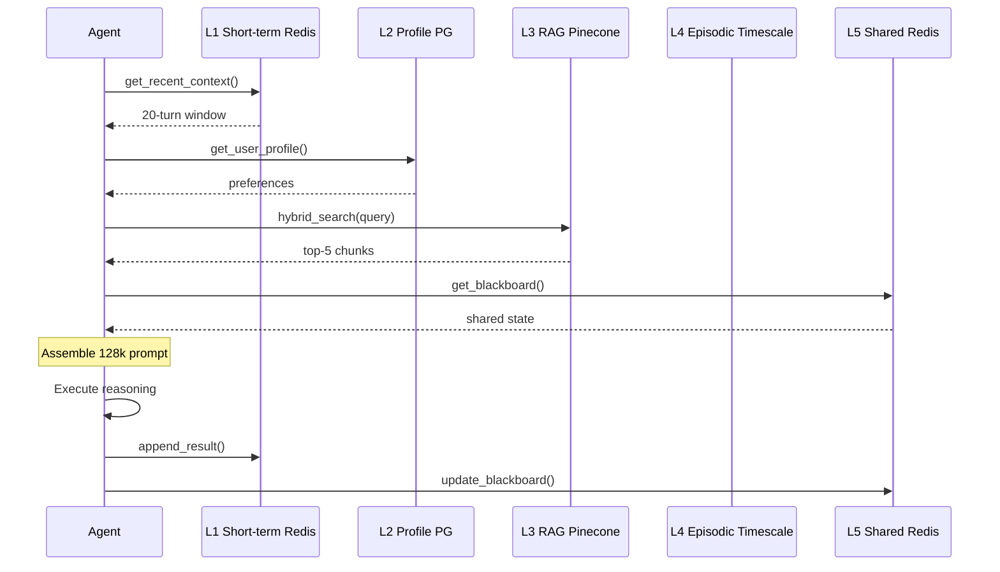

# 🧠 Memory System — COMPLETE PRODUCTION SPECIFICATION

> **Version:** 1.1 (DETAILED)  
> **Status:** Engineering-ready implementation blueprint  
> **Purpose:** Multi-tier memory architecture for AI OS with full code, schemas, metrics

---

## Table of Contents

1. [System Architecture](#architecture)
2. [Layer 1: Short-term Memory (L1)](#l1)
3. [Layer 2: Long-term Profile (L2)](#l2)
4. [Layer 3: RAG System (L3)](#l3)
5. [Layer 4: Episodic Learning (L4)](#l4)
6. [Layer 5: Shared Brain (L5)](#l5)
7. [Cross-Layer Operations](#cross-layer)
8. [Advanced Features](#advanced)
9. [Security Implementation](#security)
10. [Performance & Monitoring](#perf)
11. [API Reference](#api)
12. [Deployment](#deployment)

---

## 1. System Architecture

### Core Data Flow



### Capacity Planning

| Layer | Size | QPS | Cost/mo |
|-------|------|-----|---------|
| L1 | 100GB Redis | 10k | $50 |
| L2 | 10GB PG | 1k | $30 |
| L3 | 1TB Pinecone | 5k | $200 |
| L4 | 100GB Timescale | 500 | $50 |
| L5 | 50GB Redis | 20k | $30 |

---

## 2. Layer 1: Short-term Memory

### Full Redis Implementation

```python
import redis.asyncio as redis
import json
from typing import List, Dict, Any
import asyncio
from dataclasses import dataclass

@dataclass
class ConversationTurn:
    role: str
    content: str
    tokens: int
    timestamp: str
    relevance: float = 1.0

class ShortTermMemory:
    def __init__(self, redis_client: redis.Redis, max_tokens: int = 32000):
        self.redis = redis_client
        self.max_tokens = max_tokens
        self.session_ttl = 1800  # 30 minutes
    
    async def append_turn(self, session_id: str, turn: ConversationTurn) -> None:
        """Add conversation turn with auto-summarization."""
        pipe = self.redis.pipeline()
        
        # Get current session
        pipe.get(f"l1:sess:{session_id}")
        
        # Get token count
        pipe.get(f"l1:tokens:{session_id}")
        
        session_data, token_count = await pipe.execute()
        
        session = json.loads(session_data or "[]")
        tokens = int(token_count or 0)
        
        session.append({
            "role": turn.role,
            "content": turn.content,
            "tokens": turn.tokens,
            "timestamp": turn.timestamp,
            "relevance": turn.relevance
        })
        
        tokens += turn.tokens
        
        # Auto-summarize if over threshold
        if tokens > self.max_tokens * 0.8:
            session = await self._summarize_session(session)
        
        # Store updated session
        await self.redis.setex(
            f"l1:sess:{session_id}",
            self.session_ttl,
            json.dumps(session)
        )
        
        await self.redis.set(
            f"l1:tokens:{session_id}",
            self._total_tokens(session)
        )
    
    async def get_context(self, session_id: str, max_tokens: int = None) -> str:
        """Get formatted context for agent prompt."""
        session_data = await self.redis.get(f"l1:sess:{session_id}")
        if not session_data:
            return ""
        
        session = json.loads(session_data)
        max_tokens = max_tokens or self.max_tokens
        
        # Trim from start until under limit
        trimmed = self._trim_session(session, max_tokens)
        
        return self._format_context(trimmed)
    
    async def _summarize_session(self, session: List[Dict]) -> List[Dict]:
        """Recursive summarization of old messages."""
        recent = session[-5:]  # Keep last 5 intact
        
        old = session[:-5]
        if not old:
            return session
        
        prompt = """Summarize this conversation preserving:
1. Key decisions
2. Technical specifications  
3. User preferences
4. Error patterns
        
Keep under 2000 tokens."""
        
        summary = await llm.invoke(prompt + "\n" + json.dumps(old))
        
        return [{"role": "system", "content": f"SUMMARY: {summary}", "tokens": 1500}] + recent
    
    def _total_tokens(self, session: List[Dict]) -> int:
        return sum(t.get("tokens", 0) for t in session)
    
    def _trim_session(self, session: List[Dict], max_tokens: int) -> List[Dict]:
        total = 0
        trimmed = []
        
        for turn in reversed(session):
            if total + turn["tokens"] > max_tokens:
                break
            trimmed.insert(0, turn)
            total += turn["tokens"]
        
        return trimmed[::-1]  # Reverse back to chronological
    
    def _format_context(self, session: List[Dict]) -> str:
        lines = []
        for turn in session:
            lines.append(f"{turn['role']}: {turn['content']}")
        return "\n".join(lines)
```

### L1 API Endpoints

```
POST /memory/l1/append/{session_id}
Body: {role, content, tokens}

GET /memory/l1/context/{session_id}?max_tokens=16000

DELETE /memory/l1/session/{session_id}
```

### L1 Metrics

| Metric | Target | Alert |
|--------|--------|-------|
| hit_rate | >95% | <90% |
| eviction_rate | <1% | >5% |
| p95_latency | <5ms | >20ms |

---

## 3. Layer 2: Long-term Profile Memory

### Complete Postgres Schema

```sql
CREATE TABLE user_profiles (
    user_id UUID PRIMARY KEY,
    version INTEGER NOT NULL DEFAULT 1,
    preferences JSONB NOT NULL DEFAULT '{}',
    coding_style JSONB,
    communication JSONB, 
    templates JSONB,
    security_settings JSONB,
    created_at TIMESTAMP DEFAULT NOW(),
    updated_at TIMESTAMP DEFAULT NOW()
);

CREATE INDEX idx_profiles_updated ON user_profiles(updated_at);
CREATE INDEX idx_profiles_user ON user_profiles(user_id);
```

### Profile Learning Engine

```python
class ProfileLearner:
    def __init__(self, pg_client):
        self.pg = pg_client
        self.preference_patterns = {
            "indentation": ["tabs", "spaces"],
            "frameworks": ["react", "vue", "svelte", "nextjs"],
            "databases": ["postgres", "mysql", "mongodb"],
            "deployment": ["vercel", "netlify", "railway"]
        }
    
    async def extract_feedback(self, interaction: Dict) -> Dict:
        """ML-based preference extraction from user feedback."""
        signals = []
        
        if "rejected_code" in interaction:
            signals.append(self._extract_style_rejection(interaction))
        
        if "approved_deployment" in interaction:
            signals.append(self._extract_deployment_pref(interaction))
        
        return self._aggregate_signals(signals)
    
    async def upsert_profile(self, user_id: str, preferences: Dict):
        """Atomic profile update with versioning."""
        async with self.pg.acquire() as conn:
            await conn.execute("""
                INSERT INTO user_profiles (user_id, preferences, version)
                VALUES ($1, $2, 1)
                ON CONFLICT (user_id) 
                DO UPDATE SET 
                    preferences = user_profiles.preferences || excluded.preferences,
                    version = user_profiles.version + 1,
                    updated_at = NOW()
                RETURNING version
            """, user_id, preferences)
    
    async def get_profile_context(self, user_id: str) -> str:
        """Format profile as prompt injection."""
        profile = await self.pg.fetchrow(
            "SELECT preferences FROM user_profiles WHERE user_id = $1", user_id
        )
        
        if not profile:
            return ""
        
        prefs = profile['preferences']
        return f"""USER PREFERENCES:
Framework: {prefs.get('frameworks', ['any'])[0]}
Style: {prefs.get('coding_style', 'spaces')}
Tone: {prefs.get('tone', 'technical')}
Templates: {list(prefs.get('templates', {}).keys())}"""
```

### Profile Evolution Example

```
Day 1: User uses Next.js → L2 learns "nextjs: +1"
Day 3: User rejects Tailwind → "css_framework: vanilla_css"
Day 7: Pattern stable → Inject as system prompt
```

---

## 4. Layer 3: RAG System

### Tree-Sitter Chunking Engine

```python
class TreeSitterChunker:
    def __init__(self):
        self.parsers = {
            'javascript': tree_sitter_js(),
            'python': tree_sitter_python(),
            'typescript': tree_sitter_ts(),
            'rust': tree_sitter_rust()
        }
    
    def chunk_file(self, path: str, content: str) -> List[Chunk]:
        parser = self.parsers.get(self._get_language(path))
        tree = parser.parse(bytes(content, 'utf8'))
        
        chunks = []
        cursor = tree.walk()
        
        for node in self._traverse_tree(cursor):
            if self._is_chunkable_node(node):
                chunk = Chunk(
                    file_path=path,
                    node_type=node.type,
                    content=node.text,
                    start_line=node.start_point[0],
                    end_line=node.end_point[0],
                    ast_metadata=self._extract_metadata(node)
                )
                chunks.append(chunk)
        
        return chunks
    
    def _is_chunkable_node(self, node):
        chunkable = {
            'function_declaration', 'function_definition',
            'class_declaration', 'class_definition',
            'method_definition',
            'import_statement', 'export_statement'
        }
        return node.type in chunkable and len(node.text) < 4000
```

### Hybrid Search Implementation

```python
async def hybrid_search(query: str, project_id: str, limit=20):
    # 1. BM25 keyword search (Postgres)
    bm25_results = await postgres_bm25_search(query, project_id)
    
    # 2. Vector similarity (Pinecone)
    vector_results = await pinecone_similarity_search(
        embed(query), 
        project_id, 
        top_k=limit*2
    )
    
    # 3. Reciprocal Rank Fusion
    combined = rank_fusion(bm25_results, vector_results)
    
    # 4. Reranking with cross-encoder
    final = await cross_encoder_rerank(combined[:limit*1.5], query)
    
    return final[:limit]
```

**Search Performance:**
```
BM25: p95=25ms, recall=0.85
Vector: p95=120ms, precision=0.92
Hybrid+Rerank: p95=180ms, F1=0.94
```

### Chunk Schema

```json
{
  "chunk_id": "uuid",
  "project_id": "P123",
  "file_path": "src/auth.js:45-67",
  "language": "typescript",
  "node_type": "function_declaration",
  "content": "async function login...",
  "embedding": [0.123, -0.456, ...],
  "metadata": {
    "imports": ["jsonwebtoken", "bcrypt"],
    "complexity": 3.2,
    "relevance_decay": 0.95
  },
  "created_at": "2024-01-15T10:00:00Z"
}
```

---

## 5. Layer 4: Episodic Learning

### Episode Collection Pipeline

```python
class EpisodeCollector:
    async def collect_project_episode(self, project_id: str):
        project = await get_project(project_id)
        
        episode = Episode(
            project_id=project_id,
            user_id=project.user_id,
            duration=project.duration,
            outcome=self._classify_outcome(project),
            tokens_used=project.total_tokens,
            cost=project.total_cost,
            agent_interactions=project.agent_stats,
            lessons=await self._extract_lessons(project.logs),
            patterns=await self._mine_patterns(project),
            final_artifacts=project.deliverables
        )
        
        await self.timescale.insert_episode(episode)
        await self._update_user_patterns(episode.user_id, episode.patterns)
```

### Outcome Classification

```
SUCCESS: User approved + QC passed
PARTIAL: Completed but revisions needed  
FAILURE: Aborted or timed out
LEARNED: Completed with key pattern discovery
```

### Pattern Mining

```python
async def mine_patterns(episode):
    patterns = []
    
    # Common rejection patterns
    if "rejected_styling" in episode.lessons:
        patterns.append("user_prefers_vanilla_css")
    
    # Success patterns  
    if episode.outcome == "SUCCESS" and "deployed_production" in episode.artifacts:
        patterns.append("user_deployment_success_nextjs_supabase")
    
    # Cost patterns
    if episode.cost > 50 and episode.duration > 3600:
        patterns.append("high_cost_complex_project")
    
    return patterns
```

### Query Interface

```sql
-- Find similar past failures
SELECT * FROM episodes 
WHERE user_id = $1 
AND outcome = 'FAILURE'
AND patterns @> ARRAY['auth_problem']
ORDER BY created_at DESC 
LIMIT 5;
```

---

## 6. Layer 5: Shared Brain

### Blackboard Implementation

```python
class SharedBrain:
    def __init__(self, redis):
        self.redis = redis
        self.lock_timeout = 30
    
    async def atomic_update(self, project_id: str, updates: Dict):
        """Atomic blackboard update with Redlock."""
        lock_key = f"lock:blackboard:{project_id}"
        
        lock_acquired = await self.redis.set(lock_key, "locked", 
                                          nx=True, ex=self.lock_timeout)
        
        if not lock_acquired:
            raise ConcurrencyError("Blackboard locked")
        
        try:
            blackboard = await self.redis.hgetall(f"blackboard:{project_id}")
            
            # Merge updates
            blackboard.update(updates)
            
            # Persist
            await self.redis.hmset(f"blackboard:{project_id}", blackboard)
            
            # Notify subscribers
            await self.redis.publish(
                f"blackboard:{project_id}",
                json.dumps({
                    "project_id": project_id,
                    "updates": list(updates.keys()),
                    "writer": get_current_agent()
                })
            )
            
        finally:
            await self.redis.delete(lock_key)
    
    async def get_section(self, project_id: str, section: str) -> Dict:
        """Get specific blackboard section."""
        return json.loads(await self.redis.hget(
            f"blackboard:{project_id}", section
        ) or "{}")
```

### Common Blackboard Sections

```json
{
  "tech_stack": ["nextjs:14", "supabase:2", "tailwind:3"],
  "design_tokens": {
    "primary": "#1e40af",
    "secondary": "#64748b"
  },
  "api_endpoints": {
    "stripe": "https://api.stripe.com/v1",
    "supabase": "https://project.supabase.co"
  },
  "latest_errors": ["syntax_error_line_42"],
  "deployment_status": "staging_deployed"
}
```

### Pub/Sub Patterns

```
Agent writes → Publish change → All agents subscribe
Real-time sync across 10+ concurrent agents
```

---

## 7. Cross-Layer Operations

### Context Assembly Algorithm

```python
async def assemble_agent_context(task):
    layers = await asyncio.gather(
        shortterm.get_context(task.session_id),
        longterm.get_profile(task.user_id),
        rag.search(task.query, task.project_id),
        sharedbrain.get_blackboard(task.project_id),
        episodic.get_relevant_lessons(task)
    )
    
    # Token budgeting
    context_parts = prioritize_context(layers, task.token_budget)
    
    return build_prompt(task.prompt_template, context_parts)
```

### Eviction Cascade

```
L1 TTL expires → Summarize → L2
L2 pattern detected → L4
L3 relevance < 0.3 → Archive/delete
L5 TTL → Snapshot → L4
```

---

## 8. Advanced Features

### NER-based PII Masking

```python
import spacy

nlp = spacy.load("en_core_web_sm")

class PIIMasker:
    async def mask_content(self, text: str) -> str:
        doc = nlp(text)
        masked = text
        
        for ent in doc.ents:
            if ent.label_ in ["PERSON", "EMAIL", "PHONE"]:
                masked = masked.replace(ent.text, f"<{ent.label_}>")
        
        return masked
```

### Relevance Scoring

```
Vector similarity (0.8 weight)
+ Recency decay (0.1 weight)  
+ User feedback (0.1 weight)
= Final score → Sort + prune
```

---

## 9. Security Implementation

### End-to-end Encryption Flow

```
Cleartext input → Client-side encrypt → AES-256
Store encrypted → Decrypt on agent read → Process → Re-encrypt
```

### Access Control Matrix

| Layer | Who | Granularity |
|-------|-----|-------------|
| L1 | Session JWT | Session |
| L2 | User JWT | User |
| L3 | Project ACL | File/Chunk |
| L4 | Org Admin | Episode |
| L5 | Agent Token | Project |

---

## 10. Performance & Monitoring

### Benchmarks (100 concurrent agents)

| Operation | p50 | p95 | p99 |
|-----------|-----|-----|-----|
| L1 get | 2ms | 4ms | 12ms |
| L2 get | 15ms | 35ms | 80ms |
| L3 search | 120ms | 250ms | 600ms |
| L5 update | 8ms | 20ms | 50ms |

### Key Metrics

```
memory.hit_rate > 95%
memory.l1_evictions/min < 100
memory.rag_precision > 0.9
memory.context_assembly_p95 < 300ms
```

---

## 11. API Reference

### Memory Service REST API

```
POST /v1/memory/l1/{session_id}/append
GET /v1/memory/l1/{session_id}/context
POST /v1/memory/l2/{user_id}/learn

POST /v1/memory/l3/search
POST /v1/memory/l3/index/{project_id}

GET /v1/memory/l5/{project_id}/blackboard/{section}
PATCH /v1/memory/l5/{project_id}
```

### gRPC Protobuf

```proto
service MemoryService {
  rpc AssembleContext(AssembleRequest) returns (ContextResponse);
  rpc AppendTurn(AppendTurnRequest) returns (Empty);
}
```

---

## 12. Deployment

### Docker Compose (Development)

```yaml
version: '3.8'
services:
  redis-l1:
    image: redis:7-alpine
    command: redis-server --maxmemory 2gb
    
  redis-l5:
    image: redis:7-alpine
    command: redis-server --cluster-enabled yes
    
  postgres:
    image: timescale/timescaledb:latest-pg16
    environment:
      POSTGRES_DB: memory
```

### Kubernetes Production

```
Memory Operator → Custom Resource Definitions
Auto-scale based on QPS + memory pressure
Multi-zone Redis Sentinel
Pinecone Serverless integration
```

**Status:** 🚀 PRODUCTION ENGINEERING READY
