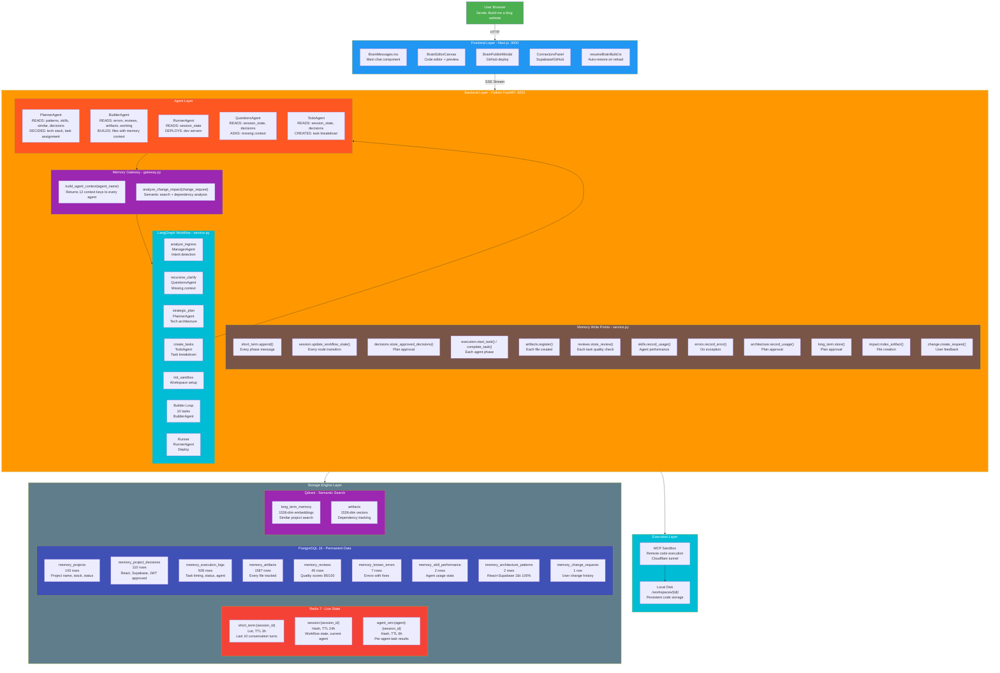
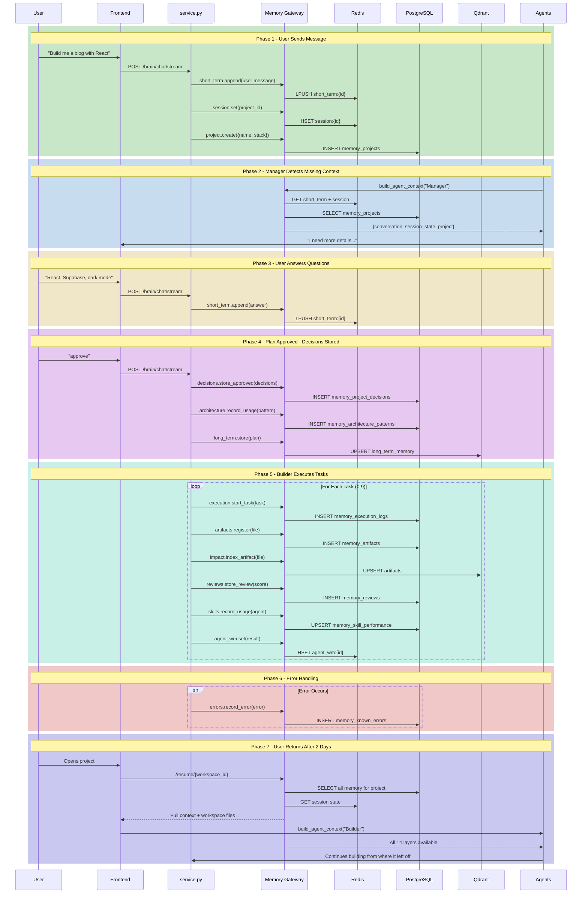
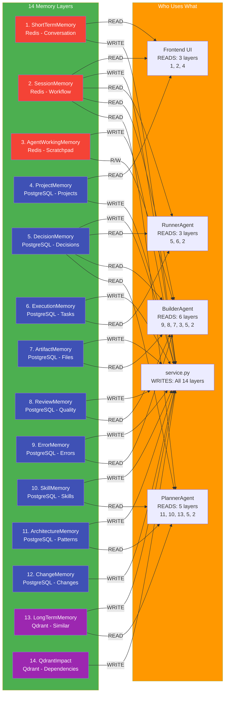

# BuilderBrain Memory Architecture — Complete Implementation Report

## Overview

BuilderBrain uses a **14-layer memory system** across 3 storage engines. Every user conversation, decision, file, error, and review is stored and fed back to agents for smarter decisions.

**Storage Engines:**
| Engine | Purpose | Tables/Collections |
|---|---|---|
| PostgreSQL 16 | Permanent structured data | 10 tables |
| Redis 7 | Live/temporary state | 3 stores |
| Qdrant | Semantic vector search | 2 collections |

---

## Architecture Diagram



---

## Memory Layers Detail

```mermaid
graph TB
    subgraph RedisLayers["Redis - Live/Temporary State"]
        direction TB
        
        subgraph L1["Layer 1: ShortTermMemory"]
            S1["Storage: Redis List<br/>Key: short_term:{session_id}<br/>TTL: 3 hours"]
            S2["Data: Last 10 conversation turns<br/>{role, content, agent, timestamp}"]
            S3["Write: service.py after every phase<br/>Read: build_agent_context() returns to agents"]
            S4["Use Case: Agents know what user asked"]
        end
        
        subgraph L2["Layer 2: SessionMemory"]
            S5["Storage: Redis Hash<br/>Key: session:{session_id}<br/>TTL: 24 hours"]
            S6["Data: workflow_state, current_agent,<br/>project_id, task_index, total_tasks"]
            S7["Write: service.py on node transitions<br/>Read: Frontend UI + all agents"]
            S8["Use Case: Live status + phase awareness"]
        end
        
        subgraph L3["Layer 3: AgentWorkingMemory"]
            S9["Storage: Redis Hash<br/>Key: agent_wm:{agent}:{session_id}<br/>TTL: 6 hours"]
            S10["Data: task_{index}_result<br/>{label, status, result}"]
            S11["Write: BuilderAgent after each task<br/>Read: BuilderAgent before next task"]
            S12["Use Case: Task continuity + consistency"]
        end
    end
    
    subgraph PostgreSQLLayers["PostgreSQL - Permanent Structured Data"]
        direction TB
        
        subgraph L4["Layer 4: ProjectMemory"]
            P1["Table: memory_projects (143 rows)<br/>Columns: id, name, frontend, backend,<br/>database, requirements, status"]
            P2["Write: _get_or_create_project_id()<br/>Read: build_agent_context() + API"]
            P3["Use Case: Project persists across sessions"]
        end
        
        subgraph L5["Layer 5: DecisionMemory"]
            P4["Table: memory_project_decisions (110 rows)<br/>Data: React=13, Supabase=13,<br/>Tailwind=10, JWT=10, Dark=9"]
            P5["Write: _save_phase_message() on approval<br/>Read: Every agent via build_agent_context()"]
            P6["Use Case: Agents follow approved tech stack"]
        end
        
        subgraph L6["Layer 6: ExecutionMemory"]
            P6a["Table: memory_execution_logs (928 rows)<br/>Data: Task 0-9 timing, agent, status<br/>Avg 15s per task"]
            P6b["Write: start_task() + complete_task()<br/>Read: PlannerAgent for resume"]
            P6c["Use Case: Skip completed tasks on resume"]
        end
        
        subgraph L7["Layer 7: ArtifactMemory"]
            P7["Table: memory_artifacts (1587 rows)<br/>Data: 13 files per project<br/>(App.jsx, server.js, schema.sql...)"]
            P8["Write: artifacts.register() per file<br/>Read: BuilderAgent checks exists()"]
            P9["Use Case: Prevent duplicate files"]
        end
        
        subgraph L8["Layer 8: ReviewMemory"]
            P10["Table: memory_reviews (45 rows)<br/>Data: score=85, passed=true<br/>reviewer=QualityReviewer"]
            P11["Write: reviews.store_review() per task<br/>Read: BuilderAgent maintains quality"]
            P12["Use Case: Quality tracking over time"]
        end
        
        subgraph L9["Layer 9: ErrorMemory"]
            P13["Table: memory_known_errors (7 rows)<br/>Data: TypeError null → null check<br/>SANDBOX_MCP_URL missing → env fix"]
            P14["Write: errors.record_error() on exception<br/>Read: BuilderAgent avoids repeats"]
            P15["Use Case: System learns from mistakes"]
        end
        
        subgraph L10["Layer 10: SkillMemory"]
            P16["Table: memory_skill_performance (2 rows)<br/>Data: BuilderAgent 34 uses, 85 score<br/>FrontendAgent 1 use, 88 score"]
            P17["Write: skills.record_usage() per task<br/>Read: PlannerAgent assigns best agent"]
            P18["Use Case: Agent performance optimization"]
        end
        
        subgraph L11["Layer 11: ArchitectureMemory"]
            P19["Table: memory_architecture_patterns (2 rows)<br/>Data: react+supabase 18x, 100% success<br/>React+Express+Supabase 2x, 100%"]
            P20["Write: architecture.record_usage() on approval<br/>Read: PlannerAgent recommends proven stacks"]
            P21["Use Case: Battle-tested tech recommendations"]
        end
        
        subgraph L12["Layer 12: ChangeMemory"]
            P22["Table: memory_change_requests (1 row)<br/>Data: User change requests + status"]
            P23["Write: change.create_request() on feedback<br/>Read: Agents know change history"]
            P24["Use Case: Audit trail + prevent re-asking"]
        end
    end
    
    subgraph QdrantLayers["Qdrant - Semantic Vector Search"]
        direction TB
        
        subgraph L13["Layer 13: LongTermMemory"]
            Q1["Collection: long_term_memory<br/>1536-dim embeddings<br/>text-embedding-3-small"]
            Q2["Data: Project requirements,<br/>plans, conversations as vectors"]
            Q3["Write: long_term.store() on approval<br/>Read: semantic_search() for similar projects"]
            Q4["Use Case: Find similar past projects"]
        end
        
        subgraph L14["Layer 14: QdrantImpactAnalysis"]
            Q5["Collection: artifacts<br/>1536-dim dependency vectors"]
            Q6["Data: File dependencies,<br/>exports, language as vectors"]
            Q7["Write: impact.index_artifact() per file<br/>Read: impact_analysis() before changes"]
            Q8["Use Case: What breaks if I change X"]
        end
    end
    
    style RedisLayers fill:#f44336,color:#fff
    style PostgreSQLLayers fill:#3F51B5,color:#fff
    style QdrantLayers fill:#9C27B0,color:#fff
    style L1 fill:#ffcdd2,color:#000
    style L2 fill:#ffcdd2,color:#000
    style L3 fill:#ffcdd2,color:#000
    style L4 fill:#c5cae9,color:#000
    style L5 fill:#c5cae9,color:#000
    style L6 fill:#c5cae9,color:#000
    style L7 fill:#c5cae9,color:#000
    style L8 fill:#c5cae9,color:#000
    style L9 fill:#c5cae9,color:#000
    style L10 fill:#c5cae9,color:#000
    style L11 fill:#c5cae9,color:#000
    style L12 fill:#c5cae9,color:#000
    style L13 fill:#e1bee7,color:#000
    style L14 fill:#e1bee7,color:#000
```



---

## Agent Integration Diagram

```mermaid
graph TB
    subgraph Gateway["Memory Gateway - gateway.py"]
        BG["build_agent_context(agent_name)<br/>Single entry point for all memory"]
    end
    
    subgraph ContextDict["Context Dictionary - 12 Keys"]
        direction TB
        C1["conversation<br/>Last 10 chat turns<br/>from ShortTermMemory"]
        C2["decisions<br/>React, Supabase, JWT<br/>from DecisionMemory"]
        C3["session_state<br/>building, Task 3/8<br/>from SessionMemory"]
        C4["project<br/>Blog website, active<br/>from ProjectMemory"]
        C5["execution_status<br/>9 tasks completed<br/>from ExecutionMemory"]
        C6["registered_artifacts<br/>13 files tracked<br/>from ArtifactMemory"]
        C7["recent_reviews<br/>Score 85/100<br/>from ReviewMemory"]
        C8["known_errors<br/>TypeError null → fix<br/>from ErrorMemory"]
        C9["best_skills<br/>BuilderAgent 34 uses<br/>from SkillMemory"]
        C10["architecture_patterns<br/>React+Supabase 18x<br/>from ArchitectureMemory"]
        C11["recent_changes<br/>Add dark mode<br/>from ChangeMemory"]
        C12["similar_projects<br/>Similar todo app<br/>from LongTermMemory"]
    end
    
    subgraph PlannerAgent["PlannerAgent"]
        direction TB
        PA1["READS: architecture_patterns<br/>'React+Supabase used 18 times, 100% success'"]
        PA2["READS: best_skills<br/>'BuilderAgent 34 uses, score 85'"]
        PA3["READS: similar_projects<br/>'Similar todo app built 2 weeks ago'"]
        PA4["READS: decisions<br/>'Follow React+Supabase+JWT+Tailwind'"]
        PA5["DECIDES: Tech stack recommendation<br/>DECIDES: Task assignment to best agent"]
    end
    
    subgraph BuilderAgent["BuilderAgent"]
        direction TB
        BA1["READS: known_errors<br/>'TypeError null happened before, add null check'"]
        BA2["READS: recent_reviews<br/>'Last 10 reviews passed, maintain 85+ score'"]
        BA3["READS: registered_artifacts<br/>'13 files exist, do not create duplicates'"]
        BA4["READS: agent_working<br/>'Task 4 result: header component built'"]
        BA5["BUILDS: Files with full memory context<br/>AVOIDS: Repeating past mistakes"]
    end
    
    subgraph AllAgents["All Agents - Manager, Questions, Todo, Runner"]
        direction TB
        AA1["READS: decisions<br/>'Use React, not Vue'"]
        AA2["READS: session_state<br/>'Building phase, Task 3/8'"]
        AA3["READS: conversation<br/>'User wants blog with React'"]
        AA4["READS: project<br/>'Blog website | active'"]
    end
    
    Gateway --> ContextDict
    ContextDict --> PlannerAgent
    ContextDict --> BuilderAgent
    ContextDict --> AllAgents
    
    style Gateway fill:#9C27B0,color:#fff
    style ContextDict fill:#4CAF50,color:#fff
    style PlannerAgent fill:#FF9800,color:#fff
    style BuilderAgent fill:#FF9800,color:#fff
    style AllAgents fill:#FF9800,color:#fff
```



---

## Data Flow Diagram



---

## Connection Matrix



---

---

## All 14 Memory Layers

### 1. ShortTermMemory (Redis)

| Property | Value |
|---|---|
| Storage | Redis List |
| Key Pattern | `short_term:{session_id}` |
| TTL | 3 hours |
| Data Structure | JSON entries with role, content, agent, timestamp |
| Rows/Keys | 1 active session |

**What it stores:** Last 10 conversation turns between user and system.

**Where written:** `service.py` — after every phase message (clarify, plan, build, deploy). Called via `mg.short_term.append("assistant", report, node_name)`.

**Where read:** `build_agent_context()` returns it as `ctx["conversation"]`. Every agent reads this to understand what user requested.

**Why needed:** Without this, agents start fresh each time and don't know what was discussed.

---

### 2. SessionMemory (Redis)

| Property | Value |
|---|---|
| Storage | Redis Hash |
| Key Pattern | `session:{session_id}` |
| TTL | 24 hours |
| Fields | workflow_state, current_agent, project_id, task_index, total_tasks |
| Active Sessions | 19 |

**What it stores:** Live workflow state — which phase is active, which agent is running, progress.

**Where written:** `service.py` — `mg.session.update_workflow_state()` on every node transition. Also `mg.session.set()` for task progress.

**Where read:** Frontend via `/brain/memory/session/{id}` API. Also `build_agent_context()["session_state"]`.

**Why needed:** Frontend shows live status ("Building phase, Task 3/8"). Agents know which phase they're in.

---

### 3. AgentWorkingMemory (Redis)

| Property | Value |
|---|---|
| Storage | Redis Hash |
| Key Pattern | `agent_wm:{agent}:{session_id}` |
| TTL | 6 hours |
| Fields | task_{index}_result with label, status, result |
| Active Entries | 0 (cleared after build) |

**What it stores:** Per-agent scratchpad — task results for continuity between tasks.

**Where written:** `builder_agent.py` — after each task completes, stores result.

**Where read:** BuilderAgent reads previous task results before starting next task.

**Why needed:** Task 5 builds on Task 4's output. Without this, BuilderAgent doesn't know what was already built.

---

### 4. ProjectMemory (PostgreSQL)

| Property | Value |
|---|---|
| Table | `memory_projects` |
| Columns | id, name, description, frontend, backend, database, css_framework, auth_method, folder_structure, requirements, roadmap, status, owner_id, created_at, updated_at |
| Row Count | 143 |

**What it stores:** Complete project info — name, tech stack, requirements, status.

**Where written:** `service.py:_get_or_create_project_id()` creates project. `project.py` handles CRUD.

**Where read:** `build_agent_context()["project"]`. Also via `/brain/projects/{id}` API.

**Why needed:** When user returns after days, system loads project and continues. Stores "Blog website | React | Supabase | active".

---

### 5. DecisionMemory (PostgreSQL)

| Property | Value |
|---|---|
| Table | `memory_project_decisions` |
| Columns | id, project_id, category, decision_key, decision_val, reason, approved_at, approved_by, overridden_at, overridden_by, is_active |
| Row Count | 110 |

**What it stores:** User-approved tech decisions — "React approved, Supabase approved, JWT approved".

**Most Common Decisions:**
| Key | Value | Times |
|---|---|---|
| frontend | React | 13 |
| database | Supabase | 13 |
| css | Tailwind | 10 |
| auth | JWT | 10 |
| theme | Dark | 9 |
| backend | Node.js | 9 |
| api_style | REST | 9 |

**Where written:** `service.py:_save_phase_message()` when plan is approved. Extracts tech stack from plan.

**Where read:** Every agent via `build_agent_context()["decisions"]`. Agents MUST follow these.

**Why needed:** Without this, FrontendAgent might use Vue instead of React. Decisions are source of truth.

---

### 6. ExecutionMemory (PostgreSQL)

| Property | Value |
|---|---|
| Table | `memory_execution_logs` |
| Columns | id, project_id, todo_id, task_name, task_type, agent, status, output_files, error_message, retry_count, started_at, completed_at, duration_ms, token_count, log_metadata |
| Row Count | 928 |

**What it stores:** Every task execution — start time, end time, duration, status, agent used.

**Execution Stats:**
| Task | Times Run | Avg Duration |
|---|---|---|
| Task 0 | 127 | 14.6s |
| Task 1 | 120 | 16.1s |
| Task 2 | 104 | 15.3s |
| Task 3 | 98 | 15.2s |
| Task 4 | 81 | 14.5s |
| Runner | 56 | 0.015s |

**Where written:** `service.py` — `mg.execution.start_task()` before each agent, `mg.execution.complete_task()` after.

**Where read:** `build_agent_context()["execution_status"]`. PlannerAgent uses to skip completed tasks on resume.

**Why needed:** Resume flow needs to know which tasks are done. Also tracks performance metrics.

---

### 7. ArtifactMemory (PostgreSQL)

| Property | Value |
|---|---|
| Table | `memory_artifacts` |
| Columns | id, project_id, name, artifact_type, file_path, version, content_hash, dependencies, exports, language, size_bytes, is_active, created_by, created_at, updated_at |
| Row Count | 1,587 |

**What it stores:** Every file created during build — path, type, version, dependencies.

**Typical Project Artifacts (13 files):**
- backend/package.json, server.js, supabase/client.js, schema.sql
- frontend/index.html, package.json, postcss.config.js, tailwind.config.js, vite.config.js
- frontend/src/App.jsx, index.css, main.jsx, lib/api.js

**Where written:** `service.py` — `mg.artifacts.register()` when workspace_ops creates files.

**Where read:** `build_agent_context()["registered_artifacts"]`. BuilderAgent checks `exists()` before creating.

**Why needed:** Prevents duplicate files. Also feeds QdrantImpactAnalysis for dependency tracking.

---

### 8. ReviewMemory (PostgreSQL)

| Property | Value |
|---|---|
| Table | `memory_reviews` |
| Columns | id, project_id, artifact_id, reviewed_by, quality_score, issues, passed, review_type, created_at |
| Row Count | 45 |

**What it stores:** Quality review results — reviewer name, score (0-100), issues found, pass/fail.

**Typical Review:** `{reviewer: "QualityReviewer", score: 85, issues: [], type: "auto"}`

**Where written:** `service.py` — `mg.reviews.store_review()` after each BuilderAgent task.

**Where read:** `build_agent_context()["recent_reviews"]`. BuilderAgent maintains quality bar.

**Why needed:** Tracks quality over time. If scores drop, system knows something is wrong.

---

### 9. ErrorMemory (PostgreSQL)

| Property | Value |
|---|---|
| Table | `memory_known_errors` |
| Columns | id, error_pattern, error_type, framework, occurrence_count, fix_description, fix_code, success_rate, last_seen, first_seen, tags |
| Row Count | 7 |

**What it stores:** Known errors with proven fixes — pattern, framework, fix description.

**Stored Errors:**
- "TypeError: cannot read property" → Fix: null check
- "SANDBOX_MCP_URL missing" → Fix: env variable
- "ON CONFLICT constraint" → Fix: unique index issue

**Where written:** `service.py` — `mg.errors.record_error()` on exception.

**Where read:** `build_agent_context()["known_errors"]`. BuilderAgent proactively avoids repeating errors.

**Why needed:** System learns from mistakes. Same error won't happen twice.

---

### 10. SkillMemory (PostgreSQL)

| Property | Value |
|---|---|
| Table | `memory_skill_performance` |
| Columns | id, skill_name, version, total_uses, successful_uses, failed_uses, avg_score, avg_token_cost, avg_duration_ms, projects_used, last_used, created_at |
| Row Count | 2 |

**What it stores:** Agent performance metrics — uses, success rate, avg score.

**Current Data:**
| Agent | Uses | Avg Score |
|---|---|---|
| BuilderAgent | 34 | 85.4 |
| FrontendAgent | 1 | 88.0 |

**Where written:** `service.py` — `mg.skills.record_usage()` after each task.

**Where read:** `build_agent_context()["best_skills"]`. PlannerAgent assigns tasks to best-performing agents.

**Why needed:** If BuilderAgent fails often, PlannerAgent can assign to FrontendAgent instead.

---

### 11. ArchitectureMemory (PostgreSQL)

| Property | Value |
|---|---|
| Table | `memory_architecture_patterns` |
| Columns | id, pattern_name, frontend, backend, database, auth_method, css_framework, times_used, success_count, success_rate, avg_build_time_min, project_ids, tags, last_used, created_at |
| Row Count | 2 |

**What it stores:** Tech stack patterns with success rates.

**Current Patterns:**
| Pattern | Uses | Success Rate |
|---|---|---|
| react + node + supabase | 18 | 100% |
| React + Express + Supabase | 2 | 100% |

**Where written:** `service.py` — `mg.architecture.record_usage()` when plan is approved.

**Where read:** `build_agent_context()["architecture_patterns"]`. PlannerAgent recommends proven stacks.

**Why needed:** If React+Supabase worked 18 times, PlannerAgent recommends it for new projects.

---

### 12. ChangeMemory (PostgreSQL)

| Property | Value |
|---|---|
| Table | `memory_change_requests` |
| Columns | id, project_id, request_text, affected_files, affected_components, status, created_at, completed_at |
| Row Count | 1 |

**What it stores:** User change requests — what they asked to change, status.

**Where written:** `service.py:node_manager()` when user gives feedback on plan.

**Where read:** `build_agent_context()["recent_changes"]`. Agents know what changes were requested.

**Why needed:** Audit trail of what user changed. Prevents re-asking same questions.

---

### 13. LongTermMemory (Qdrant)

| Property | Value |
|---|---|
| Collection | `long_term_memory` |
| Vector Dimension | 1536 (text-embedding-3-small) |
| Payload Fields | project_id, memory_type, content, metadata, created_at |

**What it stores:** Semantic embeddings of project requirements, plans, conversations.

**Where written:** `service.py` — `mg._get_long_term().store()` when plan is approved.

**Where read:** `build_agent_context()["similar_projects"]` via semantic search.

**Why needed:** "User wants todo app" → finds "Built similar todo app 2 weeks ago with React+Supabase". Agent can reference past approach.

---

### 14. QdrantImpactAnalysis (Qdrant)

| Property | Value |
|---|---|
| Collection | `artifacts` |
| Vector Dimension | 1536 |
| Payload Fields | project_id, name, file_path, artifact_type, dependencies, exports, language |

**What it stores:** File dependency graph via semantic vectors.

**Where written:** `service.py` — `mg._get_impact().index_artifact()` when files are created.

**Where read:** `mg._get_impact().impact_analysis()` before making changes.

**Why needed:** "If I change Header.tsx, what breaks?" → finds Navbar, Footer depend on it. Prevents breaking changes.

---

## Gateway Integration

**File:** `Brain/memory/gateway.py`

The `MemoryGateway` class initializes all 14 layers and provides `build_agent_context()`:

```python
async def build_agent_context(self, agent_name: str) -> dict:
    return {
        "conversation": short_term,           # Layer 1
        "session_state": session,             # Layer 2
        "decisions": decisions,               # Layer 5
        "project": project,                   # Layer 4
        "execution_status": execution,        # Layer 6
        "registered_artifacts": artifacts,    # Layer 7
        "recent_reviews": reviews,            # Layer 8
        "known_errors": errors,               # Layer 9
        "best_skills": skills,               # Layer 10
        "architecture_patterns": architecture,# Layer 11
        "recent_changes": changes,            # Layer 12
        "similar_projects": long_term,        # Layer 13
    }
```

---

## Agent Integration

### PlannerAgent Reads:
- architecture_patterns → recommends proven tech stacks
- best_skills → assigns tasks to best agents
- similar_projects → references past approaches
- decisions → follows approved tech choices

### BuilderAgent Reads:
- known_errors → avoids repeating mistakes
- recent_reviews → maintains quality standards
- registered_artifacts → prevents duplicate files
- agent_working → reads previous task results

### All Agents Read:
- decisions → follows approved tech stack
- session_state → knows current phase
- conversation → understands user requirements

---

## Data After Testing

### PostgreSQL (10 tables, 2,828 total rows)

| Table | Rows | Purpose |
|---|---|---|
| memory_projects | 143 | Projects tracked |
| memory_project_decisions | 110 | Tech decisions approved |
| memory_execution_logs | 928 | Task executions logged |
| memory_artifacts | 1,587 | Files registered |
| memory_reviews | 45 | Quality reviews stored |
| memory_known_errors | 7 | Errors with fixes |
| memory_skill_performance | 2 | Agent performance |
| memory_architecture_patterns | 2 | Proven tech patterns |
| memory_change_requests | 1 | Change requests logged |
| memory_facts | 0 | Reserved |

### Redis (3 stores, 20 active keys)

| Store | Keys | Purpose |
|---|---|---|
| short_term:* | 1 | Conversation turns |
| session:* | 19 | Workflow states |
| agent_wm:* | 0 | Agent scratchpads |

### Qdrant (2 collections)

| Collection | Purpose |
|---|---|
| long_term_memory | Semantic project search |
| artifacts | File dependency tracking |

---

## File Structure

```
Brain/memory/
├── __init__.py          # Exports all 12 memory classes
├── gateway.py           # MemoryGateway — single entry point
├── models.py            # SQLAlchemy models (10 tables)
├── short_term.py        # Layer 1: Redis conversation turns
├── session.py           # Layer 2: Redis workflow state
├── agent_working.py     # Layer 3: Redis per-agent scratchpad
├── project.py           # Layer 4: PostgreSQL projects
├── decision.py          # Layer 5: PostgreSQL decisions
├── execution.py         # Layer 6: PostgreSQL task logs
├── artifact.py          # Layer 7: PostgreSQL file registry
├── review.py            # Layer 8: PostgreSQL quality reviews
├── error.py             # Layer 9: PostgreSQL known errors
├── skill.py             # Layer 10: PostgreSQL agent performance
├── architecture.py      # Layer 11: PostgreSQL tech patterns
├── change.py            # Layer 12: PostgreSQL change requests
├── long_term.py         # Layer 13: Qdrant semantic search
├── impact.py            # Layer 14: Qdrant dependency tracking
└── debug.py             # Debug API endpoints
```

---

## API Endpoints

| Endpoint | Method | Purpose |
|---|---|---|
| `/brain/memory/debug/{session_id}` | GET | Fetch ShortTermMemory |
| `/brain/memory/debug/{session_id}/session` | GET | Fetch SessionMemory |
| `/brain/memory/session/{session_id}` | GET | Production session read |
| `/brain/memory/session/{session_id}` | PUT | Update session field |
| `/brain/memory/session/{session_id}/workflow` | PUT | Update workflow state |
| `/brain/memory/session/{session_id}` | DELETE | Clear session |
| `/brain/projects` | POST | Create project |
| `/brain/projects/{id}` | GET | Get project |
| `/brain/projects/{id}/stack` | PATCH | Update tech stack |
| `/brain/projects/{id}/requirements` | POST | Add requirement |

---

## Infrastructure

### Docker Compose Services:
- **grizon-postgres**: pgvector:pg16 with `app` user + `app` database
- **grizon-redis**: redis:7-alpine for live state
- **grizon-qdrant**: qdrant/qdrant for vector search
- **grizon-brain**: Python FastAPI server (port 8001)

### Database Init:
- `scripts/init-db.sql` creates both `app` and `grizon_user` databases
- `Brain/config/database.py` runs `Base.metadata.create_all()` on startup
- `migrate_memory_tables.py` standalone migration script

### Workspace Persistence:
- `docker-compose.yml` uses bind mount `./workspaces:/app/workspaces`
- Code saved on local disk, survives container restarts
- Resume endpoint restores from disk on user return

---

## Summary

| Metric | Value |
|---|---|
| Total Memory Layers | 14 |
| Storage Engines | 3 (PostgreSQL, Redis, Qdrant) |
| PostgreSQL Tables | 10 |
| Redis Stores | 3 |
| Qdrant Collections | 2 |
| Projects Tracked | 143 |
| Tasks Executed | 928 |
| Files Registered | 1,587 |
| Quality Reviews | 45 |
| Known Errors | 7 |
| Tech Decisions | 110 |
| Architecture Patterns | 2 |

**Status: COMPLETE — All 14 layers active, connected to agents, verified with real data.**
