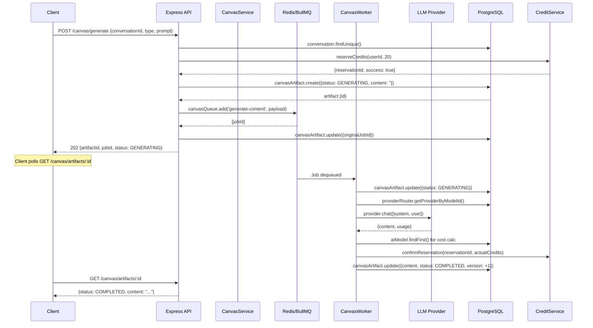
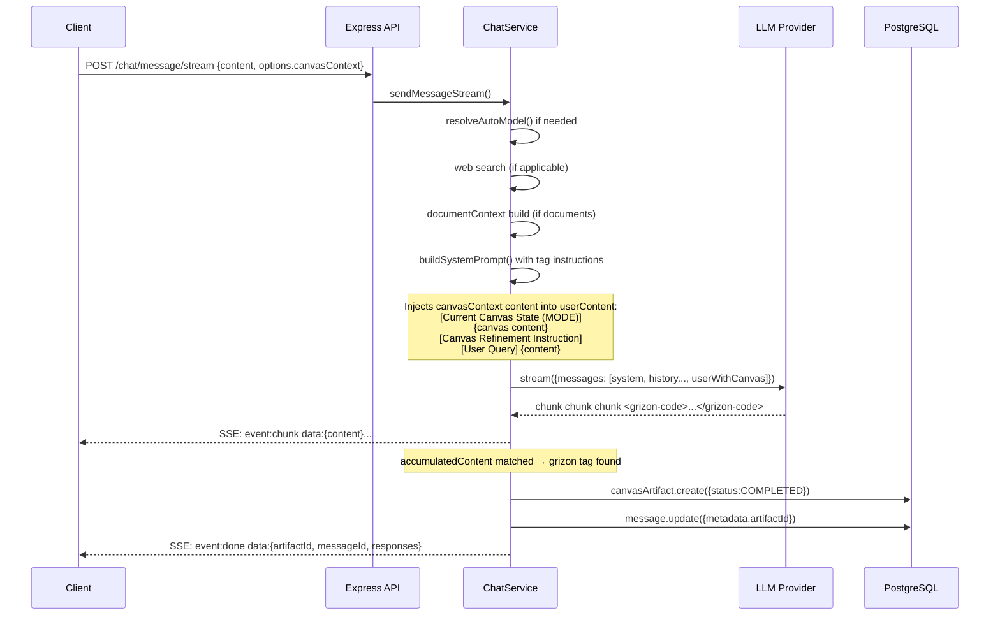
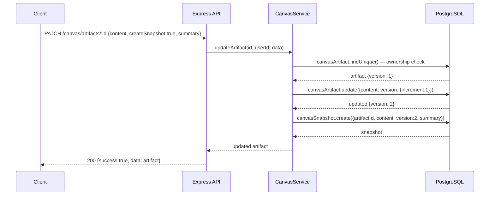
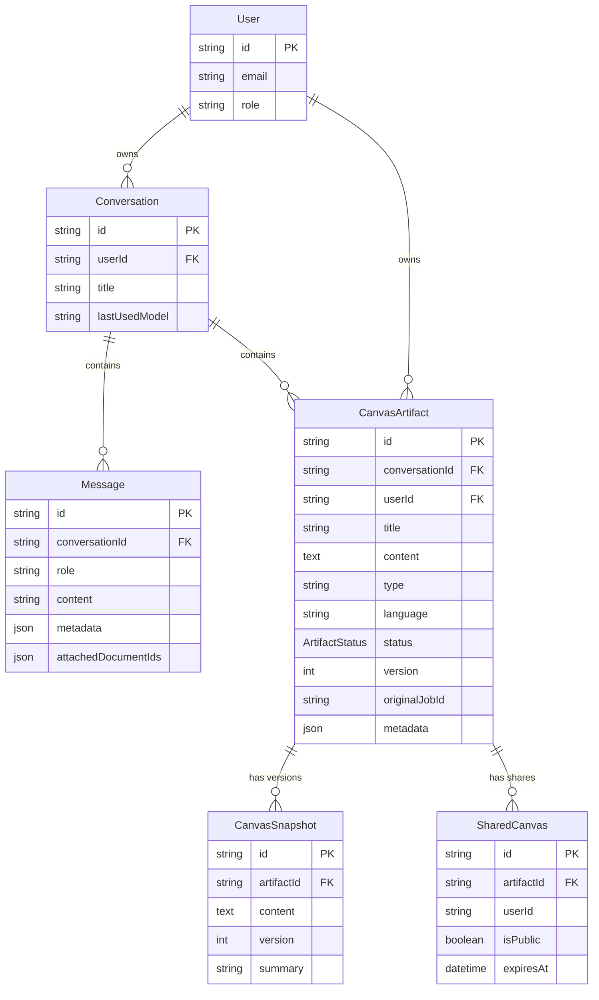
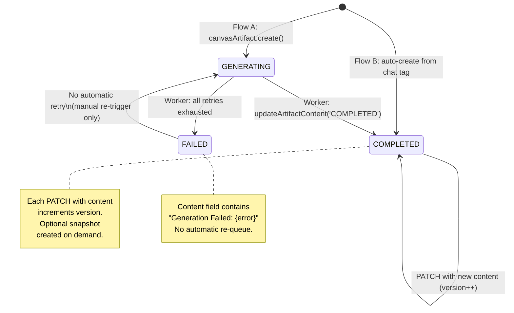

# CANVAS_FLOW_AUDIT.md

> Deep audit of the Canvas / Artifact system in Grizon-AI-Backend.  
> All file paths are relative to `src/`. All line numbers are from the live code at time of writing.

---

## 1. What is a Canvas Artifact?

### Definition and Purpose

A **CanvasArtifact** is a named, versioned, long-form piece of content (code, document, website bundle, multi-file project, or markdown) that is:

- Tied to a `Conversation` and a `User`
- Generated either **asynchronously** via BullMQ (Flow A) or **inline** as a by-product of a chat streaming response (Flow B)
- Versioned with full snapshot history on every edit
- Optionally shared publicly via a `SharedCanvas` record

### All Schema Fields

**`CanvasArtifact`** (`prisma/schema.prisma:672`)

```prisma
model CanvasArtifact {
  id             String          @id @default(cuid())
  conversationId String                              -- FK → Conversation
  userId         String                              -- FK → User
  title          String
  content        String          @db.Text            -- Raw artifact content (code, markdown, JSON, HTML)
  type           String                              -- See types below
  language       String?                             -- For code/render only (e.g. "python", "html")
  status         ArtifactStatus  @default(COMPLETED) -- GENERATING | COMPLETED | FAILED
  version        Int             @default(1)         -- Increments on every content change
  originalJobId  String?                             -- BullMQ Job ID (only for Flow A)
  metadata       Json?                               -- Free-form extras
  createdAt      DateTime        @default(now())
  updatedAt      DateTime        @updatedAt
  snapshots      CanvasSnapshot[]
  shares         SharedCanvas[]
}

enum ArtifactStatus {
  GENERATING   -- Worker is running
  COMPLETED    -- Content available
  FAILED       -- Worker failed all retries
}
```

**`CanvasSnapshot`** (`prisma/schema.prisma:696`)

```prisma
model CanvasSnapshot {
  id         String         @id @default(cuid())
  artifactId String                               -- FK → CanvasArtifact (Cascade delete)
  content    String         @db.Text
  version    Int                                  -- Version number at point of snapshot
  summary    String?                              -- Human or system label (e.g. "Manual edit")
  createdAt  DateTime       @default(now())
}
```

**`SharedCanvas`** (`prisma/schema.prisma:709`)

```prisma
model SharedCanvas {
  id         String         @id @default(cuid())
  artifactId String                               -- FK → CanvasArtifact (Cascade delete)
  userId     String                               -- Owner who created the share
  isPublic   Boolean        @default(true)
  expiresAt  DateTime?                            -- Optional expiry (never set in current code — see §9)
  metadata   Json?
  createdAt  DateTime       @default(now())
}
```

### Artifact Types and Behavior

Defined in `modules/canvas/canvas.types.ts:7` and `modules/canvas/canvas.prompt.ts:45`:

| Type | Description | LLM Output Expected | Stored As |
|---|---|---|---|
| `code` | Single-file source code | Raw source only, no fences | Plain text (source) |
| `document` | Long-form prose/report | Plain Markdown (no JSON wrapper) | Markdown text |
| `report` | Alias of `document` in canvas.prompt.ts; JSON schema in worker | JSON object (see §2 system prompts) | Raw string (no validation) |
| `markdown` | Treated same as `document` | Plain Markdown | Markdown text |
| `render` | HTML/CSS/JS website bundle | 3-file bundle with `<!-- FILE: -->` markers | Multi-file marker format |
| `project` | Multi-file software project | Files with `<!-- FILE: path -->` markers | Multi-file marker format |

> **Note**: `render` and `project` are defined in `canvas.prompt.ts` but are **not handled** in `canvas.worker.ts`. The worker only branches on `code` vs `report/document`. For `render` and `project` types submitted via Flow A, the generic fallback prompt fires. These types are correctly handled only in **Flow B** (chat-triggered via `<grizon-render>` and `<grizon-project>` tags).

### Entity Relationships

```
User ─────────────────┐
                       ├─< CanvasArtifact >─── SharedCanvas
Conversation ─────────┘          │
                                  └─< CanvasSnapshot
```

- `Conversation` → `CanvasArtifact`: one-to-many (cascade delete)
- `User` → `CanvasArtifact`: one-to-many (cascade delete)
- `CanvasArtifact` → `CanvasSnapshot`: one-to-many (cascade delete)
- `CanvasArtifact` → `SharedCanvas`: one-to-many (cascade delete)
- **No direct link** between `CanvasArtifact` and `Message` in the schema — however the streaming worker writes `artifactId` into `Message.metadata` as a JSON field (`chat.service.ts:2358`).

---

## 2. Flow A — Standalone Canvas Generation

### Full Journey

```
Client
  POST /api/v1/canvas/generate
  Body: { conversationId, title, type, language, prompt }
       ↓
[authenticate middleware]
       ↓
CanvasController.generate()          canvas.controller.ts:11
  • Validates required fields: conversationId, prompt, type
  • Builds CreateArtifactRequest
  • Returns 202 Accepted immediately
       ↓
CanvasService.generateArtifact()     canvas.service.ts:18
  1. prisma.conversation.findUnique()       → verify conversation exists
  2. creditService.reserveCredits(userId, 20)  → safe-ceiling reservation
  3. prisma.canvasArtifact.create({
       status: 'GENERATING', content: '', version: 1
     })                                     → DB row created
  4. canvasQueue.add('generate-content', payload, {
       attempts: 3,
       backoff: { type: 'exponential', delay: 2000 }
     })                                     → job enqueued
  5. prisma.canvasArtifact.update({ originalJobId: job.id })
       ↓
BullMQ: canvas-generation queue (Redis)
       ↓
canvasWorker (worker process)        workers/canvas.worker.ts:17
  1. prisma.canvasArtifact.update({ status: 'GENERATING' })
  2. Model selection (see below)
  3. Build system prompt (see below)
  4. provider.chat({ messages: [system, user] })
  5. Calculate actual credit cost via tokenCalculatorService
  6. creditService.confirmReservation(reservationId, actualCredits)
  7. canvasService.updateArtifactContent(artifactId, content, 'COMPLETED')
     → prisma.canvasArtifact.update({ content, status, version: { increment: 1 } })
```

**Immediate Client Response (202)**:
```json
{
  "success": true,
  "message": "Artifact generation started",
  "data": {
    "artifactId": "clxxx...",
    "jobId": "42",
    "status": "GENERATING"
  }
}
```

### How the Client Knows When Generation is Complete

**Polling only.** There is no webhook, WebSocket, or push notification.

The client must poll:
```
GET /api/v1/canvas/artifacts/:artifactId
```
Until `data.status` changes from `GENERATING` to `COMPLETED` or `FAILED`.

No polling interval is specified in the codebase. No SSE event is emitted by the canvas worker.

### Model Selection Logic

`canvas.worker.ts:33`

```typescript
const preferredModel = type === 'code'
  ? 'claude-3-5-sonnet-20240620'
  : 'gemini-2.0-flash';

let provider = await providerRouterService.getProviderByModelId(preferredModel);
let actualModelId = preferredModel;

if (!provider) {
  actualModelId = 'gpt-4o-mini';  // ← hardcoded fallback
  provider = await providerRouterService.getProviderByModelId(actualModelId);
}

if (!provider) {
  throw new Error('Critical: No AI Providers available for background generation.');
}
```

Only two hops: preferred → `gpt-4o-mini` → error. No dynamic fallback chain.

### System Prompts Per Type (Verbatim from `canvas.worker.ts:51`)

**Default (catch-all)**:
```
You are Grizon AI Canvas Specialist. You generate high-quality, professional artifacts.
```

**For `type === 'code'`**:
```
You are an expert {language || 'software'} developer.
Generate clean, efficient, and well-documented code.
IMPORTANT: Return ONLY the raw code content. No markdown code fences,
no preamble, no explanation. Just the source code.
```

**For `type === 'report'` or `type === 'document'`**:
```
You are a professional document specialist.
Generate a comprehensive, high-quality report.
IMPORTANT: Return ONLY a structured JSON object representing the document content.
Do NOT include markdown fences or any explanation.

JSON Schema:
{
  "title": "Title of the document",
  "metadata": {
    "header": "Dynamic Header text",
    "footer": "Dynamic Footer text",
    "author": "Grizon AI"
  },
  "style": {
    "primaryColor": "#2563eb",
    "showPageNumbers": true
  },
  "sections": [
    { "type": "heading", "level": 1, "content": "Section Title" },
    { "type": "paragraph", "content": "Text content content content..." },
    { "type": "list", "items": ["Item 1", "Item 2"] },
    { "type": "table", "headers": ["Col 1", "Col 2"], "rows": [["Cell 1", "Cell 2"]] },
    { "type": "pageBreak" }
  ]
}
```

> **Note**: `canvas.prompt.ts` defines a cleaner `buildCanvasSystemPrompt()` function that handles `render` and `project` types too, but the **worker does not import or call it**. The worker uses its own hardcoded strings. `canvas.prompt.ts` is orphaned code.

### Credit Flow (Flow A)

```
HTTP request
  → creditService.reserveCredits(userId, 20)   ← 20 credits ceiling reserved
  → canvasArtifact created in GENERATING
  → 202 returned to client

Worker (async)
  → LLM call completes
  → tokenCalculatorService.calculateCreditCost(totalTokens, model)
  → creditService.confirmReservation(reservationId, actualCredits)
     If actualCredits < 20: wallet is charged actual, 20-actual returned
     If LLM cost calculation fails: fallback to 5 credits charged
  → artifact updated to COMPLETED

On failure
  → creditService.releaseReservation(reservationId)  ← full 20 returned
  → artifact updated to FAILED
```

---

## 3. Flow B — Chat-Triggered Canvas

### Is This Implemented?

**Yes, fully implemented.** This is the primary production flow. The LLM is instructed (via system prompt) to wrap certain content in `<grizon-*>` tags. The streaming code detects these tags post-response and auto-creates a `CanvasArtifact`.

### Tag Detection in `executeModelCallStream()`

`chat.service.ts:2276`

```typescript
const docMatch     = accumulatedContent.match(
  /<grizon-document(?:\s+title="([^"]+)")?\s*>([\s\S]*?)(?:<\/grizon-document>|$)/
);
const renderMatch  = accumulatedContent.match(
  /<grizon-render(?:\s+title="([^"]+)")?\s*>([\s\S]*?)(?:<\/grizon-render>|$)/
);
const projectMatch = accumulatedContent.match(
  /<grizon-project(?:\s+title="([^"]+)")?\s*>([\s\S]*?)(?:<\/grizon-project>|$)/
);
const codeMatch    = accumulatedContent.match(
  /<grizon-code(?:\s+language="([^"]+)")?(?:\s+title="([^"]+)")?\s*>([\s\S]*?)(?:<\/grizon-code>|$)/
);
const artMatch     = accumulatedContent.match(
  /<grizon-artifact\s+type="([^"]+)"(?:\s+title="([^"]+)"|\s+language="([^"]+)")*\s*>([\s\S]*?)(?:<\/grizon-artifact>|$)/
);
```

If **any** match is found, the code:
1. Picks the match with the **highest** `index` (last occurring wins) — `chat.service.ts:2338`
2. Strips system-prompt-leaked preamble via `cleanArtifactPayload()` (for document types)
3. Creates a `CanvasArtifact` directly via `prisma.canvasArtifact.create()` — `chat.service.ts:2344`
4. Sets `status: 'COMPLETED'` and `version: 1` immediately (no queue)
5. Writes `artifactId` into `Message.metadata` — `chat.service.ts:2359`
6. Emits `artifactId` in the SSE `done` event — `chat.service.ts:2386`

### The `done` Event — `artifactId` Is Populated

`chat.service.ts:2379`

```typescript
yield {
  event: 'done',
  data: {
    usage: finalUsage,
    finishReason,
    creditsCharged,
    messageId: assistantMessage.id,
    artifactId,         // ← defined if tags matched, undefined otherwise
  },
};
```

**`artifactId` is populated when** the LLM response contains a `<grizon-*>` tag.  
**`artifactId` is `undefined` when** the response is plain text with no tags.

### What Triggers the LLM to Emit Tags?

The `buildSystemPrompt()` method injects instructions based on keyword detection in the user's query:

```typescript
// chat.service.ts:2440
if (lowerQuery.includes('website') || lowerQuery.includes('react') || ...) {
  systemPrompt += `\n\n[SYSTEM INSTRUCTION: When creating, fixing, or modifying a website...
  you MUST wrap the primary source code in a \`<grizon-artifact type="project" title="...">\` tag...]`;
}
```

Additional triggers from `shouldForceProjectScaffold()` (`chat.service.ts:2539`) and `shouldForceCanvasRefinement()` (`chat.service.ts:2484`) inject further instructions (see §4).

### Does Chat Ever Call `canvasService` or `canvasQueue`?

**No.** The chat service bypasses both entirely. Artifacts are created by calling `prisma.canvasArtifact.create()` directly inside `executeModelCallStream()`. This means:
- No credit reservation for canvas creation within chat (canvas in chat is charged as part of the normal chat message cost)
- No BullMQ job; generation is synchronous within the stream
- `originalJobId` is always `null` for Flow B artifacts

---

## 4. Canvas in Subsequent Chat Messages (`canvasContext`)

### Type Definition

`modules/chat/chat.types.ts:27`

```typescript
options?: {
  temperature?: number;
  maxTokens?: number;
  isVoiceMode?: boolean;
  agent?: { name: string; role: string; };
  canvasContext?: {
    content: string;   // The full canvas content to inject
    mode: string;      // e.g. 'code', 'document', 'render', 'project', 'split'
  };
};
```

### Exact Injection Code Path

In **both** `executeModelCall()` (non-streaming, `chat.service.ts:1621`) and `executeModelCallStream()` (streaming, `chat.service.ts:1968`), the same injection logic runs:

```typescript
// Step 1: Canvas context injected into contextParts
if (options?.canvasContext?.content) {
  contextParts.push(
    `[Current Canvas State (${options.canvasContext.mode.toUpperCase()})]\n${options.canvasContext.content}`
  );
}

// Step 2: If refinement detected, add a mandatory-tag instruction
if (shouldForceCanvasRefinement) {
  contextParts.push(this.buildCanvasRefinementInstruction(options.canvasContext.mode));
}

// Step 3: All context parts + user query assembled
userContent = `${contextParts.join('\n\n')}\n\n[User Query]\n${content}`;
```

**Order of injection in the final user message**:
1. Document context (from attached documents, if any)
2. Web search results (if web search fired), unless `shouldForceProjectScaffold`
3. `[Current Canvas State (MODE)]` + canvas content
4. Canvas refinement instruction (if triggered)
5. Project scaffold instruction (if triggered)
6. `[User Query]` + original content

This becomes the **last message** in the messages array:
```typescript
const messages = [
  { role: 'system', content: systemPrompt },
  ...history,               // prior conversation turns
  { role: 'user', content: userContent }   // ← canvas injected here
];
```

### What the LLM Sees When canvasContext Is Passed

Example with `mode: 'code'`, and refinement keywords detected:

```
[Current Canvas State (CODE)]
function add(a, b) { return a + b; }

[Canvas Refinement Instruction]
This is an EDIT request on the existing canvas artifact, not a fresh analysis task.
- Reuse and modify the provided [Current Canvas State] directly.
- Keep previous structure and improve/extend it based on [User Query].
- MANDATORY: Return the final output inside <grizon-code>...</grizon-code> only (plus optional short explanation outside tags).
- Do NOT replace the response with web-search analysis text. If web results are provided, use them only to improve the artifact content.

[User Query]
Add error handling for null inputs
```

### What the LLM Sees When canvasContext Is NOT Passed

The model has **no knowledge** a canvas exists. There is no server-side lookup of artifacts for the conversation. The model only knows about prior `Message` rows in conversation history, which contain the text content of assistant messages — but tags like `<grizon-code>...</grizon-code>` are included verbatim in those messages.

### How the `mode` Field Is Used

`mode` is **actively used** in two places:

**1. Context label** (`chat.service.ts:1622`):
```typescript
`[Current Canvas State (${options.canvasContext.mode.toUpperCase()})]`
// e.g. → "[Current Canvas State (CODE)]"
```

**2. Tag selection for refinement instruction** (`chat.service.ts:2523`):
```typescript
private buildCanvasRefinementInstruction(mode: string): string {
  const tagMap: Record<string, string> = {
    document: 'grizon-document',
    report:   'grizon-document',
    markdown: 'grizon-document',
    code:     'grizon-code',
    render:   'grizon-render',
    split:    'grizon-render',
    project:  'grizon-project',
  };
  const requiredTag = tagMap[normalizedMode] || 'grizon-artifact';
  return `...MANDATORY: Return the final output inside <${requiredTag}>...</${requiredTag}> only...`;
}
```

So `mode: 'code'` → instructs LLM to use `<grizon-code>`, `mode: 'render'` → `<grizon-render>`, etc. The instruction loop is: client passes `mode` → server tells LLM which tag to use → LLM emits that tag → server detects tag → creates/updates artifact.

---

## 5. Canvas Versioning and Editing

### PATCH Flow

```
PATCH /api/v1/canvas/artifacts/:id
Body: { content?, title?, status?, createSnapshot?, summary? }
      ↓
[authenticate]
      ↓
CanvasController.updateArtifact()     canvas.controller.ts:111
      ↓
CanvasService.updateArtifact()        canvas.service.ts:116
  1. getArtifact(id, userId)          → 404 if not found, 403 if wrong user
  2. prisma.canvasArtifact.update({
       content:  data.content  ?? artifact.content,
       title:    data.title    ?? artifact.title,
       status:   data.status   ?? artifact.status,
       version:  data.content  ? { increment: 1 } : artifact.version,
       updatedAt: new Date()
     })
  3. IF (createSnapshot === true && data.content):
       prisma.canvasSnapshot.create({
         artifactId: id,
         content:    data.content,
         version:    updated.version,
         summary:    data.summary || "Manual edit"
       })
  4. Return updated artifact
```

### When Does `version` Increment?

| Trigger | Version change |
|---|---|
| `PATCH` with `content` field | `+1` |
| `PATCH` without `content` (title/status only) | No change |
| Worker completes generation (`updateArtifactContent`) | `+1` (always) |
| Flow B auto-create from chat tags | Starts at `1`, no increment at creation |

**Implication**: A Flow A artifact starts at `version: 1`, then the worker calls `updateArtifactContent()` which increments it to `version: 2` at completion. Every subsequent PATCH with content = another `+1`.

### When Is a `CanvasSnapshot` Created?

Only when the client explicitly passes `createSnapshot: true` in the PATCH body. The worker and Flow B auto-creation **never** create snapshots. The initial generation state (`content: ''`) is never snapshotted.

### Rollback

There is **no rollback endpoint**. `GET /api/v1/canvas/artifacts/:id/snapshots` returns the list. To "rollback", the client must:
1. Fetch the desired snapshot content
2. `PATCH /api/v1/canvas/artifacts/:id` with the old content

This is a manual client-side operation; no server-side rollback method exists.

---

## 6. Canvas Sharing

### Creating a Share

```
POST /api/v1/canvas/artifacts/:id/share
      ↓
[authenticate]
      ↓
CanvasController.share()              canvas.controller.ts:158
      ↓
CanvasService.shareArtifact()         canvas.service.ts:159
  1. getArtifact(artifactId, userId)  → ownership check
  2. prisma.sharedCanvas.create({
       artifactId,
       userId,
       isPublic: true
       // expiresAt: NOT SET
     })
  3. Return SharedCanvas record (id = the shareId)
```

### Expiry Mechanism

`SharedCanvas.expiresAt` exists in the schema and is typed as `DateTime?`, but `shareArtifact()` **never sets it**. All created shares are permanent.

The `getSharedArtifact()` check (`canvas.service.ts:179`) only validates `isPublic`:
```typescript
if (!shared || !shared.isPublic) {
  throw new AppError("Shared link invalid or expired", 404);
}
// expiresAt is never checked
```

Expiry is fully unimplemented. The error message "or expired" is misleading — shares never expire.

### Public Endpoint

```
GET /api/v1/canvas/shared/:shareId     (no authentication required)
      ↓
CanvasController.getShared()
      ↓
CanvasService.getSharedArtifact(shareId)
  1. prisma.sharedCanvas.findUnique({
       where: { id: shareId },
       include: { artifact: true }
     })
  2. If not found or !isPublic → 404
  3. Return the CanvasArtifact object (full content, all fields)
```

The share `id` (a cuid) is the public URL token. The full artifact including all content is returned without authentication.

---

## 7. How Canvas and Chat Intertwine — User Journey

### Step 1: User Opens a Conversation

**API**: `POST /api/v1/conversations` or implicitly created on first chat message.

**Data shape**: `Conversation { id, userId, title: null, isArchived: false }`

**Gap**: No canvas-specific setup. Conversation has no canvas awareness at creation.

---

### Step 2: User Asks the AI to Generate Code or a Report

**API**: `POST /api/v1/chat/message/stream`
```json
{
  "conversationId": "clxxx",
  "content": "Build me a React todo app",
  "selectedModels": ["claude-3-5-sonnet-20240620"]
}
```

**What happens internally**:
1. `buildSystemPrompt()` detects `"react"` in the query → injects `<grizon-artifact type="project">` instruction
2. `shouldForceProjectScaffold()` also detects `"react"` → injects project scaffold instruction into user content
3. LLM streams its response, emitting `<grizon-project title="React Todo App">...files...</grizon-project>`

**Gap**: The instruction injection uses keyword heuristics (`includes('react')`). Ambiguous queries ("tell me about React") may incorrectly trigger project scaffolding.

---

### Step 3: Canvas is Created

**Which flow?** **Flow B** (chat-triggered). The stream accumulates the response, detects the `<grizon-project>` tag, and:
- Calls `prisma.canvasArtifact.create()` directly
- No queue, no credit reservation (already covered by chat message credits)

**Data shape created**:
```json
{
  "id": "clyyyy",
  "conversationId": "clxxx",
  "userId": "user-id",
  "title": "React Todo App",
  "content": "<!-- FILE: package.json -->\n...",
  "type": "project",
  "language": null,
  "status": "COMPLETED",
  "version": 1,
  "originalJobId": null
}
```

---

### Step 4: User Sees the Canvas

**How does the frontend know the artifact exists?**

The SSE `done` event contains `artifactId`:
```json
{
  "event": "done",
  "data": {
    "conversationId": "clxxx",
    "userMessageId": "msg-aaa",
    "responses": [...],
    "artifactId": "clyyyy"
  }
}
```

The frontend must:
1. Listen for the `done` SSE event
2. Check if `data.artifactId` is defined
3. Fetch `GET /api/v1/canvas/artifacts/clyyyy` to load the full content

**Gap**: If the SSE connection drops before `done` is received, the artifact exists in DB but the client never learns its ID. There's no "list recent artifacts" by messageId API. (The client can use `GET /api/v1/canvas/conversations/:conversationId` to list all artifacts in the conversation.)

---

### Step 5: User Asks a Follow-up Question Referencing the Canvas

**API**: `POST /api/v1/chat/message/stream`
```json
{
  "conversationId": "clxxx",
  "content": "Add error handling and TypeScript types",
  "selectedModels": ["claude-3-5-sonnet-20240620"],
  "options": {
    "canvasContext": {
      "content": "<!-- FILE: package.json -->\n...",
      "mode": "project"
    }
  }
}
```

**What happens**:
- `shouldForceProjectScaffold()` detects `mode === 'project'` → sets `shouldForceProjectScaffold = true`
- `shouldForceCanvasRefinement()` detects `"add"` in query + canvas content present → sets `shouldForceCanvasRefinement = true`
- User content becomes:
  ```
  [Current Canvas State (PROJECT)]
  <!-- FILE: package.json -->...

  [Canvas Refinement Instruction]
  ...MANDATORY: Return the final output inside <grizon-project>...</grizon-project>...

  [Project Scaffold Instruction]
  ...

  [User Query]
  Add error handling and TypeScript types
  ```
- LLM emits a new `<grizon-project>` block → a **new** `CanvasArtifact` record is created (not an update to the existing one)

**Gap**: Each chat turn that produces a tag creates a **brand-new** artifact. There is no mechanism to detect "this is an update to artifact clyyyy" and update it in place. The client is responsible for detecting the new `artifactId` in the `done` event and replacing its local reference.

---

### Step 6: User Edits the Canvas Directly

**API**: `PATCH /api/v1/canvas/artifacts/clyyyy`
```json
{
  "content": "<!-- FILE: package.json -->\n{...updated...}",
  "createSnapshot": true,
  "summary": "Added TypeScript config"
}
```

**Result**:
- `version` increments from 1 to 2
- A `CanvasSnapshot` is created at version 2 with summary "Added TypeScript config"
- `updatedAt` is refreshed

**Gap**: No optimistic locking. If two clients edit simultaneously, last write wins.

---

### Step 7: User Shares the Canvas

**API**: `POST /api/v1/canvas/artifacts/clyyyy/share`

**Response**:
```json
{
  "success": true,
  "data": {
    "id": "clshare-zzz",
    "artifactId": "clyyyy",
    "userId": "user-id",
    "isPublic": true,
    "expiresAt": null,
    "createdAt": "2024-..."
  }
}
```

Public URL token = `clshare-zzz`

**API**: `GET /api/v1/canvas/shared/clshare-zzz` (unauthenticated)

Returns the full `CanvasArtifact` object.

**Gap**: No expiry. Multiple shares of the same artifact create multiple `SharedCanvas` rows; there's no dedup. No way to revoke a share (no `DELETE /api/v1/canvas/shared/:id` endpoint).

---

## 8. Mermaid Diagrams

### 8a. Standalone Canvas Generation (Flow A)



### 8b. Chat with canvasContext (Flow B context pass)



### 8c. Canvas Edit + Snapshot



### 8d. Entity Relationship Diagram



### 8e. Artifact Status State Machine



---

## 9. Known Issues and Gaps

### Issue 1 — `canvas.prompt.ts` is Dead Code

**File**: `modules/canvas/canvas.prompt.ts:63`  
**What**: `buildCanvasSystemPrompt()` correctly handles all 6 types including `render` and `project`, but the canvas worker (`workers/canvas.worker.ts:51`) never imports or calls it. The worker has its own hardcoded prompt strings.  
**Severity**: Degrades quality — `render` and `project` artifacts via Flow A use the generic fallback prompt instead of the correct one.  
**Fix**: In `canvas.worker.ts`, replace the manual prompt block with:
```typescript
import { buildCanvasSystemPrompt } from '../modules/canvas/canvas.prompt.js';
const systemPrompt = buildCanvasSystemPrompt(type, language);
```

---

### Issue 2 — JSON Not Validated After LLM Response for `report`/`document` Types

**File**: `workers/canvas.worker.ts:99`  
**What**: The worker instructs the LLM to return JSON, then stores `aiResponse.content` directly as text with no `JSON.parse()` validation. If the LLM wraps the response in markdown fences or prefixes with explanatory text, the stored content is broken JSON.
```typescript
const generatedContent = aiResponse.content;  // ← no validation
await canvasService.updateArtifactContent(artifactId, generatedContent, 'COMPLETED');
```
**Severity**: Blocks feature — frontend expecting JSON will fail to parse.  
**Fix**:
```typescript
let finalContent = aiResponse.content.trim().replace(/^```json\n?/, '').replace(/\n?```$/, '');
JSON.parse(finalContent); // throws if invalid, triggering retry
```

---

### Issue 3 — No `prisma.$transaction()` Around Create → Queue → Update

**File**: `modules/canvas/canvas.service.ts:35`  
**What**: The sequence `prisma.canvasArtifact.create()` → `canvasQueue.add()` → `prisma.canvasArtifact.update()` is not atomic. If the queue `add` succeeds but the `update` fails, the artifact has no `originalJobId`. If the DB `create` succeeds but queue `add` fails, there is a permanent `GENERATING` artifact with no job.
```typescript
const artifact = await prisma.canvasArtifact.create(...);  // 1
const job = await canvasQueue.add(...);                     // 2 — can fail here
await prisma.canvasArtifact.update({ originalJobId: job.id }); // 3 — can fail here
```
**Severity**: Degrades quality — stuck GENERATING artifacts with no recovery path.  
**Fix**: Use `prisma.$transaction()` for DB operations; add a try/catch around queue `add` that rolls back the artifact on failure.

---

### Issue 4 — Hardcoded `gpt-4o-mini` Fallback in Canvas Worker

**File**: `workers/canvas.worker.ts:41`  
**What**: Only one fallback model is tried before throwing a critical error. If neither the preferred model nor `gpt-4o-mini` is configured, all canvas generation fails.
```typescript
actualModelId = 'gpt-4o-mini';
provider = await providerRouterService.getProviderByModelId(actualModelId);
if (!provider) throw new Error('Critical: No AI Providers available...');
```
**Severity**: Blocks feature — in deployments without OpenAI configured, all Flow A canvas fails.  
**Fix**: Use a configurable fallback chain from `env` or the model registry rather than a hardcoded string.

---

### Issue 5 — Worker Not Started by `npm run dev`

**File**: `package.json` (commit `ec09727`)  
**What**: `npm run dev` starts only the Express API process. The canvas worker (and all other workers) only run when `npm run worker` is started separately. In local development, if the worker is not running, Flow A canvas generation will queue jobs that are never processed.  
**Severity**: Blocks feature in local dev — easy to miss.  
**Fix**: Add a `dev:full` script: `"dev:full": "concurrently \"npm run dev\" \"npm run worker\""` (requires reinstalling `concurrently`).

---

### Issue 6 — `canvasContext` Is Not Auto-Injected Server-Side

**File**: `modules/chat/chat.types.ts:27`  
**What**: The server never fetches the artifact for a conversation and injects it automatically. The client must pass the full artifact content in `options.canvasContext.content` on every request. If the client forgets to pass it, the model has no canvas awareness.  
**Severity**: Minor — by design, but creates a client contract that is easy to violate.  
**Fix (optional)**: Accept `artifactId` in options and fetch content server-side, reducing payload size and preventing stale content issues.

---

### Issue 7 — `SharedCanvas.expiresAt` Never Set

**File**: `modules/canvas/canvas.service.ts:161`  
**What**: `shareArtifact()` creates a `SharedCanvas` without setting `expiresAt`. `getSharedArtifact()` never checks `expiresAt`. All public shares are permanent and irrevocable.
```typescript
return prisma.sharedCanvas.create({
  data: { artifactId, userId, isPublic: true }  // expiresAt omitted
});
```
**Severity**: Degrades quality — security/privacy concern; shared content can never be expired.  
**Fix**: Accept optional `expiresAt` in `shareArtifact()` and add check in `getSharedArtifact()`:
```typescript
if (shared.expiresAt && shared.expiresAt < new Date()) throw new AppError("Shared link expired", 404);
```

---

### Issue 8 — Chat-Triggered Artifacts Always Create New Records (No Upsert)

**File**: `modules/chat/chat.service.ts:2344`  
**What**: Every chat response containing a `<grizon-*>` tag creates a brand-new `CanvasArtifact` row. There is no logic to detect "this is an edit of artifact X" and update the existing record. A conversation with 10 back-and-forth edits of a canvas creates 10 separate artifact rows.  
**Severity**: Degrades quality — database bloat; client must track which `artifactId` is current.  
**Fix (partial)**: Client could pass `canvasContext` with the existing artifact's `id`, and the service could check for it to update instead of create.

---

### Issue 9 — No Delete or Revoke Endpoint for SharedCanvas

**File**: `modules/canvas/canvas.routes.ts`  
**What**: There is no `DELETE /api/v1/canvas/shared/:shareId` or `PATCH` to set `isPublic: false`. Once a share is created, it cannot be deactivated without direct database access.  
**Severity**: Blocks feature — basic sharing UX requires revoke capability.  
**Fix**: Add `DELETE /api/v1/canvas/artifacts/:id/shares/:shareId` route → `prisma.sharedCanvas.update({ isPublic: false })`.

---

### Issue 10 — `cleanArtifactPayload()` Heuristics Are Fragile

**File**: `modules/chat/chat.service.ts:2209`  
**What**: The function that strips system-prompt leakage from document content uses hardcoded keyword lists (`"tone"`, `"structure"`, `"constraint"`, `"baseline"`, etc.). These keywords can appear in legitimate document content (e.g., a document about "The tone of modern literature" or "Building constraints in construction"). This strips valid content.
```typescript
const preHasLeak = preHeaderText.includes("tone") || preHeaderText.includes("structure") || ...
```
**Severity**: Degrades quality — valid content silently deleted.  
**Fix**: Use a more targeted pattern match (e.g., check for specific system prompt phrases, not individual words).

---

### Issue 11 — `userId` Falls Back to `'anonymous'` in Controllers

**File**: `modules/canvas/canvas.controller.ts:14`, `canvas.controller.ts:56`, etc.  
**What**: `const userId = (req as any).user?.id || 'anonymous'`. Every controller method has this fallback. If the `authenticate` middleware fails silently (instead of throwing), requests proceed with `userId = 'anonymous'`, creating artifacts owned by a non-existent user.
```typescript
const userId = (req as any).user?.id || 'anonymous';  // ← should throw if undefined
```
**Severity**: Minor — the `authenticate` middleware should throw before reaching the controller, but the fallback is a defence-in-depth gap.  
**Fix**: Remove the `|| 'anonymous'` fallback and throw explicitly: `if (!req.user?.id) throw new AppError('Unauthorized', 401)`.

---

### Issue 12 — Multi-Model Streaming Explicitly Blocked

**File**: `modules/chat/chat.service.ts:796`  
**What**:
```typescript
if (resolvedModels.length > 1) {
  yield { event: 'error', data: { error: 'Multi-model streaming not yet supported...', code: 'NOT_SUPPORTED' } };
  return;
}
```
The non-streaming `sendMessage()` path (via BullMQ agent worker) supports multiple models in parallel, but the streaming path hard-blocks it.  
**Severity**: Minor — documented limitation, but the comment says "MVP" suggesting it was intended to be temporary.

---

*End of CANVAS_FLOW_AUDIT.md*
