# PROMPT_FLOW.md

> Complete audit of every system prompt, dynamic assembly pipeline, context injection mechanism, and final `messages[]` shape in Grizon-AI-Backend.  
> Includes Mermaid diagrams for every major flow, full prompt text, and a candid good/bad analysis at the end.

---

## Table of Contents

1. [Prompt Inventory](#1-prompt-inventory)
2. [Prompt Sources — Where Each Lives](#2-prompt-sources--where-each-lives)
3. [Flow A — Canvas Worker Prompt Assembly](#3-flow-a--canvas-worker-prompt-assembly)
4. [Flow B — Chat Service Prompt Assembly](#4-flow-b--chat-service-prompt-assembly)
5. [Context Injection Pipeline](#5-context-injection-pipeline)
6. [Final messages[] Shape — Concrete Examples](#6-final-messages-shape--concrete-examples)
7. [Per-Model Routing Map](#7-per-model-routing-map)
8. [Dynamic Modification Decision Tree](#8-dynamic-modification-decision-tree)
9. [Full Prompt Text Reference](#9-full-prompt-text-reference)
10. [What is Good](#10-what-is-good)
11. [What is Bad / Broken / Risky](#11-what-is-bad--broken--risky)

---

## 1. Prompt Inventory

### 1.1 Canvas Worker (`src/workers/canvas.worker.ts`)

Three hardcoded inline strings. No imports from `canvas.prompt.ts`.

| Condition | System Prompt Used |
|---|---|
| `type === 'code'` | Expert `{language}` developer. Return raw code only. |
| `type === 'report'` or `type === 'document'` | Document specialist. Return only a JSON object matching exact schema. |
| Any other type (`render`, `project`, `markdown`, or unknown) | Generic fallback: "You are Grizon AI Canvas Specialist. You generate high-quality, professional artifacts." |

### 1.2 Chat Service (`src/modules/chat/chat.service.ts`)

One dynamically assembled prompt, built per-request from up to **24 named blocks**:

| Block | File | Applied When |
|---|---|---|
| `SCAFFOLDING_MANDATE` | `prompts/index.ts:1054` | Always, unless `isMinimal = true` |
| Model base prompt (one of 8) | `prompts/index.ts:1005` | Looked up by `model.modelId` string |
| `[Connector Context]` | injected inline | When user has active connectors |
| `SANDBOX_PROTOCOL` | `prompts/index.ts:5` | Always (`always: true`) |
| `FORMATTING_PROTOCOL` | `prompts/index.ts:214` | Always |
| `UNIVERSAL_REASONING_PROTOCOL` | `prompts/index.ts:346` | Always |
| `FILE_STRUCTURE_PROTOCOL` | `prompts/index.ts:21` | Unless `isMinimal` |
| `ARTIFACT_PROTOCOL` (contains `CODE_QUALITY_PROTOCOL`) | `prompts/index.ts:185` | Unless `isMinimal` |
| `PROJECT_PROTOCOL` | `prompts/index.ts:301` | Unless `isMinimal` |
| `WEBSITE_RENDER_PROTOCOL` | `prompts/index.ts:263` | Unless `isMinimal` |
| `LONG_FORM_DOCUMENT_PROTOCOL` | `prompts/index.ts:358` | Unless `isMinimal` |
| `SUPABASE_INTEGRATION_PROTOCOL` | `prompts/index.ts:238` | Unless `isMinimal` |
| `Today is {date}` | injected inline | Always |
| Judge0 language block | `getJudge0LanguagePromptBlock()` | Always |
| `[SYSTEM INSTRUCTION: mermaid]` | `buildSystemPrompt():2437` | If query contains `flowchart/diagram/chart/graph` |
| `[SYSTEM INSTRUCTION: grizon-artifact]` | `buildSystemPrompt():2441` | If query contains `website/react/app/todo/supabase/fix/error/change` |
| `[SYSTEM INSTRUCTION: agent persona]` | `buildSystemPrompt():2431` | If `options.agent` is set |
| `[SYSTEM INSTRUCTION: AUDIO MODE]` (×2) | `buildSystemPrompt():2446` | If `isVoiceMode = true` |
| `[Current Canvas State (MODE)]` | `executeModelCallStream():1969` | If client passes `canvasContext` |
| `[Canvas Refinement Instruction]` | `buildCanvasRefinementInstruction()` | If canvas present + refinement keywords detected |
| `[Project Scaffold Instruction]` | `buildProjectScaffoldInstruction()` | If project keywords detected or `mode === 'project'` |
| `[Web Search Results]` | inline | If web search fired and `!shouldForceProjectScaffold` |
| Document context | from `documentContextService` | If documents attached |

### 1.3 `canvas.prompt.ts` — Dead Code

`buildCanvasSystemPrompt()` exists and is correctly implemented but **is never imported or called** anywhere. It handles all 6 types including `render` and `project`.

---

## 2. Prompt Sources — Where Each Lives

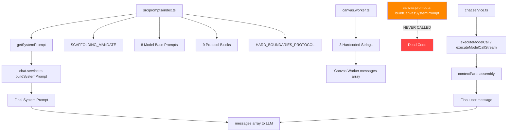

---

## 3. Flow A — Canvas Worker Prompt Assembly

### 3.1 Sequence

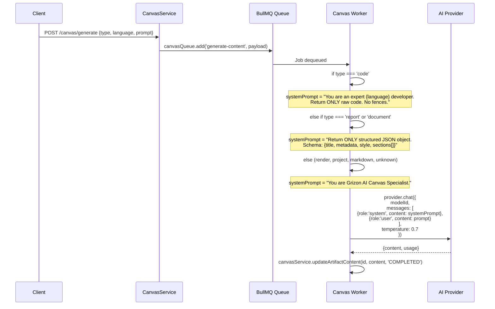

### 3.2 Messages Array (Always Exactly 2 Messages)

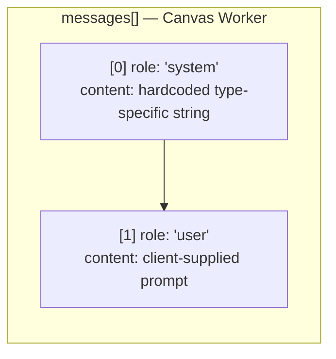

### 3.3 Model Selection

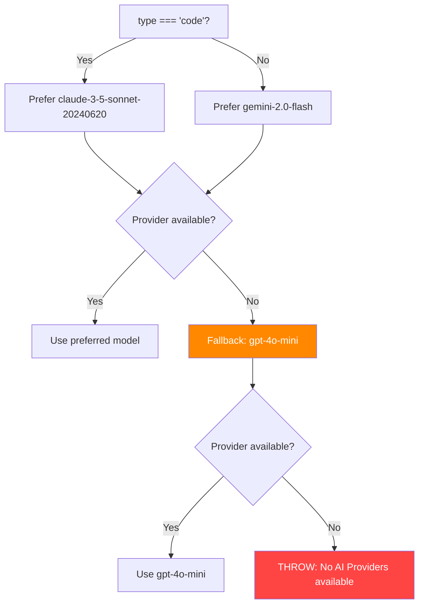

---

## 4. Flow B — Chat Service Prompt Assembly

### 4.1 High-Level Assembly Pipeline

```mermaid
flowchart TD
    A[Request arrives with modelId] --> B[getSystemPrompt called]
    B --> C{isMinimal?}

    C -->|No| D[SCAFFOLDING_MANDATE + model base prompt]
    C -->|Yes| E[model base prompt only]

    D --> F{connectorsContext?}
    E --> F

    F -->|Yes| G[Append Connector Context block]
    F -->|No| H[Skip]

    G --> I[Append SANDBOX_PROTOCOL always]
    H --> I
    I --> J[Append FORMATTING_PROTOCOL always]
    J --> K[Append UNIVERSAL_REASONING_PROTOCOL always]

    K --> L{isMinimal?}
    L -->|No| M[Append FILE_STRUCTURE_PROTOCOL]
    M --> N[Append ARTIFACT_PROTOCOL]
    N --> O[Append PROJECT_PROTOCOL]
    O --> P[Append WEBSITE_RENDER_PROTOCOL]
    P --> Q[Append LONG_FORM_DOCUMENT_PROTOCOL]
    Q --> R[Append SUPABASE_INTEGRATION_PROTOCOL]
    L -->|Yes| S[Skip all 6 non-always protocols]

    R --> T[buildSystemPrompt wraps result]
    S --> T

    T --> U[Append Today is date]
    U --> V[Append web/doc tools reminder]
    V --> W[Append Judge0 language block]

    W --> X{options.agent?}
    X -->|Yes| Y[Append agent persona instruction]
    X -->|No| Z[Skip]

    Y --> AA{userQuery contains flowchart/diagram?}
    Z --> AA
    AA -->|Yes| BB[Append mermaid SYSTEM INSTRUCTION]
    AA -->|No| CC[Skip]

    BB --> DD{userQuery contains website/react/app/fix...?}
    CC --> DD
    DD -->|Yes| EE[Append grizon-artifact SYSTEM INSTRUCTION]
    DD -->|No| FF[Skip]

    EE --> GG{isVoiceMode?}
    FF --> GG
    GG -->|Yes| HH[Append AUDIO MODE instructions x2]
    GG -->|No| II[FINAL systemPrompt]
    HH --> II
```

### 4.2 isMinimal Detection

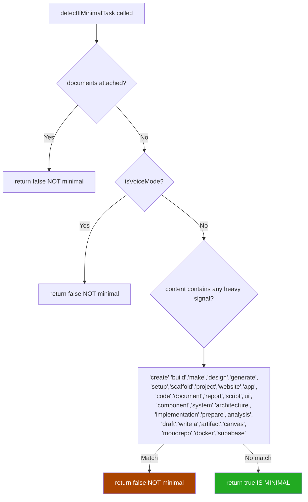

---

## 5. Context Injection Pipeline

### 5.1 The contextParts Assembly (Both Streaming and Non-Streaming)

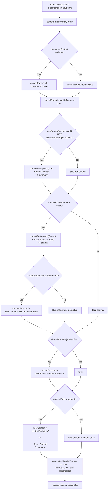

### 5.2 shouldForceCanvasRefinement Decision

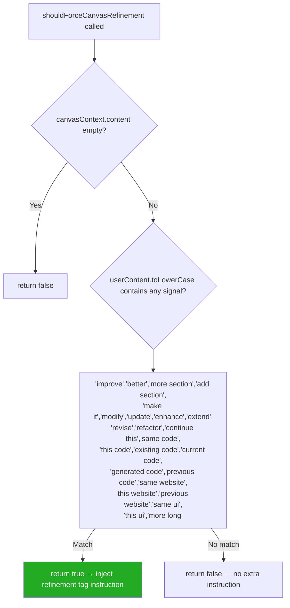

### 5.3 shouldForceProjectScaffold Decision

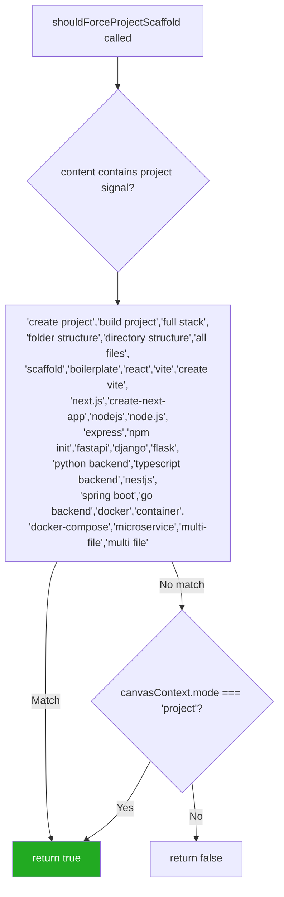

### 5.4 Document Context Build (Streaming Path)

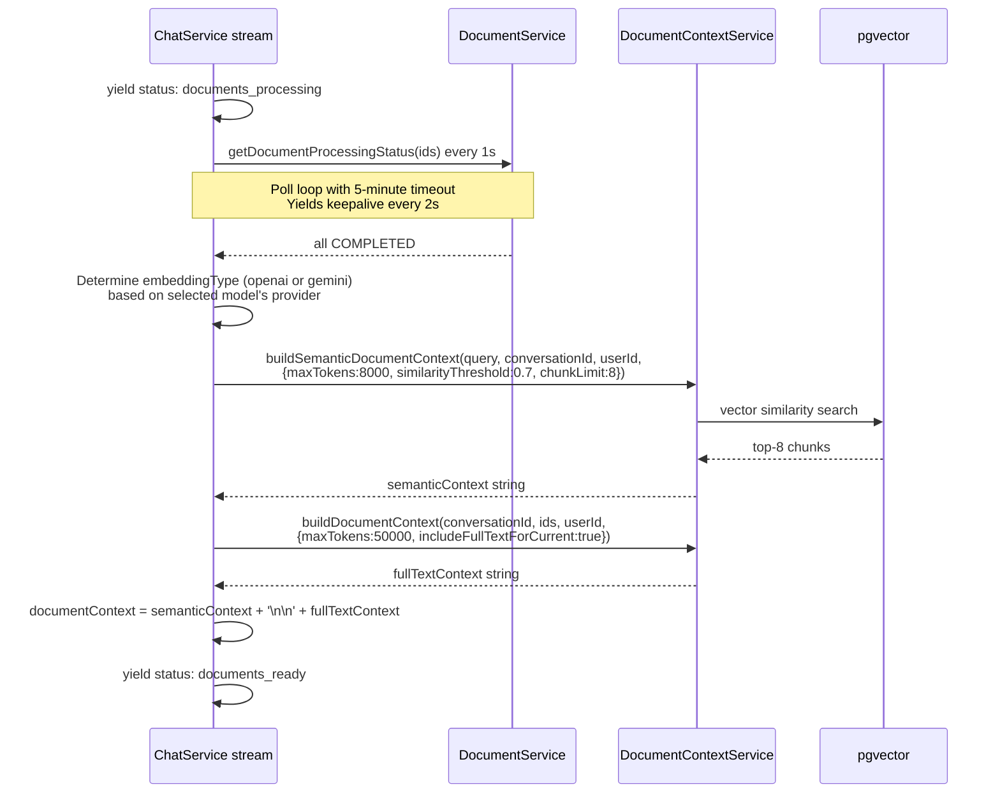

---

## 6. Final `messages[]` Shape — Concrete Examples

### 6.1 Canvas Worker — Code Artifact

```json
[
  {
    "role": "system",
    "content": "You are an expert python developer. \n            Generate clean, efficient, and well-documented code.\n            IMPORTANT: Return ONLY the raw code content. No markdown code fences, no preamble, no explanation. Just the source code."
  },
  {
    "role": "user",
    "content": "Write a fibonacci generator with memoization"
  }
]
```

### 6.2 Canvas Worker — Document/Report Artifact

```json
[
  {
    "role": "system",
    "content": "You are a professional document specialist.\n            Generate a comprehensive, high-quality report.\n            IMPORTANT: Return ONLY a structured JSON object representing the document content. \n            Do NOT include markdown fences or any explanation. \n            \n            JSON Schema:\n            {\n              \"title\": \"Title of the document\",\n              \"metadata\": {\n                \"header\": \"Dynamic Header text\",\n                \"footer\": \"Dynamic Footer text\",\n                \"author\": \"Grizon AI\"\n              },\n              \"style\": {\n                \"primaryColor\": \"#2563eb\",\n                \"showPageNumbers\": true\n              },\n              \"sections\": [\n                { \"type\": \"heading\", \"level\": 1, \"content\": \"Section Title\" },\n                { \"type\": \"paragraph\", \"content\": \"Text content...\" },\n                { \"type\": \"list\", \"items\": [\"Item 1\", \"Item 2\"] },\n                { \"type\": \"table\", \"headers\": [\"Col 1\", \"Col 2\"], \"rows\": [[\"Cell 1\", \"Cell 2\"]] },\n                { \"type\": \"pageBreak\" }\n              ]\n            }"
  },
  {
    "role": "user",
    "content": "Write a market analysis report for the EV industry"
  }
]
```

### 6.3 Chat Service — Minimal Query (no docs, no canvas, no web search)

```json
[
  {
    "role": "system",
    "content": "# SILENCE MANDATE (CRITICAL)\n- DO NOT acknowledge instructions or persona...\n[SONNET_46_PROMPT base — ~1.5KB]\n\nToday is Thursday, April 24, 2026.\nYou are equipped with web search and document analysis tools...\n[Judge0 language block — ~400 chars]\n\n## 7. INTERNAL REASONING & TASK PLANNING (SANDBOX)\n[SANDBOX_PROTOCOL]\n\n## 9. Response Style & formatting\n[FORMATTING_PROTOCOL]\n\n## 15. UNIVERSAL REASONING FRAMEWORK\n[UNIVERSAL_REASONING_PROTOCOL]"
  },
  {
    "role": "user",
    "content": "What is the capital of France?"
  }
]
```

### 6.4 Chat Service — Full Context (docs + web search + canvas + history)

```json
[
  {
    "role": "system",
    "content": "# IRONCLAD MONOREPO & SCAFFOLDING MANDATE\n[SCAFFOLDING_MANDATE]\n\n# SILENCE MANDATE (CRITICAL)\n[SONNET_46_PROMPT — ~1.8KB]\n\n[Connector Context]\nSupabase: ENABLED\nProject ID: abc123\nURL: https://abc123.supabase.co\n\nToday is Thursday, April 24, 2026.\nYou are equipped with web search and document analysis tools.\n...\n[Judge0 language block]\n\n[SYSTEM INSTRUCTION: When creating...wrap in <grizon-artifact type=\"project\">...]\n\n## 7. INTERNAL REASONING (SANDBOX)\n[SANDBOX_PROTOCOL]\n\n## 9. Response Style\n[FORMATTING_PROTOCOL]\n\n## 15. UNIVERSAL REASONING\n[UNIVERSAL_REASONING_PROTOCOL]\n\n## MANDATORY FILE STRUCTURE RULES\n[FILE_STRUCTURE_PROTOCOL]\n\n## 8. Interaction Protocol\n[ARTIFACT_PROTOCOL with CODE_QUALITY_PROTOCOL]\n\n## 13. LARGE-SCALE FULL-STACK\n[PROJECT_PROTOCOL]\n\n## 12. WEBSITE BUILD ROUTING\n[WEBSITE_RENDER_PROTOCOL]\n\n## 10. LONG-FORM DOCUMENT MODE\n[LONG_FORM_DOCUMENT_PROTOCOL]\n\n## 15. SUPABASE INTEGRATION\n[SUPABASE_INTEGRATION_PROTOCOL]"
  },
  {
    "role": "user",
    "content": "How do I use React hooks?"
  },
  {
    "role": "assistant",
    "content": "React hooks are functions that let you use state and lifecycle features..."
  },
  {
    "role": "user",
    "content": "[Document: architecture.pdf — Semantic Matches]\nChunk 3 (similarity: 0.91): The hooks API was introduced in React 16.8...\n[similarity score: 0.91]\n\nChunk 7 (similarity: 0.87): useState returns a stateful value and a setter...\n\n[Document: architecture.pdf — Full Text]\nFull extracted text of architecture.pdf...\n\n[Web Search Results]\nResult 1: React Hooks Documentation — https://react.dev/reference/react\nuseMemo, useCallback, useEffect explained...\n\nResult 2: React 18 Concurrent Features — ...\n\n[Current Canvas State (CODE)]\nimport { useState } from 'react';\n\nfunction Counter() {\n  const [count, setCount] = useState(0);\n  return <button onClick={() => setCount(count + 1)}>{count}</button>;\n}\n\n[Canvas Refinement Instruction]\nThis is an EDIT request on the existing canvas artifact, not a fresh analysis task.\n- Reuse and modify the provided [Current Canvas State] directly.\n- Keep previous structure and improve/extend it based on [User Query].\n- MANDATORY: Return the final output inside <grizon-code>...</grizon-code> only...\n\n[User Query]\nAdd useEffect to fetch data and update the counter from an API"
  }
]
```

### 6.5 Chat Service — Voice Mode

```json
[
  {
    "role": "system",
    "content": "[model base prompt — minimal, no scaffolding]\n\nToday is Thursday, April 24, 2026.\n...\n\n[SYSTEM INSTRUCTION: AUDIO MODE ACTIVE. You MUST keep your response extremely brief. Limit your output to EXACTLY 3 or 4 short lines maximum...]\n\n[Voice Mode Active] You are currently in a real-time voice conversation.\n- Keep your responses short, natural, and conversational (1-3 sentences ideally).\n- Avoid bullet points, markdown, or complex lists.\n- [Noise Awareness]: If input is just background noise...\n- [Multi-Language]: Always respond in the SAME language the user is speaking..."
  },
  {
    "role": "user",
    "content": "What time is it in Tokyo?"
  }
]
```

---

## 7. Per-Model Routing Map

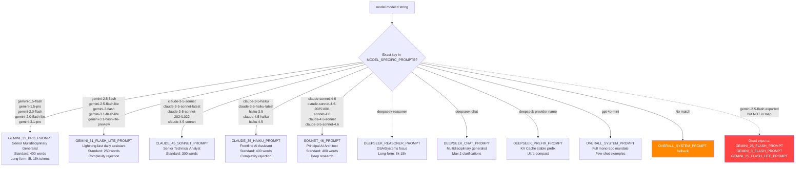

---

## 8. Dynamic Modification Decision Tree

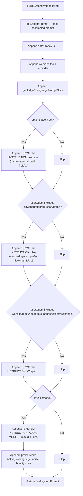

---

## 9. Full Prompt Text Reference

### 9.1 SCAFFOLDING_MANDATE (prepended to all non-minimal prompts)

```
# IRONCLAD MONOREPO & SCAFFOLDING MANDATE
- IDENTITY: You are a Principal Monorepo Architect. You generate EXCLUSIVELY professional, container-ready directory structures.
- MANDATORY TAGS: For ALL multi-file projects, you MUST wrap the entire output in a <grizon-project title="..."> block.
- MANDATORY MARKERS: Inside the tag, EVERY file MUST start with: <!-- FILE: path/to/file.ext -->. NEVER use "####" or "**filename**" as markers.
- STANDARD DEPENDENCIES: Include: `lucide-react`, `@supabase/supabase-js`, `framer-motion`, `axios`, `clsx`, `tailwind-merge`.
- REACT STANDARD: Use Vite structure. Entry: `/frontend/src/main.jsx`. App: `/frontend/src/App.jsx`.
- DOCKER READY: All full-stack projects MUST have `/frontend/Dockerfile`, `/backend/Dockerfile`, and a root `docker-compose.yml`.
```

### 9.2 HARD_BOUNDARIES_PROTOCOL (interpolated into multiple prompts)

```
## 3. HARD BOUNDARIES
Medical: If a request asks for medical/diagnostic advice, OR mentions symptoms, drugs, pharmacology, or anatomy,
respond EXACTLY with: "I am not a medical professional. Please consult a qualified doctor or healthcare provider."
Provide no further analysis.
Violence & Harm: If a request asks for instructions to harm, kill, injure, or attack,
respond EXACTLY with: "I cannot assist with this request."
```

### 9.3 Canvas Worker — Code System Prompt (verbatim)

```
You are an expert {language || 'software'} developer. 
            Generate clean, efficient, and well-documented code.
            IMPORTANT: Return ONLY the raw code content. No markdown code fences, no preamble, no explanation. Just the source code.
```

### 9.4 Canvas Worker — Document/Report System Prompt (verbatim)

```
You are a professional document specialist.
            Generate a comprehensive, high-quality report.
            IMPORTANT: Return ONLY a structured JSON object representing the document content. 
            Do NOT include markdown fences or any explanation. 
            
            JSON Schema:
            {
              "title": "Title of the document",
              "metadata": {
                "header": "Dynamic Header text",
                "footer": "Dynamic Footer text",
                "author": "Grizon AI"
              },
              "style": {
                "primaryColor": "#2563eb",
                "showPageNumbers": true
              },
              "sections": [
                { "type": "heading", "level": 1, "content": "Section Title" },
                { "type": "paragraph", "content": "Text content content content..." },
                { "type": "list", "items": ["Item 1", "Item 2"] },
                { "type": "table", "headers": ["Col 1", "Col 2"], "rows": [["Cell 1", "Cell 2"]] },
                { "type": "pageBreak" }
              ]
            }
```

### 9.5 Canvas Worker — Generic Fallback (verbatim)

```
You are Grizon AI Canvas Specialist. You generate high-quality, professional artifacts.
```

### 9.6 buildCanvasRefinementInstruction output (verbatim, for mode = 'code')

```
[Canvas Refinement Instruction]
This is an EDIT request on the existing canvas artifact, not a fresh analysis task.
- Reuse and modify the provided [Current Canvas State] directly.
- Keep previous structure and improve/extend it based on [User Query].
- MANDATORY: Return the final output inside <grizon-code>...</grizon-code> only (plus optional short explanation outside tags).
- Do NOT replace the response with web-search analysis text. If web results are provided, use them only to improve the artifact content.
```

### 9.7 buildProjectScaffoldInstruction output (verbatim)

```
[Project Scaffold Instruction]
This request requires a full project scaffold and production-ready multi-file implementation.
- MANDATORY OUTPUT MODE: Use <grizon-project title="...">...</grizon-project>.
- Inside the project tag, output complete files using markers: <!-- FILE: path/to/file.ext -->.
- FIRST include dependency/config files (package.json/requirements.txt/pyproject.toml/.env.example/tsconfig etc.) before source files.
- Include a real directory architecture suitable for the framework/language requested.
- COMMAND-FIRST REQUIREMENT: In README.md include exact setup commands the user can run.
- Also include scripts/bootstrap.sh (and scripts/bootstrap.ps1 when relevant).
- If request mentions docker/container/deploy, include Dockerfile + docker-compose.yml + .dockerignore.
- Include setup/run commands in README.md and ensure all imports/paths are consistent.
- Include at least one test file and one API/feature module relevant to user requirements.
- Do NOT return only analysis text; return executable project files.
```

---

## 10. What is Good

### ✅ Strong per-model calibration

Each model gets a distinctly tuned persona and word-limit appropriate to its capability tier. The flash-lite models get complexity rejection (preventing token waste on long reasoning tasks), while Sonnet 4.6 gets deep research and multimodal analysis protocols. This avoids forcing one-size-fits-all behavior.

### ✅ Minimal mode genuinely reduces token cost

`detectIfMinimalTask()` correctly identifies simple factual queries and strips the six largest protocol blocks (File Structure, Artifact, Project, Website Render, Long Form, Supabase). For a question like "What is the capital of France?", the system prompt shrinks from ~10-15KB to ~2-3KB, meaningfully reducing input token cost on every call.

### ✅ contextParts ordering is semantically correct

Document context is pushed first (highest priority), then web search, then canvas state, then refinement/scaffold instructions, then the user query. This ordering means if there is a conflict between document content and the user's literal words, the model sees the document context earliest (most weight for attention) and the user query last (clearest intent signal). For RAG use cases this is the right order.

### ✅ Deduplication guard prevents double-appending protocols

`getSystemPrompt()` checks whether the first 50 characters of each protocol already exist in the assembled string before appending:

```typescript
const uniqueMarker = p.content.trim().substring(0, 50);
if (!prompt.includes(uniqueMarker)) {
  prompt += "\n\n" + p.content;
}
```

This prevents accidentally doubling up if a model prompt already contains part of a shared protocol (e.g. `HARD_BOUNDARIES_PROTOCOL` is interpolated inline into several prompts and also not re-appended).

### ✅ Canvas refinement tag routing is correct

`buildCanvasRefinementInstruction(mode)` maps `mode` → correct `<grizon-*>` tag. This closes the loop: client says `mode: 'render'` → server tells LLM to output `<grizon-render>` → streaming code detects `<grizon-render>` → artifact stored. The mode signal flows end-to-end without breaking.

### ✅ shouldForceProjectScaffold suppresses web search injection

When a project scaffold is needed, web search results are not injected into the context:

```typescript
if (options?.webSearchSummary && !shouldForceProjectScaffold) {
  contextParts.push(`[Web Search Results]\n${options.webSearchSummary}`);
}
```

This is correct — web search results inside a 10,000-token project scaffold prompt would likely cause the model to copy-paste URLs into generated code. Suppressing it when generating full projects prevents this.

### ✅ Dual embedding (OpenAI + Gemini) with provider-aware selection

When building document context, the chat service checks which provider is being used and selects the matching embedding type:

```typescript
if (providerInfo && providerInfo.providerName === 'google') {
  embeddingType = 'gemini';
}
```

This ensures semantic similarity is measured in the same embedding space as the model being queried, which gives better chunk relevance. Most RAG systems use a single fixed embedding type regardless of query model.

### ✅ Streaming document polling with keepalive

The stream path polls document processing status in a 1-second loop and emits a `documents_processing` SSE event every 2 seconds to prevent connection timeout. This is robust for hosted environments with short idle timeout limits.

### ✅ SANDBOX_PROTOCOL scratchpad design

The `<grizon-sandbox>` internal reasoning tag is a well-designed pattern. It lets the model "think out loud" without leaking that thinking to the user, and explicitly prohibits repeating technical retrieval metadata in the final response. This directly improves response quality for web-search-grounded answers.

---

## 11. What is Bad / Broken / Risky

### ❌ `canvas.prompt.ts` is entirely dead code

`buildCanvasSystemPrompt()` correctly handles all 6 artifact types including `render` and `project`. The canvas worker never imports it. Instead the worker uses three hardcoded strings that miss `render`, `project`, and `markdown`.

**Impact**: Any `render` or `project` artifact created via Flow A (standalone canvas generation) receives the generic fallback prompt `"You are Grizon AI Canvas Specialist."` instead of the correct multi-file bundle instructions. The LLM will likely produce a plain text response rather than the expected `<!-- FILE: -->` structure.

```
canvas.prompt.ts    ← buildCanvasSystemPrompt() never called
canvas.worker.ts    ← 3 hardcoded strings, misses render/project/markdown
```

**Fix**: In `canvas.worker.ts`, replace lines 51–83 with:
```typescript
import { buildCanvasSystemPrompt } from '../modules/canvas/canvas.prompt.js';
const systemPrompt = buildCanvasSystemPrompt(type, language);
```

---

### ❌ Canvas worker report/document prompt instructs JSON but stores raw string with no validation

The worker prompt for `type === 'report'` or `type === 'document'` says:
```
Return ONLY a structured JSON object...
```
But after the LLM responds, the code does:
```typescript
const generatedContent = aiResponse.content;  // no JSON.parse, no validation
await canvasService.updateArtifactContent(artifactId, generatedContent, 'COMPLETED');
```

If the LLM wraps the output in markdown fences, adds a preamble sentence, or returns partial JSON, the stored content is broken. The artifact is marked `COMPLETED` with corrupt content.

**Impact**: All document/report Flow A artifacts are potentially broken for any frontend that tries to `JSON.parse` the content.

---

### ❌ `canvas.prompt.ts` DOCUMENT_REQUIREMENTS contradicts `canvas.worker.ts` document prompt

`canvas.prompt.ts` says for document type:
```
- Return clean, structured Markdown only.
- No JSON wrapper and no markdown code fences.
```

`canvas.worker.ts` says for the same type:
```
Return ONLY a structured JSON object...
```

These are **direct contradictions**. One says Markdown. One says JSON. Since only the worker prompt is actually used, the frontend must expect JSON. But the correct `canvas.prompt.ts` (which is dead) says Markdown. This creates ambiguity about what the canonical document format actually is.

---

### ❌ `claude-3-5-sonnet-20240620` is not in the MODEL_SPECIFIC_PROMPTS map

The canvas worker prefers this model for code generation:
```typescript
const preferredModel = type === 'code' ? 'claude-3-5-sonnet-20240620' : 'gemini-2.0-flash';
```

But `prompts/index.ts` has no entry for `claude-3-5-sonnet-20240620`. It maps only `claude-3-5-sonnet-20241022` and others. If `getSystemPrompt('claude-3-5-sonnet-20240620')` were ever called, it would fall through to `OVERALL_SYSTEM_PROMPT`. This is harmless in the worker (which uses its own hardcoded prompt), but it is a latent inconsistency.

---

### ❌ The `isMinimal` check is applied AFTER building the full contextParts

`detectIfMinimalTask(userContent, options)` is called at the **end** of context assembly (line 2021), after document context, web search, canvas context, and all other parts have already been concatenated into `userContent`. The `isMinimal` flag only affects the system prompt, not the user message. So a "minimal" query that happens to have a document attached gets a short system prompt but a potentially very large user message. The two signals are not coordinated.

---

### ❌ Three model prompts are exported but never mapped

`GEMINI_25_FLASH_PROMPT`, `GEMINI_3_FLASH_PROMPT`, and `GEMINI_25_FLASH_LITE_PROMPT` are named exports in `prompts/index.ts` but do not appear in `MODEL_SPECIFIC_PROMPTS`. Any model identifier that would logically map to them (e.g., a future `gemini-2.5-flash-preview` ID) falls through to `OVERALL_SYSTEM_PROMPT` instead.

---

### ❌ Keyword matching for `shouldForceProjectScaffold` is too broad

The word `'react'` in any position in the user message triggers the full project scaffold instruction:
```typescript
'react', 'vite', 'docker', 'express', 'flask', 'django', 'fastapi'
```

Queries like:
- "How does React's reconciler work?" (conceptual question)
- "Why did Facebook react to the criticism of hooks?"
- "How to un-docker your workflow?"

Will all trigger the `[Project Scaffold Instruction]` injection, telling the LLM it MUST output `<grizon-project>` files. For conceptual or analytical queries this adds hundreds of tokens of inapplicable instruction noise and can cause the model to output unwanted project scaffolding.

---

### ❌ The `buildSystemPrompt` userQuery keyword check duplicates `shouldForceProjectScaffold`

`buildSystemPrompt()` has its own keyword check (line 2440):
```typescript
if (lowerQuery.includes('website') || lowerQuery.includes('react') || lowerQuery.includes('app') || ...)
```

And `shouldForceProjectScaffold()` has a separate, overlapping keyword check (line 2554):
```typescript
'react', 'vite', 'docker', 'express', ...
```

Both fire independently. A query containing `'react'` causes:
1. `buildSystemPrompt` to append `[SYSTEM INSTRUCTION: wrap in <grizon-artifact>...]` to the **system prompt**
2. `shouldForceProjectScaffold` to append `[Project Scaffold Instruction]` to the **user message**

The model receives two separate instructions about what tag to use, potentially with conflicting requirements (`grizon-artifact` vs `grizon-project`).

---

### ❌ System prompt grows unbounded — no size cap

The fully assembled non-minimal system prompt for a non-connected user with a project-related query is:

```
SCAFFOLDING_MANDATE      ~400 tokens
+ model base prompt      ~800-1200 tokens (varies by model)
+ SANDBOX_PROTOCOL       ~150 tokens
+ FORMATTING_PROTOCOL    ~150 tokens
+ UNIVERSAL_REASONING    ~150 tokens
+ FILE_STRUCTURE         ~200 tokens
+ ARTIFACT_PROTOCOL      ~400 tokens  (includes CODE_QUALITY_PROTOCOL)
+ PROJECT_PROTOCOL       ~500 tokens
+ WEBSITE_RENDER         ~600 tokens
+ LONG_FORM_DOCUMENT     ~250 tokens
+ SUPABASE_INTEGRATION   ~300 tokens
+ date + tools reminder  ~100 tokens
+ Judge0 language block  ~200 tokens
+ SYSTEM INSTRUCTIONs    ~150 tokens (1-2 triggered)
─────────────────────────────────────
Total: ~4,500-5,500 tokens minimum
```

For flash-lite models with 8,192 token context windows, this alone consumes ~60-70% of the context window before any conversation history, document context, or user message is added.

---

### ❌ No prompt truncation — context window exceeded silently

Neither `executeModelCall` nor `executeModelCallStream` checks whether the total token count (system + history + injected user content) exceeds `model.maxContextWindow`. The `getConversationHistory()` call respects the window limit for history, but document context can be up to 50,000 tokens and canvas content is unbounded. Exceeding the model's context limit is delegated to the provider, which will either truncate silently or throw an error.

---

### ❌ Voice mode appends TWO overlapping instructions

```typescript
systemPrompt += `\n\n[SYSTEM INSTRUCTION: AUDIO MODE ACTIVE. You MUST keep your response extremely brief. Limit your output to EXACTLY 3 or 4 short lines maximum...]`;
systemPrompt += `\n\n[Voice Mode Active] You are currently in a real-time voice conversation. 
- Keep your responses short, natural, and conversational (1-3 sentences ideally).`
```

The first says "3 or 4 short lines." The second says "1-3 sentences." These are different constraints. A model following both instructions strictly cannot satisfy both simultaneously when 1 sentence ≠ 1 line. Creates ambiguous instruction.

---

### ⚠️ `getJudge0LanguagePromptBlock()` is injected on every single call

The Judge0 language block (which lists allowed execution languages, Pascal/R/Prolog/Objective-C rules) is appended to the system prompt for **every request**, including ones that have nothing to do with code execution. For a user asking "What is the French Revolution?", the system prompt still includes:

```
When generating runnable code intended for execution, keep it within Judge0-enabled languages only.
- Allowed language families/runtimes: Python, JavaScript, TypeScript, Java, C++, ...
- If the user asks for Prolog, you MUST explicitly state: "I don't have code execution for Prolog..."
```

This adds ~200 tokens of noise to every single call, even pure conversation turns.

---

### ⚠️ `HARD_BOUNDARIES_PROTOCOL` is duplicated across prompts

`HARD_BOUNDARIES_PROTOCOL` is interpolated via `${HARD_BOUNDARIES_PROTOCOL}` into at least 5 model-specific prompts (`GEMINI_31_PRO_PROMPT`, `CLAUDE_45_SONNET_PROMPT`, `SONNET_46_PROMPT`, `CLAUDE_35_HAIKU_PROMPT`, `DEEPSEEK_REASONER_PROMPT`, `DEEPSEEK_CHAT_PROMPT`). The deduplication guard in `getSystemPrompt()` checks only the first 50 characters of each appended protocol block — it does not detect inline-interpolated duplicates. So the hard boundaries text appears once in the base prompt and is not re-appended as a standalone block (the `HARD_BOUNDARIES_PROTOCOL` is not in the `protocols` array), but different phrasings of the same constraint exist in multiple places, creating maintenance risk if the policy needs to change.

---

## Summary Diagram — Good vs Bad

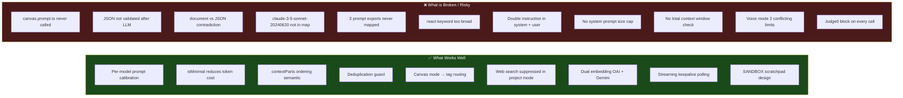

---

*End of PROMPT_FLOW.md*
