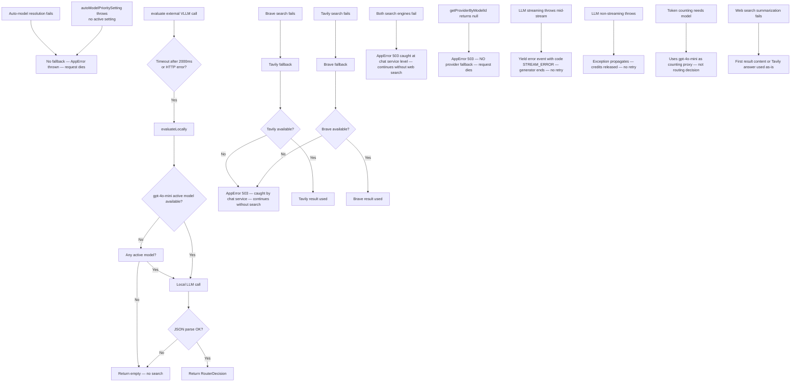
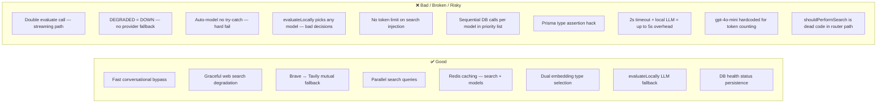

# ROUTER_FLOW.md

Complete reference for the routing system: model resolution, evaluate router, web search trigger, provider selection, and fallback chains.

---

## Table of Contents

1. [Router Decision Flow — Full Step-by-Step](#1-router-decision-flow--full-step-by-step)
2. [EvaluateRouter Prompt — Exact Messages Array](#2-evaluaterouter-prompt--exact-messages-array)
3. [Web Search Flow](#3-web-search-flow)
4. [Fallback Chain](#4-fallback-chain)
5. [VLLM Audit](#5-vllm-audit)
6. [Model Registry and Auto-Resolution](#6-model-registry-and-auto-resolution)
7. [Good and Bad](#7-good-and-bad)

---

## 1. Router Decision Flow — Full Step-by-Step

### 1.1 Entry Points

There are **two entry paths** depending on whether the client requests streaming or non-streaming:

```
POST /chat/stream  → middleware (evaluateCheck?) → sendMessageStream()
POST /chat         → middleware (evaluateCheck)  → sendMessage()
```

Both paths call `evaluate()` internally. The middleware (`evaluateCheck.ts`) also calls `evaluate()` for non-streaming. See §7 (Bad) for the double-evaluation problem.

---

### 1.2 Step 1 — Auto-Model Resolution

**Location:** `chat.service.ts:153–180` (both streaming and non-streaming)

```typescript
// chat.service.ts:149-180
private async resolveAutoModel(
  userId: string,
  selectedModels: string[],
): Promise<{ resolvedModels: string[]; usedAuto: boolean }> {
  const hasAuto = selectedModels.includes('auto');

  if (!hasAuto) {
    return { resolvedModels: selectedModels, usedAuto: false };
  }

  // Get the top accessible model from auto-model-priority
  const result =
    await autoModelPrioritySettingService.getTopAccessibleModel(userId);

  // Replace "auto" with the actual model ID
  const resolvedModels = selectedModels.map((id) =>
    id === 'auto' ? result.modelId : id,
  );

  logger.info('Auto model resolved', {
    userId,
    originalModels: selectedModels,
    resolvedModel: result.modelId,
    resolvedModels,
  });

  return { resolvedModels, usedAuto: true };
}
```

Called from both `sendMessage()` (line 224–226) and `sendMessageStream()` (line 789–791):

```typescript
// chat.service.ts:218-227 (non-streaming)
const originalModels = originalSelectedModels || selectedModels;
const usedAuto = originalModels.includes('auto');
let resolvedModels = selectedModels;

// Only resolve if not already resolved by middleware
if (usedAuto && selectedModels.includes('auto')) {
  const result = await this.resolveAutoModel(userId, selectedModels);
  resolvedModels = result.resolvedModels;
}
```

**No try/catch.** If `getTopAccessibleModel()` throws (no active setting, user has no accessible models), the entire request dies with an `AppError`.

---

### 1.3 Step 2 — EvaluateRouter Call

**Location:** `chat.service.ts:307–312` (non-streaming), `chat.service.ts:890–894` (streaming)

```typescript
// chat.service.ts:307-312 (non-streaming)
const evalResponse = await evaluate(
  conversation.id,
  content || '',
  messagesForRouter,
);

// chat.service.ts:890-894 (streaming)
const evaluateResponse = await evaluate(
  conversation.id,
  content,
  messagesForRouter,
);
```

`messagesForRouter` is the full conversation history loaded from DB:

```typescript
// chat.service.ts:294-305 (non-streaming) and 876-887 (streaming)
const allMessages = await prisma.message.findMany({
  where: { conversationId: conversation.id },
  orderBy: { createdAt: 'asc' },
  select: { role: true, content: true },
});

const messagesForRouter = allMessages.map(
  (m: { role: string; content: string }) => ({
    role: m.role.toLowerCase(),
    content: m.content,
  }),
);
```

`evaluate()` sends this to the external VLLM router or falls back to a local LLM. See §2 for exact body and prompt.

---

### 1.4 Step 3 — Router Decision Interpretation

**Location:** `chat.service.ts:314–364` (non-streaming), `chat.service.ts:896–1020` (streaming)

```typescript
// chat.service.ts:314-364 (non-streaming)
const routerDecision = evalResponse.router_decision;
const tool = routerDecision?.tool?.toLowerCase();

if (
  routerDecision &&
  (tool === 'tavily' ||
    tool === 'brave' ||
    tool === 'web_search' ||
    tool === 'searching')
) {
  const searchResult = await webSearchService.performSearchFromRouter(
    routerDecision,
    userId,
    conversation.id,
    undefined,
  );

  if (searchResult.needsSearch && searchResult.summary) {
    webSearchSummaryFromRouter = searchResult.summary;
  }
}
```

If `tool === 'none'` or the response is empty `{}` → no search, continue.

---

### 1.5 Step 4 — Provider Selection

**Location:** `chat.service.ts:1555` (non-streaming), `chat.service.ts:1902` (streaming)

```typescript
// chat.service.ts:1544-1562
const model = await modelRegistryService.getModelById(modelId);
if (!model || !model.isActive) {
  throw new AppError(`Model ${modelId} not found or inactive`, 404, 'MODEL_NOT_FOUND');
}

const provider = await providerRouterService.getProviderByModelId(modelId);
if (!provider) {
  throw new AppError(`Provider for model ${modelId} not available`, 503, 'PROVIDER_UNAVAILABLE');
}
```

`getProviderByModelId()` in `providerRouter.service.ts:137–167`:

```typescript
// providerRouter.service.ts:137-167
async getProviderByModelId(modelId: string): Promise<BaseAIProvider | null> {
  try {
    const model = await modelRegistryService.getModelById(modelId);
    if (!model || !model.provider) {
      logger.warn('Model not found in registry', { modelId });
      return null;
    }

    // Check provider health
    if (model.provider.healthStatus !== ProviderHealth.HEALTHY) {
      logger.warn('Provider not healthy', {
        provider: model.provider.name,
        status: model.provider.healthStatus,
      });
      return null;
    }

    // Get provider instance
    const provider = this.getProvider(model.provider.name);
    if (!provider) {
      logger.warn('Provider not initialized', { providerName: model.provider.name });
      return null;
    }

    return provider;
  } catch (error) {
    logger.error('Failed to get provider by model ID', { error, modelId });
    return null;
  }
}
```

**No fallback to another provider.** Returns null → caller throws `AppError`.

---

### 1.6 Step 5 — LLM Call (Non-Streaming)

```typescript
// chat.service.ts:1714-1724
const chatRequest: ChatRequest = {
  modelId: model.modelId, // API model identifier
  messages,
  temperature: options?.temperature ?? 0.7,
  maxTokens: options?.maxTokens,
  userId,
  conversationId: conversation.id,
};

const response: ChatResponse = await provider.chat(chatRequest);
```

### 1.7 Step 5 — LLM Call (Streaming)

```typescript
// chat.service.ts:2060-2092
const chatRequest: ChatRequest = {
  modelId: model.modelId,
  messages,
  temperature: options?.temperature ?? 0.7,
  maxTokens: options?.maxTokens,
  userId,
  conversationId: conversation.id,
  stream: true,
};

let accumulatedContent = '';
let finalUsage: TokenUsage | undefined;
let finishReason: string | undefined;

try {
  for await (const chunk of provider.chatStream(chatRequest)) {
    if (chunk.content) {
      accumulatedContent += chunk.content;
      yield {
        event: 'chunk',
        data: { content: chunk.content },
      };
    }
    if (chunk.done && chunk.usage) {
      finalUsage = chunk.usage;
      finishReason = chunk.finishReason || 'stop';
    }
  }
  // ...
} catch (error) {
  logger.error('Streaming model call failed', { modelId, error, userId });
  yield {
    event: 'error',
    data: {
      error: error instanceof Error ? error.message : 'Unknown error',
      code: 'STREAM_ERROR',
    },
  };
}
```

**No retry. No fallback provider. Error → yield error event → generator ends.**

---

### 1.8 Full Decision Tree (Mermaid)

```mermaid
flowchart TD
    A[User Message Arrives] --> B{selectedModels includes 'auto'?}
    B -- Yes --> C[resolveAutoModel]
    C --> D[getTopAccessibleModel from AutoModelPrioritySetting DB]
    D --> E{Active setting exists & user has accessible model?}
    E -- No --> FAIL1[Throw AppError — request dies]
    E -- Yes --> F[Replace 'auto' with real modelId]
    B -- No --> F

    F --> G[Get or Create Conversation]
    G --> H{webSearchSummary already provided?}
    H -- Yes --> SKIP[Skip evaluate call]
    H -- No --> I[Load full conversation history from DB]
    I --> J[Call evaluate with conversationId, content, history]

    J --> K{env.vllmRouter configured?}
    K -- No --> L[Return empty object — no search]
    K -- Yes --> M[POST to VLLM Router /v1/conversations — 2000ms timeout]
    M --> N{Response OK?}
    N -- No --> O[evaluateLocally — LLM call with local prompt]
    N -- Yes --> P[Parse JSON response]

    O --> Q{gpt-4o-mini model available?}
    Q -- No --> L
    Q -- Yes --> R[LLM call — parse JSON — return RouterDecision]
    R --> S{JSON parse OK?}
    S -- No --> L
    S -- Yes --> P

    P --> T{router_decision.tool?}
    T -- none or empty --> SKIP
    T -- tavily / brave / web_search / searching --> U[Execute web search]

    U --> V[Split search_keywords by comma]
    V --> W[Run up to maxSearchReq=2 searches in parallel]
    W --> X[Merge results, formatSearchResultsAsText]
    X --> Y[webSearchSummary populated]

    SKIP --> Z[Build contextParts array]
    Y --> Z
    Z --> AA[Inject: documentContext + webSearch + canvasContext + refinementInstruction]
    AA --> BB[Build system prompt via getSystemPrompt]
    BB --> CC[Construct messages array]
    CC --> DD[getProviderByModelId]
    DD --> EE{Provider HEALTHY?}
    EE -- No/DEGRADED/DOWN --> FAIL2[Throw AppError — no provider]
    EE -- Yes --> FF[provider.chat or provider.chatStream]
    FF --> GG{Error during streaming?}
    GG -- Yes --> FAIL3[Yield error event, no retry]
    GG -- No --> HH[Save assistant message, confirm credits]
```



---

## 2. EvaluateRouter Prompt — Exact Messages Array

### 2.1 External VLLM Router Path

When `env.vllmRouter` is configured, **no prompt is sent to an LLM**. Instead, a structured JSON body is posted to the external service:

```typescript
// evaluateRouter.service.ts:54-65
const body: {
  conversation_id: string;
  message: { role: string; content: string };
  messages?: EvaluateRequestMessage[];
} = {
  conversation_id: conversationId,
  message: { role: "user", content: messageContent },
};

if (messages && messages.length > 0) {
  body.messages = messages;
}
```

**Actual HTTP body (JSON):**
```json
{
  "conversation_id": "<uuid>",
  "message": { "role": "user", "content": "<user message text>" },
  "messages": [
    { "role": "user", "content": "first message" },
    { "role": "assistant", "content": "response" },
    ...
  ]
}
```

**Headers:**
```json
{
  "Content-Type": "application/json",
  "x-api-key": "<VLLM_ROUTER_API_KEY if set>"
}
```

**Timeout:** `EVALUATE_TIMEOUT_MS = 2000`

**Expected response shape:**
```typescript
// evaluateRouter.service.ts:6-18
export interface RouterDecision {
  tool: string; // "none" | "brave" | "tavily"
  optimized_prompt?: string;
  search_keywords?: string;   // comma-separated keywords
  confidence_score?: number;
}

export interface EvaluateResponse {
  conversation_id?: string;
  router_decision?: RouterDecision;
  latency_ms?: number;
  history_length?: number;
}
```

**Parsing:** `const data = (await response.json()) as EvaluateResponse` — no validation, no schema check.

---

### 2.2 Local Fallback Path — `evaluateLocally()`

When the external VLLM call fails, times out, or returns a non-OK status, `evaluateLocally()` is called. This sends a single-message chat to an in-house LLM.

**Messages array sent to LLM:**
```typescript
// evaluateRouter.service.ts:203-210
const response = await provider.chat({
  modelId: model.modelId,
  messages: [{ role: "user", content: prompt }],
  temperature: 0,
  maxTokens: 500,
  userId: "system",
  conversationId: "internal-router"
});
```

**Exact prompt (verbatim, lines 151–201 of `evaluateRouter.service.ts`):**

```
System: You are an AI query router that selects between Tavily and Brave search engines based on query characteristics.
Task: Determine if web search is needed and select the optimal engine.

HYBRID SEARCH SELECTION STRATEGY:

Use "tavily" for:
  - Historical summaries and trend analysis (e.g., "AI trends of 2025", "how has X changed over time")
  - Technical specifications and detailed data extraction (hardware specs, product details, tabular data, system requirements)
  - HARDWARE COMPARISONS with benchmarks (e.g., "compare GPUs", "best processors", "CPU specs", "RAM performance")
  - Multi-hop logic queries that connect disparate facts (e.g., "what city hosted event X?" then "what is its population?")
  - Synthesizing complex information into clean, digestible answers
  - In-depth technical comparisons and benchmarks

Use "brave" for:
  - Real-time and ephemeral data (live sports scores, local AQI, current API status, active outages)
  - Deep market updates and latest releases (AI model announcements, market news, breaking updates for 2026+)
  - SOFTWARE/WORKFLOW COMPARISONS and user experiences (e.g., "best code editor", "compare design tools", "which framework", user reviews)
  - Subjective information (software reviews, community opinions from Reddit/forums, user experiences, best practices)
  - Queries requiring timestamp verification and deep-links for factual integrity
  - Recent high-stakes news that changes by the hour

Only suggest "none" if:
  - Query is purely conversational (e.g., "Hello", "How are you?")
  - General timeless knowledge that doesn't require current verification
  - Direct task request without needing external data

Conversation History:
${historyText}

Current User Query: "${content}"

DECISION RULES:
1. If query mentions "latest", "current", "real-time", "live", "breaking", "2026" → Brave
2. If query mentions "history", "trends", "how has", "specifications", "technical details", "tabular data", "hardware", "CPU", "GPU", "RAM", "specs", "processor" → Tavily
3. If query is about HARDWARE comparisons (e.g., "compare GPUs", "best processors", "RAM specs") → Tavily (detailed specs & benchmarks)
4. If query is about SOFTWARE/WORKFLOW comparisons (e.g., "best code editor", "compare design tools", "which framework", user experiences) → Brave (subjective opinions & reviews)
5. If query implies connecting multiple facts or deep analysis → Tavily
6. If query needs timestamps or verification of ephemeral data → Brave

Rule: Respond strictly in JSON format.

Your Response (JSON):
{
  "router_decision": {
    "tool": "tavily", // or "brave" or "none" - based on hybrid strategy above
    "search_keywords": "concise keywords for searching",
    "optimized_prompt": "clear rephrased query including necessary context for the search",
    "confidence_score": 0.95,
    "reason": "brief explanation of why this engine was selected"
  }
}
```

`historyText` is assembled at lines 147–149:
```typescript
const historyText = messages && messages.length > 0 
  ? messages.map(m => `${m.role.toUpperCase()}: ${m.content}`).join("\n") 
  : "No previous history.";
```

**Note:** The prompt says "System: You are an AI query router…" as plain text in the `user` message body — NOT as a separate `system` role message. There is no `system` role in the local fallback messages array.

**Response parsing:**
```typescript
// evaluateRouter.service.ts:212-222
try {
  const cleanJson = response.content.replace(/```json\n?|\n?```/g, "").trim();
  const parsed = JSON.parse(cleanJson);
  return {
    router_decision: parsed.router_decision,
    latency_ms: 0
  };
} catch (e) {
  logger.error("[EvaluateRouter] Failed to parse local router JSON", { content: response.content });
  return {};
}
```

**On parse failure → returns `{}`** (empty object, no router decision, no search).

---

### 2.3 Fast-Path Bypass

Before any LLM or HTTP call, a regex filter short-circuits for trivial queries:

```typescript
// evaluateRouter.service.ts:37-45
const trimmed = messageContent.trim().toLowerCase();
const conversationalRegex = /^(hi|hello|hey|how are you|who are you|good morning|good evening|bye|thanks|thank you)$/i;

if (trimmed.length < 3 || (trimmed.length < 15 && conversationalRegex.test(trimmed))) {
  logger.debug("[EvaluateRouter] Simple conversational query detected, bypassing router");
  return {
    router_decision: { tool: "none", confidence_score: 1 }
  };
}
```

---

## 3. Web Search Flow

### 3.1 Trigger Condition

Search is triggered when `evaluate()` returns a `router_decision.tool` of `"tavily"`, `"brave"`, `"web_search"`, or `"searching"` (any non-`"none"` value from the recognized set).

Additionally, in the streaming path, plan access is checked first:

```typescript
// chat.service.ts:865
const hasAccess = await webSearchService.checkPlanAccess(userId);
if (hasAccess) {
  // ... evaluate and search
}
```

```typescript
// webSearch.service.ts:240-252
async checkPlanAccess(userId: string): Promise<boolean> {
  const subscription = await prisma.subscription.findUnique({
    where: { userId },
    include: { plan: true },
  });

  if (!subscription || subscription.status !== "ACTIVE") {
    return false;
  }

  const features = subscription.plan.features as Record<string, any>;
  return features?.webSearch === true;
}
```

---

### 3.2 Search Execution

**Streaming path** (`chat.service.ts:906-951`): Uses `webSearchService.searchSingleQuery()` per keyword, in parallel:

```typescript
const searchKeywords = routerDecision.search_keywords || '';
const searchQueries = searchKeywords
  .split(',')
  .map((s) => s.trim())
  .filter(Boolean);

const maxSearchReq = env.maxSearchReq ?? 2;
const queriesToRun = searchQueries.slice(0, maxSearchReq);

const searchPromises = queriesToRun.map(async (query) => {
  if (abortSignal?.aborted) return null;
  try {
    return await webSearchService.searchSingleQuery(query, tool);
  } catch (error) {
    // logged, returns null
    return null;
  }
});

const searchResults = await Promise.all(searchPromises);
```

**Non-streaming path**: Uses `webSearchService.performSearchFromRouter()` which internally does the same: splits `search_keywords`, runs up to `maxSearchReq` queries in parallel.

---

### 3.3 Engine Selection and Fallback

**Primary:** `routerDecision.tool` determines preferred engine.

**`executeSearchWithFallback()` in `webSearch.service.ts:152-235`:**

```typescript
private async executeSearchWithFallback(
  query: string,
  preferredEngine: "tavily" | "brave",
): Promise<{ response: TavilySearchResponse; engineUsed: "tavily" | "brave" }> {
  if (preferredEngine === "brave") {
    if (braveProvider.isAvailable()) {
      try { return { response: await braveProvider.search(query, { maxResults: 10 }), engineUsed: "brave" }; }
      catch (error) { /* warn: Brave failed */ }
    }
    if (tavilyProvider.isAvailable()) {
      try { return { response: await tavilyProvider.search(query, { maxResults: 10, searchDepth: "basic", includeAnswer: true }), engineUsed: "tavily" }; }
      catch (error) { throw error; }
    }
  } else { // tavily first
    if (tavilyProvider.isAvailable()) {
      try { return { response: await tavilyProvider.search(...), engineUsed: "tavily" }; }
      catch (error) { /* warn */ }
    }
    if (braveProvider.isAvailable()) {
      try { return { response: await braveProvider.search(query, { maxResults: 10 }), engineUsed: "brave" }; }
      catch (error) { throw error; }
    }
  }
  throw new AppError("Web search service unavailable", 503, "SERVICE_UNAVAILABLE");
}
```

---

### 3.4 Result Formatting

`formatSearchResultsAsText()` — no AI summarization, raw text:

```typescript
// webSearch.service.ts:1048-1062
formatSearchResultsAsText(response: TavilySearchResponse): string {
  const parts: string[] = [];
  if (response.answer?.trim()) {
    parts.push(`Answer: ${response.answer.trim()}`);
    parts.push("");
  }
  for (let i = 0; i < (response.results ?? []).length; i++) {
    const r = response.results[i];
    parts.push(`[${i + 1}] ${r.title ?? ""}`);
    if (r.url) parts.push(`URL: ${r.url}`);
    if (r.content?.trim()) parts.push(r.content.trim());
    parts.push("");
  }
  return parts.join("\n").trim();
}
```

**No token limit is applied to the formatted text.**

---

### 3.5 Context Injection

The formatted text is injected into `contextParts` as:

```typescript
// chat.service.ts:1616-1617 (non-streaming) and 1963-1964 (streaming)
if (options?.webSearchSummary && !shouldForceProjectScaffold) {
  contextParts.push(`[Web Search Results]\n${options.webSearchSummary}`);
}
```

Then the full `userContent` becomes:

```
{documentContext}

[Web Search Results]
Answer: ...
[1] Title
URL: ...
Content...

[Current Canvas State (CODE)]
...

[Canvas Refinement Instruction]
...

[User Query]
{original user message}
```

---

### 3.6 Streaming Status Events

SSE status events emitted during web search (streaming path only):

```typescript
yield { event: 'status', data: { phase: 'web_search_deciding', message: 'Evaluating if web search is needed…' } };
yield { event: 'status', data: { phase: 'web_search_searching', message: 'Searching the web…', searchQuery: searchQueries.join(', ') } };
yield { event: 'status', data: { phase: 'web_search_ready', message: 'Web search complete.' } };
```

---

## 4. Fallback Chain

Every fallback in the system, in order from first to last.



### Fallback Chain — Tabular Summary

| Step | Failure Condition | Fallback | If Fallback Also Fails |
|------|------------------|----------|------------------------|
| Auto-model resolution | No active setting / no accessible model | **None** | Request dies (AppError) |
| VLLM external call | Timeout (2s) / HTTP error | `evaluateLocally()` LLM call | Return `{}` → no search |
| Local router JSON parse | LLM returns non-JSON | Return `{}` | No search |
| Brave search | API error | Tavily | AppError 503 (caught, search skipped) |
| Tavily search | API error | Brave | AppError 503 (caught, search skipped) |
| Provider lookup | DEGRADED / DOWN / not initialized | **None** | AppError 503 (request dies) |
| LLM streaming error | Any provider exception mid-stream | **None** | Error event yielded, generator ends |
| Token tracking | `outputTokens === 0` | `gpt-4o-mini` tokenizer | — |
| Web search summarization | LLM fails | First raw result content | — |
| Embedding type lookup | Provider lookup fails | `'openai'` embedding type | — |
| Document processing | Timeout (5 min) / failure | AppError propagated | Request dies |

---

## 5. VLLM Audit

### 5.1 All References

| File | Line | Code | Active or Dead? |
|------|------|------|-----------------|
| `src/config/env.ts` | 88 | `// Evaluate / VLLM Router (Optional)` | Active — comment |
| `src/config/env.ts` | 89 | `VLLM_ROUTER: Joi.string().optional().allow('')` | **Active** — env var definition |
| `src/config/env.ts` | 90 | `VLLM_ROUTER_API_KEY: Joi.string().optional().allow('')` | **Active** — env var definition |
| `src/config/env.ts` | 290 | `vllmRouter: value.VLLM_ROUTER ? trimValue(value.VLLM_ROUTER) : undefined` | **Active** — env mapping |
| `src/config/env.ts` | 291-293 | `vllmRouterApiKey: value.VLLM_ROUTER_API_KEY ? trimValue(...) : undefined` | **Active** — env mapping |
| `src/services/evaluateRouter.service.ts` | 28 | JSDoc: "Calls VLLM router API…" | Active comment |
| `src/services/evaluateRouter.service.ts` | 47 | `const baseUrl = env.vllmRouter;` | **Active** — used if configured |
| `src/services/evaluateRouter.service.ts` | 49 | `logger.debug("VLLM_ROUTER not configured, skipping")` | **Active** — conditional log |
| `src/services/evaluateRouter.service.ts` | 70-71 | `if (env.vllmRouterApiKey) headers["x-api-key"] = env.vllmRouterApiKey` | **Active** — optional auth |
| `src/middleware/evaluateCheck.ts` | 11 | JSDoc: "Calls VLLM router API…" | Active comment (stale — calls `evaluate()`, not VLLM directly) |

### 5.2 Analysis

**None of these are dead code.** They represent an optional external routing service path. When `VLLM_ROUTER` env var is set, the system calls that external HTTP endpoint. When not set, it falls back to `evaluateLocally()` using whatever LLM is available.

The name "VLLM" is misleading — it doesn't necessarily mean vLLM (the Python inference server). It is just the name chosen for the external routing service. The code is generic enough to call any JSON-over-HTTP API that returns the `EvaluateResponse` shape.

**Should any be removed?** The comment in `evaluateCheck.ts` line 11 is stale — the middleware calls `evaluate()` (which may or may not go to VLLM), not the VLLM endpoint directly. The comment should say "Calls evaluate router service" to be accurate. The env var names are fine to keep since they are explicitly optional.

---

## 6. Model Registry and Auto-Resolution

### 6.1 How Models Are Stored and Looked Up

Models live in PostgreSQL (`AIModel` table, joined to `AIProvider` and `TierModel`/`Tier`).

```typescript
// modelRegistry.service.ts:78-115
const models = await prisma.aIModel.findMany({
  where: {
    isActive: true,
    provider: { isActive: true },
    tiers: { some: { tier: { isActive: true, isPublic: true } } },
  },
  include: { provider: true, tiers: { include: { tier: true } } },
  orderBy: [{ sortOrder: "asc" }, { name: "asc" }],
});
```

Cached in Redis for 5 minutes (`CACHE_TTL = 300`). Individual model cache: 10 minutes (`INDIVIDUAL_CACHE_TTL = 600`).

`getModelById()` does a two-step lookup (lines 138-164):
1. `prisma.aIModel.findUnique({ where: { id: modelId } })` — by primary key (cuid)
2. If not found: `prisma.aIModel.findFirst({ where: { modelId: modelId } })` — by `modelId` column (API string like `gpt-4o`)

Only caches if model is active AND provider is active.

---

### 6.2 Auto-Model Resolution — Full Implementation

Auto-model resolution is handled by `AutoModelPrioritySettingService.getTopAccessibleModel()`:

```typescript
// autoModelPriority.service.ts:214-282
async getTopAccessibleModel(userId: string): Promise<TopAccessibleModelResponse> {
  // Get active setting
  const setting = await this.getActiveSetting();

  if (!setting) {
    throw new AppError(
      'No active auto model priority setting found',
      404,
      'NO_ACTIVE_SETTING'
    );
  }

  if (setting.modelIds.length === 0) {
    throw new AppError(
      'Active setting has no model IDs configured',
      400,
      'EMPTY_MODEL_LIST'
    );
  }

  // Iterate through model IDs in order
  for (const modelId of setting.modelIds) {
    // Check if user can access this model
    const accessCheck = await modelRegistryService.canUserAccessModel(userId, modelId);

    if (accessCheck.allowed) {
      const model = await prisma.aIModel.findUnique({
        where: { id: modelId },
        include: { provider: { select: { id, name, displayName } } },
      });

      if (!model) {
        logger.warn('Model in priority list not found', { modelId, settingId: setting.id });
        continue; // skip, try next
      }

      return {
        modelId: model.id,
        model: { id, name, displayName, provider: { id, name, displayName } },
      };
    }
  }

  // No accessible model found
  throw new AppError(
    'No accessible model found in auto model priority list for your plan',
    403,
    'NO_ACCESSIBLE_MODEL'
  );
}
```

---

### 6.3 Plan/Tier Gating

`canUserAccessModel()` in `modelRegistry.service.ts:382–468`:

```typescript
// modelRegistry.service.ts:314-340
private async getUserUnlockedTiers(userId: string): Promise<string[]> {
  const subscription = await prisma.subscription.findUnique({
    where: { userId },
    include: { plan: true },
  });

  // Default to FREE plan if no subscription
  if (!subscription || subscription.status !== "ACTIVE") {
    return ["STANDARD"];
  }

  // Note: Using type assertion due to Prisma Client type generation issue
  const planTiers = (await (prisma as any).planTier.findMany({
    where: { planId: subscription.planId },
    include: { tier: true },
  })) as Array<{ tier: Tier }>;

  return planTiers.map((planTier) => planTier.tier.name.toUpperCase());
}
```

**Plan → Tiers mapping** (`getUserMaxTier()`, `modelRegistry.service.ts:301–309`):
```typescript
const tierMap: Record<string, string | null> = {
  FREE: "STANDARD",
  BASIC: "STANDARD",
  PRO: "PREMIUM",
  ELITE: "ELITE",
};
```

**Model access check:**
```typescript
// modelRegistry.service.ts:430-463
const unlockedTiers = await this.getUserUnlockedTiers(userId);
const modelTierNames = model.tiers.map((tm) => tm.tier.name.toUpperCase());
const tierAccessible = modelTierNames.some((tierName) =>
  unlockedTiers.includes(tierName),
);

if (!tierAccessible) {
  return {
    allowed: false,
    reason: `Model requires ${requiredPlan} plan`,
    requiredTier: highestTier,
    userTier: userMaxTier || undefined,
  };
}
```

**Sequential DB calls per model in priority list.** If the list has 5 models, that's up to 5 `canUserAccessModel()` calls, each doing 2–3 DB queries. Slow on cold cache.

---

### 6.4 AutoModelPriority DB Table

`AutoModelPrioritySetting` has:
- `id` — cuid
- `name` — internal name
- `displayName` — display label
- `modelIds` — ordered JSON array of AIModel primary key IDs
- `isActive` — boolean (only one active at a time enforced in service)

Only one setting is active at a time. Changing active setting deactivates all others:

```typescript
// autoModelPriority.service.ts:104-116
private async ensureSingleActiveSetting(excludeId?: string): Promise<void> {
  const where = excludeId ? { id: { not: excludeId } } : {};
  await prisma.autoModelPrioritySetting.updateMany({
    where: { ...where, isActive: true },
    data: { isActive: false },
  });
}
```

---

## 7. Good and Bad

### ✅ What Is Working Well

**1. Fast conversational bypass in evaluate() (evaluateRouter.service.ts:37–45)**
Short greetings skip the entire router/web-search pipeline immediately. Reduces latency for the common case of simple chat.

**2. Graceful web search degradation (chat.service.ts:1023–1033 / webSearch.service.ts:986–998)**
Both streaming and non-streaming wrap the entire web search block in try/catch and continue without search if anything fails. Users never see a hard failure because search was unavailable.

**3. Brave ↔ Tavily mutual fallback (webSearch.service.ts:152–235)**
If the preferred engine is down, the system transparently falls back to the other. Covered in both directions.

**4. Per-query parallelism (chat.service.ts:936–951)**
Multiple search keywords are run as `Promise.all()`, so latency is bounded by the slowest single query rather than the sum.

**5. Redis caching for search results (webSearch.service.ts:466–488)**
Results are cached by query hash + engine. TTLs are query-type aware: 1h for news, 24h for factual, 7d for general.

**6. Redis caching for model registry (modelRegistry.service.ts:66–111)**
5-minute cache on all models prevents per-request DB hits for model lookups.

**7. Dual embedding type selection (chat.service.ts:1108–1124)**
The service detects whether the selected model is from Google and switches to Gemini embeddings for pgvector retrieval, improving semantic relevance.

**8. evaluateLocally() as a functional fallback**
When the external VLLM router is unavailable, the system performs routing decision using an in-house LLM. It's not ideal but it prevents complete failure.

**9. Health status persisted to DB (providerRouter.service.ts:195–204)**
Health check results are written back to the `AIProvider` table, so model registry lookups see up-to-date health without re-checking the provider API every call.

---

### ❌ What Is Broken, Risky, or Missing

---

**1. Double evaluate() call for streaming — `evaluateCheck.ts` + `sendMessageStream()`**

`evaluateCheck.ts` calls `evaluate()` and injects results into `req.webSearchResult`. But `sendMessageStream()` does not read `req.webSearchResult` — it has no `webSearchSummary` parameter in `SendMessageRequest`. So `sendMessageStream()` always calls `evaluate()` again from scratch.

This means:
- Two VLLM/LLM router calls per streaming request
- Two web searches if both return a tool decision
- ~4000ms+ overhead per streaming request on the evaluate path

**Files:** `evaluateCheck.ts:92–96`, `chat.service.ts:890–894`

---

**2. No provider fallback — DEGRADED treated same as DOWN**

`providerRouter.service.ts:147`:
```typescript
if (model.provider.healthStatus !== ProviderHealth.HEALTHY) {
  logger.warn('Provider not healthy', { provider: model.provider.name, status: model.provider.healthStatus });
  return null;
}
```

`ProviderHealth` has three values: `HEALTHY`, `DEGRADED`, `DOWN`. A `DEGRADED` provider (e.g., slow but functional) is rejected with null, causing the caller to throw `AppError("Provider not available", 503)`. The user's request fails with no alternative provider attempted.

There is zero cross-provider fallback. If Anthropic is DEGRADED, the call fails even if OpenAI is available and the model could be served equivalently.

---

**3. Auto-model resolution has no try/catch — bubbles AppError to user**

`chat.service.ts:224–226`:
```typescript
if (usedAuto && selectedModels.includes('auto')) {
  const result = await this.resolveAutoModel(userId, selectedModels);
  resolvedModels = result.resolvedModels;
}
```

`resolveAutoModel()` calls `autoModelPrioritySettingService.getTopAccessibleModel()` which throws `AppError('No active auto model priority setting found', 404)` or `AppError('No accessible model found in auto model priority list', 403)`.

These propagate uncaught to the HTTP response. A misconfigured admin panel (no active priority setting, all models in list are unavailable) silently breaks `auto` mode for all users.

---

**4. evaluateLocally() model selection is fragile**

```typescript
// evaluateRouter.service.ts:136-137
const model = models.find((m: any) => m.isActive && m.modelId.includes("gpt-4o-mini"))
  || models.find((m: any) => m.isActive);
```

This grabs any active model as fallback. The local router prompt is calibrated for a capable chat model (gpt-4o-mini level). If the "any active" fallback picks a small or specialized model (e.g., Sarvam for Indian languages), the router will return garbage decisions — then silently return `{}` if JSON parse fails.

---

**5. No token limit on web search injection**

`formatSearchResultsAsText()` returns raw text from up to 20 results (10 per query × 2 queries). Each Tavily/Brave result can be hundreds of tokens. The full formatted text is injected as `[Web Search Results]\n{text}` into `contextParts` with no truncation.

A response from 2 searches with 10 results each could easily be 6,000–15,000 tokens. This is prepended to `userContent` which is then the last message in the `messages[]` array sent to the LLM. For models with small context windows this will silently truncate conversation history or cause errors.

**File:** `chat.service.ts:1616–1617`, `webSearch.service.ts:1048–1062`

---

**6. Sequential DB calls per model in auto-resolution list**

`getTopAccessibleModel()` iterates through `setting.modelIds` in order. For each model it calls `modelRegistryService.canUserAccessModel()` which does 2–3 DB queries: subscription lookup, plan tiers lookup, model lookup. If the priority list has 5 models and the user can only access the 5th, that's ~15 DB queries in a chain. No parallelism. High latency on cache miss.

**File:** `autoModelPriority.service.ts:235–274`

---

**7. Prisma type assertion hack in getUserUnlockedTiers**

```typescript
// modelRegistry.service.ts:329
const planTiers = (await (prisma as any).planTier.findMany({...})) as Array<{ tier: Tier }>;
```

The `(prisma as any)` cast bypasses TypeScript's generated Prisma client types. If `planTier` is renamed in the schema or the relationship changes, this line silently returns wrong data (or throws a runtime error with no compile-time warning).

---

**8. evaluateCheck middleware calls evaluate() a third time for non-streaming, sometimes**

The middleware `evaluateCheck.ts` calls `evaluate()`. Then `sendMessage()` checks `if (!webSearchSummary)` and calls `evaluate()` again only if `webSearchSummary` was not injected. However, there is a race condition: the middleware injects results into `(req as any).webSearchResult`, which the controller must read and pass to `sendMessage()` as `webSearchSummary`. If the controller doesn't do this correctly, both middleware and service call evaluate.

**Risk:** Controller code must read `req.webSearchResult?.summary` and pass it correctly. Any controller that doesn't do this causes a double evaluate call.

---

**9. EvaluateRouter 2000ms timeout — then local LLM fallback adds more latency**

```typescript
// evaluateRouter.service.ts:4
const EVALUATE_TIMEOUT_MS = 2000;
```

After a 2-second timeout waiting for the external VLLM router, the code falls through to `evaluateLocally()`, which makes another LLM API call. That call has no timeout of its own. So the total pre-LLM overhead can be: 2000ms (timeout) + LLM call latency (typically 1–3s). Up to 5s before the actual chat LLM is called.

---

**10. `gpt-4o-mini` hardcoded as token counting fallback — multiple locations**

```typescript
// chat.service.ts:1476
const trackingModel = modelId || 'gpt-4o-mini';

// chat.service.ts:1789
tokenCalculatorService.countMessageTokens(MessageRole.ASSISTANT, response.content, 'gpt-4o-mini')

// chat.service.ts:2150
tokenCalculatorService.countMessageTokens(MessageRole.ASSISTANT, accumulatedContent, 'gpt-4o-mini')
```

These are for token counting (not model routing), but using GPT-4o-mini's tokenizer for a Claude or Gemini message can give off counts. L1 summary eviction thresholds could fire too early or too late.

---

**11. webSearch.service.ts `shouldPerformSearch()` is dead code in the router path**

`shouldPerformSearch()` contains its own AI decision prompt (YES/NO, maxTokens: 10). But the router path (`performSearchFromRouter()` and the streaming inline search) never calls `shouldPerformSearch()`. It only calls `formatSearchResultsAsText()` and `searchSingleQuery()`. The YES/NO decision is replaced entirely by the `evaluate()` router.

`shouldPerformSearch()` is only called by the old `performSearch()` method. If `performSearch()` is not called anywhere in the current flow, both functions are dead code that adds confusion.

**Files:** `webSearch.service.ts:295–424`, `webSearch.service.ts:812–999`

---

### Summary Mermaid



---

*Research completed 2026-04-24. All code quoted from branch `Canvas`, commit `532d3c4`.*
