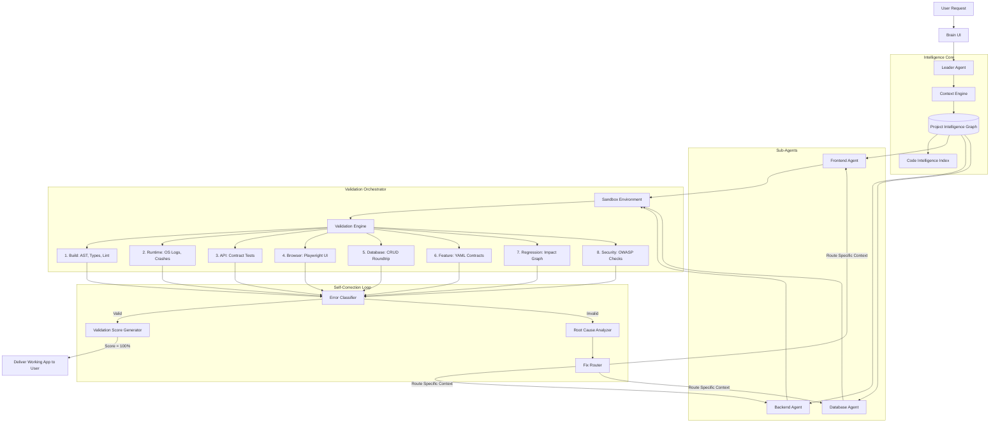

# 🧠 BuilderBrain: The Ultimate 8-Layer Validation & Project Intelligence Architecture
*(Comprehensive Technical Specification v1.0)*

---

## Table of Contents
1. [Executive Summary & Architectural Philosophy](#1-executive-summary--architectural-philosophy)
2. [Global System Architecture Diagram](#2-global-system-architecture-diagram)
3. [Component 1: Project Intelligence Graph (PIG)](#3-component-1-project-intelligence-graph-pig)
4. [Component 2: The Context Engine](#4-component-2-the-context-engine)
5. [Component 3: The Validation Orchestrator](#5-component-3-the-validation-orchestrator)
6. [Deep Dive: The 8 Validation Layers](#6-deep-dive-the-8-validation-layers)
   - [Layer 1: Build Validation](#layer-1-build-validation)
   - [Layer 2: Runtime Validation](#layer-2-runtime-validation)
   - [Layer 3: API Validation](#layer-3-api-validation)
   - [Layer 4: Browser Validation (Playwright)](#layer-4-browser-validation-playwright)
   - [Layer 5: Database Validation](#layer-5-database-validation)
   - [Layer 6: Feature Contracts (E2E)](#layer-6-feature-contracts-e2e)
   - [Layer 7: Impact-Based Regression](#layer-7-impact-based-regression)
   - [Layer 8: Security Validation](#layer-8-security-validation)
7. [Component 4: Error Intelligence Pipeline](#7-component-4-error-intelligence-pipeline)
8. [Code Implementation: Python Backend Modules](#8-code-implementation-python-backend-modules)
9. [Code Implementation: Frontend React Integration](#9-code-implementation-frontend-react-integration)
10. [End-to-End Execution Scenarios](#10-end-to-end-execution-scenarios)

---

## 1. Executive Summary & Architectural Philosophy

The current paradigm of AI-driven software generation relies heavily on the "Render Test": if the frontend renders without throwing an immediate 500 Internal Server Error, the code is considered "successful." This is catastrophically insufficient for production-grade software.

A successful render does not imply:
- Data persistence is functioning correctly.
- Edge cases in business logic are handled.
- Security policies (like RLS or RBAC) are enforced.
- Previously built features (Regression) haven't been silently broken by shared dependencies.

**BuilderBrain** introduces a paradigm shift: The AI does not just write code; it authors an **Application Registry (Project Intelligence Graph)**, establishes **Feature Contracts**, and executes a brutal **8-Layer Verification System** before delivering a single line of code to the user.

---

## 2. Global System Architecture Diagram



---

## 3. Component 1: Project Intelligence Graph (PIG)

The Project Intelligence Graph (PIG) is a directed graph where nodes represent files, functions, API routes, and database tables, and edges represent dependencies. This prevents agents from blindly searching a codebase using generic `grep` commands.

### 3.1 Pydantic Schemas for PIG Nodes

```python
from pydantic import BaseModel
from typing import List, Optional, Literal

class Node(BaseModel):
    id: str
    type: Literal["frontend_file", "backend_file", "route", "function", "db_table"]
    name: str

class FrontendNode(Node):
    type: Literal["frontend_file"] = "frontend_file"
    components: List[str]
    imports: List[str]
    apis_called: List[str]

class BackendNode(Node):
    type: Literal["backend_file"] = "backend_file"
    functions: List[str]
    routes_defined: List[str]
    db_tables_accessed: List[str]

class RouteNode(Node):
    type: Literal["route"] = "route"
    method: str
    path: str
    handler_function: str
    auth_required: bool
    expected_status_codes: List[int]

class DBNode(Node):
    type: Literal["db_table"] = "db_table"
    columns: List[str]
    foreign_keys: List[str]
    rls_policies: List[str]

class Edge(BaseModel):
    source_id: str
    target_id: str
    relationship: Literal["calls", "imports", "queries", "implements", "routes_to"]
```

### 3.2 Massive Application Graph Example (E-Commerce App)

When BuilderBrain builds an app, it generates this JSON topology in memory:

```json
{
  "nodes": [
    {
      "id": "frontend/src/pages/Cart.tsx",
      "type": "frontend_file",
      "name": "Cart Page",
      "components": ["Cart", "CartItem", "CheckoutButton"],
      "imports": ["@/hooks/useCart", "@/api/orderService"],
      "apis_called": ["POST /api/orders/checkout"]
    },
    {
      "id": "backend/routes/order.routes.ts",
      "type": "backend_file",
      "name": "Order Routes",
      "functions": [],
      "routes_defined": ["POST /api/orders/checkout"],
      "db_tables_accessed": []
    },
    {
      "id": "POST /api/orders/checkout",
      "type": "route",
      "name": "Checkout API",
      "method": "POST",
      "path": "/api/orders/checkout",
      "handler_function": "checkoutController",
      "auth_required": true,
      "expected_status_codes": [201, 400, 401, 500]
    },
    {
      "id": "backend/controllers/order.controller.ts",
      "type": "backend_file",
      "name": "Order Controller",
      "functions": ["checkoutController"],
      "routes_defined": [],
      "db_tables_accessed": ["orders", "inventory"]
    },
    {
      "id": "db/tables/orders",
      "type": "db_table",
      "name": "Orders Table",
      "columns": ["id", "user_id", "total_amount", "status"],
      "foreign_keys": ["users.id"],
      "rls_policies": ["user_can_read_own_orders"]
    }
  ],
  "edges": [
    {"source_id": "frontend/src/pages/Cart.tsx", "target_id": "POST /api/orders/checkout", "relationship": "calls"},
    {"source_id": "POST /api/orders/checkout", "target_id": "backend/controllers/order.controller.ts", "relationship": "routes_to"},
    {"source_id": "backend/controllers/order.controller.ts", "target_id": "db/tables/orders", "relationship": "queries"}
  ]
}
```

---

## 4. Component 2: The Context Engine

The Context Engine enforces the **3-Level Context Rule**. AI Agents degrade in logic when presented with massive prompt contexts. The Context Engine uses Graph Traversal (DFS/BFS) on the PIG to slice the exact context needed.

### 4.1 Level 1: Global Project Context
Injected into every single prompt as the system message.
```markdown
# GLOBAL PROJECT CONTEXT
**Project Name:** Grizon ERP v2
**Stack:** React (Vite, TS, Tailwind), FastAPI (Python), PostgreSQL (Supabase).
**Architecture:** Monolith API, JWT Auth.
**Current Global Phase:** Validation & Bug Fixing.
**Strict Directives:** Do not modify database schemas unless explicitly instructed by the Root Cause Analyzer.
```

### 4.2 Level 2: Agent Specific Context
Injected based on the Agent Type.
**Example for Backend Agent:**
```markdown
# AGENT CONTEXT (BACKEND)
**Active Routes:**
- GET /api/users
- POST /api/auth/login
- POST /api/orders/checkout
**Shared Middleware:** `auth_middleware.py`, `error_handler.py`.
**Database Connection:** SQLAlchemy Async Session via `db.py`.
```

### 4.3 Level 3: Task Specific Context (The Micro-Slice)
Generated dynamically by traversing the PIG when an error occurs.
```markdown
# TASK CONTEXT
**Task:** Fix 500 Error on Checkout.
**Error Trace:** 
`Playwright caught 500 Internal Server Error from POST /api/orders/checkout.`
`Backend Sandbox Log: KeyError: 'total_amount' at order.controller.ts:45`

**Intelligence Graph Slice:**
- The caller is `frontend/src/pages/Cart.tsx`. It sends `{ "cart_items": [...] }`.
- The controller `checkoutController` expects `{ "cart_items": [...], "total_amount": float }`.
- The frontend forgot to send `total_amount`, causing the backend to throw a KeyError instead of a clean 400 Validation Error.

**Directive:**
Update `order.controller.ts` to implement strict Pydantic validation and return a 400 Bad Request if `total_amount` is missing, OR calculate it dynamically on the server.
```

---

## 5. Component 3: The Validation Orchestrator

The Orchestrator is a Python daemon running in the `grizon-ai-backend-2-main` that sequentially triggers the 8 layers.

### 5.1 Orchestrator Python Implementation

```python
import asyncio
from typing import Dict, Any

class ValidationOrchestrator:
    def __init__(self, sandbox_manager, context_engine):
        self.sandbox = sandbox_manager
        self.context = context_engine
        
        self.validators = [
            BuildValidator(),
            RuntimeValidator(),
            APIValidator(),
            BrowserValidator(),
            DatabaseValidator(),
            FeatureValidator(),
            RegressionValidator(),
            SecurityValidator()
        ]
        
    async def run_full_validation_suite(self, feature_id: str) -> Dict[str, Any]:
        report = {
            "score": 100,
            "layer_results": [],
            "critical_failures": []
        }
        
        for validator in self.validators:
            result = await validator.execute(self.sandbox, self.context, feature_id)
            report["layer_results"].append(result)
            
            if not result.passed:
                report["score"] -= validator.weight
                if validator.is_critical:
                    report["critical_failures"].append(result.error_payload)
                    # Short-circuit on critical failures (e.g., Build Failed)
                    break 
                    
        return report
```

---

## 6. Deep Dive: The 8 Validation Layers

### Layer 1: Build Validation
Before spending tokens on Playwright or API calls, the code must mathematically compile.
```bash
# Frontend
cd frontend && npm run typecheck && npm run lint && npm run build

# Backend (Python example)
cd backend && python -m py_compile ./**/*.py && mypy .

# Database
supabase db lint
```

### Layer 2: Runtime Validation
Starts the application processes in the sandbox and streams OS-level logs.
```python
class RuntimeValidator(BaseValidator):
    async def execute(self, sandbox, context, feature_id):
        # 1. Start processes
        await sandbox.run_command("npm run dev", background=True)
        await sandbox.run_command("uvicorn main:app", background=True)
        
        # 2. Wait 5 seconds for initialization
        await asyncio.sleep(5)
        
        # 3. Fetch stdout/stderr
        logs = await sandbox.get_process_logs()
        
        # 4. Regex matching for catastrophic failures
        fatal_errors = ["Address already in use", "ModuleNotFoundError", "Connection refused", "FATAL"]
        for error in fatal_errors:
            if error in logs.stderr:
                return ValidationResult(passed=False, error=logs.stderr)
        return ValidationResult(passed=True)
```

### Layer 3: API Validation
Tests backend contracts directly without relying on UI clicks.
```python
import httpx

class APIValidator(BaseValidator):
    async def execute(self, sandbox, context, feature_id):
        routes = context.get_routes_for_feature(feature_id)
        tunnel_url = sandbox.get_backend_tunnel()
        
        async with httpx.AsyncClient() as client:
            for route in routes:
                # Test 1: Valid Request
                res = await client.post(f"{tunnel_url}{route.path}", json=route.mock_valid_payload)
                if res.status_code not in route.expected_status_codes:
                    return ValidationResult(passed=False, error=f"Expected {route.expected_status_codes}, got {res.status_code}")
                
                # Test 2: Invalid Payload (Ensure 400, not 500)
                res = await client.post(f"{tunnel_url}{route.path}", json={})
                if res.status_code == 500:
                    return ValidationResult(passed=False, error=f"Endpoint {route.path} threw 500 on empty payload. Missing validation.")
                    
        return ValidationResult(passed=True)
```

### Layer 4: Browser Validation (Playwright)
Simulates human interaction and captures UI-specific bugs.
```python
from playwright.async_api import async_playwright

class BrowserValidator(BaseValidator):
    async def execute(self, sandbox, context, feature_id):
        tunnel_url = sandbox.get_frontend_tunnel()
        errors = []
        
        async with async_playwright() as p:
            browser = await p.chromium.launch(headless=True)
            page = await browser.new_page()
            
            # Listeners
            page.on("console", lambda msg: errors.append(msg.text) if msg.type in ["error", "warning"] else None)
            page.on("pageerror", lambda err: errors.append(f"Uncaught Exception: {err}"))
            page.on("response", lambda res: errors.append(f"Network Fail: {res.status} on {res.url}") if res.status >= 400 else None)
            
            # Navigation
            await page.goto(tunnel_url, wait_until="networkidle")
            
            # Extract DOM state
            body_text = await page.locator("body").inner_text()
            if "Application Error" in body_text or body_text.strip() == "":
                errors.append("White Screen of Death detected.")
                
            await browser.close()
            
        if errors:
            return ValidationResult(passed=False, error_payload=errors)
        return ValidationResult(passed=True)
```

### Layer 5: Database Validation
Round-trip checks to ensure data isn't just mutating in React State.
```sql
-- The DB Validator dynamically generates and runs these test queries
BEGIN;
INSERT INTO users (email, role) VALUES ('test@grizon.ai', 'admin') RETURNING id;
-- (Capture ID)
SELECT * FROM users WHERE id = <captured_id>;
-- (Verify data matches)
UPDATE users SET role = 'user' WHERE id = <captured_id>;
-- (Verify update)
DELETE FROM users WHERE id = <captured_id>;
-- (Verify cascade constraints don't break)
ROLLBACK;
```

### Layer 6: Feature Contracts (E2E)
A Feature Contract is a YAML file generated *before* code generation. It defines the absolute Definition of Done.

```yaml
# artifacts/contracts/auth_contract.yaml
feature_id: "AUTH_001"
name: "Secure Authentication Flow"
steps:
  - action: "goto"
    url: "/login"
  - action: "fill"
    selector: "input[name='email']"
    value: "admin@grizon.ai"
  - action: "fill"
    selector: "input[name='password']"
    value: "wrong_password"
  - action: "click"
    selector: "button[type='submit']"
  - action: "assert_visible"
    selector: ".text-red-500"
    contains: "Invalid credentials"
  - action: "fill"
    selector: "input[name='password']"
    value: "correct_password"
  - action: "click"
    selector: "button[type='submit']"
  - action: "assert_url"
    url: "/dashboard"
  - action: "assert_network"
    method: "POST"
    url: "/api/auth/login"
    status: 200
```
*The Feature Validator parses this YAML and dynamically executes Playwright scripts.*

### Layer 7: Impact-Based Regression
If we fix Auth, we must test Dashboard. We do NOT test Contact Us.
```python
class RegressionValidator(BaseValidator):
    def get_impacted_features(self, modified_files: List[str], pig: IntelligenceGraph):
        impacted_features = set()
        for file in modified_files:
            # Graph Traversal (BFS) up the dependency tree
            dependents = pig.get_all_dependents_recursively(file)
            for dep in dependents:
                if dep.is_feature_entrypoint():
                    impacted_features.add(dep.feature_id)
        return list(impacted_features)

    async def execute(self, sandbox, context, feature_id):
        modified_files = context.get_recent_changes()
        impacted = self.get_impacted_features(modified_files, context.pig)
        
        for feat in impacted:
            # Re-run Layer 6 (Feature Contracts) for impacted features only
            res = await feature_validator.run_contract(feat)
            if not res.passed:
                return ValidationResult(passed=False, error=f"Regression detected in feature {feat}")
        return ValidationResult(passed=True)
```

### Layer 8: Security Validation
Automated OWASP Top 10 sanity checks.
- Runs SQLmap payloads in API inputs.
- Checks if JWTs are exposed in LocalStorage vs HttpOnly Cookies.
- Attempts to hit protected endpoints (`/api/admin/*`) without Auth Headers.

---

## 7. Component 4: Error Intelligence Pipeline

When a validation layer fails, the raw error string is useless to an agent. It must be classified.

### 7.1 The Error Classifier
Parses the error into an `ErrorEvent` object.

```python
from enum import Enum

class ErrorCategory(Enum):
    BUILD = "BUILD"
    RUNTIME = "RUNTIME"
    NETWORK_CORS = "NETWORK_CORS"
    API_500 = "API_500"
    DB_CONSTRAINT = "DB_CONSTRAINT"
    UI_CRASH = "UI_CRASH"
    VISUAL = "VISUAL"
    REGRESSION = "REGRESSION"

class ErrorClassifier:
    def classify(self, raw_error: str) -> ErrorEvent:
        if "CORS policy blocked" in raw_error:
            return ErrorEvent(category=ErrorCategory.NETWORK_CORS, severity="HIGH")
        if "relation" in raw_error and "does not exist" in raw_error:
            return ErrorEvent(category=ErrorCategory.DB_CONSTRAINT, severity="CRITICAL")
        # ... massive heuristics dictionary ...
```

### 7.2 Root Cause Analyzer & Fix Router
The most critical part of BuilderBrain. It prevents hallucinated fixes.

```python
class RootCauseAnalyzer:
    def analyze(self, error_event: ErrorEvent, pig: IntelligenceGraph):
        if error_event.category == ErrorCategory.API_500:
            # Look at backend sandbox logs
            logs = sandbox.get_backend_logs()
            if "PrismaClientKnownRequestError" in logs:
                # The backend threw 500, but the root cause is the DB Schema
                return FixInstruction(
                    target_agent="DatabaseAgent",
                    prompt="Apply missing prisma migration. The backend is crashing because table is out of sync."
                )
            if "TypeError: Cannot read property" in logs:
                # The backend threw 500, but the root cause is missing frontend payload
                return FixInstruction(
                    target_agent="FrontendAgent",
                    prompt="You are not sending the correct JSON payload to POST /api. Update the fetch call."
                )
```

---

## 8. Code Implementation: Python Backend Modules
*(Where this lives in `grizon-ai-backend-2-main`)*

```text
Brain/
 ├── main.py
 ├── agents/
 │    ├── task_agent.py
 │    ├── validation/
 │    │    ├── __init__.py
 │    │    ├── orchestrator.py      # ValidationOrchestrator class
 │    │    ├── context_engine.py    # Generates the 3-Level Context
 │    │    ├── intelligence_graph.py# Manages PIG JSON
 │    │    ├── error_pipeline.py    # Classifier & Root Cause
 │    │    └── layers/
 │    │         ├── l1_build.py
 │    │         ├── l2_runtime.py
 │    │         ├── l3_api.py
 │    │         ├── l4_browser.py   # playwright scripts
 │    │         ├── l5_database.py
 │    │         ├── l6_feature.py
 │    │         ├── l7_regression.py
 │    │         └── l8_security.py
 ├── services/
 │    └── sandbox_mcp_service.py    # Exposes log streaming
```

---

## 9. Code Implementation: Frontend React Integration
*(Where this lives in `Grizon-AI-Frontend-v2-api-2`)*

To show the user the magnificent work BuilderBrain is doing, we update the UI to visualize the 8-layers.

```tsx
// src/components/ValidationScorecard.tsx
import React from 'react';
import { useExecutionStore } from '@/store/executionStore';

export const ValidationScorecard = () => {
  const { validationState, score } = useExecutionStore();

  return (
    <div className="p-6 bg-slate-900 border border-slate-800 rounded-xl">
      <h2 className="text-xl font-bold text-white mb-4">BuilderBrain Validation Engine</h2>
      <div className="flex items-center justify-between mb-6">
        <span className="text-slate-400">System Integrity Score:</span>
        <span className={`text-2xl font-black ${score === 100 ? 'text-green-500' : 'text-amber-500'}`}>
          {score}%
        </span>
      </div>
      
      <div className="space-y-3">
        <ValidationRow label="1. Build Integrity" status={validationState.build} />
        <ValidationRow label="2. Runtime Health" status={validationState.runtime} />
        <ValidationRow label="3. API Contracts" status={validationState.api} />
        <ValidationRow label="4. Browser UI (Playwright)" status={validationState.browser} />
        <ValidationRow label="5. Database Persistence" status={validationState.database} />
        <ValidationRow label="6. Feature Acceptance" status={validationState.feature} />
        <ValidationRow label="7. Impact Regression" status={validationState.regression} />
        <ValidationRow label="8. Security Baseline" status={validationState.security} />
      </div>
      
      {score === 100 && (
        <div className="mt-6 p-4 bg-green-500/10 border border-green-500/20 rounded-lg">
          <p className="text-green-400 font-medium">✅ All 8 Quality Gates Passed. Delivering URL.</p>
        </div>
      )}
    </div>
  );
};

const ValidationRow = ({ label, status }) => {
  const icons = {
    pending: "⏳",
    running: "🔄",
    passed: "✅",
    failed: "❌"
  };
  return (
    <div className="flex justify-between items-center text-sm">
      <span className="text-slate-300">{label}</span>
      <span>{icons[status] || "⏳"}</span>
    </div>
  );
}
```

---

## 10. End-to-End Execution Scenarios

### Scenario A: The UI works, but API is missing data (False Positive Prevention)
1. **Frontend Agent** generates a list that fetches from `GET /api/products`.
2. **Backend Agent** writes the route, but forgets to execute `await db.all()`. It returns `[]`.
3. **Playwright (Layer 4)** opens the page. No console errors. Page renders an empty list. Result: `PASS`.
4. **API Validator (Layer 3)** hits `GET /api/products` directly. Compares response against OpenAPI schema. Fails because data is missing.
5. **Database Validator (Layer 5)** checks DB, sees 5 products exist.
6. **Error Classifier** marks `API_DATA_MISMATCH`.
7. **Root Cause Analyzer** routes task exclusively to **Backend Agent** with Level 3 Context: *"API returning empty array despite 5 rows in DB. Fix controller."*
8. **Fix & Re-validate.** Score hits 100%. User receives perfect app.

### Scenario B: The CORS Nightmare
1. Agents build app. Sandbox starts.
2. **Playwright (Layer 4)** logs: `Access to fetch at 'http://api' from origin 'http://ui' has been blocked by CORS policy`.
3. **Error Classifier** identifies `NETWORK_CORS`.
4. **Root Cause Analyzer** knows Frontend cannot fix this. It isolates `main.py` (FastAPI) or `server.js` (Express) from the PIG.
5. Routes to **Backend Agent**: *"Add CORSMiddleware allowing origin http://ui."*
6. Fix applied in 12 seconds. Re-validated. Score hits 100%.

### Scenario C: The Silent Regression
1. User requests: *"Add a dark mode toggle."*
2. **Frontend Agent** modifies `Layout.tsx` and adds `<ThemeProvider>`.
3. During modification, it accidentally removes the `<AuthProvider>` context wrapper.
4. **Build Validation (Layer 1)** passes.
5. **Dark Mode Feature Validation (Layer 6)** passes.
6. **Regression Validation (Layer 7)** kicks in. The Impact Analyzer sees `Layout.tsx` is the root node for `LoginPage` and `DashboardPage`.
7. It triggers the Auth Feature Contract.
8. Playwright attempts to login. App crashes because `useAuth` hook has no provider.
9. BuilderBrain catches the regression *before* the user sees it.
10. Fixes `<AuthProvider>`. Score hits 100%.

---
*(End of BuilderBrain Architectural Whitepaper)*
